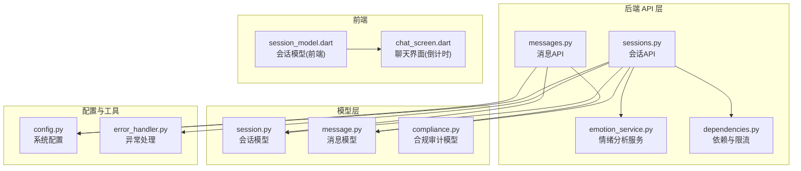
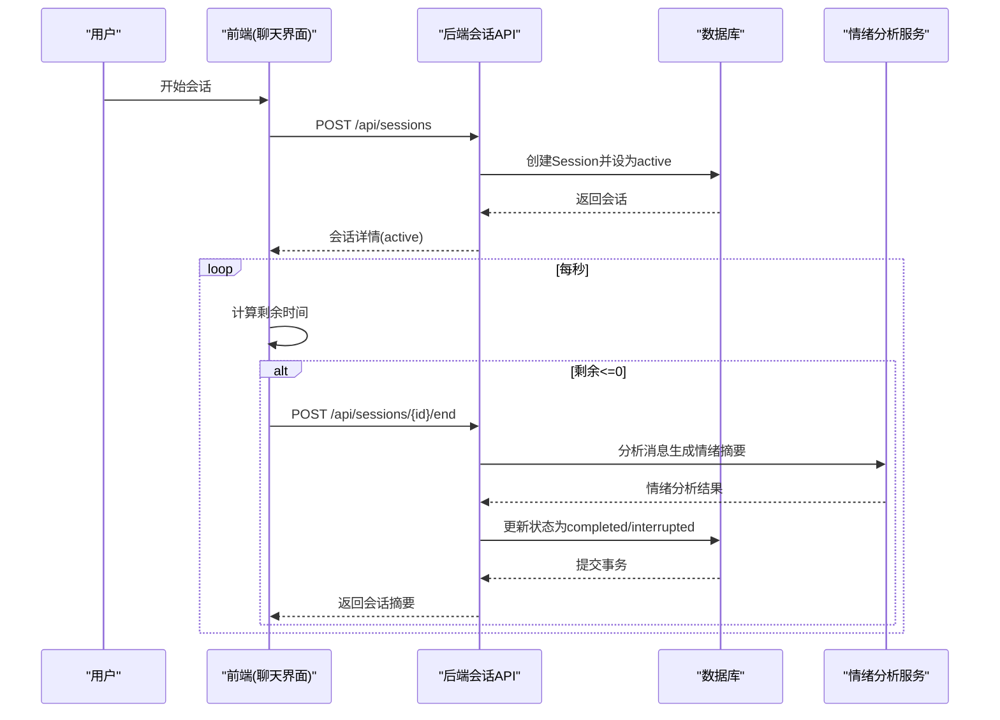
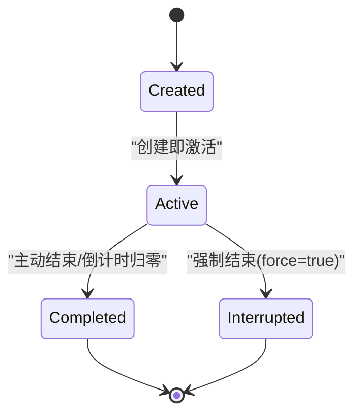
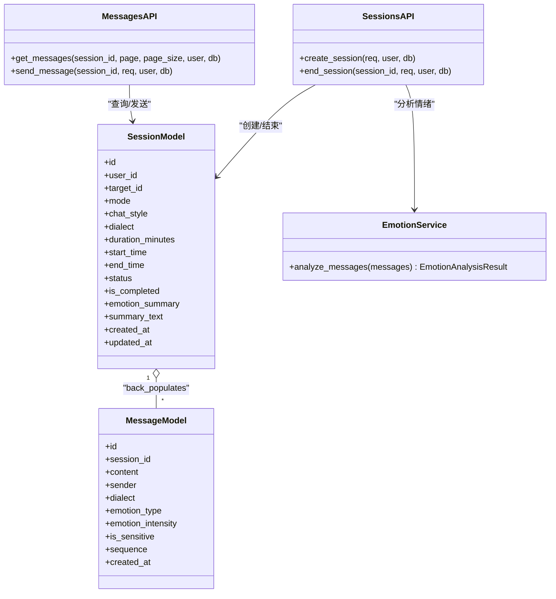

# 会话状态机设计

<cite>
**本文引用的文件**
- [session.py](file://emo_outlet_api/app/models/session.py)
- [session.py](file://emo_outlet_api/app/schemas/session.py)
- [sessions.py](file://emo_outlet_api/app/api/sessions.py)
- [dependencies.py](file://emo_outlet_api/app/core/dependencies.py)
- [emotion_service.py](file://emo_outlet_api/app/services/emotion_service.py)
- [message.py](file://emo_outlet_api/app/models/message.py)
- [messages.py](file://emo_outlet_api/app/api/messages.py)
- [config.py](file://emo_outlet_api/app/config.py)
- [compliance.py](file://emo_outlet_api/app/models/compliance.py)
- [error_handler.py](file://emo_outlet_api/app/core/error_handler.py)
- [session_model.dart](file://emo_outlet_app/lib/models/session_model.dart)
- [chat_screen.dart](file://emo_outlet_app/lib/screens/chat_screen.dart)
</cite>

## 目录
1. [简介](#简介)
2. [项目结构](#项目结构)
3. [核心组件](#核心组件)
4. [架构总览](#架构总览)
5. [详细组件分析](#详细组件分析)
6. [依赖关系分析](#依赖关系分析)
7. [性能考虑](#性能考虑)
8. [故障排查指南](#故障排查指南)
9. [结论](#结论)
10. [附录](#附录)

## 简介
本文件面向“会话状态机”的专业设计文档，围绕后端会话模型与前端交互流程，系统梳理状态定义、转换规则、触发条件、业务规则、持久化与并发控制、监控与审计等方面。重点覆盖以下状态：
- created（创建）
- active（进行中）
- completed（正常结束）
- interrupted（中断）

并结合实际代码实现，给出状态机的UML图示、状态转换表以及关键流程的序列图与类图，帮助开发者与产品人员快速理解与落地。

## 项目结构
本项目采用前后端分离架构，后端基于FastAPI + SQLAlchemy，前端基于Flutter。会话状态机主要由后端模型与API、情绪分析服务、消息模型与API构成；前端负责倒计时与会话结束触发。

图表来源
- [sessions.py:1-220](file://emo_outlet_api/app/api/sessions.py#L1-L220)
- [messages.py:1-78](file://emo_outlet_api/app/api/messages.py#L1-L78)
- [session.py:1-79](file://emo_outlet_api/app/models/session.py#L1-L79)
- [message.py:1-46](file://emo_outlet_api/app/models/message.py#L1-L46)
- [emotion_service.py:1-181](file://emo_outlet_api/app/services/emotion_service.py#L1-L181)
- [dependencies.py:1-67](file://emo_outlet_api/app/core/dependencies.py#L1-L67)
- [config.py:1-125](file://emo_outlet_api/app/config.py#L1-L125)
- [error_handler.py:1-59](file://emo_outlet_api/app/core/error_handler.py#L1-L59)
- [session_model.dart:1-150](file://emo_outlet_app/lib/models/session_model.dart#L1-L150)
- [chat_screen.dart:1-179](file://emo_outlet_app/lib/screens/chat_screen.dart#L1-L179)

章节来源
- [sessions.py:1-220](file://emo_outlet_api/app/api/sessions.py#L1-L220)
- [session.py:1-79](file://emo_outlet_api/app/models/session.py#L1-L79)
- [config.py:1-125](file://emo_outlet_api/app/config.py#L1-L125)

## 核心组件
- 会话模型（SessionModel）：定义会话字段、状态字段、时间字段、关联关系等。
- 会话API（sessions.py）：提供创建、查询、获取当前活动会话、结束会话等接口。
- 消息模型与API：承载会话中的消息，计算剩余时长，限制会话内消息发送。
- 情绪分析服务（emotion_service.py）：在会话结束时生成情绪摘要与建议。
- 前端会话模型与聊天界面：负责倒计时与自动结束触发。

章节来源
- [session.py:13-79](file://emo_outlet_api/app/models/session.py#L13-L79)
- [sessions.py:50-220](file://emo_outlet_api/app/api/sessions.py#L50-L220)
- [message.py:13-46](file://emo_outlet_api/app/models/message.py#L13-L46)
- [messages.py:32-78](file://emo_outlet_api/app/api/messages.py#L32-L78)
- [emotion_service.py:44-181](file://emo_outlet_api/app/services/emotion_service.py#L44-L181)
- [session_model.dart:5-61](file://emo_outlet_app/lib/models/session_model.dart#L5-L61)
- [chat_screen.dart:27-44](file://emo_outlet_app/lib/screens/chat_screen.dart#L27-L44)

## 架构总览
后端通过FastAPI路由暴露会话能力，使用SQLAlchemy ORM映射到MySQL/SQLite。会话状态在数据库中持久化，前端通过定时器驱动倒计时并在超时后触发结束会话。

图表来源
- [sessions.py:50-220](file://emo_outlet_api/app/api/sessions.py#L50-L220)
- [messages.py:32-78](file://emo_outlet_api/app/api/messages.py#L32-L78)
- [emotion_service.py:44-181](file://emo_outlet_api/app/services/emotion_service.py#L44-L181)
- [chat_screen.dart:27-44](file://emo_outlet_app/lib/screens/chat_screen.dart#L27-L44)

## 详细组件分析

### 会话状态定义与含义
- created（创建）：会话被创建，但尚未开始。在后端实现中，创建时直接进入active状态，而非pending。
- active（进行中）：会话处于活跃状态，允许发送消息、计算剩余时长。
- completed（正常结束）：用户主动结束或超时自动结束，且非强制中断。
- interrupted（中断）：用户强制中断（force=true），或系统异常导致的中断。

注意：后端模型注释中存在pending状态，但在创建逻辑中直接设为active，因此实际运行中pending状态未在创建流程中体现。

章节来源
- [session.py:50-55](file://emo_outlet_api/app/models/session.py#L50-L55)
- [sessions.py:85-99](file://emo_outlet_api/app/api/sessions.py#L85-L99)

### 状态转换规则与触发条件
- created → active：创建会话时，设置status为active并记录start_time。
- active → completed：用户主动结束或倒计时归零自动结束。
- active → interrupted：用户强制结束（force=true）。
- completed/interrupted → 不可逆：会话完成后禁止再次发送消息或重复结束。

图表来源
- [sessions.py:85-99](file://emo_outlet_api/app/api/sessions.py#L85-L99)
- [sessions.py:156-220](file://emo_outlet_api/app/api/sessions.py#L156-L220)
- [messages.py:56-66](file://emo_outlet_api/app/api/messages.py#L56-L66)

### 业务规则与前置条件
- 权限验证：所有会话相关接口均需通过认证与用户绑定校验。
- 日常会话配额：每日会话次数限制，按用户类型与年龄分组。
- 会话完整性：会话结束后禁止继续发送消息或重复结束。
- 消息发送限制：仅在active状态且未完成时允许发送消息。

章节来源
- [dependencies.py:18-50](file://emo_outlet_api/app/core/dependencies.py#L18-L50)
- [dependencies.py:53-67](file://emo_outlet_api/app/core/dependencies.py#L53-L67)
- [sessions.py:67-79](file://emo_outlet_api/app/api/sessions.py#L67-L79)
- [messages.py:76-78](file://emo_outlet_api/app/api/messages.py#L76-L78)

### 数据持久化与并发控制
- 事务与刷新：创建会话后flush并refresh，确保前端拿到最新状态。
- 并发控制：每日配额重置在依赖函数中按日期维度重置，避免跨天并发问题。
- 时间字段：start_time/end_time精确到毫秒级时区时间，便于剩余时长计算。

章节来源
- [sessions.py:95-99](file://emo_outlet_api/app/api/sessions.py#L95-L99)
- [dependencies.py:45-49](file://emo_outlet_api/app/core/dependencies.py#L45-L49)
- [session.py:43-48](file://emo_outlet_api/app/models/session.py#L43-L48)

### 状态监控与审计
- 审计日志：合规模块包含内容审计日志表，可用于记录敏感内容与处理动作。
- 异常处理：全局异常处理器统一返回错误信息，便于定位问题。
- 剩余时长展示：消息列表接口根据active状态与start_time计算remaining_seconds，前端据此提示。

章节来源
- [compliance.py:31-50](file://emo_outlet_api/app/models/compliance.py#L31-L50)
- [error_handler.py:10-59](file://emo_outlet_api/app/core/error_handler.py#L10-L59)
- [messages.py:56-66](file://emo_outlet_api/app/api/messages.py#L56-L66)

### 前端交互与自动结束
- 前端定时器每秒递减剩余时间，当<=0时调用结束会话接口。
- 聊天界面提供“延长1分钟”按钮，前端增加剩余秒数后继续会话。

章节来源
- [chat_screen.dart:27-44](file://emo_outlet_app/lib/screens/chat_screen.dart#L27-L44)
- [chat_screen.dart:171-179](file://emo_outlet_app/lib/screens/chat_screen.dart#L171-L179)

## 依赖关系分析

图表来源
- [session.py:13-79](file://emo_outlet_api/app/models/session.py#L13-L79)
- [message.py:13-46](file://emo_outlet_api/app/models/message.py#L13-L46)
- [emotion_service.py:44-181](file://emo_outlet_api/app/services/emotion_service.py#L44-L181)
- [sessions.py:50-220](file://emo_outlet_api/app/api/sessions.py#L50-L220)
- [messages.py:32-78](file://emo_outlet_api/app/api/messages.py#L32-L78)

## 性能考虑
- 查询优化：消息列表按session_id过滤并按sequence排序，避免全表扫描。
- 事务粒度：创建与结束会话均使用flush/refresh确保一致性，减少后续查询延迟。
- 剩余时长计算：在API层按UTC时间差计算，避免前端时区差异带来的误差。
- 配额重置：按日期维度重置，避免频繁写入竞争。

章节来源
- [messages.py:47-66](file://emo_outlet_api/app/api/messages.py#L47-L66)
- [sessions.py:95-99](file://emo_outlet_api/app/api/sessions.py#L95-L99)
- [dependencies.py:45-49](file://emo_outlet_api/app/core/dependencies.py#L45-L49)

## 故障排查指南
- 404 会话不存在：检查session_id与用户绑定关系。
- 400 会话已完成：确认会话状态，避免重复结束。
- 429 达到每日配额：检查用户类型与年龄分组对应的配额阈值。
- 服务器内部错误：查看全局异常处理器返回的统一错误结构。

章节来源
- [sessions.py:156-174](file://emo_outlet_api/app/api/sessions.py#L156-L174)
- [dependencies.py:53-67](file://emo_outlet_api/app/core/dependencies.py#L53-L67)
- [error_handler.py:10-59](file://emo_outlet_api/app/core/error_handler.py#L10-L59)

## 结论
本会话状态机以“创建即激活”为核心策略，结合前端倒计时与后端情绪分析，形成从创建、进行、到结束的完整闭环。通过严格的权限校验、配额控制与审计日志，保障系统的安全与合规。建议后续补充pending状态的创建流程，完善异常恢复与重试机制，进一步提升用户体验与系统稳定性。

## 附录

### 状态转换表
- created → active：POST /api/sessions
- active → completed：POST /api/sessions/{id}/end（非强制）
- active → interrupted：POST /api/sessions/{id}/end（force=true）
- completed/interrupted → 不可逆：禁止继续发送消息或重复结束

章节来源
- [sessions.py:50-220](file://emo_outlet_api/app/api/sessions.py#L50-L220)
- [messages.py:76-78](file://emo_outlet_api/app/api/messages.py#L76-L78)

### 代码实现示例（路径）
- 创建会话并设为active：[sessions.py:85-99](file://emo_outlet_api/app/api/sessions.py#L85-L99)
- 结束会话并生成情绪摘要：[sessions.py:156-220](file://emo_outlet_api/app/api/sessions.py#L156-L220)
- 计算剩余时长与状态：[messages.py:56-66](file://emo_outlet_api/app/api/messages.py#L56-L66)
- 情绪分析服务：[emotion_service.py:44-181](file://emo_outlet_api/app/services/emotion_service.py#L44-L181)
- 前端倒计时与结束触发：[chat_screen.dart:27-44](file://emo_outlet_app/lib/screens/chat_screen.dart#L27-L44)