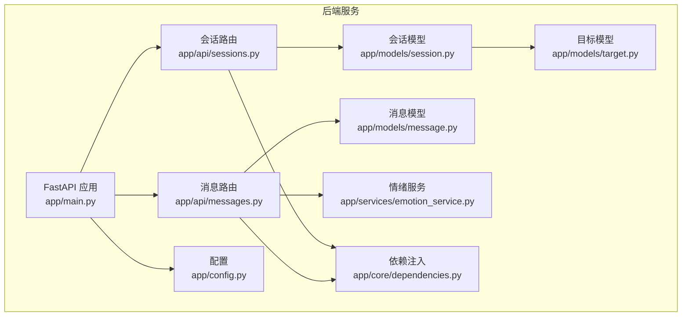
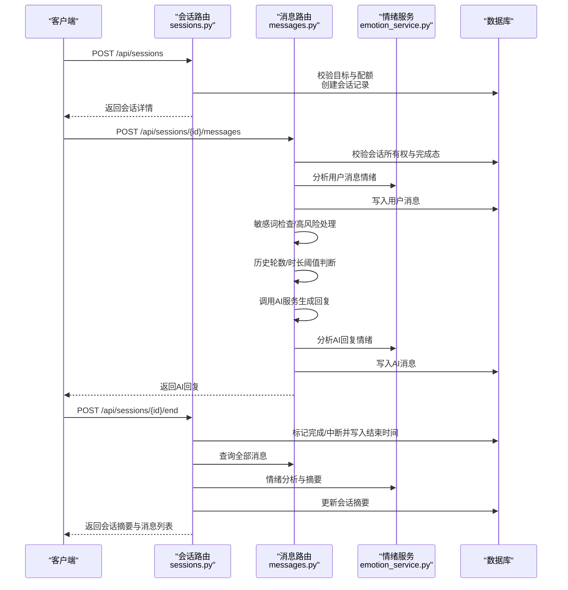
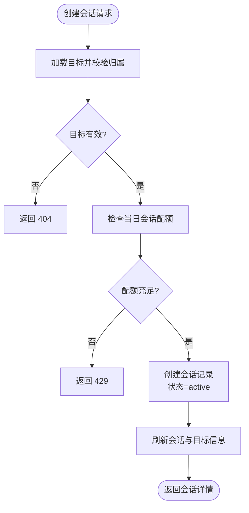
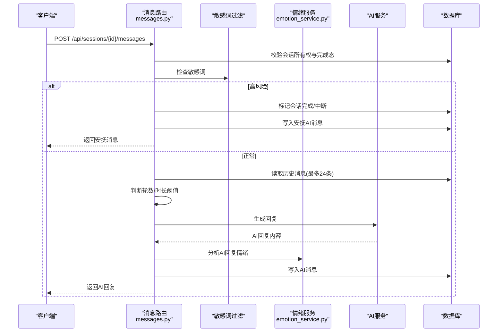
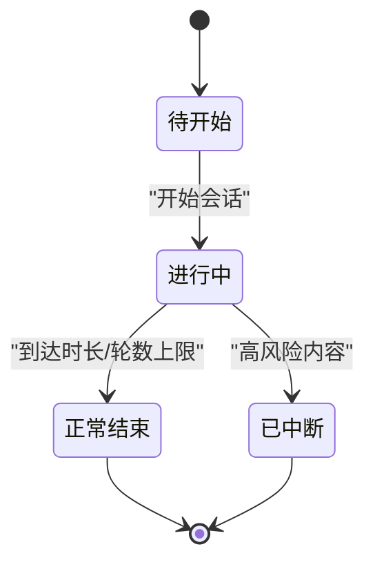
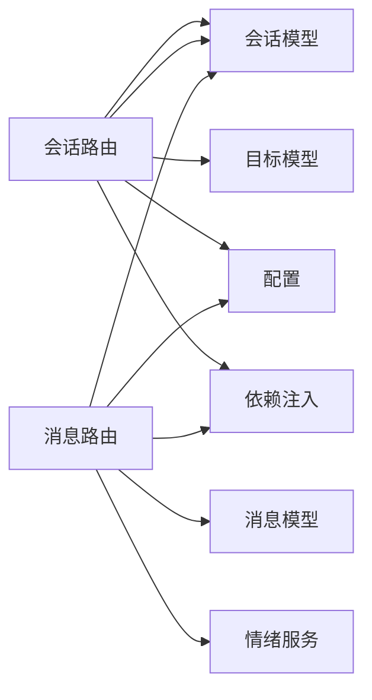
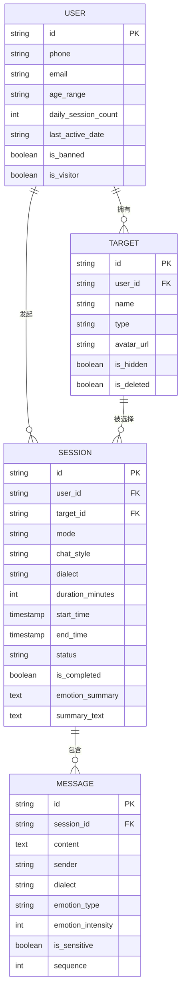

# 会话管理系统

<cite>
**本文引用的文件**
- [emo_outlet_api/app/main.py](file://emo_outlet_api/app/main.py)
- [emo_outlet_api/app/api/sessions.py](file://emo_outlet_api/app/api/sessions.py)
- [emo_outlet_api/app/models/session.py](file://emo_outlet_api/app/models/session.py)
- [emo_outlet_api/app/schemas/session.py](file://emo_outlet_api/app/schemas/session.py)
- [emo_outlet_api/app/api/messages.py](file://emo_outlet_api/app/api/messages.py)
- [emo_outlet_api/app/models/message.py](file://emo_outlet_api/app/models/message.py)
- [emo_outlet_api/app/schemas/message.py](file://emo_outlet_api/app/schemas/message.py)
- [emo_outlet_api/app/core/dependencies.py](file://emo_outlet_api/app/core/dependencies.py)
- [emo_outlet_api/app/config.py](file://emo_outlet_api/app/config.py)
- [emo_outlet_api/app/services/emotion_service.py](file://emo_outlet_api/app/services/emotion_service.py)
- [emo_outlet_api/app/models/target.py](file://emo_outlet_api/app/models/target.py)
- [emo_outlet_api/app/schemas/target.py](file://emo_outlet_api/app/schemas/target.py)
- [需求文档.md](file://需求文档.md)
- [README.md](file://README.md)
</cite>

## 目录
1. [简介](#简介)
2. [项目结构](#项目结构)
3. [核心组件](#核心组件)
4. [架构总览](#架构总览)
5. [详细组件分析](#详细组件分析)
6. [依赖关系分析](#依赖关系分析)
7. [性能考量](#性能考量)
8. [故障排查指南](#故障排查指南)
9. [结论](#结论)
10. [附录](#附录)

## 简介
本文件面向 Emo Outlet 的会话管理系统，聚焦以下主题：
- 会话创建机制：目标绑定、模式选择（单向/双向）、时间配置与资源分配
- 实时对话能力：消息发送、AI 回复、敏感词拦截与高风险中断
- 会话时间控制：定时器管理、超时处理、暂停/恢复与自动保存
- 会话历史管理：会话列表查询、状态跟踪、统计数据与持久化
- 会话状态机：创建、进行中、已完成、已中断等状态转换与业务规则
- 消息处理流程：接收、存储、转发与实时推送机制
- 生命周期管理：API 规范、错误处理与性能优化策略

## 项目结构
后端采用 FastAPI + SQLAlchemy 架构，按功能模块划分路由与模型：
- 路由层：会话与消息 API
- 模型层：会话、消息、目标等 ORM 映射
- 服务层：情绪分析、AI 对话编排等
- 配置层：运行参数、限流与合规策略
- 依赖注入：认证、权限与每日会话次数检查

图表来源
- [emo_outlet_api/app/main.py:23-63](file://emo_outlet_api/app/main.py#L23-L63)
- [emo_outlet_api/app/api/sessions.py:26](file://emo_outlet_api/app/api/sessions.py#L26)
- [emo_outlet_api/app/api/messages.py:21](file://emo_outlet_api/app/api/messages.py#L21)
- [emo_outlet_api/app/models/session.py:13-79](file://emo_outlet_api/app/models/session.py#L13-L79)
- [emo_outlet_api/app/models/message.py:13-46](file://emo_outlet_api/app/models/message.py#L13-L46)
- [emo_outlet_api/app/models/target.py:13-56](file://emo_outlet_api/app/models/target.py#L13-L56)
- [emo_outlet_api/app/services/emotion_service.py:44-181](file://emo_outlet_api/app/services/emotion_service.py#L44-L181)
- [emo_outlet_api/app/config.py:12-125](file://emo_outlet_api/app/config.py#L12-L125)
- [emo_outlet_api/app/core/dependencies.py:18-67](file://emo_outlet_api/app/core/dependencies.py#L18-L67)

章节来源
- [emo_outlet_api/app/main.py:14-82](file://emo_outlet_api/app/main.py#L14-L82)
- [README.md:58-84](file://README.md#L58-L84)

## 核心组件
- 会话 API：负责会话创建、激活查询、结束与摘要返回
- 消息 API：负责消息发送、历史查询、剩余时长计算与高风险中断
- 会话模型：承载会话元信息、状态与时间控制字段
- 消息模型：承载消息内容、情绪标签、敏感词标记与序列号
- 情绪服务：对用户输入进行情绪分析，输出主情绪、强度、关键词与建议
- 依赖注入：认证、权限校验与每日会话次数限制
- 配置中心：会话时长上限、对话轮数上限、敏感词与审计开关等

章节来源
- [emo_outlet_api/app/api/sessions.py:50-220](file://emo_outlet_api/app/api/sessions.py#L50-L220)
- [emo_outlet_api/app/api/messages.py:32-216](file://emo_outlet_api/app/api/messages.py#L32-L216)
- [emo_outlet_api/app/models/session.py:13-79](file://emo_outlet_api/app/models/session.py#L13-L79)
- [emo_outlet_api/app/models/message.py:13-46](file://emo_outlet_api/app/models/message.py#L13-L46)
- [emo_outlet_api/app/services/emotion_service.py:44-181](file://emo_outlet_api/app/services/emotion_service.py#L44-L181)
- [emo_outlet_api/app/core/dependencies.py:18-67](file://emo_outlet_api/app/core/dependencies.py#L18-L67)
- [emo_outlet_api/app/config.py:12-125](file://emo_outlet_api/app/config.py#L12-L125)

## 架构总览
会话管理贯穿“创建—进行中—结束/中断—分析—归档”的完整生命周期，前后端通过 REST API 交互，消息发送与会话状态变更由后端统一编排。

图表来源
- [emo_outlet_api/app/api/sessions.py:50-220](file://emo_outlet_api/app/api/sessions.py#L50-L220)
- [emo_outlet_api/app/api/messages.py:69-195](file://emo_outlet_api/app/api/messages.py#L69-L195)
- [emo_outlet_api/app/services/emotion_service.py:44-181](file://emo_outlet_api/app/services/emotion_service.py#L44-L181)

## 详细组件分析

### 会话创建机制
- 目标绑定：仅允许绑定当前用户的未删除目标，防止越权
- 模式选择：支持单向/双向模式，配合对话风格与方言配置
- 时间配置：时长分钟数限制在 1-10 分钟之间
- 资源分配：创建成功后刷新会话并关联目标信息，准备开始计时

图表来源
- [emo_outlet_api/app/api/sessions.py:50-99](file://emo_outlet_api/app/api/sessions.py#L50-L99)
- [emo_outlet_api/app/core/dependencies.py:53-67](file://emo_outlet_api/app/core/dependencies.py#L53-L67)

章节来源
- [emo_outlet_api/app/api/sessions.py:50-99](file://emo_outlet_api/app/api/sessions.py#L50-L99)
- [emo_outlet_api/app/schemas/session.py:8-14](file://emo_outlet_api/app/schemas/session.py#L8-L14)
- [需求文档.md:164-169](file://需求文档.md#L164-L169)

### 实时对话与消息处理
- 消息发送：校验会话所有权与完成态；执行敏感词检查；若高风险则中断并返回安抚消息；否则根据历史轮数与时长阈值决定是否自动完成；最后调用 AI 生成回复并分析情绪
- 历史查询：支持分页获取消息列表，并返回会话状态与剩余秒数
- 情绪分析：对用户输入与 AI 回复分别进行情绪打分、关键词提取与摘要生成

图表来源
- [emo_outlet_api/app/api/messages.py:69-195](file://emo_outlet_api/app/api/messages.py#L69-L195)
- [emo_outlet_api/app/services/emotion_service.py:44-181](file://emo_outlet_api/app/services/emotion_service.py#L44-L181)

章节来源
- [emo_outlet_api/app/api/messages.py:32-66](file://emo_outlet_api/app/api/messages.py#L32-L66)
- [emo_outlet_api/app/api/messages.py:69-195](file://emo_outlet_api/app/api/messages.py#L69-L195)
- [emo_outlet_api/app/schemas/message.py:8-33](file://emo_outlet_api/app/schemas/message.py#L8-L33)

### 会话时间控制机制
- 定时器管理：会话开始后，若累计时长达到设定分钟数则自动完成
- 超时处理：在消息发送时动态计算已用时长并触发完成
- 暂停/恢复：当前实现以“完成/中断”状态替代暂停；若需暂停恢复，可在会话模型扩展暂停时间字段并在计算剩余时长时扣除
- 自动保存：每次状态变更（完成/中断）与情绪分析完成后，持久化会话摘要与结束时间

章节来源
- [emo_outlet_api/app/api/messages.py:186-193](file://emo_outlet_api/app/api/messages.py#L186-L193)
- [emo_outlet_api/app/api/sessions.py:156-220](file://emo_outlet_api/app/api/sessions.py#L156-L220)
- [emo_outlet_api/app/models/session.py:39-48](file://emo_outlet_api/app/models/session.py#L39-L48)

### 会话历史记录管理
- 会话列表查询：按用户过滤、已完成会话排序并分页返回
- 状态跟踪：返回会话状态、开始/结束时间、摘要与情绪标签
- 统计数据：情绪分析结果包含主情绪、强度、关键词与建议
- 数据持久化：会话与消息均具备创建/更新时间戳，便于审计与统计

章节来源
- [emo_outlet_api/app/api/sessions.py:102-121](file://emo_outlet_api/app/api/sessions.py#L102-L121)
- [emo_outlet_api/app/models/session.py:50-70](file://emo_outlet_api/app/models/session.py#L50-L70)
- [emo_outlet_api/app/models/message.py:22-40](file://emo_outlet_api/app/models/message.py#L22-L40)

### 会话状态机设计
- 状态定义：pending（待开始）、active（进行中）、completed（正常结束）、interrupted（中断）
- 转换规则：
  - 创建后：pending → active
  - 进行中：active → completed 或 active → interrupted
  - 结束：completed/interrupted 不再转换
- 业务规则：
  - 完成条件：到达时长上限或达到对话轮数上限
  - 中断条件：检测到高风险内容
  - 恢复：当前未实现，建议扩展暂停/恢复逻辑

图表来源
- [emo_outlet_api/app/models/session.py:50-55](file://emo_outlet_api/app/models/session.py#L50-L55)
- [emo_outlet_api/app/api/messages.py:146-150](file://emo_outlet_api/app/api/messages.py#L146-L150)
- [emo_outlet_api/app/api/messages.py:109-113](file://emo_outlet_api/app/api/messages.py#L109-L113)

章节来源
- [emo_outlet_api/app/models/session.py:50-55](file://emo_outlet_api/app/models/session.py#L50-L55)
- [emo_outlet_api/app/api/messages.py:146-150](file://emo_outlet_api/app/api/messages.py#L146-L150)
- [emo_outlet_api/app/api/messages.py:109-113](file://emo_outlet_api/app/api/messages.py#L109-L113)

### 消息处理流程
- 接收：校验会话所有权与完成态
- 存储：写入用户消息与AI消息，记录方言、情绪标签与序列号
- 转发：将历史消息与上下文传入 AI 服务生成回复
- 实时推送：当前后端以同步响应形式返回 AI 回复；若需 WebSocket 推送，可在消息路由中引入事件广播与连接池管理

章节来源
- [emo_outlet_api/app/api/messages.py:69-195](file://emo_outlet_api/app/api/messages.py#L69-L195)
- [emo_outlet_api/app/models/message.py:13-46](file://emo_outlet_api/app/models/message.py#L13-L46)

### 会话生命周期管理
- 创建：校验目标与配额，初始化状态与时间
- 进行：消息发送、情绪分析、敏感词拦截与高风险中断
- 结束：完成或中断，生成情绪摘要与总结文案
- 归档：持久化会话与消息，支持历史查询与统计

章节来源
- [emo_outlet_api/app/api/sessions.py:50-220](file://emo_outlet_api/app/api/sessions.py#L50-L220)
- [emo_outlet_api/app/api/messages.py:69-195](file://emo_outlet_api/app/api/messages.py#L69-L195)

## 依赖关系分析
- 路由依赖：会话与消息路由依赖数据库会话/消息模型与情绪服务
- 认证依赖：依赖注入模块提供当前用户与每日配额检查
- 配置依赖：全局配置提供会话时长、轮数上限与敏感词审计开关
- 模型依赖：会话与消息模型定义字段与关系，支撑查询与统计

图表来源
- [emo_outlet_api/app/api/sessions.py:10-25](file://emo_outlet_api/app/api/sessions.py#L10-L25)
- [emo_outlet_api/app/api/messages.py:9-20](file://emo_outlet_api/app/api/messages.py#L9-L20)
- [emo_outlet_api/app/models/session.py:13-79](file://emo_outlet_api/app/models/session.py#L13-L79)
- [emo_outlet_api/app/models/message.py:13-46](file://emo_outlet_api/app/models/message.py#L13-L46)
- [emo_outlet_api/app/models/target.py:13-56](file://emo_outlet_api/app/models/target.py#L13-L56)
- [emo_outlet_api/app/config.py:12-125](file://emo_outlet_api/app/config.py#L12-L125)
- [emo_outlet_api/app/core/dependencies.py:18-67](file://emo_outlet_api/app/core/dependencies.py#L18-L67)

章节来源
- [emo_outlet_api/app/api/sessions.py:10-25](file://emo_outlet_api/app/api/sessions.py#L10-L25)
- [emo_outlet_api/app/api/messages.py:9-20](file://emo_outlet_api/app/api/messages.py#L9-L20)
- [emo_outlet_api/app/models/session.py:13-79](file://emo_outlet_api/app/models/session.py#L13-L79)
- [emo_outlet_api/app/models/message.py:13-46](file://emo_outlet_api/app/models/message.py#L13-L46)
- [emo_outlet_api/app/models/target.py:13-56](file://emo_outlet_api/app/models/target.py#L13-L56)
- [emo_outlet_api/app/config.py:12-125](file://emo_outlet_api/app/config.py#L12-L125)
- [emo_outlet_api/app/core/dependencies.py:18-67](file://emo_outlet_api/app/core/dependencies.py#L18-L67)

## 性能考量
- 数据库访问：使用异步 SQLAlchemy，尽量减少 N+1 查询；消息查询使用分页与索引
- 情绪分析：对用户输入进行批量统计与评分，避免重复计算
- 敏感词过滤：在 AI 生成前进行高风险拦截，减少无效调用
- 会话配额：每日配额检查在依赖注入中集中处理，避免重复查询

[本节为通用指导，不直接分析具体文件]

## 故障排查指南
- 401 未提供认证令牌：确认请求头携带有效的访问令牌
- 403 账号被封禁：检查用户封禁状态与封禁原因
- 404 会话/目标不存在：确认会话 ID 与用户绑定关系
- 429 达到当日会话配额：检查用户年龄区间与配额限制
- 400 会话已完成：结束后的会话无法再次发送消息或结束
- 高风险内容：系统自动中断并返回安抚消息，需检查敏感词配置与审计日志

章节来源
- [emo_outlet_api/app/core/dependencies.py:18-50](file://emo_outlet_api/app/core/dependencies.py#L18-L50)
- [emo_outlet_api/app/api/messages.py:77-78](file://emo_outlet_api/app/api/messages.py#L77-L78)
- [emo_outlet_api/app/api/messages.py:109-113](file://emo_outlet_api/app/api/messages.py#L109-L113)
- [emo_outlet_api/app/api/sessions.py:67-78](file://emo_outlet_api/app/api/sessions.py#L67-L78)
- [emo_outlet_api/app/api/sessions.py:172-173](file://emo_outlet_api/app/api/sessions.py#L172-L173)

## 结论
会话管理系统围绕“安全、可控、可视化”的核心目标构建，通过严格的认证与配额控制、敏感词与高风险拦截、情绪分析与摘要生成，实现了从创建到结束的完整生命周期管理。当前后端以同步响应为主，若需进一步提升实时性与用户体验，可在消息路由中引入 WebSocket 推送与连接池管理。

[本节为总结性内容，不直接分析具体文件]

## 附录

### API 接口规范（会话与消息）
- 会话
  - POST /api/sessions：创建会话（请求体包含目标 ID、模式、风格、方言、时长）
  - GET /api/sessions：查询已完成会话列表（分页）
  - GET /api/sessions/active：查询当前进行中的会话
  - GET /api/sessions/{session_id}：查询指定会话详情
  - POST /api/sessions/{session_id}/end：结束会话并返回摘要与消息列表
- 消息
  - POST /api/sessions/{session_id}/messages：发送消息并返回 AI 回复
  - GET /api/sessions/{session_id}/messages：分页获取消息列表，返回剩余秒数与会话状态

章节来源
- [emo_outlet_api/app/api/sessions.py:50-220](file://emo_outlet_api/app/api/sessions.py#L50-L220)
- [emo_outlet_api/app/api/messages.py:32-195](file://emo_outlet_api/app/api/messages.py#L32-L195)
- [README.md:88-104](file://README.md#L88-L104)

### 数据模型关系

图表来源
- [emo_outlet_api/app/models/session.py:13-79](file://emo_outlet_api/app/models/session.py#L13-L79)
- [emo_outlet_api/app/models/message.py:13-46](file://emo_outlet_api/app/models/message.py#L13-L46)
- [emo_outlet_api/app/models/target.py:13-56](file://emo_outlet_api/app/models/target.py#L13-L56)