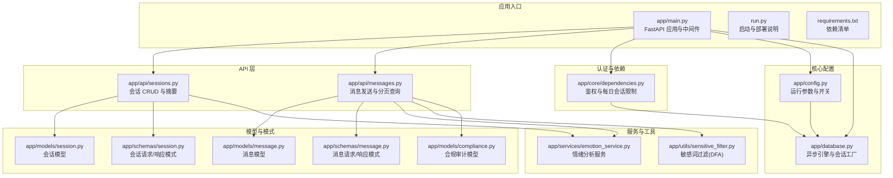
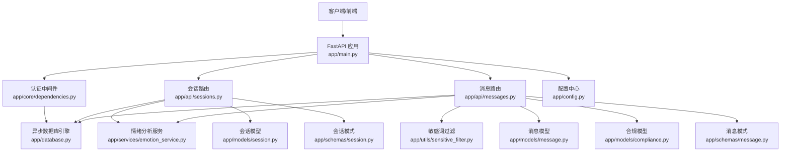
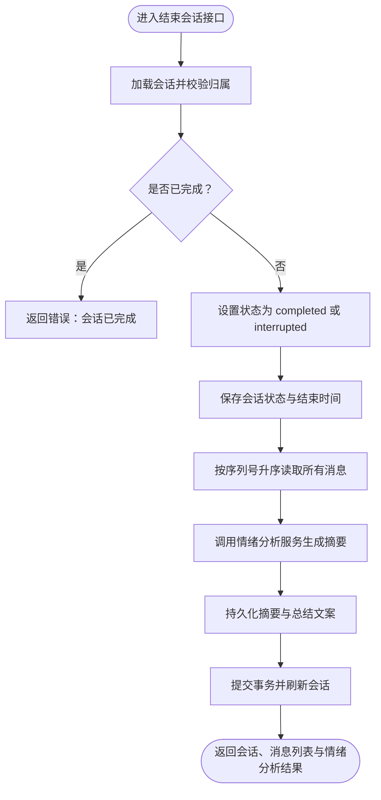
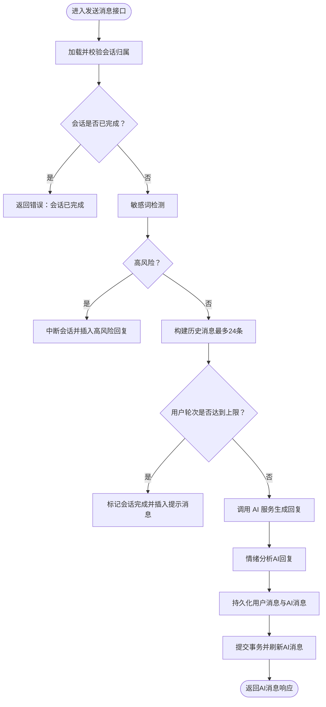
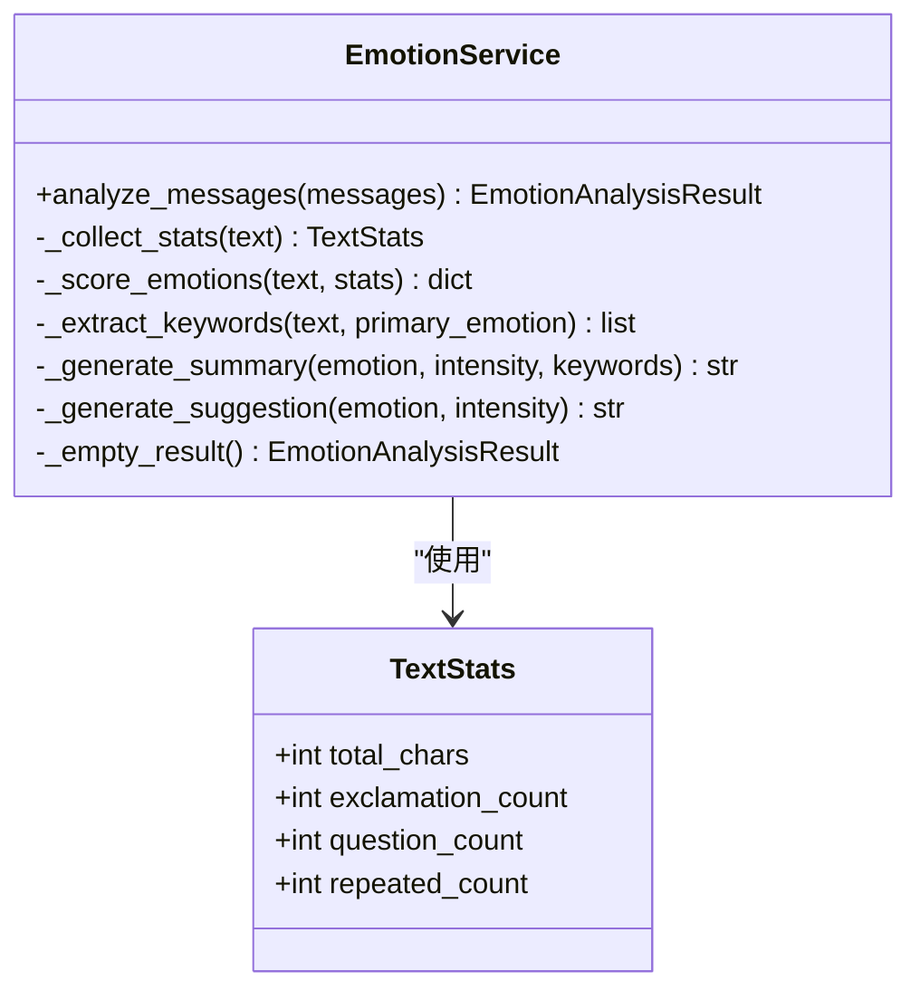
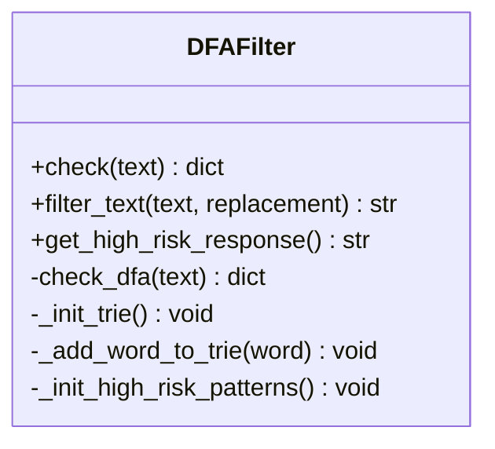
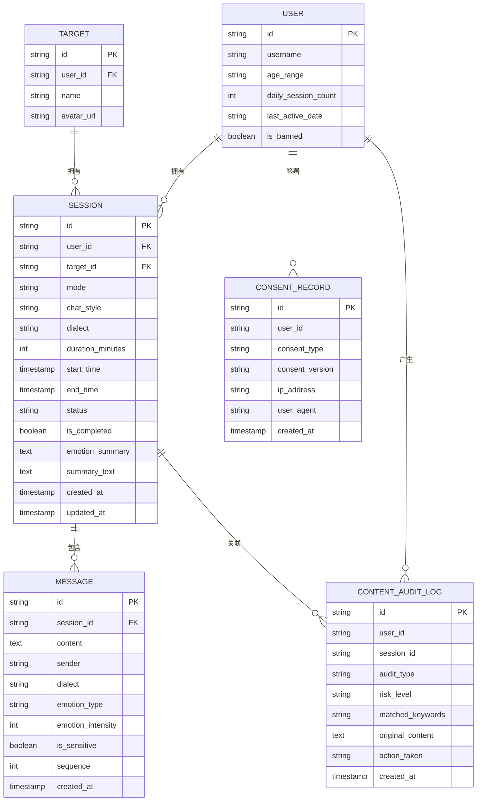
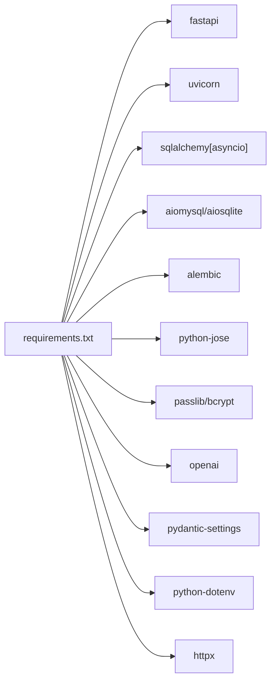

# 实时对话引擎

<cite>
**本文引用的文件**
- [emo_outlet_api/app/main.py](file://emo_outlet_api/app/main.py)
- [emo_outlet_api/app/api/messages.py](file://emo_outlet_api/app/api/messages.py)
- [emo_outlet_api/app/models/message.py](file://emo_outlet_api/app/models/message.py)
- [emo_outlet_api/app/schemas/message.py](file://emo_outlet_api/app/schemas/message.py)
- [emo_outlet_api/app/api/sessions.py](file://emo_outlet_api/app/api/sessions.py)
- [emo_outlet_api/app/models/session.py](file://emo_outlet_api/app/models/session.py)
- [emo_outlet_api/app/schemas/session.py](file://emo_outlet_api/app/schemas/session.py)
- [emo_outlet_api/app/utils/sensitive_filter.py](file://emo_outlet_api/app/utils/sensitive_filter.py)
- [emo_outlet_api/app/services/emotion_service.py](file://emo_outlet_api/app/services/emotion_service.py)
- [emo_outlet_api/app/config.py](file://emo_outlet_api/app/config.py)
- [emo_outlet_api/app/database.py](file://emo_outlet_api/app/database.py)
- [emo_outlet_api/app/core/dependencies.py](file://emo_outlet_api/app/core/dependencies.py)
- [emo_outlet_api/app/models/compliance.py](file://emo_outlet_api/app/models/compliance.py)
- [emo_outlet_api/run.py](file://emo_outlet_api/run.py)
- [emo_outlet_api/requirements.txt](file://emo_outlet_api/requirements.txt)
</cite>

## 目录
1. [简介](#简介)
2. [项目结构](#项目结构)
3. [核心组件](#核心组件)
4. [架构总览](#架构总览)
5. [详细组件分析](#详细组件分析)
6. [依赖分析](#依赖分析)
7. [性能考虑](#性能考虑)
8. [故障排查指南](#故障排查指南)
9. [结论](#结论)
10. [附录](#附录)

## 简介
本项目为“实时对话引擎”，围绕“情绪出口”应用场景，提供会话生命周期管理、消息发送与检索、敏感内容过滤、情绪分析与实时对话能力。当前代码库以 FastAPI 提供 REST API，采用 SQLAlchemy Async ORM 进行数据库访问，并通过 Pydantic 进行请求/响应数据校验。项目未包含 WebSocket 服务端实现，因此关于“WebSocket 连接建立与管理、心跳检测、断线重连、连接池管理、双向实时推送与广播”的部分将以“概念性说明”呈现，不对应具体源码。

## 项目结构
后端采用分层结构：入口与中间件、API 控制器、领域模型、数据访问层、服务层、工具与配置。前端位于独立 Flutter 项目，此处不展开。

图示来源
- [emo_outlet_api/app/main.py:1-82](file://emo_outlet_api/app/main.py#L1-L82)
- [emo_outlet_api/app/api/sessions.py:1-220](file://emo_outlet_api/app/api/sessions.py#L1-L220)
- [emo_outlet_api/app/api/messages.py:1-216](file://emo_outlet_api/app/api/messages.py#L1-L216)
- [emo_outlet_api/app/models/session.py:1-79](file://emo_outlet_api/app/models/session.py#L1-L79)
- [emo_outlet_api/app/models/message.py:1-46](file://emo_outlet_api/app/models/message.py#L1-L46)
- [emo_outlet_api/app/models/compliance.py:1-50](file://emo_outlet_api/app/models/compliance.py#L1-L50)
- [emo_outlet_api/app/schemas/session.py:1-49](file://emo_outlet_api/app/schemas/session.py#L1-L49)
- [emo_outlet_api/app/schemas/message.py:1-33](file://emo_outlet_api/app/schemas/message.py#L1-L33)
- [emo_outlet_api/app/services/emotion_service.py:1-181](file://emo_outlet_api/app/services/emotion_service.py#L1-L181)
- [emo_outlet_api/app/utils/sensitive_filter.py:1-142](file://emo_outlet_api/app/utils/sensitive_filter.py#L1-L142)
- [emo_outlet_api/app/config.py:1-125](file://emo_outlet_api/app/config.py#L1-L125)
- [emo_outlet_api/app/database.py:1-43](file://emo_outlet_api/app/database.py#L1-L43)
- [emo_outlet_api/run.py:1-31](file://emo_outlet_api/run.py#L1-L31)
- [emo_outlet_api/requirements.txt:1-29](file://emo_outlet_api/requirements.txt#L1-L29)

章节来源
- [emo_outlet_api/app/main.py:1-82](file://emo_outlet_api/app/main.py#L1-L82)
- [emo_outlet_api/app/config.py:1-125](file://emo_outlet_api/app/config.py#L1-L125)
- [emo_outlet_api/app/database.py:1-43](file://emo_outlet_api/app/database.py#L1-L43)
- [emo_outlet_api/app/core/dependencies.py:1-67](file://emo_outlet_api/app/core/dependencies.py#L1-L67)
- [emo_outlet_api/app/api/sessions.py:1-220](file://emo_outlet_api/app/api/sessions.py#L1-L220)
- [emo_outlet_api/app/api/messages.py:1-216](file://emo_outlet_api/app/api/messages.py#L1-L216)
- [emo_outlet_api/app/models/session.py:1-79](file://emo_outlet_api/app/models/session.py#L1-L79)
- [emo_outlet_api/app/models/message.py:1-46](file://emo_outlet_api/app/models/message.py#L1-L46)
- [emo_outlet_api/app/models/compliance.py:1-50](file://emo_outlet_api/app/models/compliance.py#L1-L50)
- [emo_outlet_api/app/schemas/session.py:1-49](file://emo_outlet_api/app/schemas/session.py#L1-L49)
- [emo_outlet_api/app/schemas/message.py:1-33](file://emo_outlet_api/app/schemas/message.py#L1-L33)
- [emo_outlet_api/app/services/emotion_service.py:1-181](file://emo_outlet_api/app/services/emotion_service.py#L1-L181)
- [emo_outlet_api/app/utils/sensitive_filter.py:1-142](file://emo_outlet_api/app/utils/sensitive_filter.py#L1-L142)
- [emo_outlet_api/run.py:1-31](file://emo_outlet_api/run.py#L1-L31)
- [emo_outlet_api/requirements.txt:1-29](file://emo_outlet_api/requirements.txt#L1-L29)

## 核心组件
- 应用入口与中间件：注册 CORS、异常处理器、健康检查、路由挂载与生命周期管理。
- 会话管理：创建、查询、获取活动会话、结束会话并生成情绪摘要。
- 消息处理：发送消息、分页查询、序列号生成、敏感内容拦截与审计日志。
- 情绪分析：基于关键词与统计特征的多维情绪评分与建议。
- 敏感词过滤：基于 DFA 的 O(n) 匹配与高风险正则组合检测。
- 数据库与配置：异步 SQLAlchemy 引擎、SQLite/MySQL 切换、Redis 地址、AI 服务配置等。
- 认证与限流：基于 JWT 的用户鉴权、每日会话次数限制。

章节来源
- [emo_outlet_api/app/main.py:1-82](file://emo_outlet_api/app/main.py#L1-L82)
- [emo_outlet_api/app/api/sessions.py:1-220](file://emo_outlet_api/app/api/sessions.py#L1-L220)
- [emo_outlet_api/app/api/messages.py:1-216](file://emo_outlet_api/app/api/messages.py#L1-L216)
- [emo_outlet_api/app/services/emotion_service.py:1-181](file://emo_outlet_api/app/services/emotion_service.py#L1-L181)
- [emo_outlet_api/app/utils/sensitive_filter.py:1-142](file://emo_outlet_api/app/utils/sensitive_filter.py#L1-L142)
- [emo_outlet_api/app/config.py:1-125](file://emo_outlet_api/app/config.py#L1-L125)
- [emo_outlet_api/app/database.py:1-43](file://emo_outlet_api/app/database.py#L1-L43)
- [emo_outlet_api/app/core/dependencies.py:1-67](file://emo_outlet_api/app/core/dependencies.py#L1-L67)

## 架构总览
后端采用“控制器-服务-模型-数据访问”的分层架构，API 层负责路由与数据校验，服务层封装业务逻辑（情绪分析、敏感词过滤），模型层映射数据库表，数据访问层提供异步会话与连接管理。

图示来源
- [emo_outlet_api/app/main.py:1-82](file://emo_outlet_api/app/main.py#L1-L82)
- [emo_outlet_api/app/core/dependencies.py:1-67](file://emo_outlet_api/app/core/dependencies.py#L1-L67)
- [emo_outlet_api/app/api/sessions.py:1-220](file://emo_outlet_api/app/api/sessions.py#L1-L220)
- [emo_outlet_api/app/api/messages.py:1-216](file://emo_outlet_api/app/api/messages.py#L1-L216)
- [emo_outlet_api/app/services/emotion_service.py:1-181](file://emo_outlet_api/app/services/emotion_service.py#L1-L181)
- [emo_outlet_api/app/utils/sensitive_filter.py:1-142](file://emo_outlet_api/app/utils/sensitive_filter.py#L1-L142)
- [emo_outlet_api/app/models/session.py:1-79](file://emo_outlet_api/app/models/session.py#L1-L79)
- [emo_outlet_api/app/models/message.py:1-46](file://emo_outlet_api/app/models/message.py#L1-L46)
- [emo_outlet_api/app/models/compliance.py:1-50](file://emo_outlet_api/app/models/compliance.py#L1-L50)
- [emo_outlet_api/app/schemas/session.py:1-49](file://emo_outlet_api/app/schemas/session.py#L1-L49)
- [emo_outlet_api/app/schemas/message.py:1-33](file://emo_outlet_api/app/schemas/message.py#L1-L33)
- [emo_outlet_api/app/database.py:1-43](file://emo_outlet_api/app/database.py#L1-L43)
- [emo_outlet_api/app/config.py:1-125](file://emo_outlet_api/app/config.py#L1-L125)

## 详细组件分析

### 会话管理（Sessions）
- 功能要点
  - 创建会话：校验目标、检查每日会话配额、初始化状态与开始时间。
  - 查询会话：分页列出已完成会话；获取活动会话；按 ID 获取会话详情。
  - 结束会话：支持强制中断或正常完成；计算情绪摘要并持久化。
- 数据模型
  - 字段覆盖模式、风格、方言、时长、状态、完成标记、情绪摘要 JSON、时间戳等。
- 流程图（结束会话）

图示来源
- [emo_outlet_api/app/api/sessions.py:156-220](file://emo_outlet_api/app/api/sessions.py#L156-L220)
- [emo_outlet_api/app/models/session.py:13-79](file://emo_outlet_api/app/models/session.py#L13-L79)
- [emo_outlet_api/app/models/message.py:13-46](file://emo_outlet_api/app/models/message.py#L13-L46)
- [emo_outlet_api/app/services/emotion_service.py:44-81](file://emo_outlet_api/app/services/emotion_service.py#L44-L81)

章节来源
- [emo_outlet_api/app/api/sessions.py:1-220](file://emo_outlet_api/app/api/sessions.py#L1-L220)
- [emo_outlet_api/app/models/session.py:1-79](file://emo_outlet_api/app/models/session.py#L1-L79)
- [emo_outlet_api/app/schemas/session.py:1-49](file://emo_outlet_api/app/schemas/session.py#L1-L49)

### 消息处理（Messages）
- 功能要点
  - 发送消息：敏感词检测、序列号生成、情绪分析、AI 回复生成、会话时长/轮数上限判断、高风险中断与审计日志。
  - 查询消息：按会话分页查询，返回剩余秒数与会话状态。
- 数据模型
  - 字段包含内容、发送方、方言、情绪类型与强度、敏感标记、序列号、创建时间。
- 流程图（发送消息）

图示来源
- [emo_outlet_api/app/api/messages.py:69-195](file://emo_outlet_api/app/api/messages.py#L69-L195)
- [emo_outlet_api/app/utils/sensitive_filter.py:102-119](file://emo_outlet_api/app/utils/sensitive_filter.py#L102-L119)
- [emo_outlet_api/app/services/emotion_service.py:44-71](file://emo_outlet_api/app/services/emotion_service.py#L44-L71)
- [emo_outlet_api/app/models/message.py:13-46](file://emo_outlet_api/app/models/message.py#L13-L46)

章节来源
- [emo_outlet_api/app/api/messages.py:1-216](file://emo_outlet_api/app/api/messages.py#L1-L216)
- [emo_outlet_api/app/models/message.py:1-46](file://emo_outlet_api/app/models/message.py#L1-L46)
- [emo_outlet_api/app/schemas/message.py:1-33](file://emo_outlet_api/app/schemas/message.py#L1-L33)

### 情绪分析服务（EmotionService）
- 设计要点
  - 基于关键词集合与停用词集合，统计标点、重复字符、长度等特征，计算各情绪得分并归一化。
  - 输出主情绪、强度、关键词、摘要与建议。
- 类图

图示来源
- [emo_outlet_api/app/services/emotion_service.py:44-181](file://emo_outlet_api/app/services/emotion_service.py#L44-L181)

章节来源
- [emo_outlet_api/app/services/emotion_service.py:1-181](file://emo_outlet_api/app/services/emotion_service.py#L1-L181)

### 敏感词过滤（DFAFilter）
- 设计要点
  - 使用 DFA Trie 树实现 O(n) 敏感词匹配；结合高风险正则模式识别潜在危险表达。
  - 提供过滤文本与高风险温和引导语。
- 类图

图示来源
- [emo_outlet_api/app/utils/sensitive_filter.py:37-142](file://emo_outlet_api/app/utils/sensitive_filter.py#L37-L142)

章节来源
- [emo_outlet_api/app/utils/sensitive_filter.py:1-142](file://emo_outlet_api/app/utils/sensitive_filter.py#L1-L142)

### 数据模型与关系
- ER 图

图示来源
- [emo_outlet_api/app/models/session.py:13-79](file://emo_outlet_api/app/models/session.py#L13-L79)
- [emo_outlet_api/app/models/message.py:13-46](file://emo_outlet_api/app/models/message.py#L13-L46)
- [emo_outlet_api/app/models/compliance.py:12-50](file://emo_outlet_api/app/models/compliance.py#L12-L50)

章节来源
- [emo_outlet_api/app/models/session.py:1-79](file://emo_outlet_api/app/models/session.py#L1-L79)
- [emo_outlet_api/app/models/message.py:1-46](file://emo_outlet_api/app/models/message.py#L1-L46)
- [emo_outlet_api/app/models/compliance.py:1-50](file://emo_outlet_api/app/models/compliance.py#L1-L50)

### 认证与依赖注入
- JWT 鉴权：从 Authorization 头解析令牌，解码并加载用户信息，校验封禁状态。
- 每日会话配额：按年龄组与访客类型限制当日可创建会话数量。
- 数据库会话：异步上下文管理，自动提交/回滚/关闭。

章节来源
- [emo_outlet_api/app/core/dependencies.py:1-67](file://emo_outlet_api/app/core/dependencies.py#L1-L67)
- [emo_outlet_api/app/database.py:1-43](file://emo_outlet_api/app/database.py#L1-L43)

### WebSocket 与实时通信（概念性说明）
- 连接建立与握手：当前代码库未实现 WebSocket。若需引入，可在 FastAPI 中使用 WebSocketRoute 并在连接建立时进行鉴权与会话校验。
- 心跳检测：服务端定期发送 ping，客户端回显 pong；超时则判定断线。
- 断线重连：指数退避策略，携带上次序列号与时间戳恢复消息。
- 连接池管理：限制每个用户的并发连接数，避免资源滥用。
- 双向通信：客户端到服务器的消息路由至消息处理流程；服务器到客户端的实时推送与广播通过频道/房间模型实现。
- 注意：以上为通用实时架构建议，非现有源码实现。

## 依赖分析
- 外部依赖
  - Web 框架：FastAPI、Uvicorn
  - 数据库：SQLAlchemy Async、aiomysql/aiosqlite、Alembic
  - 认证：python-jose、passlib、bcrypt
  - AI：OpenAI SDK
  - 配置：Pydantic Settings、python-dotenv
  - 工具：httpx、python-multipart
- 内部耦合
  - API 层依赖模型与模式，服务层被 API 层调用，工具类被服务层调用。
  - 认证中间件贯穿所有受保护路由，数据库会话由依赖注入统一提供。

图示来源
- [emo_outlet_api/requirements.txt:1-29](file://emo_outlet_api/requirements.txt#L1-L29)

章节来源
- [emo_outlet_api/requirements.txt:1-29](file://emo_outlet_api/requirements.txt#L1-L29)

## 性能考虑
- 数据库
  - 异步引擎与连接池：使用 SQLAlchemy Async Engine 与 async_session_factory，减少阻塞。
  - 索引优化：对常用查询字段（如 session_id、user_id、created_at）建立索引，提升分页与过滤效率。
  - 分页查询：消息分页按 sequence 升序，避免全表扫描。
- 服务层
  - 情绪分析与敏感词检测：尽量批量处理，减少重复计算。
  - AI 调用：合理设置超时与重试，避免阻塞请求线程。
- 并发与隔离
  - 每个请求使用独立 AsyncSession，确保事务隔离。
  - 会话级并发：通过会话状态与序列号保证消息顺序一致性。

## 故障排查指南
- 常见错误
  - 401 未认证：检查 Authorization 头与 JWT 有效性。
  - 403 用户被封禁：检查用户封禁状态与封禁原因。
  - 404 会话不存在：确认 session_id 与用户归属。
  - 429 达到每日会话配额：检查用户年龄组与配额限制。
  - 400 会话已完成：结束后的会话无法继续发送消息。
- 审计与日志
  - 高风险内容触发时记录审计日志，便于追踪与合规审查。
- 排查步骤
  - 查看请求日志与响应状态码。
  - 核对数据库中会话与消息状态。
  - 检查敏感词过滤与情绪分析返回值。
  - 确认配置项（如会话时长、轮次上限、审计开关）。

章节来源
- [emo_outlet_api/app/core/dependencies.py:18-50](file://emo_outlet_api/app/core/dependencies.py#L18-L50)
- [emo_outlet_api/app/api/messages.py:76-113](file://emo_outlet_api/app/api/messages.py#L76-L113)
- [emo_outlet_api/app/models/compliance.py:31-50](file://emo_outlet_api/app/models/compliance.py#L31-L50)

## 结论
本项目提供了完整的会话与消息管理、敏感内容治理与情绪分析能力，具备良好的扩展性与合规性。若需实现真正的实时双向通信，建议在现有 FastAPI 基础上引入 WebSocket，并配套心跳、重连与广播机制。同时，建议完善数据库索引、缓存与限流策略，以支撑高并发场景。

## 附录

### API 文档与客户端集成指南（REST）
- 健康检查
  - GET /health
  - 返回应用状态、名称与版本。
- 会话相关
  - POST /api/sessions：创建会话（请求体参考会话模式）。
  - GET /api/sessions：分页查询已完成会话。
  - GET /api/sessions/active：获取活动会话。
  - GET /api/sessions/{session_id}：按 ID 获取会话。
  - POST /api/sessions/{session_id}/end：结束会话并生成摘要。
- 消息相关
  - GET /api/sessions/{session_id}/messages?page&page_size：分页查询消息。
  - POST /api/sessions/{session_id}/messages：发送消息（请求体参考消息模式）。
- 认证
  - 使用 Bearer Token 在 Authorization 头中传递 JWT。
- 部署
  - 开发：uvicorn app.main:app --reload --host 0.0.0.0 --port 8686
  - 生产：uvicorn app.main:app --host 0.0.0.0 --port 8686 --workers 4
  - Docker：docker build -t emo-outlet-api . && docker run -d -p 8000:8000 --env-file .env emo-outlet-api

章节来源
- [emo_outlet_api/app/main.py:66-82](file://emo_outlet_api/app/main.py#L66-L82)
- [emo_outlet_api/app/api/sessions.py:50-153](file://emo_outlet_api/app/api/sessions.py#L50-L153)
- [emo_outlet_api/app/api/messages.py:32-195](file://emo_outlet_api/app/api/messages.py#L32-L195)
- [emo_outlet_api/run.py:1-31](file://emo_outlet_api/run.py#L1-L31)