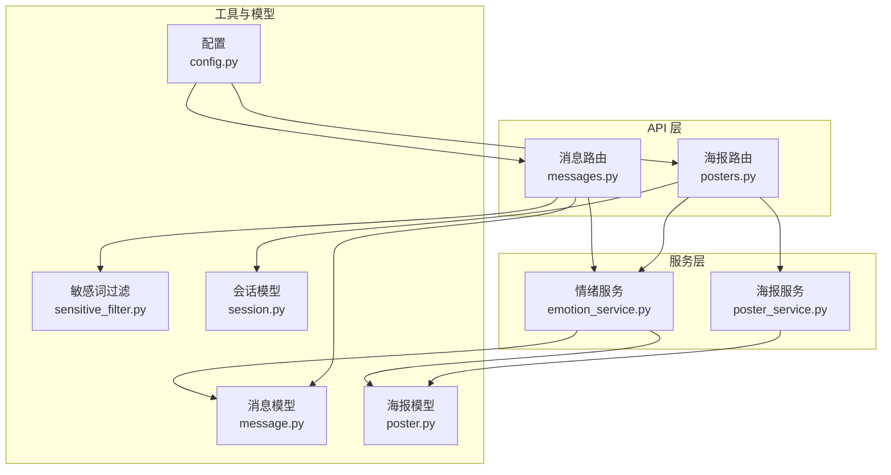
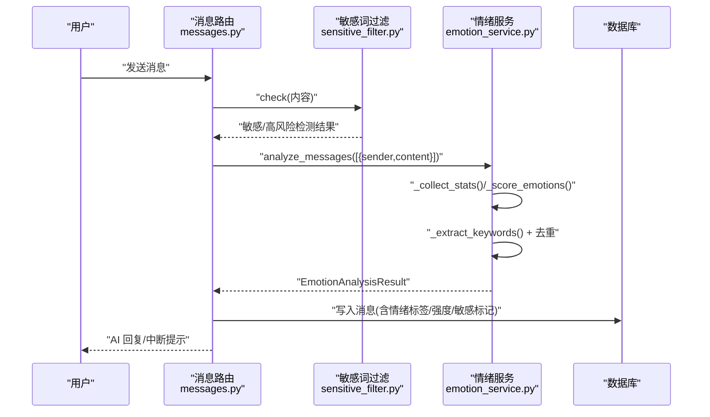
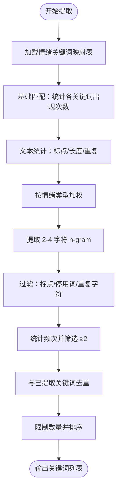
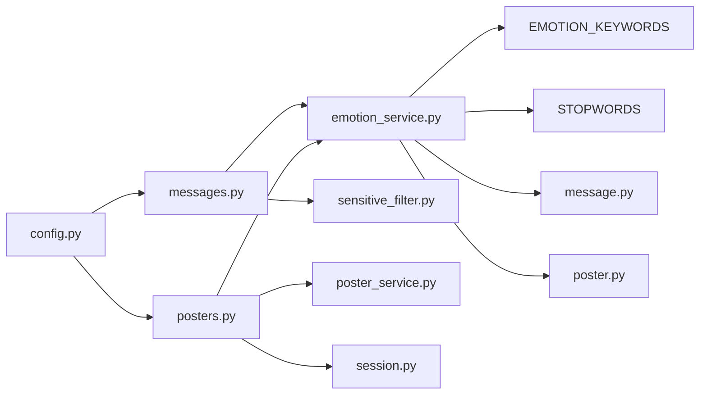

# 关键词提取系统

<cite>
**本文引用的文件**
- [emotion_service.py](file://emo_outlet_api/app/services/emotion_service.py)
- [sensitive_filter.py](file://emo_outlet_api/app/utils/sensitive_filter.py)
- [messages.py](file://emo_outlet_api/app/api/messages.py)
- [posters.py](file://emo_outlet_api/app/api/posters.py)
- [poster_service.py](file://emo_outlet_api/app/services/poster_service.py)
- [message.py](file://emo_outlet_api/app/models/message.py)
- [poster.py](file://emo_outlet_api/app/models/poster.py)
- [session.py](file://emo_outlet_api/app/models/session.py)
- [config.py](file://emo_outlet_api/app/config.py)
- [需求文档.md](file://需求文档.md)
- [README.md](file://README.md)
</cite>

## 目录
1. [简介](#简介)
2. [项目结构](#项目结构)
3. [核心组件](#核心组件)
4. [架构总览](#架构总览)
5. [详细组件分析](#详细组件分析)
6. [依赖分析](#依赖分析)
7. [性能考虑](#性能考虑)
8. [故障排查指南](#故障排查指南)
9. [结论](#结论)
10. [附录](#附录)

## 简介
本文件面向关键词提取系统，聚焦于基于关键词匹配的提取算法与情绪关键词映射表的构建、匹配策略与去重机制、重要性评估（出现频率、情感强度权重、上下文相关性）、筛选与排序（候选词收集、评分计算、Top-N 提取）、关键词与情绪类型的关联分析（情感色彩标注、语义相似度与领域适应性），以及性能优化（预编译正则、缓存、并发）与测试评估。系统以情绪关键词映射表为核心，结合文本统计特征，实现关键词抽取与情绪分析的闭环。

## 项目结构
后端采用 FastAPI + SQLAlchemy 异步架构，关键词提取位于情绪服务模块，贯穿消息处理与海报生成流程：
- 情绪服务负责关键词提取与情绪评分
- API 层在消息发送与海报生成处调用情绪服务
- 海报服务消费情绪分析结果生成可视化内容
- 敏感词过滤模块提供高风险检测与中断机制

图表来源
- [messages.py:1-216](file://emo_outlet_api/app/api/messages.py#L1-L216)
- [posters.py:1-408](file://emo_outlet_api/app/api/posters.py#L1-L408)
- [emotion_service.py:1-181](file://emo_outlet_api/app/services/emotion_service.py#L1-L181)
- [poster_service.py:1-221](file://emo_outlet_api/app/services/poster_service.py#L1-L221)
- [sensitive_filter.py:1-142](file://emo_outlet_api/app/utils/sensitive_filter.py#L1-L142)
- [message.py:1-46](file://emo_outlet_api/app/models/message.py#L1-L46)
- [poster.py:1-41](file://emo_outlet_api/app/models/poster.py#L1-L41)
- [session.py:1-79](file://emo_outlet_api/app/models/session.py#L1-L79)
- [config.py:1-125](file://emo_outlet_api/app/config.py#L1-L125)

章节来源
- [README.md:1-169](file://README.md#L1-L169)
- [需求文档.md:1-449](file://需求文档.md#L1-L449)

## 核心组件
- 情绪关键词映射表（EMOTION_KEYWORDS）：按情绪类型维护关键词集合，用于基础匹配与权重计算
- 停用词集合（STOPWORDS）：过滤高频无意义字符组合，避免噪声干扰
- 情绪服务（EmotionService）：封装文本统计、情绪评分、关键词提取、摘要与建议生成
- 敏感词过滤（DFAFilter）：基于 DFA 的 O(n) 敏感词匹配，配合正则高风险模式
- API 路由：消息发送与海报生成调用情绪服务，返回关键词与情绪分析结果

章节来源
- [emotion_service.py:8-33](file://emo_outlet_api/app/services/emotion_service.py#L8-L33)
- [emotion_service.py:44-181](file://emo_outlet_api/app/services/emotion_service.py#L44-L181)
- [sensitive_filter.py:37-142](file://emo_outlet_api/app/utils/sensitive_filter.py#L37-L142)
- [messages.py:69-195](file://emo_outlet_api/app/api/messages.py#L69-L195)
- [posters.py:73-138](file://emo_outlet_api/app/api/posters.py#L73-L138)

## 架构总览
关键词提取贯穿以下流程：用户消息进入后，先进行敏感词检测与会话状态控制，随后调用情绪服务进行文本统计、情绪评分与关键词提取，最终将关键词与情绪结果写入消息与海报模型。

图表来源
- [messages.py:69-195](file://emo_outlet_api/app/api/messages.py#L69-L195)
- [sensitive_filter.py:74-119](file://emo_outlet_api/app/utils/sensitive_filter.py#L74-L119)
- [emotion_service.py:44-71](file://emo_outlet_api/app/services/emotion_service.py#L44-L71)

## 详细组件分析

### 情绪关键词映射表与匹配策略
- 映射表构建原理
  - 每种情绪类型维护一组关键词，用于直接匹配与加权计算
  - 通过词频统计与权重系数，量化各情绪的强度
- 匹配策略
  - 基础匹配：遍历映射表中的关键词，统计出现次数
  - 文本统计增强：结合标点、长度、重复字符等统计特征对情绪分数进行微调
- 去重机制
  - 关键词提取阶段使用列表去重，确保关键词唯一
  - 候选词集合与已提取关键词集合互斥，避免重复

章节来源
- [emotion_service.py:8-28](file://emo_outlet_api/app/services/emotion_service.py#L8-L28)
- [emotion_service.py:95-120](file://emo_outlet_api/app/services/emotion_service.py#L95-L120)
- [emotion_service.py:122-148](file://emo_outlet_api/app/services/emotion_service.py#L122-L148)

### 关键词重要性评估
- 出现频率统计
  - 对每个情绪类型的关键词进行计数，乘以固定权重，形成基础得分
- 情感强度权重
  - 根据文本统计特征（感叹号、问号、字符长度、重复字符）对特定情绪进行加分
- 上下文相关性分析
  - 通过滑动窗口提取 2-gram 至 4-gram 字符串，过滤标点与停用词，统计频次
  - 结合停用词集合与单一字符重复集合，剔除噪声
  - 仅保留出现次数≥2的候选词，进一步去重并限制总数

图表来源
- [emotion_service.py:95-148](file://emo_outlet_api/app/services/emotion_service.py#L95-L148)

章节来源
- [emotion_service.py:30-33](file://emo_outlet_api/app/services/emotion_service.py#L30-L33)
- [emotion_service.py:130-146](file://emo_outlet_api/app/services/emotion_service.py#L130-L146)

### 关键词筛选与排序算法
- 候选词收集
  - 情绪关键词命中集合作为基础候选
  - n-gram 候选集合经过滤与计数后合并
- 评分计算
  - 基础评分：关键词出现次数 × 权重
  - 统计增强：根据标点、长度、重复字符对情绪类型进行额外加分
  - 归一化：最大值归一化至 0-100，补充“平静”项保证覆盖
- Top-N 提取
  - 优先保留情绪关键词，再扩展至 n-gram 候选
  - 限制总数不超过 6，确保结果简洁可用

章节来源
- [emotion_service.py:95-120](file://emo_outlet_api/app/services/emotion_service.py#L95-L120)
- [emotion_service.py:122-148](file://emo_outlet_api/app/services/emotion_service.py#L122-L148)

### 关键词与情绪类型的关联分析
- 情感色彩标注
  - 每种情绪类型拥有专属标题、副标题、徽标、强调色与辅助色，用于海报渲染
- 语义相似度计算
  - 通过 n-gram 统计与停用词过滤，间接体现语义共现关系
- 领域适应性处理
  - 基于业务场景（泄愤对象、方言、对话风格）对关键词进行上下文约束与风格化输出

章节来源
- [poster_service.py:10-59](file://emo_outlet_api/app/services/poster_service.py#L10-L59)
- [posters.py:73-138](file://emo_outlet_api/app/api/posters.py#L73-L138)

### 敏感词与高风险拦截对关键词提取的影响
- 敏感词过滤
  - 使用 DFA Trie 树实现 O(n) 匹配，支持最长匹配与去重跳过
  - 高风险正则模式用于复杂意图检测
- 高风险中断
  - 检测到高风险时，系统中断会话并生成温和引导语，避免极端内容影响关键词提取质量

章节来源
- [sensitive_filter.py:37-142](file://emo_outlet_api/app/utils/sensitive_filter.py#L37-L142)
- [messages.py:80-126](file://emo_outlet_api/app/api/messages.py#L80-L126)

## 依赖分析
- 模块耦合
  - 情绪服务依赖映射表与停用词集合，内部逻辑自包含
  - API 层通过依赖注入调用情绪服务与敏感词过滤
  - 海报服务消费情绪分析结果，与情绪服务存在数据契约
- 外部依赖
  - 配置模块提供运行参数（如会话轮数上限、审计日志开关）
  - 数据库模型承载情绪分析结果与会话元数据

图表来源
- [emotion_service.py:1-181](file://emo_outlet_api/app/services/emotion_service.py#L1-L181)
- [messages.py:1-216](file://emo_outlet_api/app/api/messages.py#L1-L216)
- [posters.py:1-408](file://emo_outlet_api/app/api/posters.py#L1-L408)
- [poster_service.py:1-221](file://emo_outlet_api/app/services/poster_service.py#L1-L221)
- [sensitive_filter.py:1-142](file://emo_outlet_api/app/utils/sensitive_filter.py#L1-L142)
- [config.py:1-125](file://emo_outlet_api/app/config.py#L1-L125)
- [message.py:1-46](file://emo_outlet_api/app/models/message.py#L1-L46)
- [poster.py:1-41](file://emo_outlet_api/app/models/poster.py#L1-L41)
- [session.py:1-79](file://emo_outlet_api/app/models/session.py#L1-L79)

章节来源
- [messages.py:69-195](file://emo_outlet_api/app/api/messages.py#L69-L195)
- [posters.py:73-138](file://emo_outlet_api/app/api/posters.py#L73-L138)

## 性能考虑
- 预编译正则与缓存
  - 高风险正则在初始化时编译，减少重复编译开销
  - DFA Trie 树一次性构建，匹配过程 O(n)
- 缓存机制
  - 敏感词列表在过滤文本时直接遍历替换，避免重复扫描
- 并发处理策略
  - 异步数据库连接与会话管理，提升消息吞吐
  - 关键词提取为纯内存计算，适合在异步 API 中并行调度
- 复杂度分析
  - 基础匹配：O(E×K)，E 为情绪类型数，K 为关键词数
  - 统计增强：O(T)，T 为文本长度
  - n-gram 提取：O(T^2)，受窗口大小与候选词过滤影响
  - 总体：近似 O(E×K + T^2)，在合理阈值下可满足实时性要求

章节来源
- [sensitive_filter.py:69-72](file://emo_outlet_api/app/utils/sensitive_filter.py#L69-L72)
- [emotion_service.py:130-146](file://emo_outlet_api/app/services/emotion_service.py#L130-L146)
- [config.py:94-111](file://emo_outlet_api/app/config.py#L94-L111)

## 故障排查指南
- 关键词为空
  - 检查映射表是否为空或 primary_emotion 是否有效
  - 确认文本是否为空或仅含停用词
- 情绪评分异常
  - 核对统计特征（标点、长度、重复）是否被错误计入
  - 确认归一化与“平静”补充逻辑是否生效
- 高风险误判
  - 检查高风险正则模式是否过于宽泛
  - 确认敏感词库是否覆盖新增场景
- 性能瓶颈
  - 关注 n-gram 提取窗口与候选词过滤策略
  - 评估数据库写入延迟与会话轮数上限

章节来源
- [emotion_service.py:73-81](file://emo_outlet_api/app/services/emotion_service.py#L73-L81)
- [emotion_service.py:109-120](file://emo_outlet_api/app/services/emotion_service.py#L109-L120)
- [messages.py:80-126](file://emo_outlet_api/app/api/messages.py#L80-L126)

## 结论
关键词提取系统以情绪关键词映射表为核心，结合文本统计与 n-gram 候选扩展，实现了稳定、可解释且可量化的关键词抽取流程。通过 DFA 敏感词过滤与高风险中断机制，保障内容安全。在性能方面，预编译正则、DFA 缓存与异步并发提升了整体吞吐。建议持续扩展映射表与高风险模式，引入领域语料增强语义相关性，并在生产环境引入缓存与限流策略。

## 附录
- 测试用例建议
  - 正常场景：不同情绪关键词组合、标点与长度变化
  - 边界场景：空文本、仅停用词、超长文本、重复字符
  - 安全场景：高风险文本、敏感词触发
- 效果评估指标
  - 关键词召回率、精确率、F1 值
  - 情绪分类准确率与一致性
  - 用户满意度与使用时长