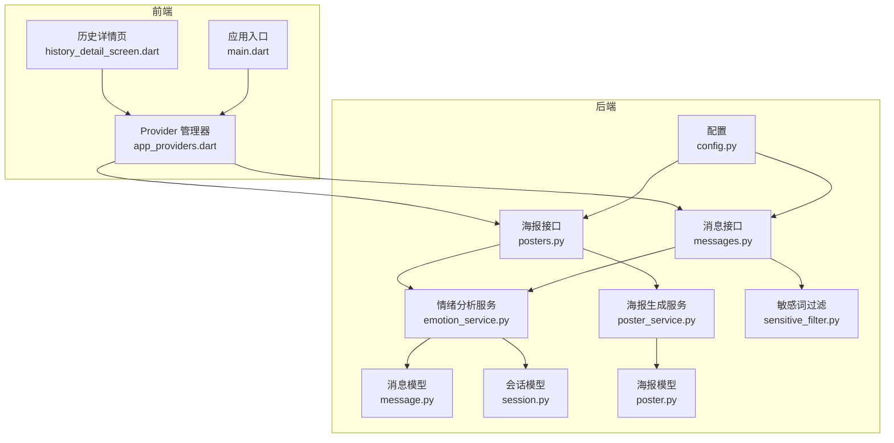
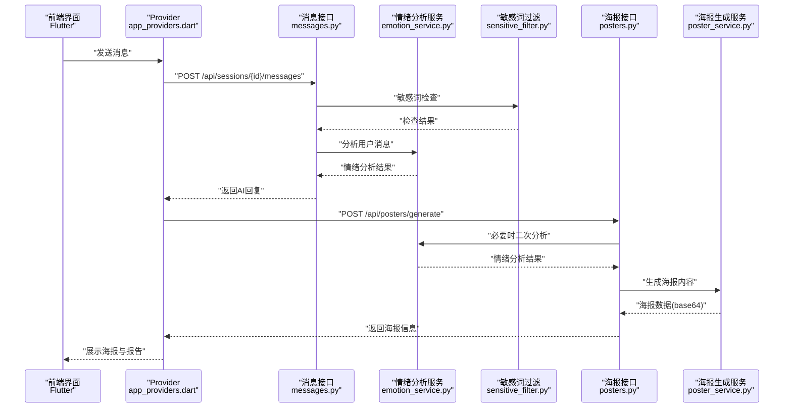
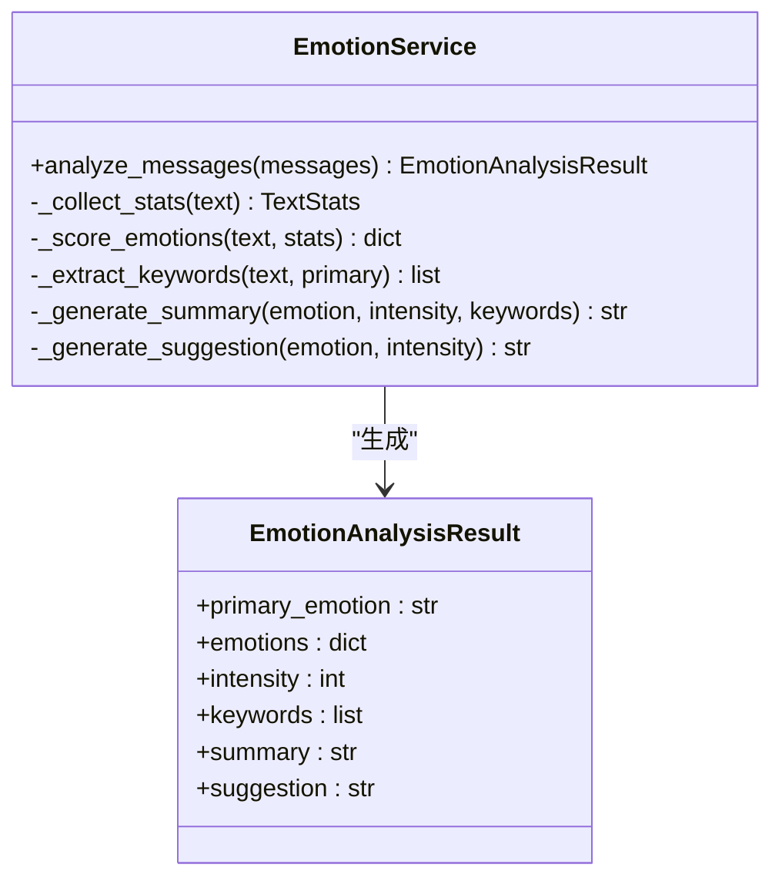
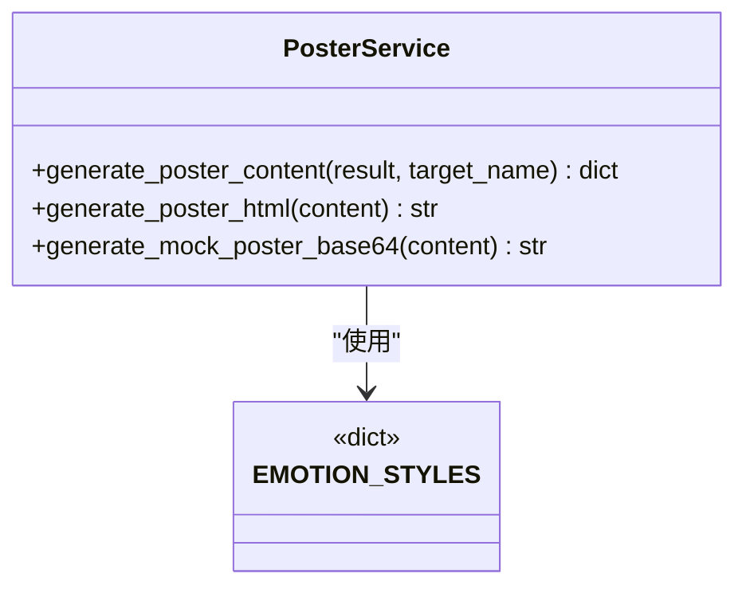
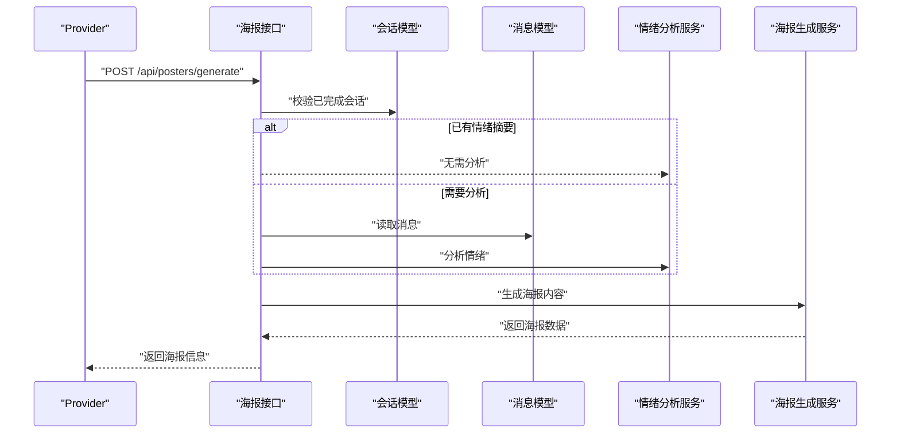
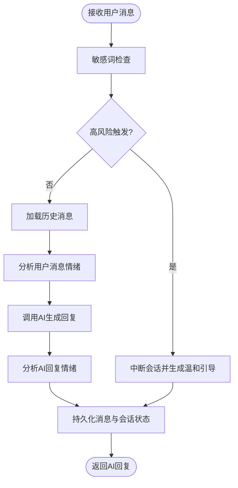
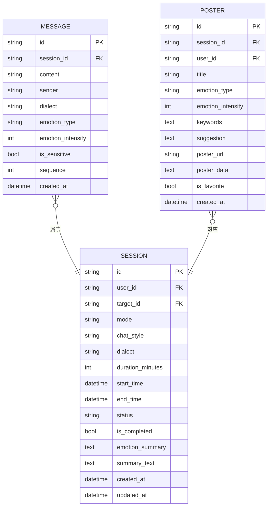
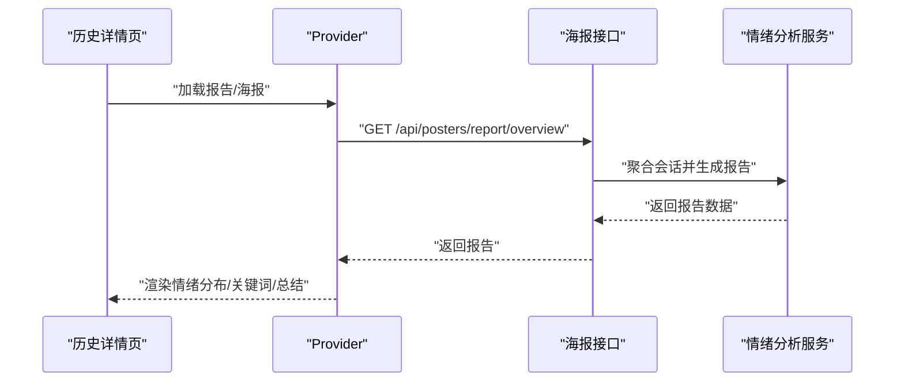
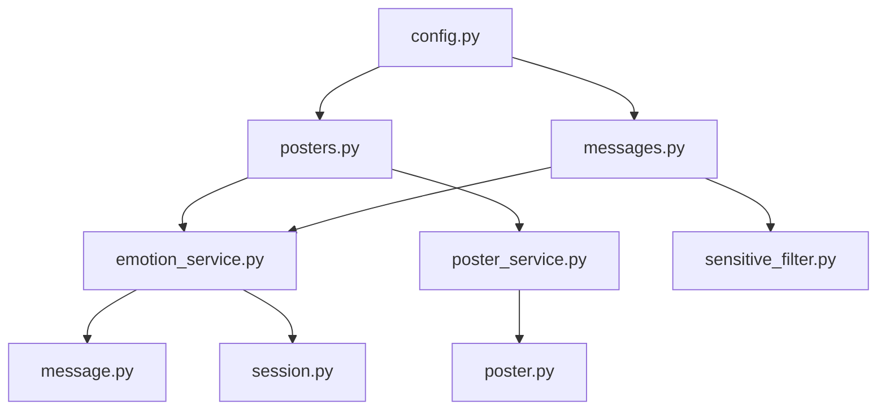

# 总结与建议生成

<cite>
**本文引用的文件**
- [emotion_service.py](file://emo_outlet_api/app/services/emotion_service.py)
- [poster_service.py](file://emo_outlet_api/app/services/poster_service.py)
- [posters.py](file://emo_outlet_api/app/api/posters.py)
- [messages.py](file://emo_outlet_api/app/api/messages.py)
- [poster.py](file://emo_outlet_api/app/models/poster.py)
- [message.py](file://emo_outlet_api/app/models/message.py)
- [session.py](file://emo_outlet_api/app/models/session.py)
- [support.py](file://emo_outlet_api/app/models/support.py)
- [poster_schema.py](file://emo_outlet_api/app/schemas/poster.py)
- [message_schema.py](file://emo_outlet_api/app/schemas/message.py)
- [sensitive_filter.py](file://emo_outlet_api/app/utils/sensitive_filter.py)
- [config.py](file://emo_outlet_api/app/config.py)
- [app_providers.dart](file://emo_outlet_app/lib/providers/app_providers.dart)
- [history_detail_screen.dart](file://emo_outlet_app/lib/screens/history_detail_screen.dart)
- [main.dart](file://emo_outlet_app/lib/main.dart)
</cite>

## 目录
1. [简介](#简介)
2. [项目结构](#项目结构)
3. [核心组件](#核心组件)
4. [架构总览](#架构总览)
5. [详细组件分析](#详细组件分析)
6. [依赖分析](#依赖分析)
7. [性能考量](#性能考量)
8. [故障排查指南](#故障排查指南)
9. [结论](#结论)
10. [附录](#附录)

## 简介
本文件围绕“总结与建议生成”功能，系统化梳理后端情绪分析与海报生成的技术实现，以及前后端协同流程。重点涵盖：
- 基于模板的情绪总结生成机制：多模板映射、上下文参数注入、自然语言生成策略
- 个性化建议算法设计：情绪类型映射、建议池管理与随机选择机制
- 总结文案的动态生成：变量替换、情感色彩调整、语言风格适配
- 建议内容的分类体系：情绪调节技巧、心理疏导方法、自我关怀策略
- 模板优化与扩展方案：多语言支持、文化适应性与个性化定制
- 测试案例与用户体验优化建议

## 项目结构
后端采用 FastAPI + SQLAlchemy 架构，核心模块包括：
- 服务层：情绪分析服务、海报生成服务
- API 层：海报生成接口、消息与会话接口
- 模型层：消息、会话、海报、用户偏好等数据库模型
- 工具层：敏感词过滤（DFA）
- 配置层：运行参数与合规限制

前端 Flutter 应用通过 Provider 管理会话、消息与情绪报告/海报状态，并与后端 API 协作完成完整流程。

图表来源
- [emotion_service.py:44-181](file://emo_outlet_api/app/services/emotion_service.py#L44-L181)
- [poster_service.py:66-221](file://emo_outlet_api/app/services/poster_service.py#L66-L221)
- [posters.py:73-139](file://emo_outlet_api/app/api/posters.py#L73-L139)
- [messages.py:69-196](file://emo_outlet_api/app/api/messages.py#L69-L196)
- [message.py:13-46](file://emo_outlet_api/app/models/message.py#L13-L46)
- [session.py:13-79](file://emo_outlet_api/app/models/session.py#L13-L79)
- [poster.py:12-41](file://emo_outlet_api/app/models/poster.py#L12-L41)
- [config.py:12-125](file://emo_outlet_api/app/config.py#L12-L125)
- [sensitive_filter.py:37-142](file://emo_outlet_api/app/utils/sensitive_filter.py#L37-L142)
- [app_providers.dart:134-328](file://emo_outlet_app/lib/providers/app_providers.dart#L134-L328)
- [history_detail_screen.dart:1-200](file://emo_outlet_app/lib/screens/history_detail_screen.dart#L1-L200)
- [main.dart:1-97](file://emo_outlet_app/lib/main.dart#L1-L97)

章节来源
- [emotion_service.py:44-181](file://emo_outlet_api/app/services/emotion_service.py#L44-L181)
- [poster_service.py:66-221](file://emo_outlet_api/app/services/poster_service.py#L66-L221)
- [posters.py:73-139](file://emo_outlet_api/app/api/posters.py#L73-L139)
- [messages.py:69-196](file://emo_outlet_api/app/api/messages.py#L69-L196)
- [message.py:13-46](file://emo_outlet_api/app/models/message.py#L13-L46)
- [session.py:13-79](file://emo_outlet_api/app/models/session.py#L13-L79)
- [poster.py:12-41](file://emo_outlet_api/app/models/poster.py#L12-L41)
- [config.py:12-125](file://emo_outlet_api/app/config.py#L12-L125)
- [sensitive_filter.py:37-142](file://emo_outlet_api/app/utils/sensitive_filter.py#L37-L142)
- [app_providers.dart:134-328](file://emo_outlet_app/lib/providers/app_providers.dart#L134-L328)
- [history_detail_screen.dart:1-200](file://emo_outlet_app/lib/screens/history_detail_screen.dart#L1-L200)
- [main.dart:1-97](file://emo_outlet_app/lib/main.dart#L1-L97)

## 核心组件
- 情绪分析服务：负责统计文本特征、计算情绪得分、提取关键词、生成总结与建议
- 海报生成服务：根据情绪结果与样式模板生成海报内容与 HTML/SVG
- 海报接口：统一生成海报、查询报告、收藏与删除
- 消息接口：发送消息、触发情绪分析、敏感词拦截与会话状态管理
- 数据模型：消息、会话、海报、用户偏好等持久化结构
- 前端 Provider：封装会话、消息、报告与海报的状态与 API 调用

章节来源
- [emotion_service.py:44-181](file://emo_outlet_api/app/services/emotion_service.py#L44-L181)
- [poster_service.py:66-221](file://emo_outlet_api/app/services/poster_service.py#L66-L221)
- [posters.py:73-139](file://emo_outlet_api/app/api/posters.py#L73-L139)
- [messages.py:69-196](file://emo_outlet_api/app/api/messages.py#L69-L196)
- [poster.py:12-41](file://emo_outlet_api/app/models/poster.py#L12-L41)
- [message.py:13-46](file://emo_outlet_api/app/models/message.py#L13-L46)
- [session.py:13-79](file://emo_outlet_api/app/models/session.py#L13-L79)
- [app_providers.dart:134-328](file://emo_outlet_app/lib/providers/app_providers.dart#L134-L328)

## 架构总览
从用户输入到最终海报产出的端到端流程如下：

图表来源
- [messages.py:69-196](file://emo_outlet_api/app/api/messages.py#L69-L196)
- [emotion_service.py:44-181](file://emo_outlet_api/app/services/emotion_service.py#L44-L181)
- [sensitive_filter.py:102-139](file://emo_outlet_api/app/utils/sensitive_filter.py#L102-L139)
- [posters.py:73-139](file://emo_outlet_api/app/api/posters.py#L73-L139)
- [poster_service.py:66-221](file://emo_outlet_api/app/services/poster_service.py#L66-L221)
- [app_providers.dart:233-328](file://emo_outlet_app/lib/providers/app_providers.dart#L233-L328)

## 详细组件分析

### 组件A：情绪分析服务（多模板与自然语言生成）
- 多模板随机选择策略：通过情绪类型映射到不同风格模板，结合强度与关键词进行动态拼接
- 上下文参数注入：将主情绪、强度、关键词、目标名等注入到模板占位符
- 自然语言生成技术：基于规则与权重的评分函数，结合标点、长度、重复等统计特征，输出标准化概率分布与摘要、建议

图表来源
- [emotion_service.py:44-181](file://emo_outlet_api/app/services/emotion_service.py#L44-L181)
- [poster_schema.py:8-15](file://emo_outlet_api/app/schemas/poster.py#L8-L15)

章节来源
- [emotion_service.py:44-181](file://emo_outlet_api/app/services/emotion_service.py#L44-L181)
- [poster_schema.py:8-15](file://emo_outlet_api/app/schemas/poster.py#L8-L15)

### 组件B：海报生成服务（模板与样式）
- 情绪样式映射：每种情绪对应标题、副标题、徽标、强调色、辅助色与摘要语句
- 动态内容生成：将情绪分析结果注入到 HTML/SVG 模板，生成海报数据
- 可视化适配：通过 CSS 变量与渐变背景，适配不同情绪的视觉风格

图表来源
- [poster_service.py:66-221](file://emo_outlet_api/app/services/poster_service.py#L66-L221)

章节来源
- [poster_service.py:66-221](file://emo_outlet_api/app/services/poster_service.py#L66-L221)

### 组件C：海报接口（生成、查询、收藏与报告）
- 生成海报：校验已完成会话，读取或计算情绪分析结果，生成海报数据
- 查询报告：按周期聚合会话，计算主导情绪、分布与趋势，并给出建议
- 收藏与删除：维护海报收藏状态

图表来源
- [posters.py:73-139](file://emo_outlet_api/app/api/posters.py#L73-L139)
- [emotion_service.py:44-181](file://emo_outlet_api/app/services/emotion_service.py#L44-L181)
- [poster_service.py:66-221](file://emo_outlet_api/app/services/poster_service.py#L66-L221)
- [session.py:13-79](file://emo_outlet_api/app/models/session.py#L13-L79)
- [message.py:13-46](file://emo_outlet_api/app/models/message.py#L13-L46)

章节来源
- [posters.py:73-139](file://emo_outlet_api/app/api/posters.py#L73-L139)
- [session.py:13-79](file://emo_outlet_api/app/models/session.py#L13-L79)
- [message.py:13-46](file://emo_outlet_api/app/models/message.py#L13-L46)

### 组件D：消息接口（敏感词过滤与会话控制）
- 敏感词过滤：DFA + 正则双通道，识别高风险模式并记录审计日志
- 会话控制：限制轮数、时长与年龄分组，必要时中断并生成温和引导回复
- 情绪分析：在用户消息与 AI 消息上分别进行情绪分析，标注情绪类型与强度

图表来源
- [messages.py:69-196](file://emo_outlet_api/app/api/messages.py#L69-L196)
- [sensitive_filter.py:102-139](file://emo_outlet_api/app/utils/sensitive_filter.py#L102-L139)
- [emotion_service.py:44-181](file://emo_outlet_api/app/services/emotion_service.py#L44-L181)
- [config.py:94-125](file://emo_outlet_api/app/config.py#L94-L125)

章节来源
- [messages.py:69-196](file://emo_outlet_api/app/api/messages.py#L69-L196)
- [sensitive_filter.py:102-139](file://emo_outlet_api/app/utils/sensitive_filter.py#L102-L139)
- [emotion_service.py:44-181](file://emo_outlet_api/app/services/emotion_service.py#L44-L181)
- [config.py:94-125](file://emo_outlet_api/app/config.py#L94-L125)

### 组件E：数据模型与状态流转
- 消息模型：记录发送方、方言、情绪类型与强度、序列号等
- 会话模型：记录模式、风格、方言、时长、状态与情绪摘要
- 海报模型：存储海报标题、情绪类型与强度、关键词、建议与数据
- 用户偏好：保存历史保存、海报生成权限、通知开关与方言偏好

图表来源
- [message.py:13-46](file://emo_outlet_api/app/models/message.py#L13-L46)
- [session.py:13-79](file://emo_outlet_api/app/models/session.py#L13-L79)
- [poster.py:12-41](file://emo_outlet_api/app/models/poster.py#L12-L41)

章节来源
- [message.py:13-46](file://emo_outlet_api/app/models/message.py#L13-L46)
- [session.py:13-79](file://emo_outlet_api/app/models/session.py#L13-L79)
- [poster.py:12-41](file://emo_outlet_api/app/models/poster.py#L12-L41)

### 组件F：前端集成与用户体验
- Provider 管理：封装会话创建、消息发送、海报生成与报告加载
- UI 展示：历史详情页展示情绪分布、关键词、安抚总结与海报数据
- 主题与样式：全局主题定义，确保情绪可视化一致性

图表来源
- [app_providers.dart:330-416](file://emo_outlet_app/lib/providers/app_providers.dart#L330-L416)
- [posters.py:251-318](file://emo_outlet_api/app/api/posters.py#L251-L318)
- [emotion_service.py:44-181](file://emo_outlet_api/app/services/emotion_service.py#L44-L181)
- [history_detail_screen.dart:1-200](file://emo_outlet_app/lib/screens/history_detail_screen.dart#L1-L200)
- [main.dart:1-97](file://emo_outlet_app/lib/main.dart#L1-L97)

章节来源
- [app_providers.dart:330-416](file://emo_outlet_app/lib/providers/app_providers.dart#L330-L416)
- [posters.py:251-318](file://emo_outlet_api/app/api/posters.py#L251-L318)
- [history_detail_screen.dart:1-200](file://emo_outlet_app/lib/screens/history_detail_screen.dart#L1-L200)
- [main.dart:1-97](file://emo_outlet_app/lib/main.dart#L1-L97)

## 依赖分析
- 模块内聚：情绪分析与海报生成职责清晰，通过服务接口解耦
- 外部依赖：FastAPI、SQLAlchemy、DFA 敏感词过滤、AI 服务（可配置）
- 配置驱动：通过配置文件控制会话轮数、时长、方言与合规策略

图表来源
- [emotion_service.py:44-181](file://emo_outlet_api/app/services/emotion_service.py#L44-L181)
- [poster_service.py:66-221](file://emo_outlet_api/app/services/poster_service.py#L66-L221)
- [posters.py:73-139](file://emo_outlet_api/app/api/posters.py#L73-L139)
- [messages.py:69-196](file://emo_outlet_api/app/api/messages.py#L69-L196)
- [sensitive_filter.py:37-142](file://emo_outlet_api/app/utils/sensitive_filter.py#L37-L142)
- [message.py:13-46](file://emo_outlet_api/app/models/message.py#L13-L46)
- [session.py:13-79](file://emo_outlet_api/app/models/session.py#L13-L79)
- [poster.py:12-41](file://emo_outlet_api/app/models/poster.py#L12-L41)
- [config.py:12-125](file://emo_outlet_api/app/config.py#L12-L125)

章节来源
- [posters.py:73-139](file://emo_outlet_api/app/api/posters.py#L73-L139)
- [messages.py:69-196](file://emo_outlet_api/app/api/messages.py#L69-L196)
- [emotion_service.py:44-181](file://emo_outlet_api/app/services/emotion_service.py#L44-L181)
- [poster_service.py:66-221](file://emo_outlet_api/app/services/poster_service.py#L66-L221)
- [sensitive_filter.py:37-142](file://emo_outlet_api/app/utils/sensitive_filter.py#L37-L142)
- [config.py:12-125](file://emo_outlet_api/app/config.py#L12-L125)

## 性能考量
- 文本分析复杂度：关键词匹配与统计为线性扫描，整体 O(n)，适合长文本
- DFA 敏感词过滤：Trie 树匹配 O(n)，避免正则回溯
- 数据库访问：批量读取历史消息与会话，注意分页与索引优化
- 建议
  - 对高频会话与报告接口增加缓存
  - 对长历史消息分段分析，避免一次性加载过多数据
  - 将敏感词库与高风险模式预编译，减少运行时开销

## 故障排查指南
- 情绪分析为空：检查消息内容是否为空或仅系统消息；确认统计与归一化逻辑
- 海报生成失败：核对会话是否已完成、是否存在情绪摘要；验证样式模板键值
- 敏感词误判：调整 DFA 字典与高风险正则阈值；记录审计日志便于复盘
- 会话中断：确认年龄分组与轮数/时长限制；检查高风险触发响应
- 前端无法显示海报：检查 Provider 的海报数据字段与 UI 绑定

章节来源
- [emotion_service.py:73-81](file://emo_outlet_api/app/services/emotion_service.py#L73-L81)
- [posters.py:78-96](file://emo_outlet_api/app/api/posters.py#L78-L96)
- [messages.py:76-127](file://emo_outlet_api/app/api/messages.py#L76-L127)
- [sensitive_filter.py:102-139](file://emo_outlet_api/app/utils/sensitive_filter.py#L102-L139)
- [app_providers.dart:382-398](file://emo_outlet_app/lib/providers/app_providers.dart#L382-L398)

## 结论
本系统通过“规则+模板”的组合实现了稳定、可解释的情绪总结与建议生成。后端以服务化架构清晰分离情绪分析与海报生成，前端通过 Provider 实现流畅的用户体验。建议后续在多语言、文化适配与个性化定制方面持续迭代，同时加强缓存与监控以提升稳定性与可观测性。

## 附录

### 模板优化与扩展方案
- 多语言支持：为每种情绪模板提供多语言版本，按用户方言偏好动态切换
- 文化适应性：针对不同地区调整建议语句与视觉风格，避免刻板印象
- 个性化定制：基于用户偏好与历史行为，动态调整建议池权重与模板风格

### 建议内容分类体系
- 情绪调节技巧：深呼吸、暂停、重述边界
- 心理疏导方法：接纳、共情、重构认知
- 自我关怀策略：休息、独处、兴趣活动

### 测试案例与用户体验优化
- 测试案例
  - 输入空消息：期望返回默认“平静”结果与提示文案
  - 高频关键词：关键词提取应稳定且数量可控
  - 强烈标点：愤怒与焦虑的强度应随标点增多而提升
  - 长文本：性能测试覆盖 5000 字以上文本
- 用户体验优化
  - 增加“复制海报”与“分享”按钮
  - 提供“收藏海报”与“导出 PDF”能力
  - 在报告页面增加“导出 CSV”以便进一步分析