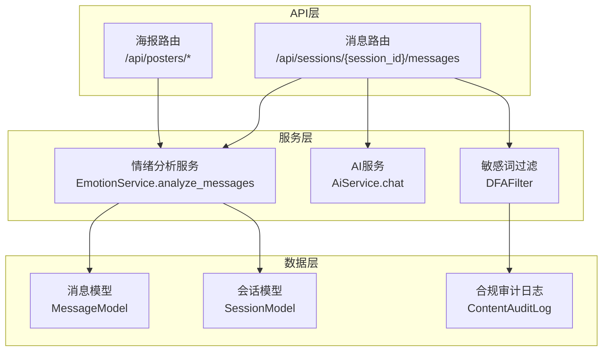
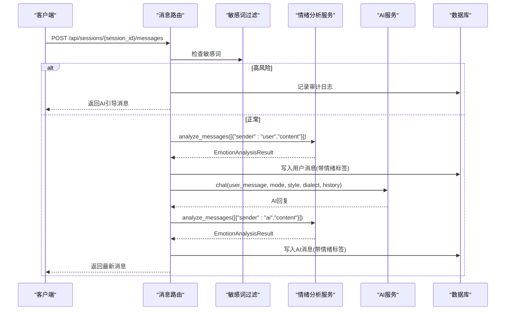
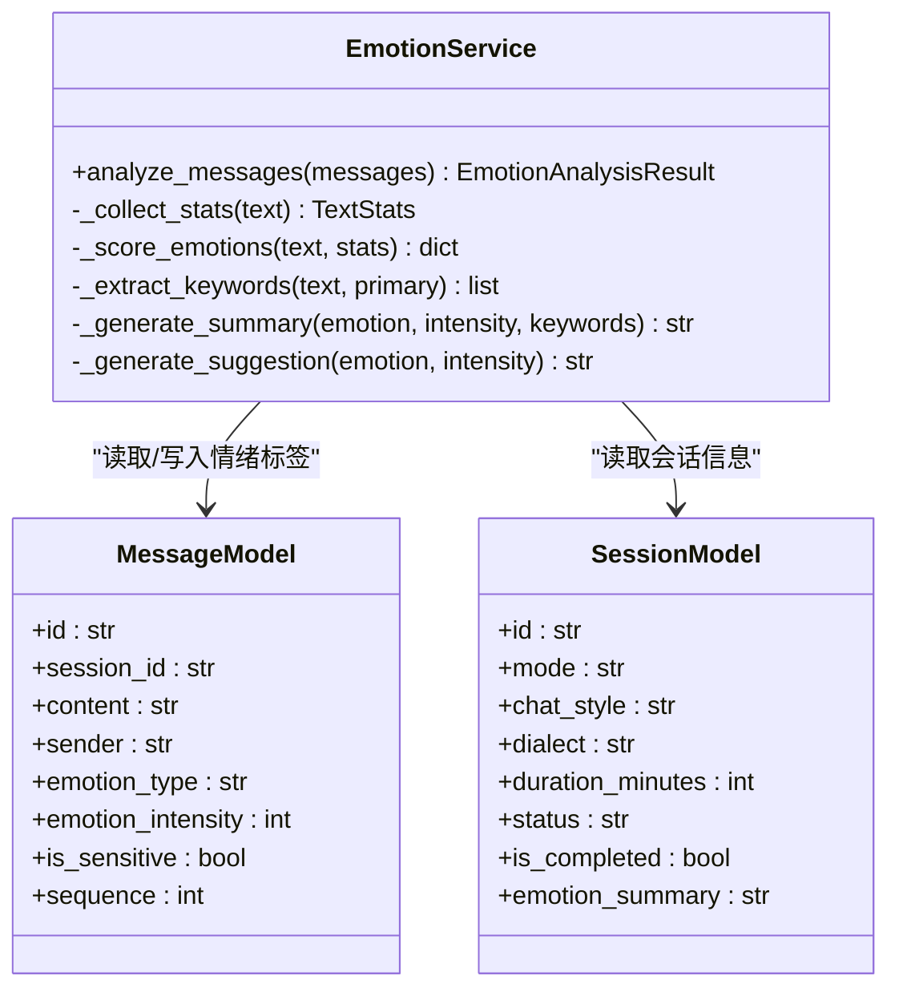
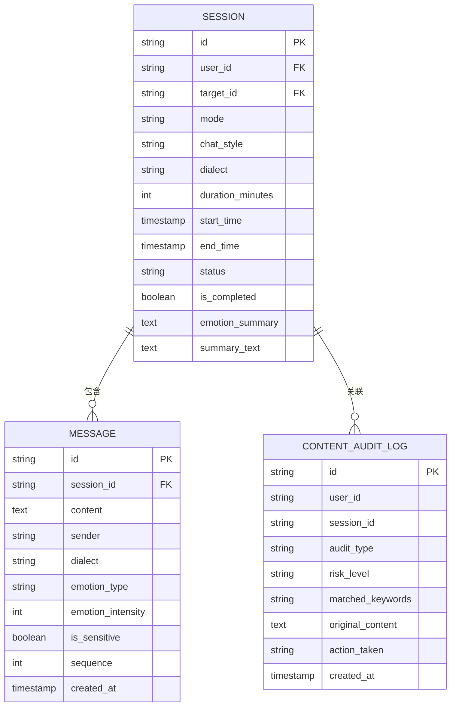

# 情绪分析API接口

<cite>
**本文档引用的文件**
- [emotion_service.py](file://emo_outlet_api/app/services/emotion_service.py)
- [messages.py](file://emo_outlet_api/app/api/messages.py)
- [message.py](file://emo_outlet_api/app/schemas/message.py)
- [poster.py](file://emo_outlet_api/app/schemas/poster.py)
- [message_model.py](file://emo_outlet_api/app/models/message.py)
- [session_model.py](file://emo_outlet_api/app/models/session.py)
- [compliance_model.py](file://emo_outlet_api/app/models/compliance.py)
- [ai_service.py](file://emo_outlet_api/app/services/ai_service.py)
- [sensitive_filter.py](file://emo_outlet_api/app/utils/sensitive_filter.py)
- [config.py](file://emo_outlet_api/app/config.py)
- [main.py](file://emo_outlet_api/app/main.py)
- [posters_api.py](file://emo_outlet_api/app/api/posters.py)
</cite>

## 目录
1. [简介](#简介)
2. [项目结构](#项目结构)
3. [核心组件](#核心组件)
4. [架构总览](#架构总览)
5. [详细组件分析](#详细组件分析)
6. [依赖关系分析](#依赖关系分析)
7. [性能与准确性评估](#性能与准确性评估)
8. [故障排查指南](#故障排查指南)
9. [结论](#结论)
10. [附录](#附录)

## 简介
本文件面向情绪分析API接口，聚焦于 analyze_messages 方法的接口规范与实现细节，涵盖输入参数格式、消息列表结构、发送者标识、返回结果的数据结构、调用流程（含异步处理、错误处理与超时控制）、性能指标与准确率评估方法、完整使用示例、最佳实践与常见问题解决方案，以及与其他模块的集成方式与数据流转过程。

## 项目结构
本项目采用FastAPI + SQLAlchemy的异步后端架构，核心围绕“会话-消息-情绪分析-海报生成-合规审计”链路展开。情绪分析能力由独立服务类提供，消息路由负责接入与持久化，并在敏感内容检测与AI回复之间进行协调。

图表来源
- [messages.py:1-216](file://emo_outlet_api/app/api/messages.py#L1-L216)
- [posters_api.py:1-408](file://emo_outlet_api/app/api/posters.py#L1-L408)
- [emotion_service.py:1-181](file://emo_outlet_api/app/services/emotion_service.py#L1-L181)
- [ai_service.py:1-354](file://emo_outlet_api/app/services/ai_service.py#L1-L354)
- [sensitive_filter.py:1-142](file://emo_outlet_api/app/utils/sensitive_filter.py#L1-L142)
- [message_model.py:1-46](file://emo_outlet_api/app/models/message.py#L1-L46)
- [session_model.py:1-79](file://emo_outlet_api/app/models/session.py#L1-L79)
- [compliance_model.py:1-50](file://emo_outlet_api/app/models/compliance.py#L1-L50)

章节来源
- [main.py:1-82](file://emo_outlet_api/app/main.py#L1-L82)
- [config.py:1-125](file://emo_outlet_api/app/config.py#L1-L125)

## 核心组件
- 情绪分析服务：提供 analyze_messages 方法，支持从消息列表中提取用户文本，统计标点与重复字符，计算各情绪得分并归一化，抽取关键词，生成摘要与建议。
- 消息路由：负责接收用户消息、执行敏感词检测、调用情绪分析与AI回复、持久化消息与会话状态。
- 海报路由：基于会话或消息分析结果生成情绪海报，提供情绪报告概览与详情。
- 敏感词过滤：基于DFA与正则的组合算法，支持高风险模式检测与温和引导响应。
- AI服务：根据会话模式、风格、方言与历史上下文生成回复，具备降级与安全审计能力。

章节来源
- [emotion_service.py:44-181](file://emo_outlet_api/app/services/emotion_service.py#L44-L181)
- [messages.py:69-195](file://emo_outlet_api/app/api/messages.py#L69-L195)
- [posters_api.py:73-138](file://emo_outlet_api/app/api/posters.py#L73-L138)
- [sensitive_filter.py:37-139](file://emo_outlet_api/app/utils/sensitive_filter.py#L37-L139)
- [ai_service.py:62-286](file://emo_outlet_api/app/services/ai_service.py#L62-L286)

## 架构总览
情绪分析API通过消息路由触发，内部串联敏感词检测、情绪分析与AI回复，最终落库并返回响应。整体为异步非阻塞设计，结合中间件与异常处理器保障稳定性。

图表来源
- [messages.py:69-195](file://emo_outlet_api/app/api/messages.py#L69-L195)
- [emotion_service.py:44-71](file://emo_outlet_api/app/services/emotion_service.py#L44-L71)
- [ai_service.py:98-134](file://emo_outlet_api/app/services/ai_service.py#L98-L134)
- [sensitive_filter.py:102-139](file://emo_outlet_api/app/utils/sensitive_filter.py#L102-L139)

## 详细组件分析

### analyze_messages 接口规范
- 方法签名：async analyze_messages(messages: list[dict]) -> EmotionAnalysisResult
- 输入参数格式：
  - messages: 列表，元素为字典，包含以下键：
    - content: 字符串，消息内容
    - sender: 字符串，取值为"user"或"ai"，用于区分消息来源
- 处理逻辑要点：
  - 仅统计sender为"user"的消息内容
  - 统计字符总数、感叹号/问号数量、连续重复字符数量
  - 基于预置情绪关键词与标点/长度特征加权计算各情绪分数
  - 归一化至0-100范围，补充"平静"项以保证分布完整性
  - 提取主情绪与强度，抽取关键词，生成摘要与建议

章节来源
- [emotion_service.py:44-121](file://emo_outlet_api/app/services/emotion_service.py#L44-L121)

### 返回结果数据结构：EmotionAnalysisResult
- 字段定义与类型：
  - primary_emotion: 字符串，主情绪类别
  - emotions: 字典，字符串->浮点数，各情绪得分百分比
  - intensity: 整数，情绪强度(0-100)
  - keywords: 字符串列表，关键词
  - summary: 字符串，情绪摘要
  - suggestion: 字符串，建议
- 默认空结果：
  - 若输入为空或无有效用户文本，返回"平静"主情绪与默认摘要/建议

章节来源
- [poster.py:8-14](file://emo_outlet_api/app/schemas/poster.py#L8-L14)
- [emotion_service.py:73-81](file://emo_outlet_api/app/services/emotion_service.py#L73-L81)

### 调用流程与异步处理
- 异步特性：
  - 情绪分析服务方法为异步，便于在高并发场景下提升吞吐
  - 消息路由与AI服务均采用异步数据库会话与异步LLM客户端
- 错误处理策略：
  - 路由层捕获HTTP异常并返回标准状态码
  - 情绪分析服务在无有效输入时返回默认结果
  - 敏感词检测触发高风险时，中断会话并返回温和引导消息
- 超时控制：
  - LLM调用设置最大令牌与温度参数，异常时降级为本地回复
  - 会话时长与轮数上限在路由层进行检查与更新

章节来源
- [messages.py:69-195](file://emo_outlet_api/app/api/messages.py#L69-L195)
- [emotion_service.py:44-81](file://emo_outlet_api/app/services/emotion_service.py#L44-L81)
- [ai_service.py:117-134](file://emo_outlet_api/app/services/ai_service.py#L117-L134)

### API使用示例
- 请求格式（发送消息）：
  - 方法：POST
  - 路径：/api/sessions/{session_id}/messages
  - 请求体：MessageSendRequest
    - content: 字符串，长度限制见配置
- 响应解析：
  - 成功：MessageResponse
    - 包含消息ID、会话ID、内容、发送者、方言、情绪类型与强度、是否敏感、序列号、创建时间
  - 失败：HTTP状态码与错误信息
- 示例（概念性说明）：
  - 发送一条用户消息，后端将进行敏感词检测、情绪分析、AI回复生成与持久化，最终返回最新消息

章节来源
- [message.py:8-25](file://emo_outlet_api/app/schemas/message.py#L8-L25)
- [messages.py:69-195](file://emo_outlet_api/app/api/messages.py#L69-L195)
- [config.py:88-92](file://emo_outlet_api/app/config.py#L88-L92)

### 错误码说明
- 404：会话不存在或已完成
- 400：会话已完成仍尝试发送消息
- 201：成功创建消息（含AI回复）
- 其他：HTTP状态码由异常处理器统一处理

章节来源
- [messages.py:77-78](file://emo_outlet_api/app/api/messages.py#L77-L78)
- [messages.py:206-208](file://emo_outlet_api/app/api/messages.py#L206-L208)

### 性能与准确性评估
- 性能指标：
  - 处理延迟：通过中间件记录请求耗时，可用于监控与优化
  - 内存使用：情绪分析与AI回复均为纯函数式处理，内存占用与输入长度近似线性
- 准确性评估：
  - 情绪关键词与标点权重为经验规则，建议通过A/B测试与标注数据集验证
  - 可扩展为外部模型推理，结合混淆矩阵与ROC曲线评估

章节来源
- [main.py:33-39](file://emo_outlet_api/app/main.py#L33-L39)
- [emotion_service.py:95-120](file://emo_outlet_api/app/services/emotion_service.py#L95-L120)

### 最佳实践与常见问题
- 最佳实践：
  - 控制单次消息长度，避免超长文本导致计算开销增大
  - 使用方言与风格参数适配不同用户群体
  - 在生产环境启用合规审计日志与高风险拦截
- 常见问题：
  - 会话已完成仍发送消息：需在前端控制交互状态
  - 高风险内容触发：系统会自动中断并返回温和引导
  - AI服务不可用：自动降级为本地回复，确保可用性

章节来源
- [messages.py:77-163](file://emo_outlet_api/app/api/messages.py#L77-L163)
- [sensitive_filter.py:128-139](file://emo_outlet_api/app/utils/sensitive_filter.py#L128-L139)
- [ai_service.py:110-134](file://emo_outlet_api/app/services/ai_service.py#L110-L134)

## 依赖关系分析
- 模块耦合：
  - 消息路由依赖情绪分析服务、AI服务与敏感词过滤
  - 情绪分析服务依赖结果模式定义
  - 报表路由依赖情绪分析结果与会话/消息模型
- 外部依赖：
  - 异步MySQL驱动、Redis缓存、OpenAI/DeepSeek/Qwen等LLM服务
  - 敏感词过滤基于DFA与正则，复杂度O(n)

图表来源
- [emotion_service.py:44-181](file://emo_outlet_api/app/services/emotion_service.py#L44-L181)
- [message_model.py:13-46](file://emo_outlet_api/app/models/message.py#L13-L46)
- [session_model.py:13-79](file://emo_outlet_api/app/models/session.py#L13-L79)

章节来源
- [emotion_service.py:1-181](file://emo_outlet_api/app/services/emotion_service.py#L1-L181)
- [message_model.py:1-46](file://emo_outlet_api/app/models/message.py#L1-L46)
- [session_model.py:1-79](file://emo_outlet_api/app/models/session.py#L1-L79)

## 性能与准确性评估
- 性能特性：
  - 情绪分析：基于字符串统计与关键词计数，时间复杂度近似O(n)，n为用户文本长度
  - 敏感词检测：DFA构建Trie树，匹配复杂度O(n)，正则高风险模式二次扫描
  - AI回复：异步LLM调用，异常时本地降级，确保稳定性
- 准确性评估方法：
  - 人工标注数据集划分训练/验证/测试集，计算精确率、召回率、F1
  - 使用混淆矩阵分析各类别误判情况，定位关键词权重与标点特征调整方向
  - A/B测试对比规则引擎与模型推理的差异，选择最优方案

[本节为通用指导，不直接分析特定文件]

## 故障排查指南
- 常见错误与处理：
  - 会话不存在/已完成：检查会话ID与用户权限
  - 高风险内容：查看审计日志，确认拦截原因与处置动作
  - AI服务异常：检查LLM提供商配置与密钥，确认降级逻辑是否生效
- 日志与监控：
  - 中间件记录请求耗时与状态码，便于定位慢请求
  - 合规审计日志记录敏感词命中与处置动作

章节来源
- [messages.py:206-208](file://emo_outlet_api/app/api/messages.py#L206-L208)
- [compliance_model.py:31-50](file://emo_outlet_api/app/models/compliance.py#L31-L50)
- [main.py:33-39](file://emo_outlet_api/app/main.py#L33-L39)

## 结论
本API通过清晰的接口规范与模块化设计，实现了从消息输入到情绪分析再到AI回复的完整闭环。analyze_messages方法提供了稳定的规则化情绪识别能力，配合敏感词过滤与合规审计，满足心理健康应用场景的安全与可用性要求。建议在生产环境中结合A/B测试与持续监控，逐步引入模型推理以提升准确性，并通过限流与缓存策略保障性能。

[本节为总结性内容，不直接分析特定文件]

## 附录

### 数据模型关系图

图表来源
- [session_model.py:13-79](file://emo_outlet_api/app/models/session.py#L13-L79)
- [message_model.py:13-46](file://emo_outlet_api/app/models/message.py#L13-L46)
- [compliance_model.py:31-50](file://emo_outlet_api/app/models/compliance.py#L31-L50)