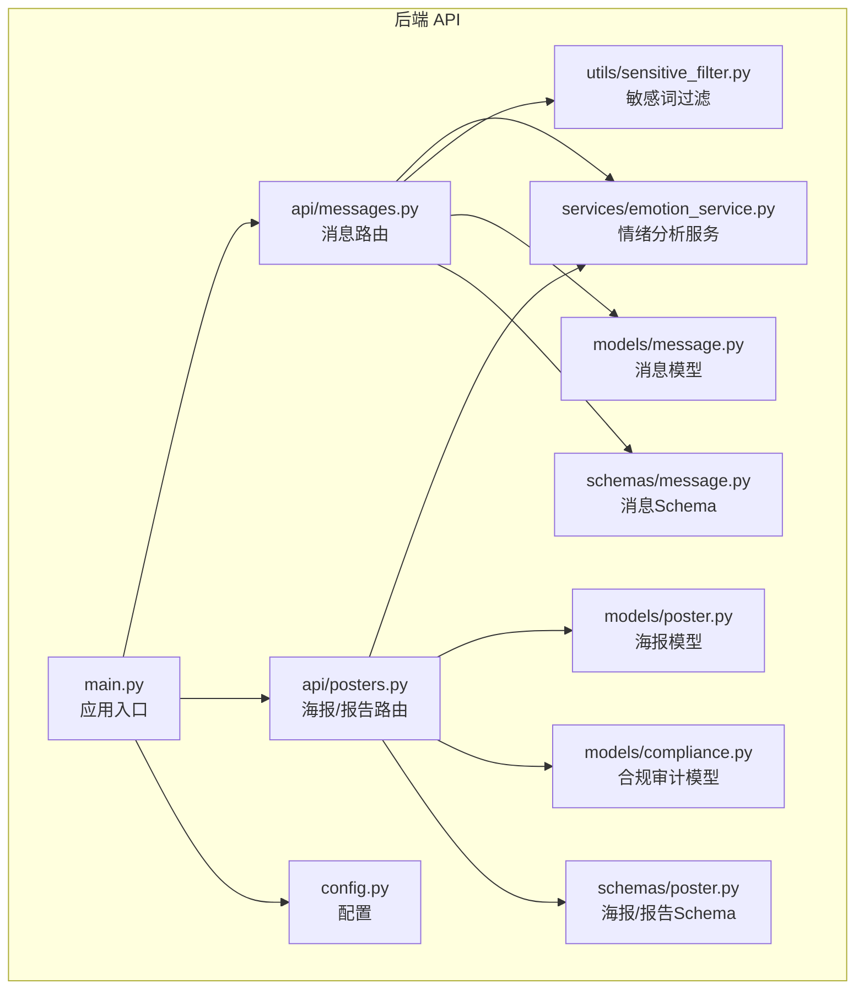
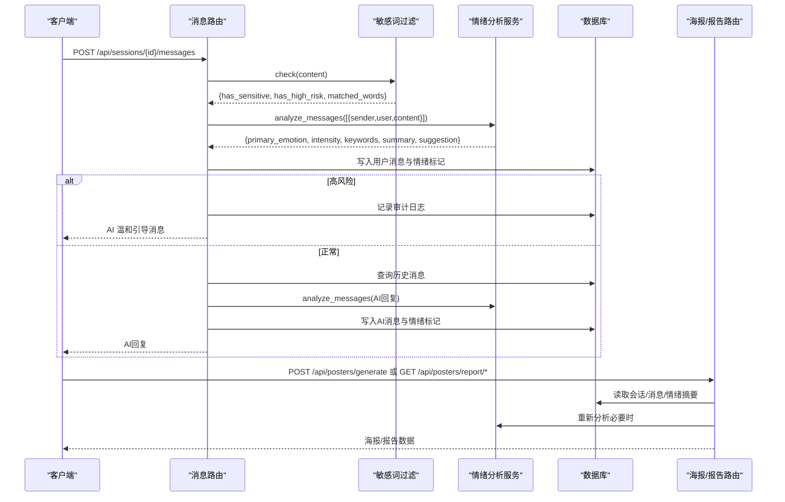
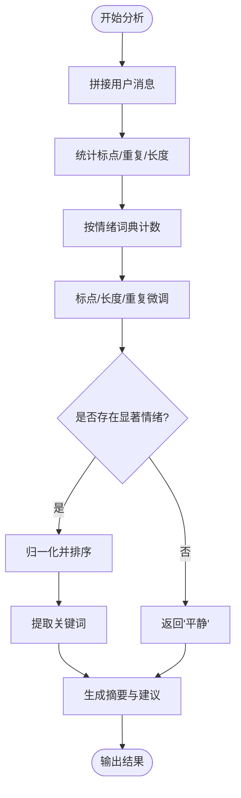
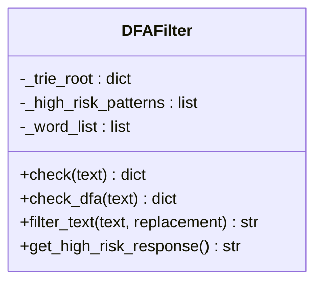
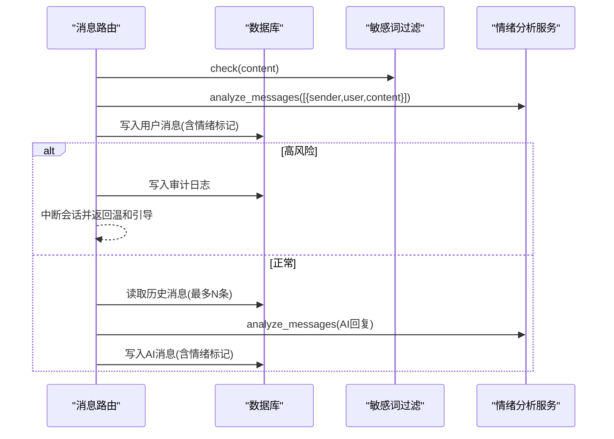
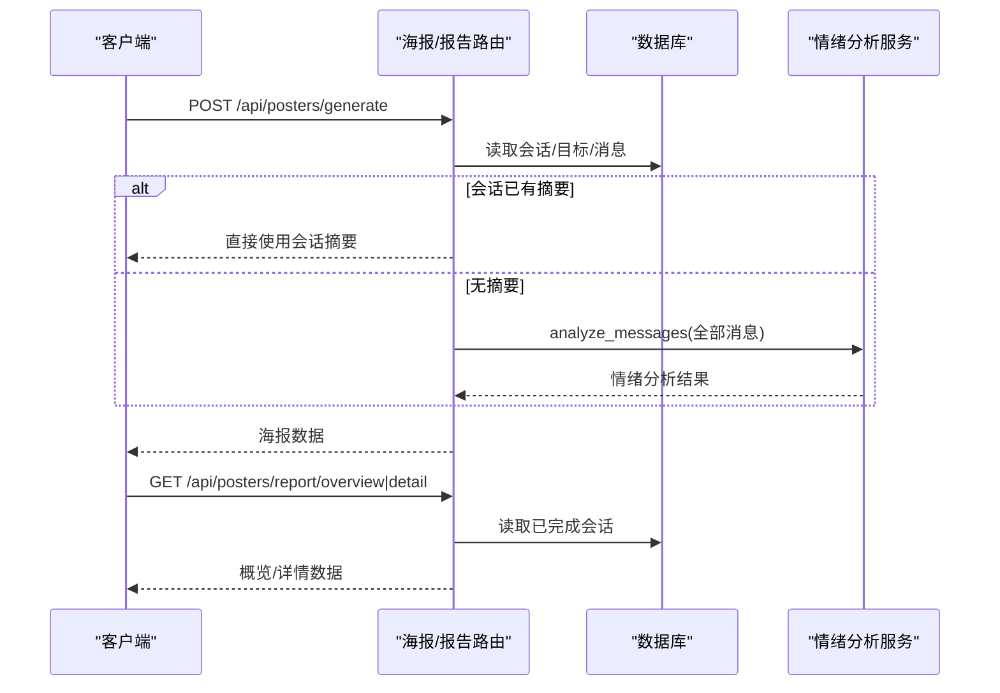
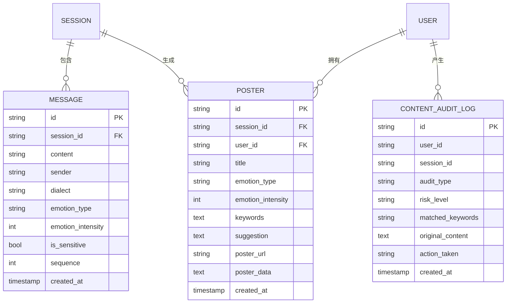
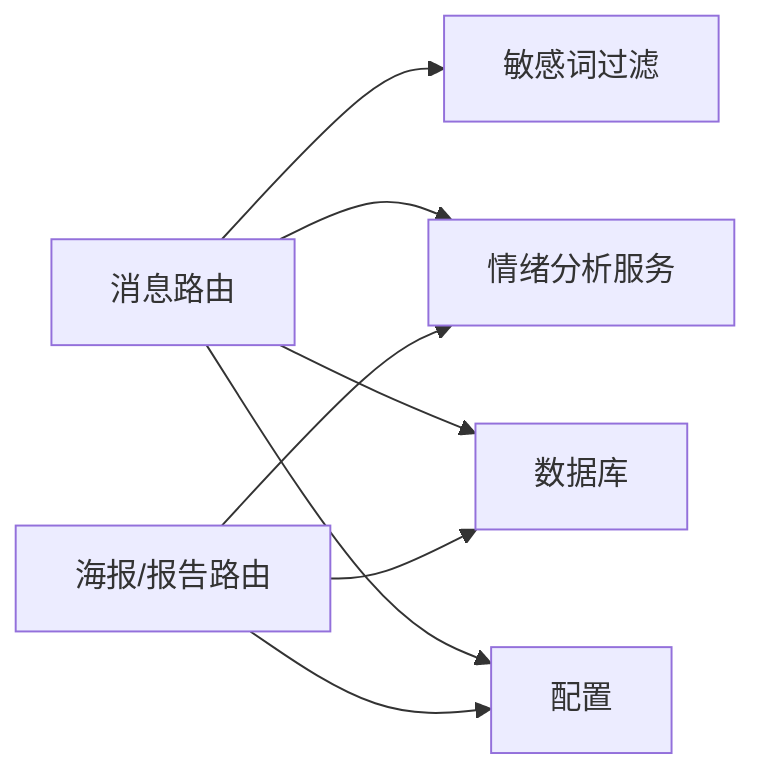

# 情绪分析系统

<cite>
**本文引用的文件**
- [emo_outlet_api/app/services/emotion_service.py](file://emo_outlet_api/app/services/emotion_service.py)
- [emo_outlet_api/app/utils/sensitive_filter.py](file://emo_outlet_api/app/utils/sensitive_filter.py)
- [emo_outlet_api/app/api/messages.py](file://emo_outlet_api/app/api/messages.py)
- [emo_outlet_api/app/api/posters.py](file://emo_outlet_api/app/api/posters.py)
- [emo_outlet_api/app/models/message.py](file://emo_outlet_api/app/models/message.py)
- [emo_outlet_api/app/models/poster.py](file://emo_outlet_api/app/models/poster.py)
- [emo_outlet_api/app/models/compliance.py](file://emo_outlet_api/app/models/compliance.py)
- [emo_outlet_api/app/schemas/message.py](file://emo_outlet_api/app/schemas/message.py)
- [emo_outlet_api/app/schemas/poster.py](file://emo_outlet_api/app/schemas/poster.py)
- [emo_outlet_api/app/config.py](file://emo_outlet_api/app/config.py)
- [emo_outlet_api/app/main.py](file://emo_outlet_api/app/main.py)
- [README.md](file://README.md)
- [需求文档.md](file://需求文档.md)
</cite>

## 目录
1. [简介](#简介)
2. [项目结构](#项目结构)
3. [核心组件](#核心组件)
4. [架构总览](#架构总览)
5. [详细组件分析](#详细组件分析)
6. [依赖分析](#依赖分析)
7. [性能考量](#性能考量)
8. [故障排查指南](#故障排查指南)
9. [结论](#结论)
10. [附录](#附录)

## 简介
本文件面向 Emo Outlet 情绪分析系统，聚焦后端 API 与情绪分析、敏感内容过滤、海报与报告生成等模块的技术实现。文档从算法原理、数据流、处理逻辑、集成点、错误处理与性能优化等方面进行系统化梳理，并提供 API 接口说明与最佳实践建议，帮助开发者与产品人员快速理解与扩展系统。

## 项目结构
后端采用 FastAPI + SQLAlchemy 架构，按功能域划分模块：
- API 层：路由定义与请求/响应处理
- 服务层：业务逻辑封装（情绪分析、海报生成等）
- 模型层：数据库 ORM 映射
- 工具层：敏感词过滤等通用工具
- 配置层：应用配置与环境变量
- 入口：FastAPI 应用生命周期与中间件

**图表来源**
- [emo_outlet_api/app/main.py:1-82](file://emo_outlet_api/app/main.py#L1-L82)
- [emo_outlet_api/app/api/messages.py:1-216](file://emo_outlet_api/app/api/messages.py#L1-L216)
- [emo_outlet_api/app/api/posters.py:1-383](file://emo_outlet_api/app/api/posters.py#L1-L383)
- [emo_outlet_api/app/services/emotion_service.py:1-181](file://emo_outlet_api/app/services/emotion_service.py#L1-L181)
- [emo_outlet_api/app/utils/sensitive_filter.py:1-142](file://emo_outlet_api/app/utils/sensitive_filter.py#L1-L142)
- [emo_outlet_api/app/models/message.py:1-46](file://emo_outlet_api/app/models/message.py#L1-L46)
- [emo_outlet_api/app/models/poster.py:1-61](file://emo_outlet_api/app/models/poster.py#L1-L61)
- [emo_outlet_api/app/models/compliance.py:1-50](file://emo_outlet_api/app/models/compliance.py#L1-L50)
- [emo_outlet_api/app/schemas/message.py:1-33](file://emo_outlet_api/app/schemas/message.py#L1-L33)
- [emo_outlet_api/app/schemas/poster.py:1-65](file://emo_outlet_api/app/schemas/poster.py#L1-L65)
- [emo_outlet_api/app/config.py:1-125](file://emo_outlet_api/app/config.py#L1-L125)

**章节来源**
- [README.md:58-84](file://README.md#L58-L84)
- [需求文档.md:238-284](file://需求文档.md#L238-L284)

## 核心组件
- 情绪分析服务：基于关键词匹配与统计特征的规则化情绪评分，输出主情绪、强度、关键词与建议摘要。
- 敏感词过滤：基于 DFA Trie 的 O(n) 匹配与高风险正则组合，支持温和引导与审计日志。
- 消息与会话：消息持久化、会话状态管理、历史拼接与轮数/时长控制。
- 海报与报告：会话完成后生成可视化海报，提供情绪概览与详情报告。
- 配置与安全：统一配置、合规开关、审计采样、年龄分组限制。

**章节来源**
- [emo_outlet_api/app/services/emotion_service.py:44-181](file://emo_outlet_api/app/services/emotion_service.py#L44-L181)
- [emo_outlet_api/app/utils/sensitive_filter.py:37-142](file://emo_outlet_api/app/utils/sensitive_filter.py#L37-L142)
- [emo_outlet_api/app/api/messages.py:69-195](file://emo_outlet_api/app/api/messages.py#L69-L195)
- [emo_outlet_api/app/api/posters.py:72-382](file://emo_outlet_api/app/api/posters.py#L72-L382)
- [emo_outlet_api/app/config.py:88-121](file://emo_outlet_api/app/config.py#L88-L121)

## 架构总览
系统围绕“消息-情绪-海报-报告”的闭环展开，消息路由负责接收用户输入、执行敏感词检查与情绪分析，AI 服务生成回复，最终在会话结束时生成海报与报告。

**图表来源**
- [emo_outlet_api/app/api/messages.py:69-195](file://emo_outlet_api/app/api/messages.py#L69-L195)
- [emo_outlet_api/app/utils/sensitive_filter.py:102-119](file://emo_outlet_api/app/utils/sensitive_filter.py#L102-L119)
- [emo_outlet_api/app/services/emotion_service.py:44-71](file://emo_outlet_api/app/services/emotion_service.py#L44-L71)
- [emo_outlet_api/app/api/posters.py:72-137](file://emo_outlet_api/app/api/posters.py#L72-L137)

## 详细组件分析

### 情绪分析算法实现
- 情绪词典：内置多类情绪的关键词集合，用于统计匹配计数。
- 统计特征：标点、重复字符、长度等文本统计用于微调各情绪分数。
- 归一化与主情绪：对各情绪得分归一化至百分比，若无显著情绪则返回“平静”，否则取最高分项为主情绪。
- 关键词提取：优先返回主情绪词典中的命中词，其次基于滑动窗口统计高频子串（去停用词、去标点、去单一字符）。
- 摘要与建议：根据主情绪与强度生成可读化摘要与调节建议。

**图表来源**
- [emo_outlet_api/app/services/emotion_service.py:44-181](file://emo_outlet_api/app/services/emotion_service.py#L44-L181)

**章节来源**
- [emo_outlet_api/app/services/emotion_service.py:8-28](file://emo_outlet_api/app/services/emotion_service.py#L8-L28)
- [emo_outlet_api/app/services/emotion_service.py:83-121](file://emo_outlet_api/app/services/emotion_service.py#L83-L121)
- [emo_outlet_api/app/services/emotion_service.py:122-148](file://emo_outlet_api/app/services/emotion_service.py#L122-L148)
- [emo_outlet_api/app/services/emotion_service.py:150-177](file://emo_outlet_api/app/services/emotion_service.py#L150-L177)

### 敏感内容过滤机制
- DFA Trie：构建敏感词 Trie，O(n) 线性扫描匹配，支持最长匹配。
- 高风险正则：对自伤/他伤等高危意图进行正则增强检测。
- 审计日志：当启用审计时，记录风险级别、命中关键词、动作（中断/观察）等。
- 高风险处理：触发高风险时中断会话并返回温和引导语。

**图表来源**
- [emo_outlet_api/app/utils/sensitive_filter.py:37-142](file://emo_outlet_api/app/utils/sensitive_filter.py#L37-L142)

**章节来源**
- [emo_outlet_api/app/utils/sensitive_filter.py:11-34](file://emo_outlet_api/app/utils/sensitive_filter.py#L11-L34)
- [emo_outlet_api/app/utils/sensitive_filter.py:54-119](file://emo_outlet_api/app/utils/sensitive_filter.py#L54-L119)
- [emo_outlet_api/app/api/messages.py:96-126](file://emo_outlet_api/app/api/messages.py#L96-L126)

### 消息与会话处理
- 消息持久化：记录内容、发送方、方言、情绪类型与强度、敏感标记、序列号。
- 会话控制：轮数上限、时长上限、年龄分组限制、会话状态（活动/中断/完成）。
- 历史拼接：最多取最近若干条消息作为 AI 对话上下文。
- 敏感审计：根据配置决定是否记录审计日志。

**图表来源**
- [emo_outlet_api/app/api/messages.py:69-195](file://emo_outlet_api/app/api/messages.py#L69-L195)
- [emo_outlet_api/app/models/message.py:13-42](file://emo_outlet_api/app/models/message.py#L13-L42)

**章节来源**
- [emo_outlet_api/app/api/messages.py:32-66](file://emo_outlet_api/app/api/messages.py#L32-L66)
- [emo_outlet_api/app/api/messages.py:76-195](file://emo_outlet_api/app/api/messages.py#L76-L195)
- [emo_outlet_api/app/models/message.py:13-42](file://emo_outlet_api/app/models/message.py#L13-L42)

### 海报与报告生成
- 海报生成：从会话或消息中提取情绪摘要，生成海报内容与图片（开发态返回 Base64）。
- 报告概览：按周期统计会话数量、主导情绪分布、日均强度与趋势。
- 报告详情：按周期统计模式分布、目标分布、时段分布、关键词频次等。

**图表来源**
- [emo_outlet_api/app/api/posters.py:72-137](file://emo_outlet_api/app/api/posters.py#L72-L137)
- [emo_outlet_api/app/api/posters.py:226-382](file://emo_outlet_api/app/api/posters.py#L226-L382)

**章节来源**
- [emo_outlet_api/app/api/posters.py:72-137](file://emo_outlet_api/app/api/posters.py#L72-L137)
- [emo_outlet_api/app/api/posters.py:226-382](file://emo_outlet_api/app/api/posters.py#L226-L382)
- [emo_outlet_api/app/schemas/poster.py:49-65](file://emo_outlet_api/app/schemas/poster.py#L49-L65)

### 数据模型与 Schema
- 消息模型：包含情绪类型、强度、敏感标记、序列号等字段。
- 海报模型：存储海报标题、情绪类型/强度、关键词、建议与图片数据。
- 合规审计：记录用户、会话、风险级别、命中关键词、动作等。

**图表来源**
- [emo_outlet_api/app/models/message.py:13-42](file://emo_outlet_api/app/models/message.py#L13-L42)
- [emo_outlet_api/app/models/poster.py:13-57](file://emo_outlet_api/app/models/poster.py#L13-L57)
- [emo_outlet_api/app/models/compliance.py:31-49](file://emo_outlet_api/app/models/compliance.py#L31-L49)

**章节来源**
- [emo_outlet_api/app/models/message.py:13-42](file://emo_outlet_api/app/models/message.py#L13-L42)
- [emo_outlet_api/app/models/poster.py:13-57](file://emo_outlet_api/app/models/poster.py#L13-L57)
- [emo_outlet_api/app/models/compliance.py:31-49](file://emo_outlet_api/app/models/compliance.py#L31-L49)
- [emo_outlet_api/app/schemas/message.py:8-33](file://emo_outlet_api/app/schemas/message.py#L8-L33)
- [emo_outlet_api/app/schemas/poster.py:8-65](file://emo_outlet_api/app/schemas/poster.py#L8-L65)

## 依赖分析
- 组件耦合：消息路由依赖敏感词过滤与情绪分析；海报路由依赖情绪分析与数据库；情绪分析与敏感词过滤相互独立。
- 外部依赖：FastAPI、SQLAlchemy、AI 服务（通过配置切换）、Redis/MySQL/SQLite（可选）。
- 配置驱动：通过配置控制会话轮数、时长、审计开关、方言目录等。

**图表来源**
- [emo_outlet_api/app/api/messages.py:17-19](file://emo_outlet_api/app/api/messages.py#L17-L19)
- [emo_outlet_api/app/api/posters.py:24-26](file://emo_outlet_api/app/api/posters.py#L24-L26)
- [emo_outlet_api/app/config.py:88-121](file://emo_outlet_api/app/config.py#L88-L121)

**章节来源**
- [emo_outlet_api/app/config.py:88-121](file://emo_outlet_api/app/config.py#L88-L121)
- [emo_outlet_api/app/main.py:51-64](file://emo_outlet_api/app/main.py#L51-L64)

## 性能考量
- 敏感词过滤：DFA Trie 匹配为线性复杂度，适合大规模词库；建议将词库预热加载，避免重复构建。
- 情绪分析：关键词计数与统计特征开销低；若消息量大，可考虑缓存主情绪与关键词以减少重复计算。
- 数据库：消息查询按会话与序列号索引，注意分页与历史长度限制；审计日志按采样率写入。
- 并发与限流：结合配置的每日/轮次限制与年龄分组策略，避免滥用。

[本节为通用性能建议，不直接分析具体文件]

## 故障排查指南
- 敏感词误判：检查词库是否包含歧义词，必要时增加停用词或调整匹配策略。
- 高风险误报/漏报：调整高风险正则阈值与模式，确保与业务场景一致。
- 情绪分析异常：确认输入消息为空或仅包含停用词时的默认分支；检查情绪词典与统计权重。
- 审计日志缺失：确认配置开关与采样率；检查数据库连接与权限。
- API 健康检查：访问健康端点确认服务可用。

**章节来源**
- [emo_outlet_api/app/utils/sensitive_filter.py:102-119](file://emo_outlet_api/app/utils/sensitive_filter.py#L102-L119)
- [emo_outlet_api/app/services/emotion_service.py:73-81](file://emo_outlet_api/app/services/emotion_service.py#L73-L81)
- [emo_outlet_api/app/config.py:108-111](file://emo_outlet_api/app/config.py#L108-L111)
- [emo_outlet_api/app/main.py:66-72](file://emo_outlet_api/app/main.py#L66-L72)

## 结论
本系统以规则化情绪分析与 DFA 敏感词过滤为核心，结合会话与消息持久化、海报与报告生成，形成完整的情绪可视化闭环。通过配置驱动的安全与合规策略，满足不同年龄段与场景下的使用需求。建议在后续迭代中引入更丰富的统计特征与可解释性输出，持续优化情绪词典与高风险检测策略。

[本节为总结性内容，不直接分析具体文件]

## 附录

### 情绪分析 API 接口文档
- 消息发送与回复
  - 方法与路径：POST /api/sessions/{session_id}/messages
  - 输入：MessageSendRequest（content）
  - 输出：MessageResponse（含情绪类型、强度、敏感标记等）
  - 行为：执行敏感词检查与情绪分析，写入消息并返回 AI 回复；高风险时中断并返回温和引导
- 海报生成
  - 方法与路径：POST /api/posters/generate
  - 输入：PosterGenerateRequest（session_id）
  - 输出：PosterResponse（海报标题、情绪类型/强度、关键词、建议、图片数据）
  - 行为：从会话或消息中提取情绪摘要，生成海报
- 情绪报告
  - 方法与路径：GET /api/posters/report/overview
  - 参数：period（daily/weekly/monthly/yearly/all）
  - 输出：EmotionReportResponse（会话总数、总时长、主导情绪、分布、趋势、建议）
  - 行为：按周期统计并生成概览
  - 方法与路径：GET /api/posters/report/detail
  - 参数：period
  - 输出：EmotionReportDetailResponse（趋势点、模式分布、目标分布、时段分布、关键词统计）

**章节来源**
- [emo_outlet_api/app/api/messages.py:69-195](file://emo_outlet_api/app/api/messages.py#L69-L195)
- [emo_outlet_api/app/api/posters.py:72-137](file://emo_outlet_api/app/api/posters.py#L72-L137)
- [emo_outlet_api/app/api/posters.py:226-382](file://emo_outlet_api/app/api/posters.py#L226-L382)
- [emo_outlet_api/app/schemas/message.py:8-33](file://emo_outlet_api/app/schemas/message.py#L8-L33)
- [emo_outlet_api/app/schemas/poster.py:17-65](file://emo_outlet_api/app/schemas/poster.py#L17-L65)

### 算法优化建议
- 情绪强度计算
  - 引入滑动窗口统计与上下文权重，提升对多轮对话情绪变化的捕捉。
  - 加入否定词与程度副词处理，改善强度与极性的判断。
- 关键词提取
  - 引入 TF-IDF 或 TextRank 算法，结合领域词典与情感词典进行加权。
  - 增加词性过滤与命名实体识别，提升关键词质量。
- 敏感内容过滤
  - 动态更新词库与正则模式，结合用户举报与审计日志进行迭代。
  - 引入模糊匹配与编辑距离，降低绕过风险。
- 可视化输出
  - 报告支持导出 PDF/CSV，图表支持交互式缩放与筛选。
  - 增加情绪温度计与趋势对比，提升用户体验。

[本节为通用优化建议，不直接分析具体文件]

### 实际应用场景最佳实践
- 年龄分组与限制：针对未成年人设置更严格的轮数与时长限制，并在 UI 中提示健康使用建议。
- 合规与审计：启用审计日志并定期审查，确保高风险内容得到及时干预。
- 数据脱敏：仅上报情绪类型与强度统计，避免原始对话明文存储。
- 本地化与方言：通过 Prompt 工程与词库替换实现方言风格，逐步引入方言 TTS。

[本节为通用实践建议，不直接分析具体文件]