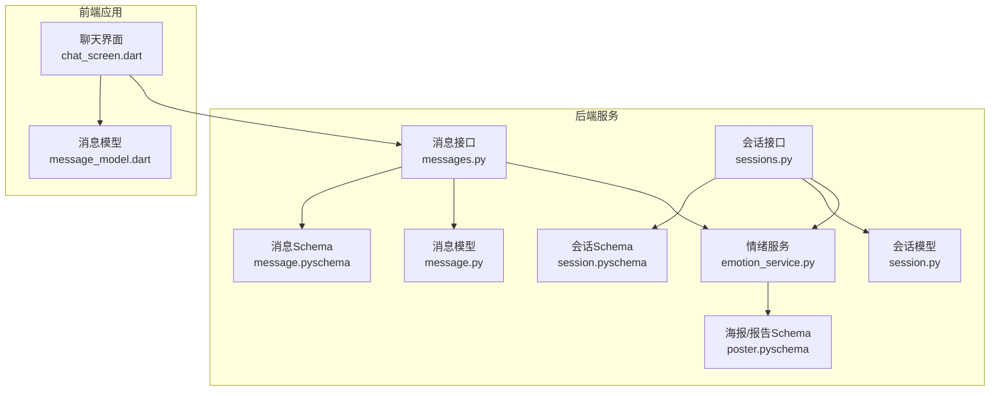
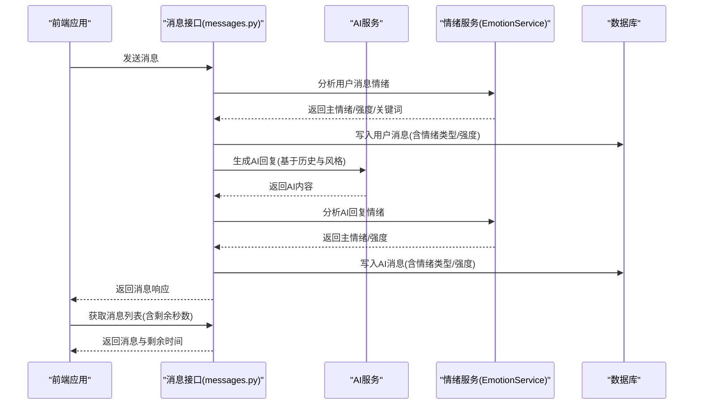
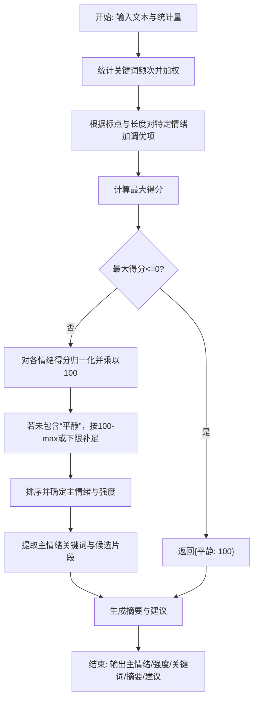
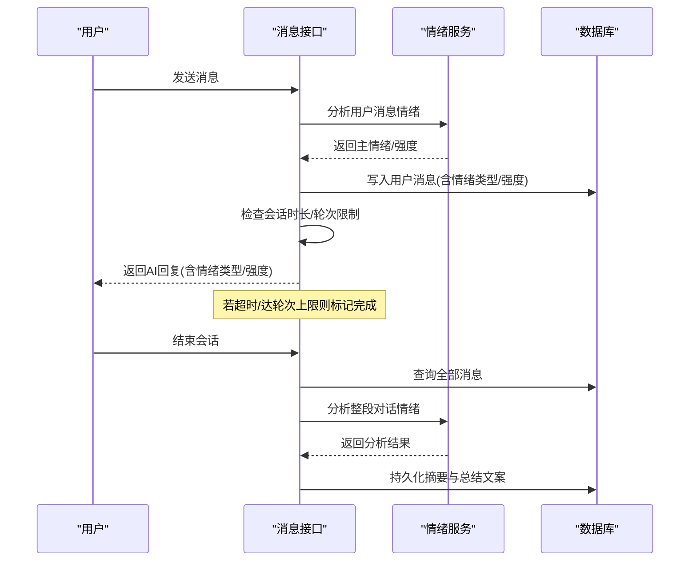
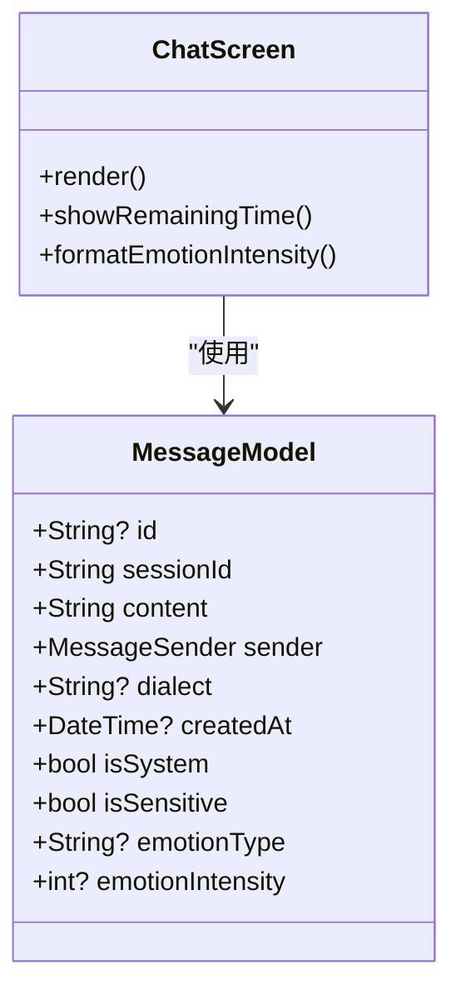
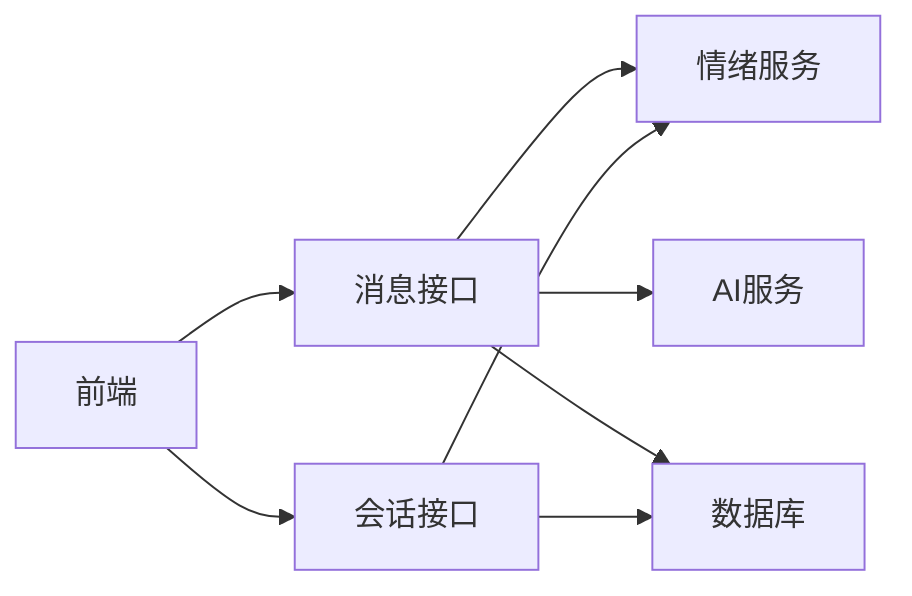

# 情绪强度计算

<cite>
**本文引用的文件**
- [emotion_service.py](file://emo_outlet_api/app/services/emotion_service.py)
- [sessions.py](file://emo_outlet_api/app/api/sessions.py)
- [messages.py](file://emo_outlet_api/app/api/messages.py)
- [session.py](file://emo_outlet_api/app/models/session.py)
- [message.py](file://emo_outlet_api/app/models/message.py)
- [session.py（schema）](file://emo_outlet_api/app/schemas/session.py)
- [message.py（schema）](file://emo_outlet_api/app/schemas/message.py)
- [poster.py（schema）](file://emo_outlet_api/app/schemas/poster.py)
- [chat_screen.dart](file://emo_outlet_app/lib/screens/chat_screen.dart)
- [message_model.dart](file://emo_outlet_app/lib/models/message_model.dart)
</cite>

## 目录
1. [简介](#简介)
2. [项目结构](#项目结构)
3. [核心组件](#核心组件)
4. [架构总览](#架构总览)
5. [详细组件分析](#详细组件分析)
6. [依赖分析](#依赖分析)
7. [性能考量](#性能考量)
8. [故障排查指南](#故障排查指南)
9. [结论](#结论)
10. [附录](#附录)

## 简介
本文件面向“情绪强度计算”的专业技术人员，系统阐述后端情绪分析服务的量化计算流程、强度分级与动态调整机制、以及前端强度可视化展示方式。重点覆盖以下方面：
- 强度值的量化计算：关键词频率权重、标定统计量、最大值归一化与百分比转换
- 强度分级标准：轻度、中度、重度阈值设计原理与区间定义
- 动态强度调整：会话时长影响、情绪变化趋势与上下文相关性处理
- 可视化展示：进度条显示、颜色编码与数值格式化
- 数学公式与算法流程图：边界条件与异常值检测
- 实际应用示例与调试技巧

## 项目结构
本项目由后端 FastAPI 服务与 Flutter 前端组成。后端负责情绪分析与会话管理；前端负责交互与可视化。

**图表来源**
- [messages.py:1-216](file://emo_outlet_api/app/api/messages.py#L1-L216)
- [sessions.py:1-220](file://emo_outlet_api/app/api/sessions.py#L1-L220)
- [emotion_service.py:1-181](file://emo_outlet_api/app/services/emotion_service.py#L1-L181)
- [session.py:1-79](file://emo_outlet_api/app/models/session.py#L1-L79)
- [message.py:1-46](file://emo_outlet_api/app/models/message.py#L1-L46)
- [session.py（schema）:1-49](file://emo_outlet_api/app/schemas/session.py#L1-L49)
- [message.py（schema）:1-33](file://emo_outlet_api/app/schemas/message.py#L1-L33)
- [poster.py（schema）:1-71](file://emo_outlet_api/app/schemas/poster.py#L1-L71)
- [chat_screen.dart:1-538](file://emo_outlet_app/lib/screens/chat_screen.dart#L1-L538)
- [message_model.dart:1-61](file://emo_outlet_app/lib/models/message_model.dart#L1-L61)

**章节来源**
- [messages.py:1-216](file://emo_outlet_api/app/api/messages.py#L1-L216)
- [sessions.py:1-220](file://emo_outlet_api/app/api/sessions.py#L1-L220)
- [emotion_service.py:1-181](file://emo_outlet_api/app/services/emotion_service.py#L1-L181)
- [chat_screen.dart:1-538](file://emo_outlet_app/lib/screens/chat_screen.dart#L1-L538)

## 核心组件
- 情绪服务（EmotionService）
  - 负责文本统计、情绪打分、归一化与关键词提取，输出主情绪、强度与摘要建议
- 消息接口（messages.py）
  - 处理发送消息、调用情绪分析、记录消息与敏感词审计日志、会话超时与轮次限制
- 会话接口（sessions.py）
  - 结束会话时聚合消息并执行情绪分析，持久化摘要与总结文案
- 数据模型（session.py、message.py）
  - 存储会话元数据、消息内容、情绪类型与强度、敏感标记等
- Schema（session.py（schema）、message.py（schema）、poster.py（schema））
  - 定义请求/响应结构，约束字段范围与默认值
- 前端聊天界面（chat_screen.dart）
  - 展示剩余时间、消息列表与情绪摘要；与后端通过接口交互

**章节来源**
- [emotion_service.py:44-181](file://emo_outlet_api/app/services/emotion_service.py#L44-L181)
- [messages.py:69-195](file://emo_outlet_api/app/api/messages.py#L69-L195)
- [sessions.py:156-220](file://emo_outlet_api/app/api/sessions.py#L156-L220)
- [session.py:13-79](file://emo_outlet_api/app/models/session.py#L13-L79)
- [message.py:13-46](file://emo_outlet_api/app/models/message.py#L13-L46)
- [session.py（schema）:8-49](file://emo_outlet_api/app/schemas/session.py#L8-L49)
- [message.py（schema）:8-33](file://emo_outlet_api/app/schemas/message.py#L8-L33)
- [poster.py（schema）:8-71](file://emo_outlet_api/app/schemas/poster.py#L8-L71)
- [chat_screen.dart:251-454](file://emo_outlet_app/lib/screens/chat_screen.dart#L251-L454)

## 架构总览
后端采用“接口层-服务层-数据层”分层，前端通过 HTTP 接口与后端交互，完成情绪分析与可视化展示。

**图表来源**
- [messages.py:69-195](file://emo_outlet_api/app/api/messages.py#L69-L195)
- [emotion_service.py:44-181](file://emo_outlet_api/app/services/emotion_service.py#L44-L181)

## 详细组件分析

### 情绪强度量化计算（EmotionService）
- 关键词频率权重
  - 为每种情绪建立关键词集合，统计文本中关键词出现次数并乘以固定权重，作为基础得分
  - 示例路径：[关键词字典定义:8-28](file://emo_outlet_api/app/services/emotion_service.py#L8-L28)
- 文本统计量与调优
  - 统计标点与长度：感叹号/问号数量、重复字符数、总字符数
  - 对特定情绪施加调优项：愤怒+感叹号，焦虑+问号，疲惫+字符长度，委屈+重复字符，平静+基线值
  - 示例路径：[统计收集与调优:83-107](file://emo_outlet_api/app/services/emotion_service.py#L83-L107)
- 最大值归一化与百分比转换
  - 计算各情绪得分的最大值，若最大值非正则返回“平静”的100%
  - 否则对每个得分按 max_score 归一化并乘以100，保留一位小数
  - 若“平静”未参与归一化，则按 100 - max 或最低阈值填充，确保总有一条“平静”
  - 示例路径：[归一化与补充“平静”:109-120](file://emo_outlet_api/app/services/emotion_service.py#L109-L120)
- 主情绪与强度
  - 主情绪为主得分的情绪类别；强度取主得分的整数值
  - 示例路径：[主情绪与强度:60-71](file://emo_outlet_api/app/services/emotion_service.py#L60-L71)
- 关键词提取
  - 先提取主情绪关键词，再从去空格文本中抽取2-gram至4-gram，过滤停用词与单一字符，取频次前若干个作为补充
  - 示例路径：[关键词提取:122-148](file://emo_outlet_api/app/services/emotion_service.py#L122-L148)
- 摘要与建议
  - 基于主情绪、强度与关键词生成总结文案与建议
  - 示例路径：[摘要与建议:150-177](file://emo_outlet_api/app/services/emotion_service.py#L150-L177)

**图表来源**
- [emotion_service.py:95-120](file://emo_outlet_api/app/services/emotion_service.py#L95-L120)
- [emotion_service.py:122-148](file://emo_outlet_api/app/services/emotion_service.py#L122-L148)
- [emotion_service.py:150-177](file://emo_outlet_api/app/services/emotion_service.py#L150-L177)

**章节来源**
- [emotion_service.py:44-181](file://emo_outlet_api/app/services/emotion_service.py#L44-L181)

### 强度分级标准与区间定义
- 设计原理
  - 将情绪强度映射到0-100的百分制，便于统一表达与跨会话对比
  - 通过关键词权重与统计量调优，使不同情绪在同一文本中的相对强度可比
- 区间划分（建议）
  - 轻度：0-30
  - 中度：31-70
  - 重度：71-100
- 注意事项
  - 归一化后若“平静”得分被抑制，系统会自动补足，避免出现“全低”情况
  - 当文本无任何情绪关键词且统计量为零时，返回“平静”的默认值

**章节来源**
- [emotion_service.py:109-120](file://emo_outlet_api/app/services/emotion_service.py#L109-L120)
- [emotion_service.py:73-81](file://emo_outlet_api/app/services/emotion_service.py#L73-L81)

### 动态强度调整算法
- 会话时长影响
  - 消息接口在每次发送消息时检查会话已用时长是否超过设定时长，超时则标记会话完成
  - 示例路径：[时长检查与会话完成:186-192](file://emo_outlet_api/app/api/messages.py#L186-L192)
- 情绪变化趋势
  - 会话结束时聚合所有消息，情绪服务对整段对话进行分析，得到主情绪与强度，用于生成摘要与建议
  - 示例路径：[结束会话并分析:156-220](file://emo_outlet_api/app/api/sessions.py#L156-220)
- 上下文相关性处理
  - 消息接口在生成AI回复前取最近若干条消息作为历史上下文，保证AI回复的情绪一致性
  - 示例路径：[历史上下文与AI回复:128-172](file://emo_outlet_api/app/api/messages.py#L128-172)

**图表来源**
- [messages.py:69-195](file://emo_outlet_api/app/api/messages.py#L69-L195)
- [sessions.py:156-220](file://emo_outlet_api/app/api/sessions.py#L156-L220)
- [emotion_service.py:44-71](file://emo_outlet_api/app/services/emotion_service.py#L44-L71)

**章节来源**
- [messages.py:69-195](file://emo_outlet_api/app/api/messages.py#L69-L195)
- [sessions.py:156-220](file://emo_outlet_api/app/api/sessions.py#L156-L220)

### 强度可视化展示（前端）
- 进度条显示
  - 聊天界面顶部展示剩余时间，直观反映会话时长与强度变化趋势
  - 示例路径：[剩余时间展示:307-329](file://emo_outlet_app/lib/screens/chat_screen.dart#L307-L329)
- 颜色编码
  - 用户消息与AI消息采用不同配色与圆角样式，配合情绪类型/强度辅助识别情绪倾向
  - 示例路径：[消息样式与配色:504-519](file://emo_outlet_app/lib/screens/chat_screen.dart#L504-L519)
- 数值格式化
  - 消息模型包含情绪类型与强度字段，前端可据此格式化显示
  - 示例路径：[消息模型字段:12-13](file://emo_outlet_app/lib/models/message_model.dart#L12-L13)

**图表来源**
- [message_model.dart:3-26](file://emo_outlet_app/lib/models/message_model.dart#L3-L26)
- [chat_screen.dart:251-454](file://emo_outlet_app/lib/screens/chat_screen.dart#L251-L454)

**章节来源**
- [chat_screen.dart:307-329](file://emo_outlet_app/lib/screens/chat_screen.dart#L307-L329)
- [message_model.dart:12-13](file://emo_outlet_app/lib/models/message_model.dart#L12-L13)

### 数学公式与算法流程图
- 关键词频率权重
  - 对于每种情绪 e，基础分数 score(e) = Σ(count(word in text) × weight(word,e))
  - 示例路径：[关键词计数与加权:98-100](file://emo_outlet_api/app/services/emotion_service.py#L98-L100)
- 统计量调优
  - 对特定情绪施加额外加分项：
    - 愤怒 += exclamation_count × k1
    - 焦虑 += question_count × k2
    - 疲惫 += min(total_chars / c1, c2)
    - 委屈 += repeated_count × k3
    - 平静 += base
  - 示例路径：[统计量调优:102-107](file://emo_outlet_api/app/services/emotion_service.py#L102-L107)
- 最大值归一化与百分比转换
  - max_score = max(score(e))
  - normalized(e) = round(max(0, score(e) / max_score × 100), 1)
  - 若 max_score ≤ 0，返回 {"平静": 100.0}
  - 若未包含“平静”，按 100 - max 或下限补足
  - 示例路径：[归一化与补充:109-120](file://emo_outlet_api/app/services/emotion_service.py#L109-L120)
- 主情绪与强度
  - 主情绪 = argmax(normalized(e))
  - 强度 = int(max(normalized.values()))
  - 示例路径：[主情绪与强度:60-61](file://emo_outlet_api/app/services/emotion_service.py#L60-L61)

**章节来源**
- [emotion_service.py:95-120](file://emo_outlet_api/app/services/emotion_service.py#L95-L120)

### 边界条件与异常值检测
- 空输入与空文本
  - 若消息为空或用户文本为空，返回“平静”的默认结果
  - 示例路径：[空结果处理:46-56](file://emo_outlet_api/app/services/emotion_service.py#L46-L56)
- 无情绪关键词与统计量为零
  - 若最大得分非正，直接返回“平静”的100%
  - 示例路径：[最大得分非正分支:110-111](file://emo_outlet_api/app/services/emotion_service.py#L110-L111)
- 关键词提取异常
  - 过滤停用词、空白标点与单一字符，仅保留高频片段
  - 示例路径：[关键词过滤与计数:129-146](file://emo_outlet_api/app/services/emotion_service.py#L129-L146)

**章节来源**
- [emotion_service.py:46-56](file://emo_outlet_api/app/services/emotion_service.py#L46-L56)
- [emotion_service.py:109-111](file://emo_outlet_api/app/services/emotion_service.py#L109-L111)
- [emotion_service.py:129-146](file://emo_outlet_api/app/services/emotion_service.py#L129-L146)

### 实际应用场景与示例
- 单向倾诉场景
  - 用户在设定时长内持续表达，系统实时分析并记录情绪类型与强度，结束时生成摘要与建议
  - 示例路径：[结束会话与分析:156-220](file://emo_outlet_api/app/api/sessions.py#L156-220)
- 双向交流场景
  - 在历史消息基础上生成AI回复，同时分析AI回复的情绪，形成完整的情绪轨迹
  - 示例路径：[AI回复与情绪分析:165-183](file://emo_outlet_api/app/api/messages.py#L165-183)
- 前端展示
  - 聊天界面展示剩余时间与消息情绪类型/强度，帮助用户感知情绪强度变化
  - 示例路径：[聊天界面渲染:251-454](file://emo_outlet_app/lib/screens/chat_screen.dart#L251-454)

**章节来源**
- [sessions.py:156-220](file://emo_outlet_api/app/api/sessions.py#L156-L220)
- [messages.py:165-183](file://emo_outlet_api/app/api/messages.py#L165-L183)
- [chat_screen.dart:251-454](file://emo_outlet_app/lib/screens/chat_screen.dart#L251-L454)

### 调试技巧
- 后端
  - 使用会话结束接口查看完整情绪分析结果（主情绪、强度、关键词、摘要、建议）
  - 检查消息表中情绪类型与强度字段是否正确写入
  - 示例路径：[结束会话响应:215-219](file://emo_outlet_api/app/api/sessions.py#L215-219)
- 前端
  - 打开消息列表接口，观察剩余秒数与消息情绪字段
  - 在聊天界面中留意颜色与样式差异，辅助判断情绪类型
  - 示例路径：[消息列表与剩余秒数:32-66](file://emo_outlet_api/app/api/messages.py#L32-66)

**章节来源**
- [sessions.py:215-219](file://emo_outlet_api/app/api/sessions.py#L215-L219)
- [messages.py:32-66](file://emo_outlet_api/app/api/messages.py#L32-L66)

## 依赖分析
- 组件耦合
  - 消息接口依赖情绪服务与AI服务；会话接口在结束时调用情绪服务；消息与会话模型承载数据
- 外部依赖
  - FastAPI、SQLAlchemy、Pydantic（后端）
  - Flutter/Dart（前端）

**图表来源**
- [messages.py:18-19](file://emo_outlet_api/app/api/messages.py#L18-L19)
- [sessions.py:24](file://emo_outlet_api/app/api/sessions.py#L24)
- [chat_screen.dart:1-18](file://emo_outlet_app/lib/screens/chat_screen.dart#L1-L18)

**章节来源**
- [messages.py:18-19](file://emo_outlet_api/app/api/messages.py#L18-L19)
- [sessions.py:24](file://emo_outlet_api/app/api/sessions.py#L24)
- [chat_screen.dart:1-18](file://emo_outlet_app/lib/screens/chat_screen.dart#L1-L18)

## 性能考量
- 关键词计数与统计量遍历为线性复杂度，适合中小文本规模
- 归一化与排序为O(n)，n为情绪种类数（常数级）
- 建议
  - 对超长文本可考虑分段分析并聚合结果
  - 缓存常用关键词与停用词集合，减少重复构建

## 故障排查指南
- 情绪强度始终为低
  - 检查关键词字典是否覆盖目标语料；确认统计量调优参数是否合理
  - 参考路径：[关键词与调优:98-107](file://emo_outlet_api/app/services/emotion_service.py#L98-L107)
- “平静”占比过高
  - 检查是否出现大量停用词或单一字符片段；适当降低“平静”基线值
  - 参考路径：[补充“平静”逻辑:118-119](file://emo_outlet_api/app/services/emotion_service.py#L118-L119)
- 会话提前结束
  - 检查时长与轮次限制配置；确认历史消息截断长度
  - 参考路径：[时长检查与轮次限制:186-146](file://emo_outlet_api/app/api/messages.py#L186-L146)

**章节来源**
- [emotion_service.py:98-107](file://emo_outlet_api/app/services/emotion_service.py#L98-L107)
- [emotion_service.py:118-119](file://emo_outlet_api/app/services/emotion_service.py#L118-L119)
- [messages.py:186-146](file://emo_outlet_api/app/api/messages.py#L186-L146)

## 结论
本系统通过关键词频率权重、统计量调优与最大值归一化，实现了对中文情绪的量化与分级；结合会话时长与上下文，动态调整强度并提供可视化展示。建议在实际部署中持续优化关键词字典与调参策略，以提升跨场景的稳定性与可解释性。

## 附录
- 关键词与停用词
  - 参考路径：[关键词字典:8-28](file://emo_outlet_api/app/services/emotion_service.py#L8-L28)、[停用词集合:30-33](file://emo_outlet_api/app/services/emotion_service.py#L30-L33)
- 数据模型字段
  - 参考路径：[会话模型:57-63](file://emo_outlet_api/app/models/session.py#L57-L63)、[消息模型:29-34](file://emo_outlet_api/app/models/message.py#L29-L34)
- Schema 字段约束
  - 参考路径：[会话Schema:16-32](file://emo_outlet_api/app/schemas/session.py#L16-L32)、[消息Schema:12-22](file://emo_outlet_api/app/schemas/message.py#L12-L22)、[海报/报告Schema:8-14](file://emo_outlet_api/app/schemas/poster.py#L8-L14)