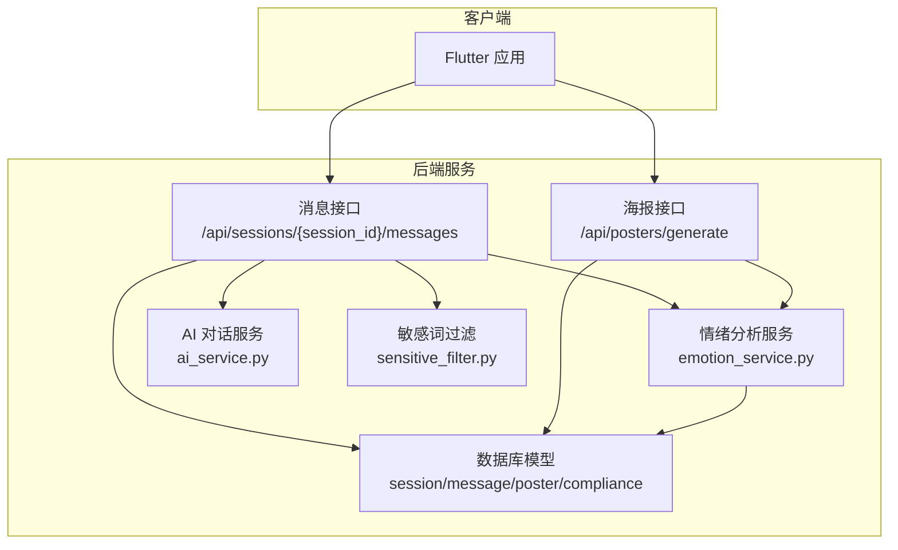
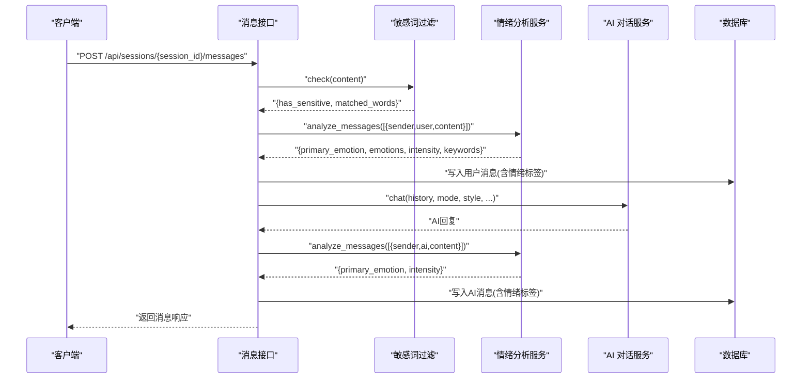
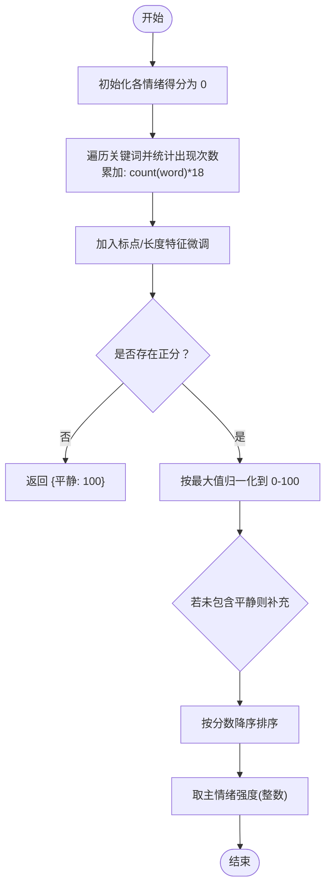
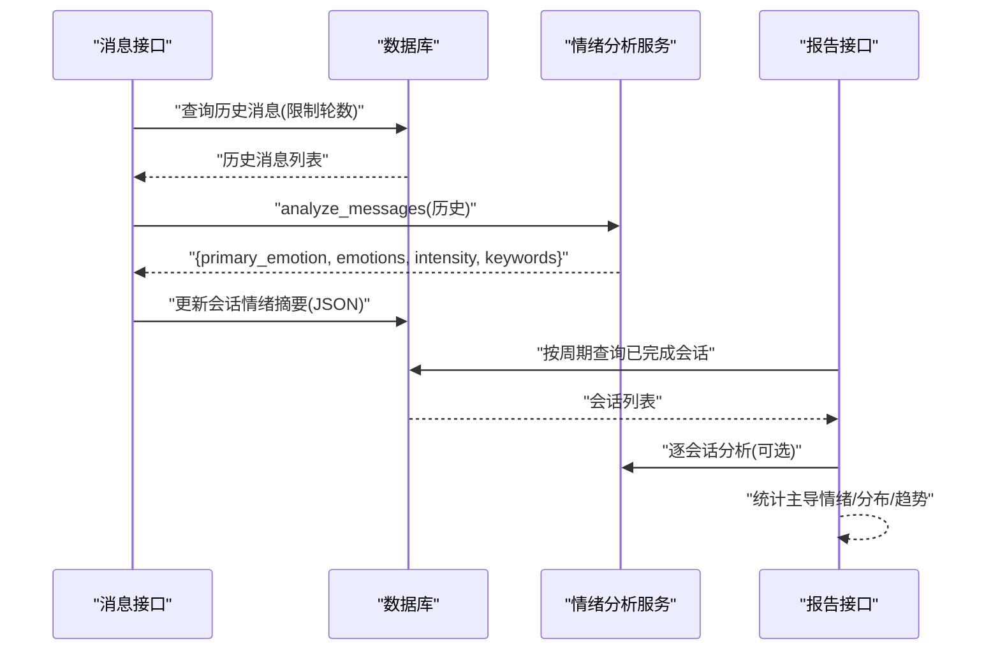
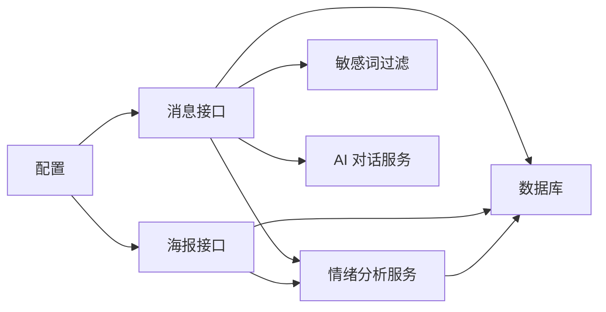
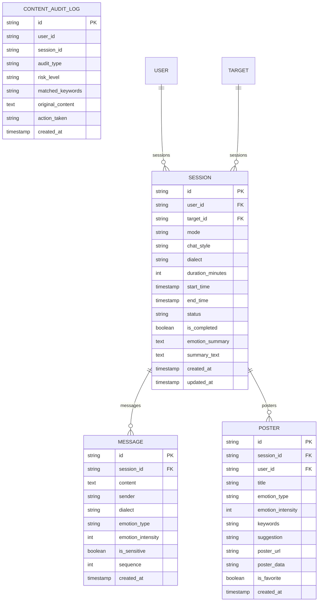

# 情绪检测算法

<cite>
**本文引用的文件**
- [emo_outlet_api/app/services/emotion_service.py](file://emo_outlet_api/app/services/emotion_service.py)
- [emo_outlet_api/app/utils/sensitive_filter.py](file://emo_outlet_api/app/utils/sensitive_filter.py)
- [emo_outlet_api/app/api/messages.py](file://emo_outlet_api/app/api/messages.py)
- [emo_outlet_api/app/api/posters.py](file://emo_outlet_api/app/api/posters.py)
- [emo_outlet_api/app/models/message.py](file://emo_outlet_api/app/models/message.py)
- [emo_outlet_api/app/models/session.py](file://emo_outlet_api/app/models/session.py)
- [emo_outlet_api/app/schemas/poster.py](file://emo_outlet_api/app/schemas/poster.py)
- [emo_outlet_api/app/config.py](file://emo_outlet_api/app/config.py)
- [emo_outlet_api/app/database.py](file://emo_outlet_api/app/database.py)
- [emo_outlet_api/app/models/compliance.py](file://emo_outlet_api/app/models/compliance.py)
</cite>

## 目录
1. [简介](#简介)
2. [项目结构](#项目结构)
3. [核心组件](#核心组件)
4. [架构总览](#架构总览)
5. [详细组件分析](#详细组件分析)
6. [依赖分析](#依赖分析)
7. [性能考虑](#性能考虑)
8. [故障排查指南](#故障排查指南)
9. [结论](#结论)
10. [附录](#附录)

## 简介
本技术文档围绕“情绪检测算法”展开，聚焦于基于关键词匹配的情绪识别机制与评分体系。文档从以下维度进行系统化说明：
- 字典结构设计：EMOTION_KEYWORDS 的情绪类别划分与关键词组织原则
- 情绪评分算法：关键词频次统计、加权累积、归一化与强度计算
- 多轮对话中的情绪建模：历史消息聚合、趋势分析与动态调整策略
- 性能优化：索引优化、缓存策略与批量处理建议
- 测试与验证：通过接口调用与报告生成验证不同情绪类型的检测效果与稳定性

## 项目结构
本项目采用分层架构，前端 Flutter 应用与后端 FastAPI 服务分离。情绪检测能力位于后端服务层，主要涉及：
- 服务层：情绪分析服务、海报生成服务、AI 对话服务
- API 层：消息发送、海报生成与情绪报告接口
- 模型层：会话、消息、合规审计日志等数据库模型
- 工具层：敏感词过滤（DFA）

图表来源
- [emo_outlet_api/app/api/messages.py:69-195](file://emo_outlet_api/app/api/messages.py#L69-L195)
- [emo_outlet_api/app/api/posters.py:73-138](file://emo_outlet_api/app/api/posters.py#L73-L138)
- [emo_outlet_api/app/services/emotion_service.py:44-181](file://emo_outlet_api/app/services/emotion_service.py#L44-L181)
- [emo_outlet_api/app/utils/sensitive_filter.py:37-142](file://emo_outlet_api/app/utils/sensitive_filter.py#L37-L142)
- [emo_outlet_api/app/models/message.py:13-45](file://emo_outlet_api/app/models/message.py#L13-L45)
- [emo_outlet_api/app/models/session.py:13-79](file://emo_outlet_api/app/models/session.py#L13-L79)

章节来源
- [emo_outlet_api/app/api/messages.py:1-216](file://emo_outlet_api/app/api/messages.py#L1-L216)
- [emo_outlet_api/app/api/posters.py:1-408](file://emo_outlet_api/app/api/posters.py#L1-L408)
- [emo_outlet_api/app/services/emotion_service.py:1-181](file://emo_outlet_api/app/services/emotion_service.py#L1-L181)
- [emo_outlet_api/app/utils/sensitive_filter.py:1-142](file://emo_outlet_api/app/utils/sensitive_filter.py#L1-L142)
- [emo_outlet_api/app/models/message.py:1-46](file://emo_outlet_api/app/models/message.py#L1-L46)
- [emo_outlet_api/app/models/session.py:1-79](file://emo_outlet_api/app/models/session.py#L1-L79)

## 核心组件
- 情绪分析服务（EmotionService）
  - 提供多轮消息的情绪分析入口，返回主情绪、各情绪得分、强度、关键词、摘要与建议
  - 关键实现：关键词匹配、标点与长度特征微调、归一化与强度计算、关键词提取
- 敏感词过滤（DFAFilter）
  - 基于 DFA 的 O(n) 匹配，支持高风险模式正则增强，用于内容安全与合规
- API 接口
  - 消息发送接口：集成敏感词检测、情绪分析、AI 回复与会话状态管理
  - 海报生成接口：基于会话或历史消息生成情绪海报
- 数据模型
  - 会话与消息模型存储情绪标签与强度，并支持合规审计日志

章节来源
- [emo_outlet_api/app/services/emotion_service.py:44-181](file://emo_outlet_api/app/services/emotion_service.py#L44-L181)
- [emo_outlet_api/app/utils/sensitive_filter.py:37-142](file://emo_outlet_api/app/utils/sensitive_filter.py#L37-L142)
- [emo_outlet_api/app/api/messages.py:69-195](file://emo_outlet_api/app/api/messages.py#L69-L195)
- [emo_outlet_api/app/api/posters.py:73-138](file://emo_outlet_api/app/api/posters.py#L73-L138)
- [emo_outlet_api/app/models/message.py:13-45](file://emo_outlet_api/app/models/message.py#L13-L45)
- [emo_outlet_api/app/models/session.py:13-79](file://emo_outlet_api/app/models/session.py#L13-L79)

## 架构总览
情绪检测贯穿“输入—分析—输出—持久化—展示”链路：
- 输入：用户消息与历史消息
- 分析：关键词匹配与特征加权，归一化得到情绪分布，取主情绪与强度
- 输出：消息实体标注情绪类型与强度；会话完成后生成海报与报告
- 持久化：消息与会话模型保存情绪摘要；敏感内容触发审计日志

图表来源
- [emo_outlet_api/app/api/messages.py:69-195](file://emo_outlet_api/app/api/messages.py#L69-L195)
- [emo_outlet_api/app/utils/sensitive_filter.py:102-119](file://emo_outlet_api/app/utils/sensitive_filter.py#L102-L119)
- [emo_outlet_api/app/services/emotion_service.py:44-71](file://emo_outlet_api/app/services/emotion_service.py#L44-L71)

## 详细组件分析

### 情绪关键词字典与停用词设计
- 情绪类别与关键词
  - 愤怒、委屈、焦虑、疲惫、无奈、平静六大类，每类包含一组语义相近的关键词
  - 设计原则：覆盖高频情绪表达词汇，兼顾口语化与重复表达
- 停用词集合
  - 过滤常见虚词与无情感倾向的词语，减少噪声干扰
- 作用范围
  - 作为情绪评分的基础匹配单元，参与频次统计与权重累积

章节来源
- [emo_outlet_api/app/services/emotion_service.py:8-33](file://emo_outlet_api/app/services/emotion_service.py#L8-L33)

### 文本统计与特征工程
- 统计指标
  - 总字符数、感叹号/问号数量、连续重复字符数
- 特征加权
  - 不同标点与长度对特定情绪进行微调，例如：
    - 愤怒：强调感叹号
    - 焦虑：强调问号
    - 疲惫：强调长度
    - 委屈：强调重复
    - 平静：默认加分
- 目的
  - 在纯关键词匹配之外引入语言特征，提升判别能力

章节来源
- [emo_outlet_api/app/services/emotion_service.py:83-93](file://emo_outlet_api/app/services/emotion_service.py#L83-L93)
- [emo_outlet_api/app/services/emotion_service.py:102-107](file://emo_outlet_api/app/services/emotion_service.py#L102-L107)

### 情绪评分算法与归一化
- 评分流程
  - 初始化各情绪得分为 0
  - 遍历每个情绪类别的关键词，统计文本中出现次数并乘以固定权重（如 18）累加
  - 加入标点与长度特征微调
  - 取最大值，若为非正值则返回“平静”
  - 归一化到 0-100，按值降序排序
  - 若“平静”不在结果中，则按约束补充，保证覆盖
- 强度计算
  - 主情绪强度为主评分的整数值
- 关键点
  - 权重与特征系数可调，便于平衡不同情绪的敏感度
  - 归一化确保跨轮次可比性

图表来源
- [emo_outlet_api/app/services/emotion_service.py:95-120](file://emo_outlet_api/app/services/emotion_service.py#L95-L120)
- [emo_outlet_api/app/services/emotion_service.py:60-61](file://emo_outlet_api/app/services/emotion_service.py#L60-L61)

章节来源
- [emo_outlet_api/app/services/emotion_service.py:95-120](file://emo_outlet_api/app/services/emotion_service.py#L95-L120)

### 关键词提取与摘要/建议生成
- 关键词提取
  - 优先提取主情绪关键词
  - 对去除空格后的文本进行滑动窗口（2/3/4 字），过滤标点、停用词与单一字符片段
  - 统计频次，取前若干高频且去重的结果，限制最多 6 个
- 摘要与建议
  - 根据主情绪与强度生成个性化摘要
  - 根据情绪与强度阈值生成温和建议

章节来源
- [emo_outlet_api/app/services/emotion_service.py:122-148](file://emo_outlet_api/app/services/emotion_service.py#L122-L148)
- [emo_outlet_api/app/services/emotion_service.py:150-177](file://emo_outlet_api/app/services/emotion_service.py#L150-L177)

### 多轮对话中的情绪建模
- 历史消息聚合
  - 将同一会话的历史消息拼接为一段文本，仅取用户侧内容
- 情绪趋势分析
  - 会话完成后，基于情绪摘要生成情绪报告，包含主导情绪、分布与每日趋势
- 动态调整策略
  - 根据年龄组设置不同对话轮数上限，避免过度沉浸
  - 高风险内容触发会话中断并插入温和引导消息

图表来源
- [emo_outlet_api/app/api/messages.py:128-172](file://emo_outlet_api/app/api/messages.py#L128-L172)
- [emo_outlet_api/app/api/posters.py:251-318](file://emo_outlet_api/app/api/posters.py#L251-L318)
- [emo_outlet_api/app/models/session.py:57-63](file://emo_outlet_api/app/models/session.py#L57-L63)

章节来源
- [emo_outlet_api/app/api/messages.py:128-172](file://emo_outlet_api/app/api/messages.py#L128-L172)
- [emo_outlet_api/app/api/posters.py:251-318](file://emo_outlet_api/app/api/posters.py#L251-L318)
- [emo_outlet_api/app/models/session.py:57-63](file://emo_outlet_api/app/models/session.py#L57-L63)

### 敏感词过滤与合规
- DFA Trie 树
  - 构建敏感词 Trie，实现 O(n) 匹配
- 高风险正则
  - 对特定高危模式使用正则增强检测
- 行为与日志
  - 触发高风险时中断会话并插入温和引导消息
  - 记录审计日志，包含匹配关键词、风险等级与处置动作

章节来源
- [emo_outlet_api/app/utils/sensitive_filter.py:37-142](file://emo_outlet_api/app/utils/sensitive_filter.py#L37-L142)
- [emo_outlet_api/app/api/messages.py:96-126](file://emo_outlet_api/app/api/messages.py#L96-L126)
- [emo_outlet_api/app/models/compliance.py:31-49](file://emo_outlet_api/app/models/compliance.py#L31-L49)

## 依赖分析
- 组件耦合
  - 消息接口依赖情绪分析服务与敏感词过滤，间接依赖数据库与 AI 服务
  - 报告接口依赖会话与消息模型，读取情绪摘要进行统计
- 外部依赖
  - 数据库：异步 SQLAlchemy ORM
  - 配置：Pydantic Settings，支持环境变量注入
- 循环依赖
  - 未发现循环导入；服务与模型解耦良好

图表来源
- [emo_outlet_api/app/api/messages.py:69-195](file://emo_outlet_api/app/api/messages.py#L69-L195)
- [emo_outlet_api/app/api/posters.py:73-138](file://emo_outlet_api/app/api/posters.py#L73-L138)
- [emo_outlet_api/app/services/emotion_service.py:44-181](file://emo_outlet_api/app/services/emotion_service.py#L44-L181)
- [emo_outlet_api/app/config.py:12-121](file://emo_outlet_api/app/config.py#L12-L121)

章节来源
- [emo_outlet_api/app/api/messages.py:69-195](file://emo_outlet_api/app/api/messages.py#L69-L195)
- [emo_outlet_api/app/api/posters.py:73-138](file://emo_outlet_api/app/api/posters.py#L73-L138)
- [emo_outlet_api/app/services/emotion_service.py:44-181](file://emo_outlet_api/app/services/emotion_service.py#L44-L181)
- [emo_outlet_api/app/config.py:12-121](file://emo_outlet_api/app/config.py#L12-L121)

## 性能考虑
- 索引优化
  - 消息表：按 session_id、sender、sequence 建立复合索引，加速历史查询与分页
  - 会话表：按 user_id、status、created_at 建立索引，提升报告与筛选效率
  - 审计日志：按 user_id、created_at 建索引，便于合规检索
- 缓存策略
  - 会话情绪摘要 JSON 可缓存于 Redis，减少重复分析开销
  - DFA Trie 构建后可常驻内存，避免重复初始化
- 批量处理
  - 报告统计可按天/周/月批量扫描会话，降低实时查询压力
  - 消息查询限制轮数（默认 24 轮），避免超大数据集扫描
- 算法复杂度
  - 关键词匹配为线性扫描，整体 O(n+m)，n 为文本长度，m 为关键词总数
  - 归一化与排序为 O(k log k)，k 为情绪类别数（常数级）

章节来源
- [emo_outlet_api/app/models/message.py:13-45](file://emo_outlet_api/app/models/message.py#L13-L45)
- [emo_outlet_api/app/models/session.py:13-79](file://emo_outlet_api/app/models/session.py#L13-L79)
- [emo_outlet_api/app/api/messages.py:128-138](file://emo_outlet_api/app/api/messages.py#L128-L138)
- [emo_outlet_api/app/utils/sensitive_filter.py:54-67](file://emo_outlet_api/app/utils/sensitive_filter.py#L54-L67)

## 故障排查指南
- 情绪为空或异常
  - 检查输入消息是否为空或仅含停用词
  - 确认历史消息聚合逻辑与轮数限制
- 归一化结果异常
  - 核对最大分数是否为非正值，确认默认“平静”分支
  - 检查特征加权系数是否合理
- 敏感词误判或漏判
  - 更新敏感词库与高风险正则
  - 检查 DFA Trie 构建与匹配过程
- 报告缺失数据
  - 确认会话已完成且情绪摘要已写入
  - 检查时间区间与会话状态过滤条件

章节来源
- [emo_outlet_api/app/services/emotion_service.py:73-81](file://emo_outlet_api/app/services/emotion_service.py#L73-L81)
- [emo_outlet_api/app/api/messages.py:96-126](file://emo_outlet_api/app/api/messages.py#L96-L126)
- [emo_outlet_api/app/api/posters.py:251-318](file://emo_outlet_api/app/api/posters.py#L251-L318)

## 结论
本情绪检测算法以关键词匹配为核心，结合标点与长度特征进行微调，通过归一化与强度计算输出稳定的多轮情绪分析结果。配合敏感词过滤与合规日志，形成从输入到输出的闭环。未来可在关键词扩展、特征融合与缓存策略方面持续优化，以提升准确性与性能。

## 附录

### 数据模型概览

图表来源
- [emo_outlet_api/app/models/session.py:13-79](file://emo_outlet_api/app/models/session.py#L13-L79)
- [emo_outlet_api/app/models/message.py:13-45](file://emo_outlet_api/app/models/message.py#L13-L45)
- [emo_outlet_api/app/models/compliance.py:31-49](file://emo_outlet_api/app/models/compliance.py#L31-L49)

### 接口与数据流要点
- 消息发送接口
  - 输入：会话 ID、消息内容
  - 输出：消息实体（含情绪类型与强度）
  - 关键链路：敏感词检测 → 情绪分析 → AI 对话 → 写入数据库
- 海报生成接口
  - 输入：会话 ID
  - 输出：海报实体（含情绪类型、强度、关键词、摘要）
  - 关键链路：读取会话或历史消息 → 情绪分析 → 生成海报内容 → 写入数据库
- 报告接口
  - 输入：周期参数
  - 输出：主导情绪、分布、趋势与建议
  - 关键链路：查询已完成会话 → 解析情绪摘要 → 统计与排序

章节来源
- [emo_outlet_api/app/api/messages.py:69-195](file://emo_outlet_api/app/api/messages.py#L69-L195)
- [emo_outlet_api/app/api/posters.py:73-138](file://emo_outlet_api/app/api/posters.py#L73-L138)
- [emo_outlet_api/app/api/posters.py:251-407](file://emo_outlet_api/app/api/posters.py#L251-L407)