# 核心功能模块

<cite>
**本文引用的文件**
- [emo_outlet_api/app/main.py](file://emo_outlet_api/app/main.py)
- [emo_outlet_api/app/api/auth.py](file://emo_outlet_api/app/api/auth.py)
- [emo_outlet_api/app/api/targets.py](file://emo_outlet_api/app/api/targets.py)
- [emo_outlet_api/app/api/sessions.py](file://emo_outlet_api/app/api/sessions.py)
- [emo_outlet_api/app/api/messages.py](file://emo_outlet_api/app/api/messages.py)
- [emo_outlet_api/app/api/posters.py](file://emo_outlet_api/app/api/posters.py)
- [emo_outlet_api/app/services/emotion_service.py](file://emo_outlet_api/app/services/emotion_service.py)
- [emo_outlet_api/app/services/poster_service.py](file://emo_outlet_api/app/services/poster_service.py)
- [emo_outlet_api/app/utils/sensitive_filter.py](file://emo_outlet_api/app/utils/sensitive_filter.py)
- [emo_outlet_api/app/models/user.py](file://emo_outlet_api/app/models/user.py)
- [emo_outlet_api/app/models/target.py](file://emo_outlet_api/app/models/target.py)
- [emo_outlet_api/app/models/session.py](file://emo_outlet_api/app/models/session.py)
- [emo_outlet_api/app/models/message.py](file://emo_outlet_api/app/models/message.py)
- [emo_outlet_api/app/config.py](file://emo_outlet_api/app/config.py)
- [emo_outlet_api/app/core/security.py](file://emo_outlet_api/app/core/security.py)
</cite>

## 目录
1. [简介](#简介)
2. [项目结构](#项目结构)
3. [核心组件](#核心组件)
4. [架构总览](#架构总览)
5. [详细组件分析](#详细组件分析)
6. [依赖分析](#依赖分析)
7. [性能考虑](#性能考虑)
8. [故障排查指南](#故障排查指南)
9. [结论](#结论)
10. [附录](#附录)

## 简介
本文件面向Emo Outlet后端API，系统性梳理并说明以下核心功能模块：
- 用户认证系统：手机号/邮箱注册、游客模式、JWT认证与权限控制
- 目标管理系统：虚拟对象的创建、编辑、删除与个性化设置
- 会话管理：会话创建、实时对话、时间控制与会话历史
- AI对话引擎：多模型支持、方言适配、安全过滤与对话质量保障
- 情绪分析系统：情绪检测算法、强度计算、关键词提取与分析结果展示
- 海报生成功能：模板设计、可视化输出、分享机制与导出格式
- 使用场景、配置选项与最佳实践

## 项目结构
后端采用FastAPI + SQLAlchemy异步ORM，按功能域划分路由模块，核心入口负责中间件与路由挂载。

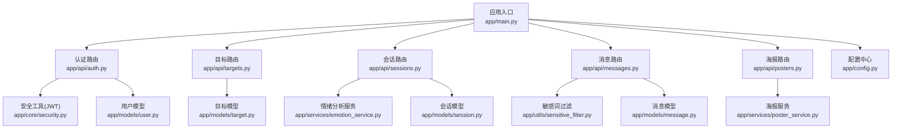

图示来源
- [emo_outlet_api/app/main.py:23-64](file://emo_outlet_api/app/main.py#L23-L64)
- [emo_outlet_api/app/api/auth.py:30](file://emo_outlet_api/app/api/auth.py#L30)
- [emo_outlet_api/app/api/targets.py:23](file://emo_outlet_api/app/api/targets.py#L23)
- [emo_outlet_api/app/api/sessions.py:50](file://emo_outlet_api/app/api/sessions.py#L50)
- [emo_outlet_api/app/api/messages.py:24](file://emo_outlet_api/app/api/messages.py#L24)
- [emo_outlet_api/app/api/posters.py:28](file://emo_outlet_api/app/api/posters.py#L28)
- [emo_outlet_api/app/services/emotion_service.py:44](file://emo_outlet_api/app/services/emotion_service.py#L44)
- [emo_outlet_api/app/services/poster_service.py:32](file://emo_outlet_api/app/services/poster_service.py#L32)
- [emo_outlet_api/app/utils/sensitive_filter.py:37](file://emo_outlet_api/app/utils/sensitive_filter.py#L37)
- [emo_outlet_api/app/core/security.py:26](file://emo_outlet_api/app/core/security.py#L26)
- [emo_outlet_api/app/config.py:12](file://emo_outlet_api/app/config.py#L12)
- [emo_outlet_api/app/models/user.py:14](file://emo_outlet_api/app/models/user.py#L14)
- [emo_outlet_api/app/models/target.py:13](file://emo_outlet_api/app/models/target.py#L13)
- [emo_outlet_api/app/models/session.py:13](file://emo_outlet_api/app/models/session.py#L13)
- [emo_outlet_api/app/models/message.py:13](file://emo_outlet_api/app/models/message.py#L13)

章节来源
- [emo_outlet_api/app/main.py:23-82](file://emo_outlet_api/app/main.py#L23-L82)

## 核心组件
- 认证与权限
  - JWT访问令牌签发与校验、密码哈希与校验
  - 注册（手机号/邮箱唯一性校验）、登录（账号/密码校验）、游客登录（设备维度）
  - 用户资料与详情读写、隐私合规记录、账户注销与数据导出
- 目标管理
  - 创建/查询/更新/删除（软删除）泄愤对象；AI生成头像；AI补全建议
- 会话管理
  - 创建会话（含每日限额与年龄感知）、获取活动会话、历史列表、结束会话并进行情绪分析
- 实时消息
  - 获取消息分页、发送消息（含敏感词过滤、高风险拦截、审计日志、上下文截断、超时/轮数限制）
- 情绪分析
  - 基于关键词与统计特征的多维评分、强度归一化、关键词抽取、摘要与建议生成
- 海报生成
  - 会话结束后生成海报（标题、情绪标签、关键词、建议、目标名），提供概览与详情报告
- 安全与合规
  - DFA敏感词过滤（O(n)）、高风险模式识别、审计日志采样、合规版本与年龄分层策略

章节来源
- [emo_outlet_api/app/api/auth.py:33-332](file://emo_outlet_api/app/api/auth.py#L33-L332)
- [emo_outlet_api/app/api/targets.py:47-213](file://emo_outlet_api/app/api/targets.py#L47-L213)
- [emo_outlet_api/app/api/sessions.py:53-242](file://emo_outlet_api/app/api/sessions.py#L53-L242)
- [emo_outlet_api/app/api/messages.py:80-243](file://emo_outlet_api/app/api/messages.py#L80-L243)
- [emo_outlet_api/app/services/emotion_service.py:44-181](file://emo_outlet_api/app/services/emotion_service.py#L44-L181)
- [emo_outlet_api/app/api/posters.py:40-352](file://emo_outlet_api/app/api/posters.py#L40-L352)
- [emo_outlet_api/app/utils/sensitive_filter.py:37-142](file://emo_outlet_api/app/utils/sensitive_filter.py#L37-L142)

## 架构总览
后端以FastAPI为核心，统一注册各业务路由，并通过依赖注入获取数据库会话与当前用户。认证中间件与CORS中间件贯穿请求生命周期。数据模型采用SQLAlchemy ORM映射至MySQL/SQLite，服务层封装AI与分析逻辑，工具层提供敏感词过滤与安全能力。

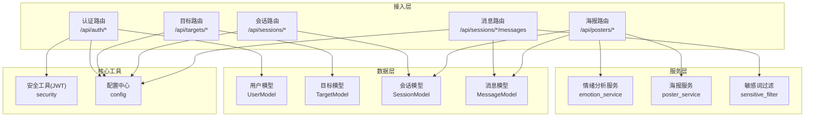

图示来源
- [emo_outlet_api/app/main.py:51-63](file://emo_outlet_api/app/main.py#L51-L63)
- [emo_outlet_api/app/api/auth.py:30](file://emo_outlet_api/app/api/auth.py#L30)
- [emo_outlet_api/app/api/targets.py:23](file://emo_outlet_api/app/api/targets.py#L23)
- [emo_outlet_api/app/api/sessions.py:50](file://emo_outlet_api/app/api/sessions.py#L50)
- [emo_outlet_api/app/api/messages.py:24](file://emo_outlet_api/app/api/messages.py#L24)
- [emo_outlet_api/app/api/posters.py:28](file://emo_outlet_api/app/api/posters.py#L28)
- [emo_outlet_api/app/services/emotion_service.py:44](file://emo_outlet_api/app/services/emotion_service.py#L44)
- [emo_outlet_api/app/services/poster_service.py:32](file://emo_outlet_api/app/services/poster_service.py#L32)
- [emo_outlet_api/app/utils/sensitive_filter.py:37](file://emo_outlet_api/app/utils/sensitive_filter.py#L37)
- [emo_outlet_api/app/core/security.py:26](file://emo_outlet_api/app/core/security.py#L26)
- [emo_outlet_api/app/config.py:12](file://emo_outlet_api/app/config.py#L12)
- [emo_outlet_api/app/models/user.py:14](file://emo_outlet_api/app/models/user.py#L14)
- [emo_outlet_api/app/models/target.py:13](file://emo_outlet_api/app/models/target.py#L13)
- [emo_outlet_api/app/models/session.py:13](file://emo_outlet_api/app/models/session.py#L13)
- [emo_outlet_api/app/models/message.py:13](file://emo_outlet_api/app/models/message.py#L13)

## 详细组件分析

### 用户认证系统
- 功能要点
  - 注册：手机号/邮箱唯一性校验，生成随机昵称，可选同意协议版本与年龄范围
  - 登录：账号（手机/邮箱任一）+密码校验，签发JWT
  - 游客登录：按设备UUID查找或创建访客用户，签发JWT
  - 个人资料：读取/更新昵称与头像；详情扩展表支持签名、性别、生日、地区
  - 权限控制：依赖当前用户依赖项，确保资源归属与操作合法性
  - 合规与数据：同意记录、账户注销（软删除+清理关联数据）、数据导出（会话/消息/目标/海报）
- 关键流程（注册）
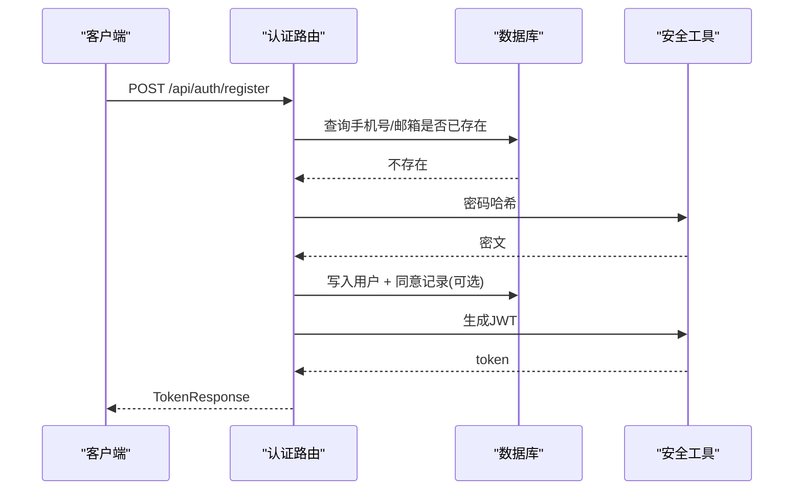

图示来源
- [emo_outlet_api/app/api/auth.py:33-76](file://emo_outlet_api/app/api/auth.py#L33-L76)
- [emo_outlet_api/app/core/security.py:16-31](file://emo_outlet_api/app/core/security.py#L16-L31)

- 关键流程（游客登录）
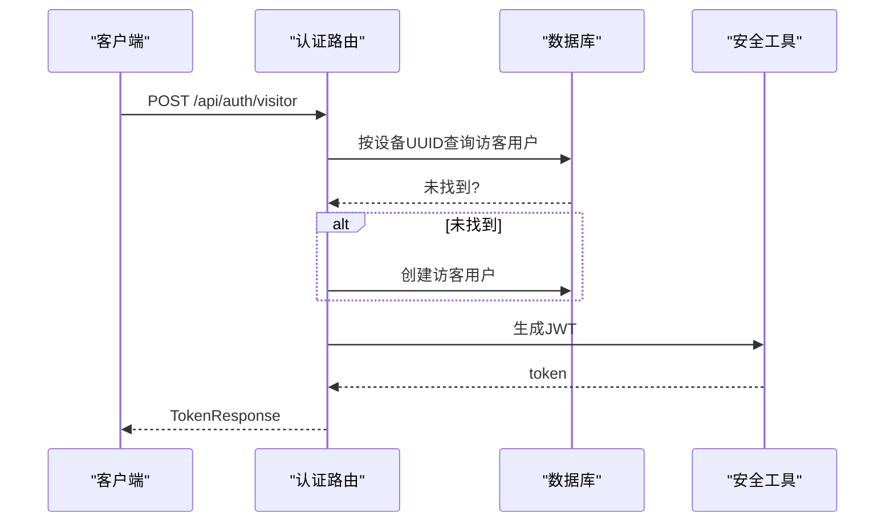

图示来源
- [emo_outlet_api/app/api/auth.py:96-121](file://emo_outlet_api/app/api/auth.py#L96-L121)
- [emo_outlet_api/app/core/security.py:26-31](file://emo_outlet_api/app/core/security.py#L26-L31)

- 关键流程（注销与数据导出）
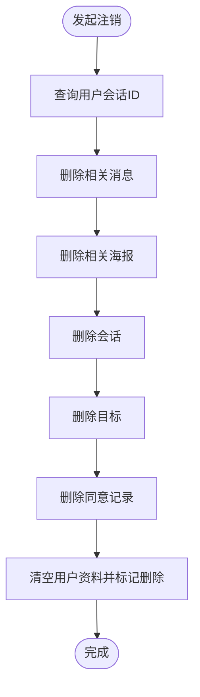

图示来源
- [emo_outlet_api/app/api/auth.py:212-239](file://emo_outlet_api/app/api/auth.py#L212-L239)

章节来源
- [emo_outlet_api/app/api/auth.py:33-332](file://emo_outlet_api/app/api/auth.py#L33-L332)
- [emo_outlet_api/app/core/security.py:16-43](file://emo_outlet_api/app/core/security.py#L16-L43)
- [emo_outlet_api/app/models/user.py:14-56](file://emo_outlet_api/app/models/user.py#L14-L56)

### 目标管理系统
- 功能要点
  - 列表：支持隐藏过滤、按更新时间倒序
  - 创建：名称、类型、外观、个性、关系、风格
  - 详情：按ID与归属校验
  - 更新：逐字段可选更新，支持隐藏开关
  - 删除：软删除
  - AI生成头像：调用图像服务生成并回填URL
  - AI补全：基于关系词匹配返回外观/个性/风格建议
- 关键流程（AI补全）
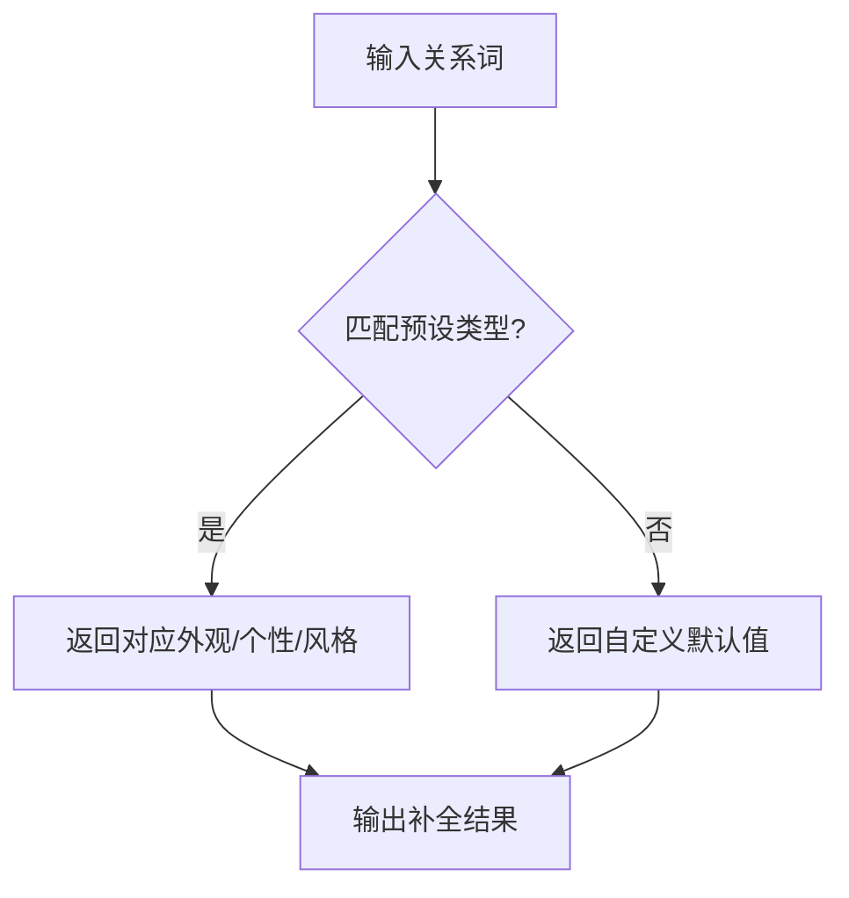

图示来源
- [emo_outlet_api/app/api/targets.py:184-213](file://emo_outlet_api/app/api/targets.py#L184-L213)

章节来源
- [emo_outlet_api/app/api/targets.py:26-182](file://emo_outlet_api/app/api/targets.py#L26-L182)
- [emo_outlet_api/app/models/target.py:13-56](file://emo_outlet_api/app/models/target.py#L13-L56)

### 会话管理
- 功能要点
  - 创建：校验目标归属、执行每日限额检查（年龄/访客差异化）、初始化会话状态与计数
  - 历史：分页查询已完成会话，附带目标名称与头像
  - 活跃会话：查询当前进行中的会话
  - 结束：标记完成、计算剩余时长、抓取消息并进行情绪分析，持久化JSON摘要与总结文案
- 关键流程（结束会话并分析）
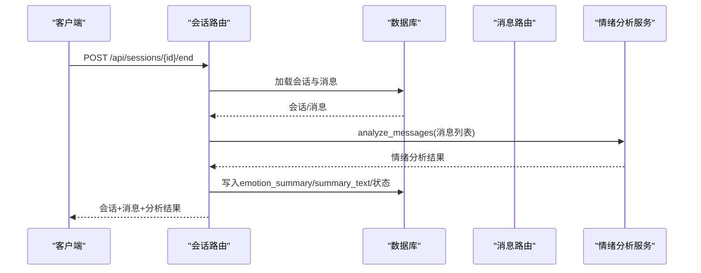

图示来源
- [emo_outlet_api/app/api/sessions.py:173-242](file://emo_outlet_api/app/api/sessions.py#L173-L242)
- [emo_outlet_api/app/services/emotion_service.py:44-71](file://emo_outlet_api/app/services/emotion_service.py#L44-L71)

章节来源
- [emo_outlet_api/app/api/sessions.py:53-242](file://emo_outlet_api/app/api/sessions.py#L53-L242)
- [emo_outlet_api/app/models/session.py:13-79](file://emo_outlet_api/app/models/session.py#L13-L79)

### 实时消息与AI对话引擎
- 功能要点
  - 获取消息：分页、总数、会话状态、剩余秒数
  - 发送消息：敏感词检查（DFA+正则高风险）、高风险中断与引导回复、审计日志、上下文截断（最多N轮）、AI回复（传入模式/风格/方言/年龄）、超时/轮数限制
- 关键流程（发送消息）
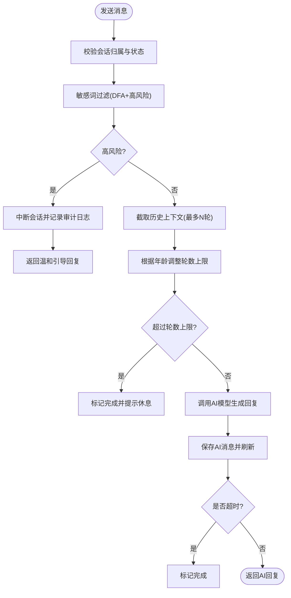

图示来源
- [emo_outlet_api/app/api/messages.py:80-231](file://emo_outlet_api/app/api/messages.py#L80-L231)
- [emo_outlet_api/app/utils/sensitive_filter.py:102-139](file://emo_outlet_api/app/utils/sensitive_filter.py#L102-L139)
- [emo_outlet_api/app/config.py:97-107](file://emo_outlet_api/app/config.py#L97-L107)

章节来源
- [emo_outlet_api/app/api/messages.py:27-243](file://emo_outlet_api/app/api/messages.py#L27-L243)
- [emo_outlet_api/app/utils/sensitive_filter.py:37-142](file://emo_outlet_api/app/utils/sensitive_filter.py#L37-L142)
- [emo_outlet_api/app/models/message.py:13-46](file://emo_outlet_api/app/models/message.py#L13-L46)

### 情绪分析系统
- 功能要点
  - 输入：用户消息序列（内容+发送者）
  - 统计特征：字符数、感叹号/问号数量、重复字符
  - 评分：基于情绪关键词计数与标点/长度微调，归一化至百分比，补充“平静”兜底
  - 强度：取最高分整数值
  - 关键词：主情绪关键词+候选词（去停用词、去标点、滑窗统计）
  - 摘要与建议：按主情绪与强度生成人性化文案
- 关键流程（情绪分析）
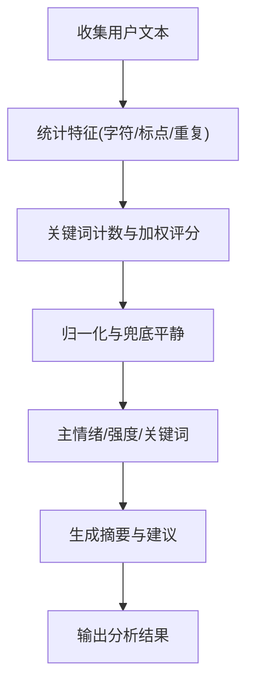

图示来源
- [emo_outlet_api/app/services/emotion_service.py:44-181](file://emo_outlet_api/app/services/emotion_service.py#L44-L181)

章节来源
- [emo_outlet_api/app/services/emotion_service.py:44-181](file://emo_outlet_api/app/services/emotion_service.py#L44-L181)

### 海报生成功能
- 功能要点
  - 生成：基于会话结束后的分析结果或重新分析，生成标题、情绪标签、关键词、建议、目标名
  - 可视化：服务端渲染HTML卡片（颜色随情绪变化），导出Base64占位图（开发用）
  - 展示：列表、详情页（包含来源会话摘要、创建时间等）
  - 报告：概览（主情绪、分布、趋势、建议）、详情（趋势点、模式分布、目标分布、时段分布、关键词Top）
- 关键流程（生成海报）
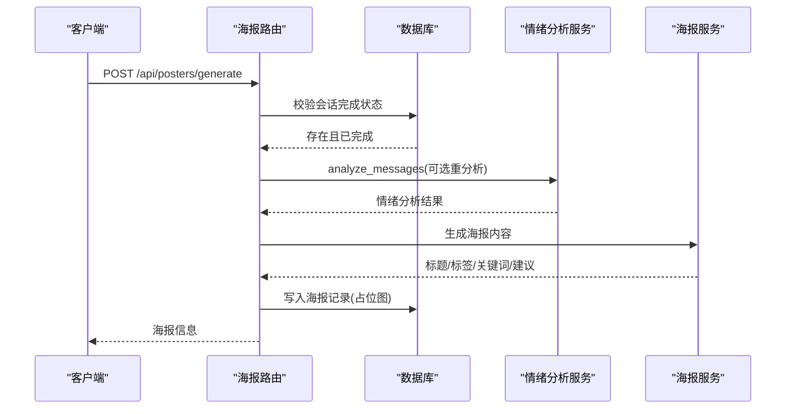

图示来源
- [emo_outlet_api/app/api/posters.py:40-111](file://emo_outlet_api/app/api/posters.py#L40-L111)
- [emo_outlet_api/app/services/emotion_service.py:44-71](file://emo_outlet_api/app/services/emotion_service.py#L44-L71)
- [emo_outlet_api/app/services/poster_service.py:32-151](file://emo_outlet_api/app/services/poster_service.py#L32-L151)

章节来源
- [emo_outlet_api/app/api/posters.py:113-352](file://emo_outlet_api/app/api/posters.py#L113-L352)
- [emo_outlet_api/app/services/poster_service.py:32-151](file://emo_outlet_api/app/services/poster_service.py#L32-L151)

## 依赖分析
- 组件耦合
  - 路由层仅依赖依赖注入与模型，避免直接耦合具体服务
  - 服务层独立封装AI与分析逻辑，便于替换与测试
  - 工具层（敏感词过滤）提供稳定的O(n)匹配能力
- 外部依赖
  - 配置中心集中管理数据库、Redis、AI提供商、安全参数与合规阈值
  - JWT密钥与算法在安全模块统一管理
- 循环依赖
  - 未发现循环导入；模型间通过外键关系反向关联，避免运行时循环

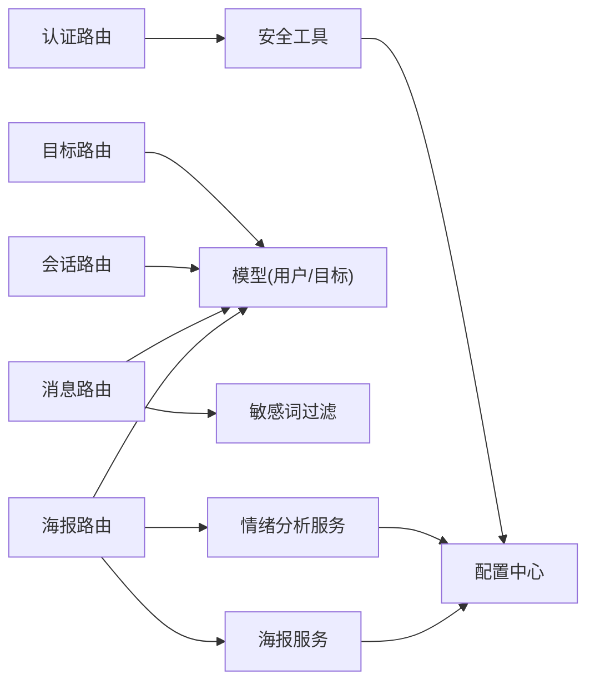

图示来源
- [emo_outlet_api/app/api/auth.py:30](file://emo_outlet_api/app/api/auth.py#L30)
- [emo_outlet_api/app/api/targets.py:23](file://emo_outlet_api/app/api/targets.py#L23)
- [emo_outlet_api/app/api/sessions.py:50](file://emo_outlet_api/app/api/sessions.py#L50)
- [emo_outlet_api/app/api/messages.py:24](file://emo_outlet_api/app/api/messages.py#L24)
- [emo_outlet_api/app/api/posters.py:28](file://emo_outlet_api/app/api/posters.py#L28)
- [emo_outlet_api/app/utils/sensitive_filter.py:37](file://emo_outlet_api/app/utils/sensitive_filter.py#L37)
- [emo_outlet_api/app/services/emotion_service.py:44](file://emo_outlet_api/app/services/emotion_service.py#L44)
- [emo_outlet_api/app/services/poster_service.py:32](file://emo_outlet_api/app/services/poster_service.py#L32)
- [emo_outlet_api/app/core/security.py:26](file://emo_outlet_api/app/core/security.py#L26)
- [emo_outlet_api/app/config.py:12](file://emo_outlet_api/app/config.py#L12)

章节来源
- [emo_outlet_api/app/config.py:12-125](file://emo_outlet_api/app/config.py#L12-L125)
- [emo_outlet_api/app/core/security.py:16-43](file://emo_outlet_api/app/core/security.py#L16-L43)

## 性能考虑
- 敏感词过滤
  - DFA构建Trie树，匹配复杂度O(n)，适合高频文本扫描；建议将敏感词库持久化缓存
- 消息上下文
  - 截断策略限制历史轮数，避免LLM输入膨胀导致延迟与成本上升
- 会话限额
  - 年龄分层与访客差异化的每日限额，防止滥用与资源占用
- 数据库查询
  - 分页查询与索引字段（用户ID、会话ID、创建时间）配合，降低IO开销
- 图片生成
  - 海报生成使用占位图，真实渲染可结合服务端截图或前端渲染，减少CPU压力

## 故障排查指南
- 认证失败
  - 检查账号是否存在、密码是否正确；确认JWT密钥与算法一致
- 游客登录异常
  - 确认设备UUID是否正确传递；检查访客用户是否被正确创建
- 注册冲突
  - 手机号/邮箱唯一性约束；若重复需更换或找回
- 会话无法创建
  - 检查目标归属、每日限额（年龄/访客）、会话状态
- 消息发送被中断
  - 高风险内容会触发中断并记录审计日志；查看敏感词匹配与轮数/时长限制
- 海报生成为空
  - 确认会话已完成且存在分析摘要；否则触发重新分析
- 数据导出缺失
  - 检查会话/消息/目标/海报是否被软删除或清理

章节来源
- [emo_outlet_api/app/api/auth.py:88-93](file://emo_outlet_api/app/api/auth.py#L88-L93)
- [emo_outlet_api/app/api/messages.py:96-100](file://emo_outlet_api/app/api/messages.py#L96-L100)
- [emo_outlet_api/app/api/sessions.py:71-83](file://emo_outlet_api/app/api/sessions.py#L71-L83)
- [emo_outlet_api/app/api/posters.py:53-55](file://emo_outlet_api/app/api/posters.py#L53-L55)

## 结论
本后端以清晰的模块划分与稳健的安全策略支撑了完整的用户认证、目标管理、会话与消息、情绪分析与海报生成闭环。通过配置中心与服务抽象，系统具备良好的可扩展性与可维护性，适合在生产环境中持续演进。

## 附录
- 使用场景
  - 认证系统：新用户注册、老用户登录、访客快速体验
  - 目标管理：建立个性化泄愤对象，提升对话沉浸感
  - 会话管理：限定时长与轮数，保障用户体验与资源控制
  - AI对话：多模型与方言适配，敏感词过滤与审计日志确保安全
  - 情绪分析：量化情绪波动，提供摘要与建议
  - 海报生成：可视化记录情绪释放历程，支持分享与导出
- 配置选项（节选）
  - 数据库：MySQL/SQLite连接串
  - Redis：缓存与会话存储
  - JWT：密钥、算法、过期时间
  - AI：提供商与模型、ASR/TTS、OSS
  - 合规：每日会话限额、对话轮数上限、审计日志采样
- 最佳实践
  - 生产环境务必更换默认JWT密钥
  - 敏感词库定期更新与扩展
  - 会话限额与超时策略结合年龄与访客维度
  - 审计日志开启采样率控制成本
  - 海报生成使用占位图，上线后接入真实渲染链路

章节来源
- [emo_outlet_api/app/config.py:54-125](file://emo_outlet_api/app/config.py#L54-L125)