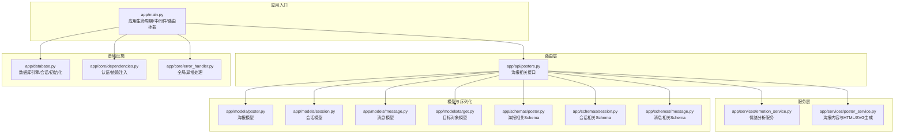
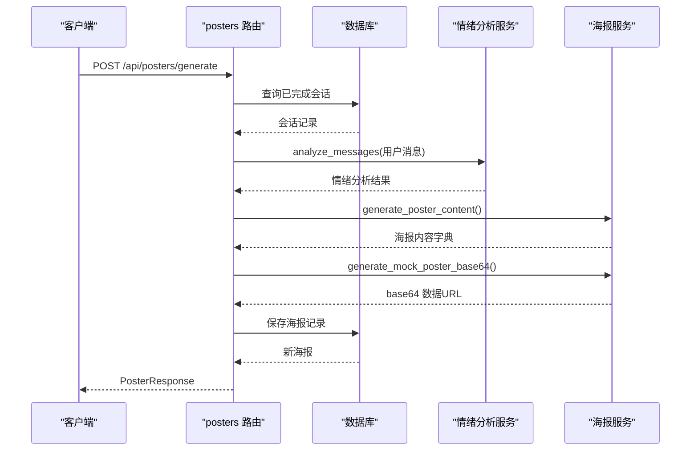
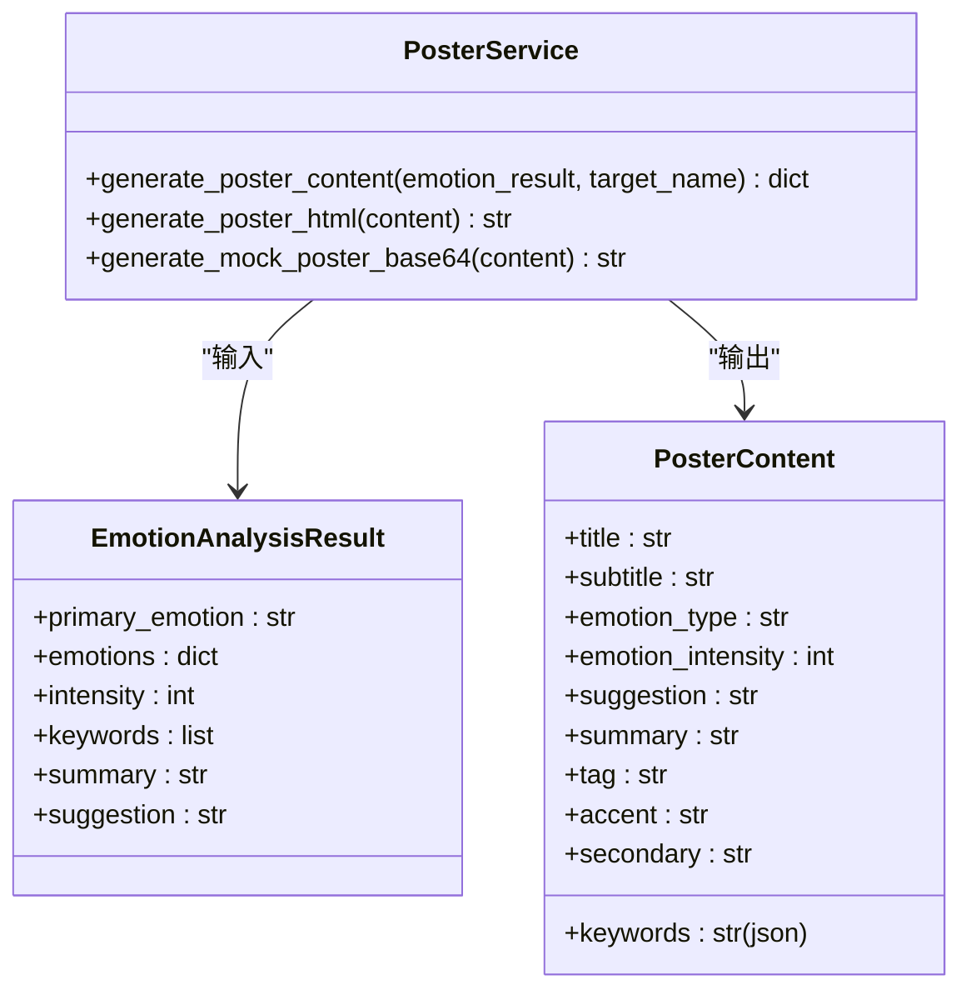
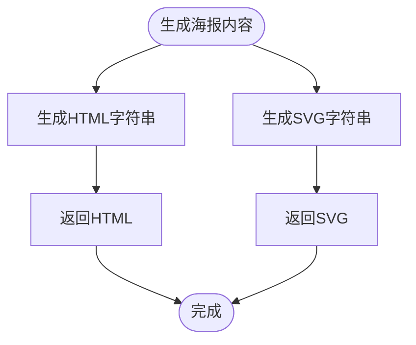
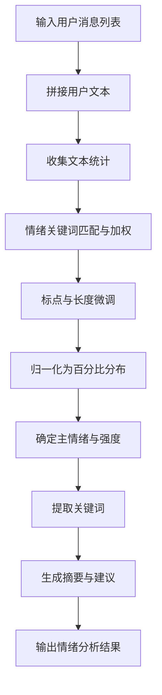
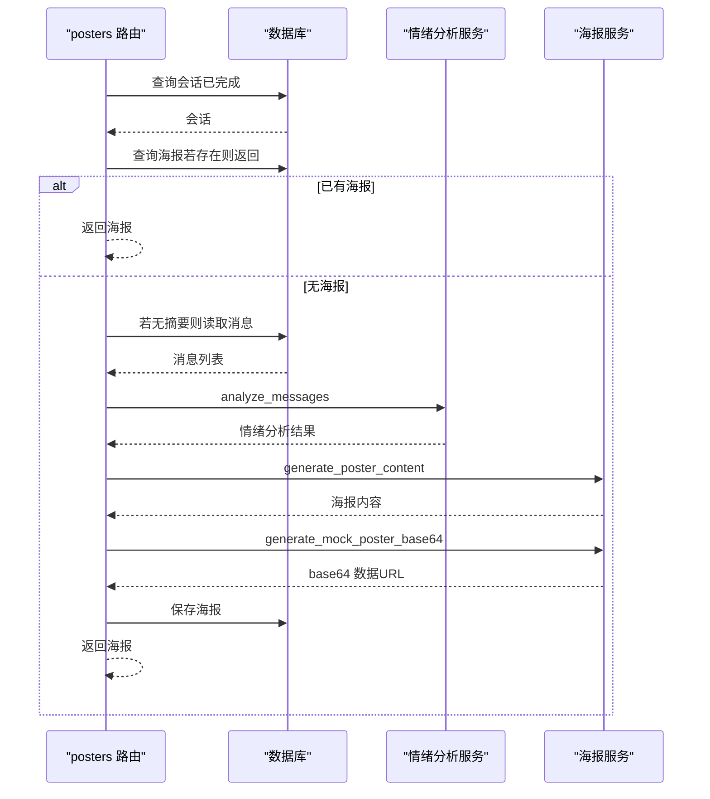
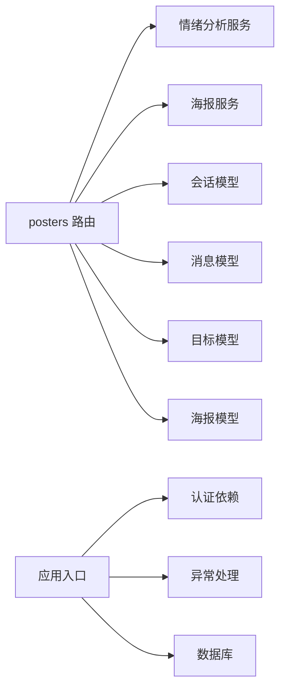
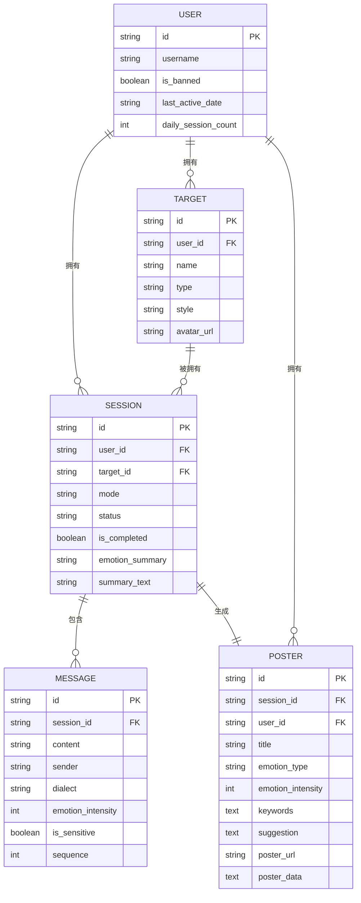

# 海报生成系统

<cite>
**本文引用的文件**
- [emo_outlet_api/app/main.py](file://emo_outlet_api/app/main.py)
- [emo_outlet_api/app/api/posters.py](file://emo_outlet_api/app/api/posters.py)
- [emo_outlet_api/app/services/emotion_service.py](file://emo_outlet_api/app/services/emotion_service.py)
- [emo_outlet_api/app/services/poster_service.py](file://emo_outlet_api/app/services/poster_service.py)
- [emo_outlet_api/app/models/poster.py](file://emo_outlet_api/app/models/poster.py)
- [emo_outlet_api/app/models/session.py](file://emo_outlet_api/app/models/session.py)
- [emo_outlet_api/app/models/message.py](file://emo_outlet_api/app/models/message.py)
- [emo_outlet_api/app/models/target.py](file://emo_outlet_api/app/models/target.py)
- [emo_outlet_api/app/schemas/poster.py](file://emo_outlet_api/app/schemas/poster.py)
- [emo_outlet_api/app/schemas/session.py](file://emo_outlet_api/app/schemas/session.py)
- [emo_outlet_api/app/schemas/message.py](file://emo_outlet_api/app/schemas/message.py)
- [emo_outlet_api/app/database.py](file://emo_outlet_api/app/database.py)
- [emo_outlet_api/app/core/dependencies.py](file://emo_outlet_api/app/core/dependencies.py)
- [emo_outlet_api/app/core/error_handler.py](file://emo_outlet_api/app/core/error_handler.py)
- [emo_outlet_api/run.py](file://emo_outlet_api/run.py)
</cite>

## 目录
1. [简介](#简介)
2. [项目结构](#项目结构)
3. [核心组件](#核心组件)
4. [架构总览](#架构总览)
5. [详细组件分析](#详细组件分析)
6. [依赖分析](#依赖分析)
7. [性能考虑](#性能考虑)
8. [故障排查指南](#故障排查指南)
9. [结论](#结论)
10. [附录](#附录)

## 简介
本文件为 Emo Outlet 的海报生成系统提供全面功能文档。系统围绕“会话—情绪分析—海报生成—可视化输出—分享与导出”的完整链路展开，重点覆盖以下方面：
- 海报模板系统：模板设计原则、布局结构、视觉元素配置与主题风格管理
- 可视化输出：HTML/SVG 渲染、颜色搭配与字体选择
- 内容生成机制：情绪分析结果整合、会话摘要提取、关键词突出显示、统计信息展示
- 分享与导出：图片生成、格式转换、水印添加与社交媒体集成
- 导出格式支持：PNG/JPG 生成、PDF 创建、高清输出与批量导出
- 海报自定义：背景选择、样式调整、尺寸设置与品牌元素添加
- 完整 API 接口文档：请求格式、参数校验、响应处理与错误码说明
- 性能优化建议与实际使用场景配置指南

## 项目结构
后端采用 FastAPI 架构，按职责划分为路由层、服务层、模型层与序列化层；数据库使用 SQLAlchemy ORM；全局中间件与异常处理保证稳定性。

**图示来源**
- [emo_outlet_api/app/main.py:1-82](file://emo_outlet_api/app/main.py#L1-L82)
- [emo_outlet_api/app/api/posters.py:1-383](file://emo_outlet_api/app/api/posters.py#L1-L383)
- [emo_outlet_api/app/services/emotion_service.py:1-181](file://emo_outlet_api/app/services/emotion_service.py#L1-L181)
- [emo_outlet_api/app/services/poster_service.py:1-221](file://emo_outlet_api/app/services/poster_service.py#L1-L221)
- [emo_outlet_api/app/models/poster.py:1-41](file://emo_outlet_api/app/models/poster.py#L1-L41)
- [emo_outlet_api/app/models/session.py:1-79](file://emo_outlet_api/app/models/session.py#L1-L79)
- [emo_outlet_api/app/models/message.py:1-46](file://emo_outlet_api/app/models/message.py#L1-L46)
- [emo_outlet_api/app/models/target.py:1-56](file://emo_outlet_api/app/models/target.py#L1-L56)
- [emo_outlet_api/app/schemas/poster.py:1-65](file://emo_outlet_api/app/schemas/poster.py#L1-L65)
- [emo_outlet_api/app/schemas/session.py:1-49](file://emo_outlet_api/app/schemas/session.py#L1-L49)
- [emo_outlet_api/app/schemas/message.py:1-33](file://emo_outlet_api/app/schemas/message.py#L1-L33)
- [emo_outlet_api/app/database.py:1-43](file://emo_outlet_api/app/database.py#L1-L43)
- [emo_outlet_api/app/core/dependencies.py:1-67](file://emo_outlet_api/app/core/dependencies.py#L1-L67)
- [emo_outlet_api/app/core/error_handler.py:1-59](file://emo_outlet_api/app/core/error_handler.py#L1-L59)

**章节来源**
- [emo_outlet_api/app/main.py:1-82](file://emo_outlet_api/app/main.py#L1-L82)
- [emo_outlet_api/run.py:1-31](file://emo_outlet_api/run.py#L1-L31)

## 核心组件
- 路由层（posters）：提供海报生成、列表查询、详情获取、按会话查询、删除以及情绪报告（概览/明细）接口
- 服务层：
  - 情绪分析服务：基于关键词匹配与文本统计计算情绪得分，提取关键词与生成摘要/建议
  - 海报服务：根据情绪风格生成海报内容字典，渲染 HTML 与 SVG，输出 base64 数据 URL
- 模型层：Poster、Session、Message、Target 等 ORM 模型
- 序列化层：Pydantic Schema 定义请求/响应结构
- 基础设施：数据库连接、认证依赖、异常处理

**章节来源**
- [emo_outlet_api/app/api/posters.py:72-137](file://emo_outlet_api/app/api/posters.py#L72-L137)
- [emo_outlet_api/app/services/emotion_service.py:44-181](file://emo_outlet_api/app/services/emotion_service.py#L44-L181)
- [emo_outlet_api/app/services/poster_service.py:66-221](file://emo_outlet_api/app/services/poster_service.py#L66-L221)
- [emo_outlet_api/app/models/poster.py:12-41](file://emo_outlet_api/app/models/poster.py#L12-L41)
- [emo_outlet_api/app/schemas/poster.py:8-65](file://emo_outlet_api/app/schemas/poster.py#L8-L65)

## 架构总览
系统以 FastAPI 作为入口，通过依赖注入获取当前用户与数据库会话，调用情绪分析与海报生成服务，最终持久化海报并返回统一响应格式。异常处理与 CORS 中间件贯穿全局。

**图示来源**
- [emo_outlet_api/app/api/posters.py:72-137](file://emo_outlet_api/app/api/posters.py#L72-L137)
- [emo_outlet_api/app/services/emotion_service.py:44-71](file://emo_outlet_api/app/services/emotion_service.py#L44-L71)
- [emo_outlet_api/app/services/poster_service.py:66-90](file://emo_outlet_api/app/services/poster_service.py#L66-L90)
- [emo_outlet_api/app/services/poster_service.py:191-217](file://emo_outlet_api/app/services/poster_service.py#L191-L217)

## 详细组件分析

### 组件A：海报模板系统与内容生成
- 模板设计原则
  - 情绪风格映射：每种情绪（愤怒、委屈、焦虑、疲惫、无奈、平静）对应标题、副标题、徽标、强调色与辅助色、建议语
  - 视觉层次：主视觉区（标题/副标题/关键词圆球）、元信息区（情绪类型+强度+徽标）、底部建议区
  - 字体与字号：标题、副标题、关键词标签、元信息与建议文本分层排版
- 布局结构
  - 页面容器：固定宽高，内边距，渐变背景
  - 主视觉区：圆角矩形背景，径向光晕装饰，关键词云（标签式）
  - 元信息区：左右布局，左侧情绪信息，右侧徽标
  - 底部建议：柔和背景，段落式建议文本
- 视觉元素配置
  - 渐变背景：页面与主视觉区分别使用不同透明度的渐变
  - 徽标：圆角背景，强调色文字
  - 关键词标签：半透明背景，圆角，间距与换行
- 主题风格管理
  - 通过 primary_emotion 映射到风格字典，动态选择标题、副标题、徽标、强调色与辅助色
  - 支持目标名拼接标题（可选）

**图示来源**
- [emo_outlet_api/app/services/poster_service.py:66-90](file://emo_outlet_api/app/services/poster_service.py#L66-L90)
- [emo_outlet_api/app/schemas/poster.py:8-15](file://emo_outlet_api/app/schemas/poster.py#L8-L15)

**章节来源**
- [emo_outlet_api/app/services/poster_service.py:10-59](file://emo_outlet_api/app/services/poster_service.py#L10-L59)
- [emo_outlet_api/app/services/poster_service.py:92-189](file://emo_outlet_api/app/services/poster_service.py#L92-L189)
- [emo_outlet_api/app/services/poster_service.py:191-217](file://emo_outlet_api/app/services/poster_service.py#L191-L217)

### 组件B：可视化输出（HTML/SVG）
- HTML 输出：生成完整 HTML 页面，内嵌样式，使用内容中的强调色与辅助色，关键词以标签形式渲染
- SVG 输出：生成固定尺寸 SVG，内含线性渐变与圆形光晕，用于 mock 图片与后续导出

**图示来源**
- [emo_outlet_api/app/services/poster_service.py:92-189](file://emo_outlet_api/app/services/poster_service.py#L92-L189)
- [emo_outlet_api/app/services/poster_service.py:191-217](file://emo_outlet_api/app/services/poster_service.py#L191-L217)

**章节来源**
- [emo_outlet_api/app/services/poster_service.py:92-217](file://emo_outlet_api/app/services/poster_service.py#L92-L217)

### 组件C：情绪分析与关键词提取
- 文本统计：字符数、感叹号/问号数量、重复字符计数
- 情绪打分：基于关键词匹配权重，结合标点与长度进行微调，归一化为百分比分布
- 关键词提取：优先匹配情绪专属高频词，其次从文本切片统计高频片段，去停用词与单一字符
- 摘要与建议：根据情绪与强度生成总结与建议语句

**图示来源**
- [emo_outlet_api/app/services/emotion_service.py:44-121](file://emo_outlet_api/app/services/emotion_service.py#L44-L121)
- [emo_outlet_api/app/services/emotion_service.py:122-148](file://emo_outlet_api/app/services/emotion_service.py#L122-L148)
- [emo_outlet_api/app/services/emotion_service.py:150-177](file://emo_outlet_api/app/services/emotion_service.py#L150-L177)

**章节来源**
- [emo_outlet_api/app/services/emotion_service.py:8-28](file://emo_outlet_api/app/services/emotion_service.py#L8-L28)
- [emo_outlet_api/app/services/emotion_service.py:30-33](file://emo_outlet_api/app/services/emotion_service.py#L30-L33)
- [emo_outlet_api/app/services/emotion_service.py:83-121](file://emo_outlet_api/app/services/emotion_service.py#L83-L121)
- [emo_outlet_api/app/services/emotion_service.py:122-177](file://emo_outlet_api/app/services/emotion_service.py#L122-L177)

### 组件D：海报内容生成机制
- 输入：会话 ID（需已完成），若会话已有海报则直接返回
- 情绪数据来源：优先使用会话的 JSON 情绪摘要；若为空，则拉取该会话的消息并调用情绪分析服务
- 生成内容：标题、副标题、情绪类型、强度、关键词、建议、摘要、徽标、强调色与辅助色
- 存储：持久化海报记录（poster_data 为 SVG 的 data URL）

**图示来源**
- [emo_outlet_api/app/api/posters.py:72-137](file://emo_outlet_api/app/api/posters.py#L72-L137)
- [emo_outlet_api/app/models/session.py:57-63](file://emo_outlet_api/app/models/session.py#L57-L63)
- [emo_outlet_api/app/models/message.py:22-36](file://emo_outlet_api/app/models/message.py#L22-L36)

**章节来源**
- [emo_outlet_api/app/api/posters.py:72-137](file://emo_outlet_api/app/api/posters.py#L72-L137)

### 组件E：分享与导出（概念说明）
- 图片生成与格式转换：当前实现返回 SVG 的 data URL，可用于前端渲染或进一步转 PNG/JPG
- PDF 文档创建：可在前端或服务端使用 HTML 到 PDF 的工具链（如 Puppeteer/WeasyPrint）将 HTML 渲染为 PDF
- 高清输出：通过提高 SVG/HTML 尺寸与分辨率实现
- 批量导出：在前端聚合海报列表后逐个下载或打包
- 水印与社交集成：可在海报 HTML/SVG 中叠加品牌水印，并通过社交平台的分享接口进行发布

[本节为概念性说明，不直接分析具体源码文件]

### 组件F：海报自定义选项（概念说明）
- 背景选择：通过强调色与辅助色组合实现
- 样式调整：标题字号、关键词标签样式、徽标样式
- 尺寸设置：HTML/SVG 固定尺寸，可按需放大
- 品牌元素：在 HTML/SVG 中叠加品牌 Logo 或水印

[本节为概念性说明，不直接分析具体源码文件]

## 依赖分析
- 路由依赖：posters 路由依赖情绪分析服务与海报服务，同时访问会话、消息、目标与海报模型
- 认证与权限：通过依赖注入获取当前用户，校验令牌有效性与封禁状态
- 数据库：异步会话工厂，自动提交/回滚/关闭
- 异常处理：统一捕获未处理异常、HTTP 异常与参数校验异常

**图示来源**
- [emo_outlet_api/app/api/posters.py:17-26](file://emo_outlet_api/app/api/posters.py#L17-L26)
- [emo_outlet_api/app/core/dependencies.py:18-50](file://emo_outlet_api/app/core/dependencies.py#L18-L50)
- [emo_outlet_api/app/core/error_handler.py:54-59](file://emo_outlet_api/app/core/error_handler.py#L54-L59)
- [emo_outlet_api/app/database.py:22-32](file://emo_outlet_api/app/database.py#L22-L32)

**章节来源**
- [emo_outlet_api/app/api/posters.py:17-26](file://emo_outlet_api/app/api/posters.py#L17-L26)
- [emo_outlet_api/app/core/dependencies.py:18-50](file://emo_outlet_api/app/core/dependencies.py#L18-L50)
- [emo_outlet_api/app/core/error_handler.py:10-59](file://emo_outlet_api/app/core/error_handler.py#L10-L59)
- [emo_outlet_api/app/database.py:10-32](file://emo_outlet_api/app/database.py#L10-L32)

## 性能考虑
- 情绪分析复杂度：文本统计 O(n)，关键词匹配 O(n*m)，排序 O(k log k)，整体近似 O(n*m + k log k)
- 关键词提取：切片统计与计数 O(n*s)，s 为切片长度（2/3/4），建议限制输入长度与切片上限
- 数据库查询：会话与消息查询按条件过滤，避免 N+1 查询；使用 select_in_eager 加载关联
- 缓存策略：对常用情绪风格映射与 HTML/SVG 模板进行内存缓存
- 并发与限流：结合每日会话配额与速率限制，防止滥用
- I/O 优化：将海报数据以 data URL 存储，减少额外文件系统操作

[本节提供通用指导，不直接分析具体源码文件]

## 故障排查指南
- 认证失败：检查 Authorization 头是否携带有效令牌，确认用户未被封禁
- 会话未完成：生成海报要求会话状态为已完成，否则返回 404
- 参数校验失败：请求体字段不符合 Schema 约束，返回 422 与字段级错误
- 服务器内部错误：未捕获异常统一返回 500 与标准错误结构
- 健康检查：访问 /health 获取应用状态

**章节来源**
- [emo_outlet_api/app/core/dependencies.py:18-50](file://emo_outlet_api/app/core/dependencies.py#L18-L50)
- [emo_outlet_api/app/api/posters.py:86-87](file://emo_outlet_api/app/api/posters.py#L86-L87)
- [emo_outlet_api/app/core/error_handler.py:21-51](file://emo_outlet_api/app/core/error_handler.py#L21-L51)
- [emo_outlet_api/app/main.py:66-72](file://emo_outlet_api/app/main.py#L66-L72)

## 结论
本系统以清晰的职责分离实现了从情绪分析到海报生成的闭环流程，通过风格化的模板与可扩展的主题系统，为用户提供情感表达与可视化沉淀的体验。未来可在导出与分享环节引入更完善的 PDF/图片生成与社交集成能力，并结合缓存与并发策略进一步提升性能与稳定性。

[本节为总结性内容，不直接分析具体源码文件]

## 附录

### API 接口文档

- 生成海报
  - 方法与路径：POST /api/posters/generate
  - 请求体：PosterGenerateRequest
    - session_id: string（必填）
  - 成功响应：PosterResponse
    - id: string
    - session_id: string
    - title: string?
    - emotion_type: string?
    - emotion_intensity: integer?
    - keywords: string?（JSON 字符串）
    - suggestion: string?
    - poster_url: string?
    - poster_data: string?（SVG data URL）
    - created_at: datetime?
  - 错误：
    - 404：找不到已完成会话
    - 401/403：认证失败或用户被封禁
    - 422：请求参数校验失败
    - 500：服务器内部错误

- 海报列表
  - 方法与路径：GET /api/posters
  - 成功响应：PosterResponse 数组（按创建时间倒序）

- 海报详情
  - 方法与路径：GET /api/posters/detail/{poster_id}
  - 成功响应：PosterDetailResponse
    - id: string
    - session_id: string
    - title: string
    - date: string（格式化日期）
    - tag: string
    - summary: string
    - created_at_label: string（格式化时间）
    - source_session_title: string
    - poster_data: string?

- 按会话查询海报
  - 方法与路径：GET /api/posters/session/{session_id}
  - 成功响应：PosterResponse
  - 错误：404 未找到海报

- 删除海报
  - 方法与路径：DELETE /api/posters/{poster_id}
  - 成功响应：204 No Content
  - 错误：404 未找到海报

- 情绪报告（概览）
  - 方法与路径：GET /api/posters/report/overview
  - 查询参数：
    - period: string（daily/weekly/monthly/yearly/all，默认 weekly）
  - 成功响应：EmotionReportResponse
    - total_sessions: integer
    - total_duration_minutes: integer
    - dominant_emotion: string
    - emotion_distribution: dict<string, number>
    - daily_trend: array<object>
    - suggestion: string

- 情绪报告（明细）
  - 方法与路径：GET /api/posters/report/detail
  - 查询参数：
    - period: string（monthly 默认）
  - 成功响应：EmotionReportDetailResponse
    - period: string
    - trend_points: array<object>
    - mode_distribution: dict<string, number>
    - target_distribution: array<object>
    - time_distribution: array<object>
    - keyword_counts: array<object>

**章节来源**
- [emo_outlet_api/app/api/posters.py:72-137](file://emo_outlet_api/app/api/posters.py#L72-L137)
- [emo_outlet_api/app/api/posters.py:140-150](file://emo_outlet_api/app/api/posters.py#L140-L150)
- [emo_outlet_api/app/api/posters.py:153-186](file://emo_outlet_api/app/api/posters.py#L153-L186)
- [emo_outlet_api/app/api/posters.py:189-204](file://emo_outlet_api/app/api/posters.py#L189-L204)
- [emo_outlet_api/app/api/posters.py:207-223](file://emo_outlet_api/app/api/posters.py#L207-L223)
- [emo_outlet_api/app/api/posters.py:226-293](file://emo_outlet_api/app/api/posters.py#L226-L293)
- [emo_outlet_api/app/api/posters.py:296-382](file://emo_outlet_api/app/api/posters.py#L296-L382)
- [emo_outlet_api/app/schemas/poster.py:17-35](file://emo_outlet_api/app/schemas/poster.py#L17-L35)
- [emo_outlet_api/app/schemas/poster.py:37-47](file://emo_outlet_api/app/schemas/poster.py#L37-L47)
- [emo_outlet_api/app/schemas/poster.py:49-65](file://emo_outlet_api/app/schemas/poster.py#L49-L65)

### 数据模型与关系

**图示来源**
- [emo_outlet_api/app/models/poster.py:12-41](file://emo_outlet_api/app/models/poster.py#L12-L41)
- [emo_outlet_api/app/models/session.py:13-79](file://emo_outlet_api/app/models/session.py#L13-L79)
- [emo_outlet_api/app/models/message.py:13-46](file://emo_outlet_api/app/models/message.py#L13-L46)
- [emo_outlet_api/app/models/target.py:13-56](file://emo_outlet_api/app/models/target.py#L13-L56)

### 运行与部署
- 开发启动：uvicorn app.main:app --reload --host 0.0.0.0 --port 8686
- 生产启动：uvicorn app.main:app --host 0.0.0.0 --port 8686 --workers 4
- Docker 部署：docker build/run 并通过 .env 注入环境变量
- API 文档：Swagger UI 与 ReDoc 地址见运行脚本注释

**章节来源**
- [emo_outlet_api/run.py:8-31](file://emo_outlet_api/run.py#L8-L31)