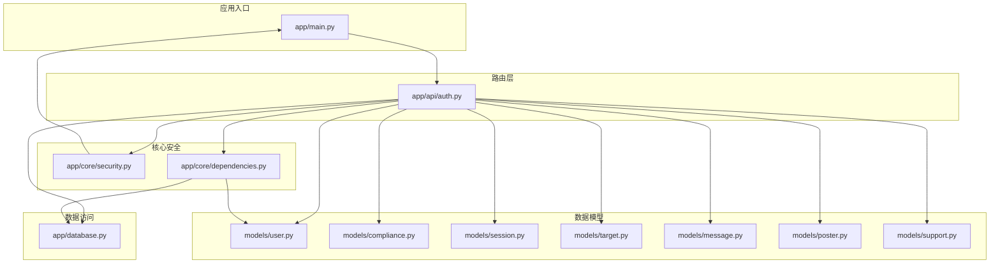
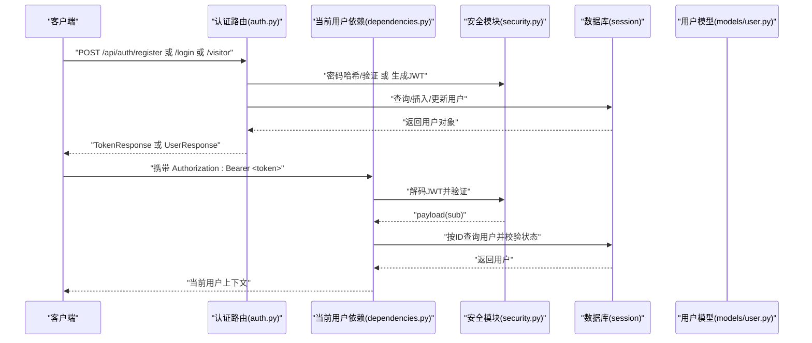
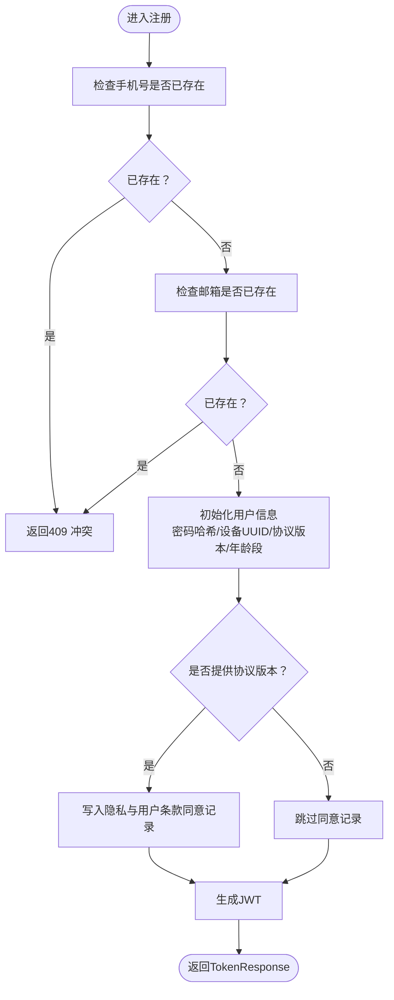
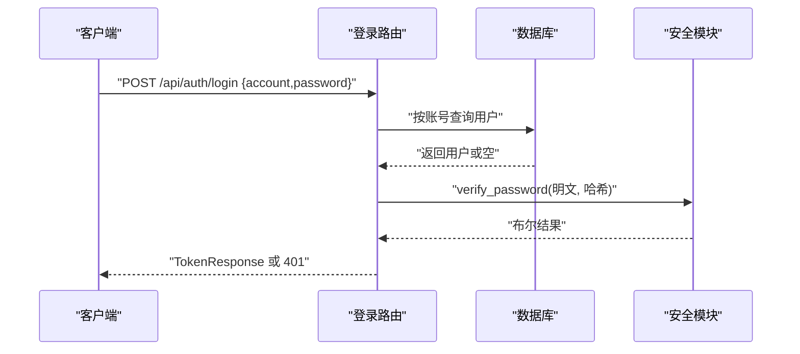
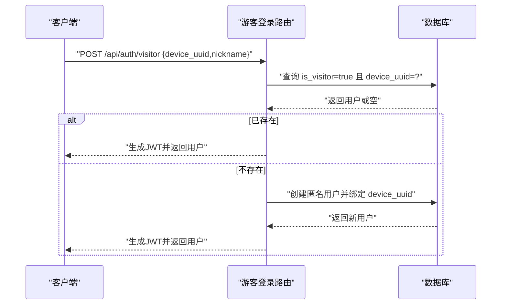
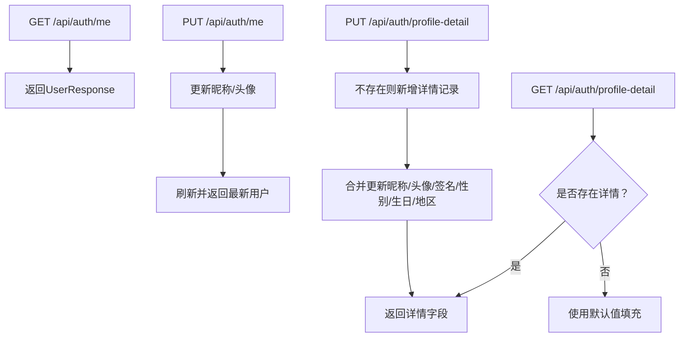
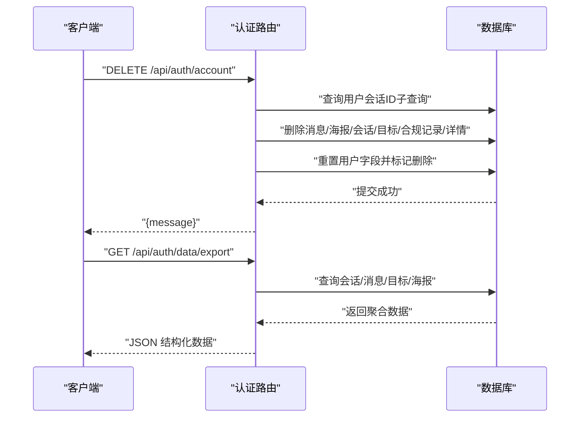
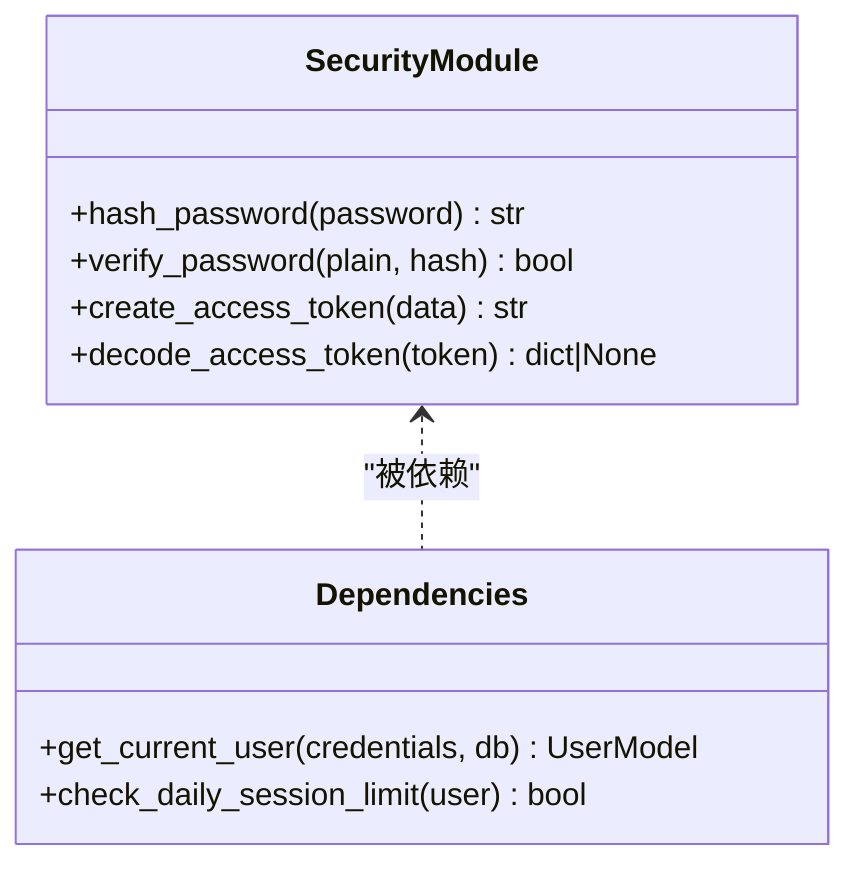
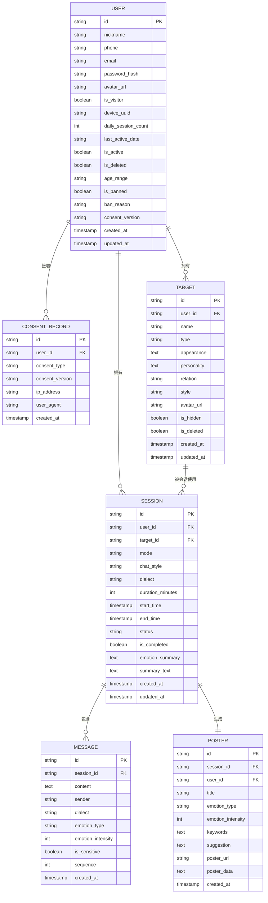
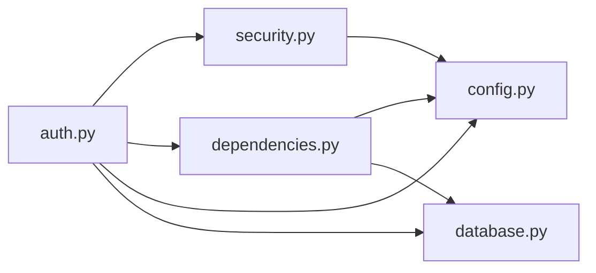

# 用户认证系统

<cite>
**本文引用的文件**
- [emo_outlet_api/app/api/auth.py](file://emo_outlet_api/app/api/auth.py)
- [emo_outlet_api/app/models/user.py](file://emo_outlet_api/app/models/user.py)
- [emo_outlet_api/app/models/compliance.py](file://emo_outlet_api/app/models/compliance.py)
- [emo_outlet_api/app/models/session.py](file://emo_outlet_api/app/models/session.py)
- [emo_outlet_api/app/models/target.py](file://emo_outlet_api/app/models/target.py)
- [emo_outlet_api/app/models/message.py](file://emo_outlet_api/app/models/message.py)
- [emo_outlet_api/app/models/poster.py](file://emo_outlet_api/app/models/poster.py)
- [emo_outlet_api/app/models/support.py](file://emo_outlet_api/app/models/support.py)
- [emo_outlet_api/app/schemas/user.py](file://emo_outlet_api/app/schemas/user.py)
- [emo_outlet_api/app/schemas/common.py](file://emo_outlet_api/app/schemas/common.py)
- [emo_outlet_api/app/core/security.py](file://emo_outlet_api/app/core/security.py)
- [emo_outlet_api/app/core/dependencies.py](file://emo_outlet_api/app/core/dependencies.py)
- [emo_outlet_api/app/config.py](file://emo_outlet_api/app/config.py)
- [emo_outlet_api/app/database.py](file://emo_outlet_api/app/database.py)
- [emo_outlet_api/app/main.py](file://emo_outlet_api/app/main.py)
- [emo_outlet_api/app/core/error_handler.py](file://emo_outlet_api/app/core/error_handler.py)
</cite>

## 目录
1. [简介](#简介)
2. [项目结构](#项目结构)
3. [核心组件](#核心组件)
4. [架构总览](#架构总览)
5. [详细组件分析](#详细组件分析)
6. [依赖分析](#依赖分析)
7. [性能考虑](#性能考虑)
8. [故障排查指南](#故障排查指南)
9. [结论](#结论)
10. [附录](#附录)

## 简介
本文件为 Emo Outlet 的用户认证系统技术文档，覆盖以下主题：
- 用户注册流程：手机号与邮箱双重验证、唯一性检查、用户信息初始化与合规协议签署
- 登录认证流程：JWT 令牌生成、密码哈希验证、会话管理与每日会话次数限制
- 游客模式：设备 UUID 绑定、匿名用户创建与数据隔离策略
- 用户资料管理：个人信息更新、头像上传、隐私设置
- 合规协议签署：隐私政策与用户条款版本管理
- 完整 API 接口文档：请求参数、响应格式与错误处理
- 安全最佳实践与常见问题解决方案

## 项目结构
后端采用 FastAPI + SQLAlchemy Async 架构，认证相关代码集中在以下模块：
- 路由层：认证路由定义于认证 API 文件
- 核心安全：JWT 与密码哈希在安全模块实现
- 依赖注入：当前用户解析与每日会话限制在依赖模块
- 数据模型：用户、会话、目标、消息、海报、合规记录等
- 数据访问：数据库引擎与会话工厂在数据库模块
- 应用入口：主程序注册中间件、异常处理器与各路由

图表来源
- [emo_outlet_api/app/main.py:51-63](file://emo_outlet_api/app/main.py#L51-L63)
- [emo_outlet_api/app/api/auth.py:30-30](file://emo_outlet_api/app/api/auth.py#L30-L30)
- [emo_outlet_api/app/core/security.py:1-43](file://emo_outlet_api/app/core/security.py#L1-L43)
- [emo_outlet_api/app/core/dependencies.py:1-67](file://emo_outlet_api/app/core/dependencies.py#L1-L67)
- [emo_outlet_api/app/database.py:1-43](file://emo_outlet_api/app/database.py#L1-L43)
- [emo_outlet_api/app/models/user.py:14-56](file://emo_outlet_api/app/models/user.py#L14-L56)
- [emo_outlet_api/app/models/compliance.py:12-29](file://emo_outlet_api/app/models/compliance.py#L12-L29)
- [emo_outlet_api/app/models/session.py:13-79](file://emo_outlet_api/app/models/session.py#L13-L79)
- [emo_outlet_api/app/models/target.py:13-56](file://emo_outlet_api/app/models/target.py#L13-L56)
- [emo_outlet_api/app/models/message.py:13-46](file://emo_outlet_api/app/models/message.py#L13-L46)
- [emo_outlet_api/app/models/poster.py:13-61](file://emo_outlet_api/app/models/poster.py#L13-L61)
- [emo_outlet_api/app/models/support.py:12-44](file://emo_outlet_api/app/models/support.py#L12-L44)

章节来源
- [emo_outlet_api/app/main.py:1-82](file://emo_outlet_api/app/main.py#L1-L82)
- [emo_outlet_api/app/api/auth.py:30-30](file://emo_outlet_api/app/api/auth.py#L30-L30)

## 核心组件
- 认证路由：提供注册、登录、游客登录、个人资料查询与更新、账户注销、数据导出等接口
- 安全模块：负责密码哈希、密码验证与 JWT 令牌签发/解码
- 当前用户依赖：从 Authorization Bearer 中提取并验证 JWT，解析用户身份，执行封禁检查与每日会话计数重置
- 数据模型：用户、会话、目标、消息、海报、合规记录、用户详情等
- 数据库：异步 SQLAlchemy 引擎与会话工厂，支持 MySQL/SQLite
- 配置：JWT 过期时间、防沉迷策略、敏感词长度限制、合规版本等

章节来源
- [emo_outlet_api/app/api/auth.py:33-121](file://emo_outlet_api/app/api/auth.py#L33-L121)
- [emo_outlet_api/app/core/security.py:16-42](file://emo_outlet_api/app/core/security.py#L16-L42)
- [emo_outlet_api/app/core/dependencies.py:18-66](file://emo_outlet_api/app/core/dependencies.py#L18-L66)
- [emo_outlet_api/app/models/user.py:14-56](file://emo_outlet_api/app/models/user.py#L14-L56)
- [emo_outlet_api/app/database.py:22-43](file://emo_outlet_api/app/database.py#L22-L43)
- [emo_outlet_api/app/config.py:54-121](file://emo_outlet_api/app/config.py#L54-L121)

## 架构总览
认证系统围绕“路由 → 依赖 → 安全 → 数据库”的调用链路工作，统一通过 HTTP Bearer 令牌进行鉴权。

图表来源
- [emo_outlet_api/app/api/auth.py:33-121](file://emo_outlet_api/app/api/auth.py#L33-L121)
- [emo_outlet_api/app/core/dependencies.py:18-50](file://emo_outlet_api/app/core/dependencies.py#L18-L50)
- [emo_outlet_api/app/core/security.py:26-42](file://emo_outlet_api/app/core/security.py#L26-L42)
- [emo_outlet_api/app/database.py:22-32](file://emo_outlet_api/app/database.py#L22-L32)
- [emo_outlet_api/app/models/user.py:14-56](file://emo_outlet_api/app/models/user.py#L14-L56)

## 详细组件分析

### 注册流程（手机号/邮箱双重验证与唯一性检查）
- 输入参数：昵称、手机号、邮箱、密码、设备 UUID、协议版本、年龄段
- 唯一性检查：分别对手机号与邮箱执行查询，若存在则返回冲突错误
- 初始化：生成默认昵称、计算密码哈希、写入设备 UUID、协议版本与年龄段
- 合规记录：若提供协议版本，则为隐私与用户条款两类记录写入对应版本
- 返回：生成 JWT 并返回用户信息

图表来源
- [emo_outlet_api/app/api/auth.py:33-76](file://emo_outlet_api/app/api/auth.py#L33-L76)
- [emo_outlet_api/app/core/security.py:16-18](file://emo_outlet_api/app/core/security.py#L16-L18)
- [emo_outlet_api/app/models/compliance.py:12-29](file://emo_outlet_api/app/models/compliance.py#L12-L29)

章节来源
- [emo_outlet_api/app/api/auth.py:33-76](file://emo_outlet_api/app/api/auth.py#L33-L76)
- [emo_outlet_api/app/schemas/user.py:8-16](file://emo_outlet_api/app/schemas/user.py#L8-L16)
- [emo_outlet_api/app/models/user.py:17-41](file://emo_outlet_api/app/models/user.py#L17-L41)
- [emo_outlet_api/app/models/compliance.py:12-29](file://emo_outlet_api/app/models/compliance.py#L12-L29)

### 登录认证（JWT 令牌生成与密码验证）
- 输入参数：账号（手机或邮箱）、密码
- 查询逻辑：根据账号匹配手机号或邮箱
- 验证逻辑：校验密码哈希；失败返回未授权
- 成功：生成 JWT 并返回用户信息

图表来源
- [emo_outlet_api/app/api/auth.py:78-94](file://emo_outlet_api/app/api/auth.py#L78-L94)
- [emo_outlet_api/app/core/security.py:21-23](file://emo_outlet_api/app/core/security.py#L21-L23)
- [emo_outlet_api/app/models/user.py:21-24](file://emo_outlet_api/app/models/user.py#L21-L24)

章节来源
- [emo_outlet_api/app/api/auth.py:78-94](file://emo_outlet_api/app/api/auth.py#L78-L94)
- [emo_outlet_api/app/core/security.py:21-23](file://emo_outlet_api/app/core/security.py#L21-L23)

### 游客模式（设备 UUID 绑定与匿名用户）
- 输入参数：设备 UUID、昵称
- 查找逻辑：按设备 UUID 与 is_visitor 标记查找匿名用户
- 创建逻辑：若不存在则创建匿名用户并绑定设备 UUID
- 返回：生成 JWT 并返回用户信息

图表来源
- [emo_outlet_api/app/api/auth.py:96-121](file://emo_outlet_api/app/api/auth.py#L96-L121)
- [emo_outlet_api/app/models/user.py:25-26](file://emo_outlet_api/app/models/user.py#L25-L26)

章节来源
- [emo_outlet_api/app/api/auth.py:96-121](file://emo_outlet_api/app/api/auth.py#L96-L121)
- [emo_outlet_api/app/models/user.py:25-26](file://emo_outlet_api/app/models/user.py#L25-L26)

### 个人资料管理（基本信息与详情）
- 获取资料：/api/auth/me 返回当前用户信息
- 更新基本信息：/api/auth/me 支持更新昵称与头像 URL
- 获取详情：/api/auth/profile-detail 返回用户详情（签名、性别、生日、地区），若无详情使用默认值
- 更新详情：/api/auth/profile-detail 支持更新昵称、头像、签名、性别、生日、地区，并同步更新用户表字段

图表来源
- [emo_outlet_api/app/api/auth.py:123-210](file://emo_outlet_api/app/api/auth.py#L123-L210)
- [emo_outlet_api/app/models/support.py:12-24](file://emo_outlet_api/app/models/support.py#L12-L24)

章节来源
- [emo_outlet_api/app/api/auth.py:123-210](file://emo_outlet_api/app/api/auth.py#L123-L210)
- [emo_outlet_api/app/models/support.py:12-24](file://emo_outlet_api/app/models/support.py#L12-L24)

### 账户注销与数据导出
- 注销：删除用户相关会话、消息、海报、目标、合规记录与详情，重置用户字段并标记删除
- 导出：按用户导出会话、消息、目标与海报数据，包含时间戳与结构化字段

图表来源
- [emo_outlet_api/app/api/auth.py:212-331](file://emo_outlet_api/app/api/auth.py#L212-L331)

章节来源
- [emo_outlet_api/app/api/auth.py:212-331](file://emo_outlet_api/app/api/auth.py#L212-L331)

### JWT 与安全模块
- 密码哈希：使用 bcrypt，确保不可逆存储
- 密码验证：基于 passlib 的 verify
- JWT 生成：携带 sub（用户 ID），设置过期时间
- JWT 解码：校验算法与密钥，返回 payload
- 依赖注入：从 Authorization Bearer 中提取 token，解码并查询用户，校验封禁状态，重置每日会话计数

图表来源
- [emo_outlet_api/app/core/security.py:16-42](file://emo_outlet_api/app/core/security.py#L16-L42)
- [emo_outlet_api/app/core/dependencies.py:18-66](file://emo_outlet_api/app/core/dependencies.py#L18-L66)

章节来源
- [emo_outlet_api/app/core/security.py:16-42](file://emo_outlet_api/app/core/security.py#L16-L42)
- [emo_outlet_api/app/core/dependencies.py:18-66](file://emo_outlet_api/app/core/dependencies.py#L18-L66)

### 数据模型与关系
用户相关核心实体与关系如下：

图表来源
- [emo_outlet_api/app/models/user.py:14-56](file://emo_outlet_api/app/models/user.py#L14-L56)
- [emo_outlet_api/app/models/compliance.py:12-29](file://emo_outlet_api/app/models/compliance.py#L12-L29)
- [emo_outlet_api/app/models/session.py:13-79](file://emo_outlet_api/app/models/session.py#L13-L79)
- [emo_outlet_api/app/models/target.py:13-56](file://emo_outlet_api/app/models/target.py#L13-L56)
- [emo_outlet_api/app/models/message.py:13-46](file://emo_outlet_api/app/models/message.py#L13-L46)
- [emo_outlet_api/app/models/poster.py:13-61](file://emo_outlet_api/app/models/poster.py#L13-L61)

章节来源
- [emo_outlet_api/app/models/user.py:14-56](file://emo_outlet_api/app/models/user.py#L14-L56)
- [emo_outlet_api/app/models/compliance.py:12-29](file://emo_outlet_api/app/models/compliance.py#L12-L29)
- [emo_outlet_api/app/models/session.py:13-79](file://emo_outlet_api/app/models/session.py#L13-L79)
- [emo_outlet_api/app/models/target.py:13-56](file://emo_outlet_api/app/models/target.py#L13-L56)
- [emo_outlet_api/app/models/message.py:13-46](file://emo_outlet_api/app/models/message.py#L13-L46)
- [emo_outlet_api/app/models/poster.py:13-61](file://emo_outlet_api/app/models/poster.py#L13-L61)

## 依赖分析
- 路由依赖：认证路由依赖安全模块进行密码与 JWT 处理，依赖依赖模块解析当前用户，依赖数据库进行持久化
- 依赖模块：从请求头提取 Bearer 令牌，解码并查询用户，执行封禁检查与每日会话计数重置
- 配置模块：提供 JWT 密钥、算法、过期时间、防沉迷阈值等全局设置
- 数据库模块：提供异步会话工厂与初始化/关闭生命周期钩子

图表来源
- [emo_outlet_api/app/api/auth.py:9-28](file://emo_outlet_api/app/api/auth.py#L9-L28)
- [emo_outlet_api/app/core/dependencies.py:1-15](file://emo_outlet_api/app/core/dependencies.py#L1-L15)
- [emo_outlet_api/app/core/security.py:1-11](file://emo_outlet_api/app/core/security.py#L1-L11)
- [emo_outlet_api/app/config.py:54-61](file://emo_outlet_api/app/config.py#L54-L61)
- [emo_outlet_api/app/database.py:22-32](file://emo_outlet_api/app/database.py#L22-L32)

章节来源
- [emo_outlet_api/app/api/auth.py:9-28](file://emo_outlet_api/app/api/auth.py#L9-L28)
- [emo_outlet_api/app/core/dependencies.py:1-15](file://emo_outlet_api/app/core/dependencies.py#L1-L15)
- [emo_outlet_api/app/core/security.py:1-11](file://emo_outlet_api/app/core/security.py#L1-L11)
- [emo_outlet_api/app/config.py:54-61](file://emo_outlet_api/app/config.py#L54-L61)
- [emo_outlet_api/app/database.py:22-32](file://emo_outlet_api/app/database.py#L22-L32)

## 性能考虑
- 异步数据库：使用 SQLAlchemy Async 与连接池，减少阻塞
- 会话懒加载：关系使用 selectin 加载，降低 N+1 查询风险
- JWT 过期时间：默认 7 天，建议生产环境结合刷新令牌策略
- 每日会话限制：按年龄段与游客类型差异化限制，避免滥用
- 参数校验：Pydantic 模型内置校验，减少无效请求进入业务层

## 故障排查指南
- 未提供认证令牌：当前用户依赖抛出未授权错误
- 令牌无效或已过期：解码失败或 sub 缺失导致未授权
- 用户不存在或已删除：查询不到用户或 is_deleted=true
- 账号被封禁：is_banned=true 时拒绝访问
- 请求参数校验失败：统一返回 422，包含字段与错误信息
- 服务器内部错误：统一返回 500，包含通用错误码

章节来源
- [emo_outlet_api/app/core/dependencies.py:22-43](file://emo_outlet_api/app/core/dependencies.py#L22-L43)
- [emo_outlet_api/app/core/error_handler.py:10-58](file://emo_outlet_api/app/core/error_handler.py#L10-L58)

## 结论
本认证系统以 FastAPI 为基础，结合 SQLAlchemy Async 实现高性能、可扩展的用户认证与会话管理。通过 JWT 与密码哈希保障安全性，配合每日会话限制与合规协议版本管理，满足青少年保护与数据治理要求。路由层清晰分离注册、登录、游客、资料与合规操作，便于维护与演进。

## 附录

### API 接口文档

- 注册
  - 方法与路径：POST /api/auth/register
  - 请求体：UserRegisterRequest
    - 字段：nickname、phone、email、password、device_uuid、consent_version、age_range
    - 校验：手机号格式、密码长度、可选邮箱与设备 UUID
  - 成功响应：TokenResponse
    - 字段：access_token、token_type、user
  - 错误：
    - 409 手机号/邮箱已注册
    - 422 参数校验失败
    - 500 服务器内部错误

- 登录
  - 方法与路径：POST /api/auth/login
  - 请求体：UserLoginRequest
    - 字段：account（手机号或邮箱）、password
  - 成功响应：TokenResponse
  - 错误：
    - 401 账号或密码错误
    - 422 参数校验失败
    - 500 服务器内部错误

- 游客登录
  - 方法与路径：POST /api/auth/visitor
  - 请求体：VisitorLoginRequest
    - 字段：device_uuid、nickname
  - 成功响应：TokenResponse
  - 错误：
    - 422 参数校验失败
    - 500 服务器内部错误

- 获取当前用户
  - 方法与路径：GET /api/auth/me
  - 成功响应：UserResponse
  - 错误：
    - 401 未提供认证令牌/令牌无效或已过期/用户不存在
    - 403 账号被封禁
    - 404 用户不存在
    - 422 参数校验失败
    - 500 服务器内部错误

- 更新基本信息
  - 方法与路径：PUT /api/auth/me
  - 请求体：UserUpdateRequest
    - 字段：nickname、avatar_url
  - 成功响应：UserResponse
  - 错误：
    - 401 未提供认证令牌/令牌无效或已过期/用户不存在
    - 403 账号被封禁
    - 422 参数校验失败
    - 500 服务器内部错误

- 获取用户详情
  - 方法与路径：GET /api/auth/profile-detail
  - 成功响应：UserProfileDetailResponse
    - 默认值：签名、性别、生日、地区
  - 错误：
    - 401 未提供认证令牌/令牌无效或已过期/用户不存在
    - 403 账号被封禁
    - 500 服务器内部错误

- 更新用户详情
  - 方法与路径：PUT /api/auth/profile-detail
  - 请求体：UserProfileDetailUpdateRequest
    - 字段：nickname、avatar_url、signature、gender、birthday、region
  - 成功响应：UserProfileDetailResponse
  - 错误：
    - 401 未提供认证令牌/令牌无效或已过期/用户不存在
    - 403 账号被封禁
    - 422 参数校验失败
    - 500 服务器内部错误

- 账户注销
  - 方法与路径：DELETE /api/auth/account
  - 成功响应：{"message": "账号已注销，所有数据已清除"}

- 数据导出
  - 方法与路径：GET /api/auth/data/export
  - 成功响应：包含 user、targets、sessions、messages、posters、export_time 的结构化数据

章节来源
- [emo_outlet_api/app/api/auth.py:33-331](file://emo_outlet_api/app/api/auth.py#L33-L331)
- [emo_outlet_api/app/schemas/user.py:8-74](file://emo_outlet_api/app/schemas/user.py#L8-L74)
- [emo_outlet_api/app/schemas/common.py:7-24](file://emo_outlet_api/app/schemas/common.py#L7-L24)

### 安全最佳实践
- 生产环境务必更换 SECRET_KEY，使用强随机密钥
- 使用 HTTPS 传输，避免令牌在公网泄露
- 控制 JWT 过期时间，结合刷新令牌策略
- 严格限制每日会话次数，针对未成年人与游客实施更严限制
- 对敏感字段与内容进行审计与抽样记录
- 定期备份数据库，确保合规与数据恢复能力

### 常见问题与解决方案
- 注册时报手机号/邮箱已注册：检查唯一性约束与输入格式
- 登录失败：确认账号与密码正确，检查用户是否被封禁
- 游客无法登录：确认设备 UUID 是否一致，昵称长度限制
- 更新资料失败：确认字段长度与格式符合 Schema 限制
- 导出数据为空：确认用户存在会话与相关数据