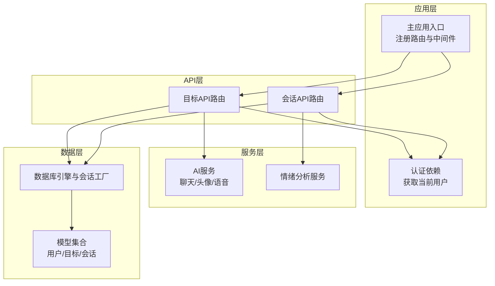
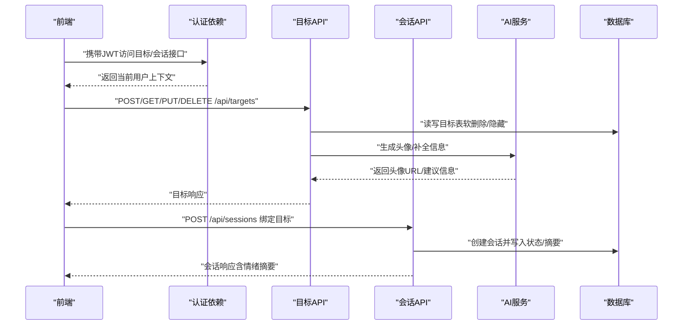
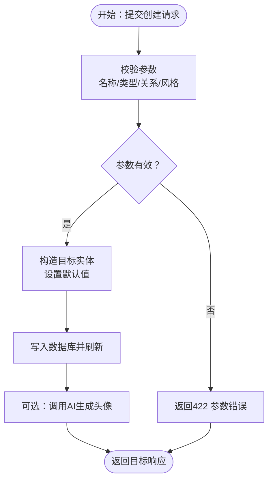
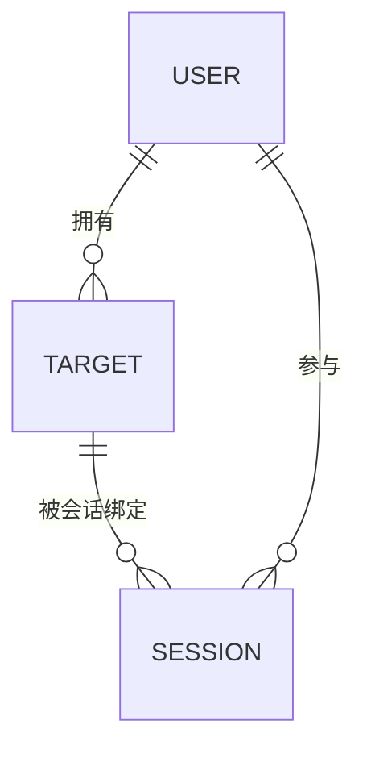
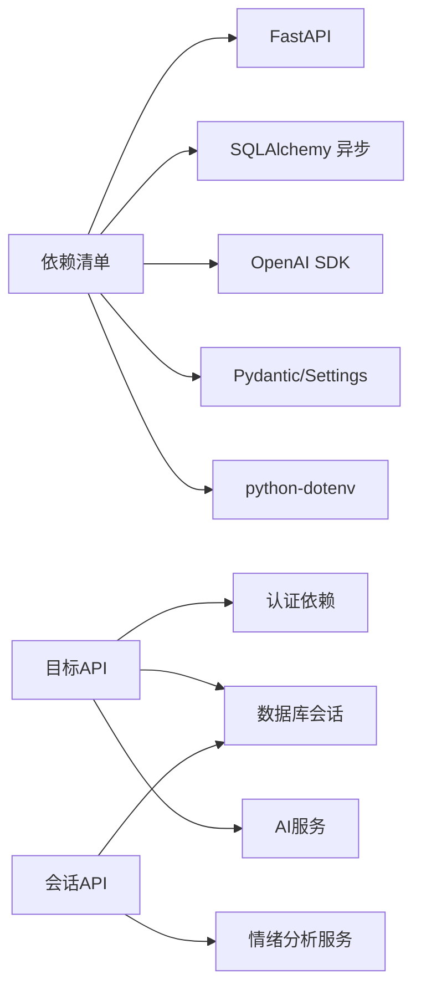

# 目标管理系统

<cite>
**本文引用的文件**
- [目标模型](file://emo_outlet_api/app/models/target.py)
- [目标Schema](file://emo_outlet_api/app/schemas/target.py)
- [目标API路由](file://emo_outlet_api/app/api/targets.py)
- [会话模型](file://emo_outlet_api/app/models/session.py)
- [会话Schema](file://emo_outlet_api/app/schemas/session.py)
- [会话API路由](file://emo_outlet_api/app/api/sessions.py)
- [数据库连接与会话](file://emo_outlet_api/app/database.py)
- [应用配置](file://emo_outlet_api/app/config.py)
- [依赖注入与认证](file://emo_outlet_api/app/core/dependencies.py)
- [主应用入口](file://emo_outlet_api/app/main.py)
- [敏感词过滤工具](file://emo_outlet_api/app/utils/sensitive_filter.py)
- [AI服务与图像生成](file://emo_outlet_api/app/services/ai_service.py)
- [情绪分析服务](file://emo_outlet_api/app/services/emotion_service.py)
- [依赖清单](file://emo_outlet_api/requirements.txt)
</cite>

## 目录
1. [简介](#简介)
2. [项目结构](#项目结构)
3. [核心组件](#核心组件)
4. [架构总览](#架构总览)
5. [详细组件分析](#详细组件分析)
6. [依赖分析](#依赖分析)
7. [性能考虑](#性能考虑)
8. [故障排查指南](#故障排查指南)
9. [结论](#结论)
10. [附录](#附录)

## 简介
本文件面向Emo Outlet的目标管理系统，围绕“虚拟目标”的概念与实现，系统化梳理目标类型、个性化设置、外观定制、创建/编辑/删除/归档流程、与会话的关联关系，以及完整的CRUD API规范。同时补充目标模板建议、批量操作与导入导出的扩展思路，帮助开发者与产品人员快速理解与落地。

## 项目结构
后端采用FastAPI + SQLAlchemy异步ORM，数据库初始化在应用生命周期内完成；目标与会话通过外键关联，支持软删除与隐藏策略；AI服务负责目标头像生成与会话中的智能回复；情绪分析服务提供会话后的综合情绪洞察。

图表来源
- [主应用入口:14-82](file://emo_outlet_api/app/main.py#L14-L82)
- [目标API路由:23-213](file://emo_outlet_api/app/api/targets.py#L23-L213)
- [会话API路由:26-220](file://emo_outlet_api/app/api/sessions.py#L26-L220)
- [数据库连接与会话:10-43](file://emo_outlet_api/app/database.py#L10-L43)
- [AI服务与图像生成:62-354](file://emo_outlet_api/app/services/ai_service.py#L62-L354)
- [情绪分析服务:44-181](file://emo_outlet_api/app/services/emotion_service.py#L44-L181)

章节来源
- [主应用入口:14-82](file://emo_outlet_api/app/main.py#L14-L82)
- [数据库连接与会话:10-43](file://emo_outlet_api/app/database.py#L10-L43)

## 核心组件
- 目标模型与Schema：定义目标的字段、默认值、校验规则与序列化映射，支撑创建、更新、查询与AI补全。
- 会话模型与Schema：定义会话的模式、风格、方言、时长、状态与情绪摘要，支撑目标绑定与历史记录管理。
- API路由：提供目标与会话的REST接口，含鉴权依赖、分页、限流与软删除。
- 服务层：AI服务负责头像生成与智能回复；情绪分析服务对消息进行情感打分与关键词提取。
- 配置与依赖：统一配置LLM/TTS/ASR/OSS等外部能力；依赖注入确保用户上下文与每日会话配额控制。

章节来源
- [目标模型:13-56](file://emo_outlet_api/app/models/target.py#L13-L56)
- [目标Schema:9-63](file://emo_outlet_api/app/schemas/target.py#L9-L63)
- [会话模型:13-79](file://emo_outlet_api/app/models/session.py#L13-L79)
- [会话Schema:8-49](file://emo_outlet_api/app/schemas/session.py#L8-L49)
- [目标API路由:26-213](file://emo_outlet_api/app/api/targets.py#L26-L213)
- [会话API路由:50-220](file://emo_outlet_api/app/api/sessions.py#L50-L220)
- [AI服务与图像生成:62-354](file://emo_outlet_api/app/services/ai_service.py#L62-L354)
- [情绪分析服务:44-181](file://emo_outlet_api/app/services/emotion_service.py#L44-L181)
- [应用配置:12-125](file://emo_outlet_api/app/config.py#L12-L125)
- [依赖注入与认证:18-67](file://emo_outlet_api/app/core/dependencies.py#L18-L67)

## 架构总览
目标与会话的交互链路如下：前端发起目标操作，经认证依赖获取当前用户；目标API执行CRUD与AI补全/头像生成；会话API绑定目标并生成情绪摘要；数据库持久化与事务管理由SQLAlchemy异步会话负责。

图表来源
- [依赖注入与认证:18-67](file://emo_outlet_api/app/core/dependencies.py#L18-L67)
- [目标API路由:47-182](file://emo_outlet_api/app/api/targets.py#L47-L182)
- [会话API路由:50-220](file://emo_outlet_api/app/api/sessions.py#L50-L220)
- [AI服务与图像生成:288-324](file://emo_outlet_api/app/services/ai_service.py#L288-L324)
- [数据库连接与会话:22-32](file://emo_outlet_api/app/database.py#L22-L32)

## 详细组件分析

### 虚拟目标概念与作用机制
- 目标类型：支持预设类型（如boss、spouse、colleague、客户、friend等）与自定义类型，便于AI补全与风格建议。
- 个性化设置：名称、关系、风格（漫画/写实/Q版）、外貌与性格描述，支持AI自动补全。
- 外观定制：通过AI生成头像（SVG数据URL），支持按外貌、性格与风格生成唯一主题色板与首字母标识。
- 软删除与隐藏：目标支持软删除与隐藏，不影响会话绑定，便于用户管理与恢复。

章节来源
- [目标模型:16-42](file://emo_outlet_api/app/models/target.py#L16-L42)
- [目标Schema:9-28](file://emo_outlet_api/app/schemas/target.py#L9-L28)
- [目标API路由:47-182](file://emo_outlet_api/app/api/targets.py#L47-L182)
- [AI服务与图像生成:288-324](file://emo_outlet_api/app/services/ai_service.py#L288-L324)

### 目标创建流程
- 输入参数：名称必填，类型默认自定义，关系与风格默认为空或指定值；外貌与性格可选。
- 初始参数配置：名称长度限制、关系长度限制、风格默认值。
- 保存机制：创建后刷新实体并返回标准化响应；AI补全接口根据关系关键字映射推荐类型、外貌、性格与风格。

图表来源
- [目标Schema:9-16](file://emo_outlet_api/app/schemas/target.py#L9-L16)
- [目标API路由:47-66](file://emo_outlet_api/app/api/targets.py#L47-L66)
- [AI服务与图像生成:288-324](file://emo_outlet_api/app/services/ai_service.py#L288-L324)

章节来源
- [目标Schema:9-16](file://emo_outlet_api/app/schemas/target.py#L9-L16)
- [目标API路由:47-66](file://emo_outlet_api/app/api/targets.py#L47-L66)

### 目标编辑功能
- 属性修改：支持名称、类型、外貌、性格、关系、风格与隐藏状态的增量更新。
- 外观调整：重新生成头像，基于当前外貌、性格与风格计算种子，生成一致的主题色与SVG数据URL。
- 行为配置：当前未提供额外行为开关，可通过扩展Schema与API实现。
- 状态管理：软删除与隐藏组合使用，隐藏用于“归档”效果，软删除用于彻底移除。

章节来源
- [目标Schema:19-28](file://emo_outlet_api/app/schemas/target.py#L19-L28)
- [目标API路由:92-128](file://emo_outlet_api/app/api/targets.py#L92-L128)
- [AI服务与图像生成:288-324](file://emo_outlet_api/app/services/ai_service.py#L288-L324)

### 目标删除与归档机制
- 删除策略：采用软删除（is_deleted标记），保留关联会话与历史记录，便于审计与恢复。
- 归档策略：通过is_hidden实现“隐藏即归档”，配合列表接口include_hidden参数控制展示。
- 权限控制：所有目标操作均需通过认证依赖校验当前用户与令牌有效性。

章节来源
- [目标模型:41-42](file://emo_outlet_api/app/models/target.py#L41-L42)
- [目标API路由:131-150](file://emo_outlet_api/app/api/targets.py#L131-L150)
- [依赖注入与认证:18-50](file://emo_outlet_api/app/core/dependencies.py#L18-L50)

### 目标与会话的关联关系
- 目标选择：创建会话时必须提供目标ID，且目标属于当前用户且未软删除。
- 会话绑定：会话模型包含target_id外键，查询响应中直接携带目标名称与头像URL。
- 历史记录管理：会话完成后写入情绪摘要与总结文案，供后续查看与分析。

图表来源
- [会话模型:22-24](file://emo_outlet_api/app/models/session.py#L22-L24)
- [目标模型:19-21](file://emo_outlet_api/app/models/target.py#L19-L21)
- [会话API路由:56-65](file://emo_outlet_api/app/api/sessions.py#L56-L65)

章节来源
- [会话模型:13-79](file://emo_outlet_api/app/models/session.py#L13-L79)
- [会话Schema:16-33](file://emo_outlet_api/app/schemas/session.py#L16-L33)
- [会话API路由:50-99](file://emo_outlet_api/app/api/sessions.py#L50-L99)

### CRUD操作API文档

- 获取目标列表
  - 方法与路径：GET /api/targets
  - 查询参数：include_hidden（布尔，默认false）
  - 认证：必需
  - 响应：目标数组（TargetResponse）

- 创建目标
  - 方法与路径：POST /api/targets
  - 请求体：TargetCreateRequest
  - 认证：必需
  - 响应：TargetResponse（201 Created）

- 获取目标详情
  - 方法与路径：GET /api/targets/{target_id}
  - 认证：必需
  - 响应：TargetResponse

- 更新目标
  - 方法与路径：PUT /api/targets/{target_id}
  - 请求体：TargetUpdateRequest（可选字段）
  - 认证：必需
  - 响应：TargetResponse

- 删除目标
  - 方法与路径：DELETE /api/targets/{target_id}
  - 认证：必需
  - 响应：{"message": "对象已删除"}

- 生成目标头像
  - 方法与路径：POST /api/targets/{target_id}/generate-avatar
  - 认证：必需
  - 响应：TargetResponse（包含avatar_url）

- AI补全目标信息
  - 方法与路径：POST /api/targets/ai-complete
  - 请求体：TargetAiCompleteRequest
  - 响应：TargetAiCompleteResponse（appearance/personality/style）

章节来源
- [目标API路由:26-213](file://emo_outlet_api/app/api/targets.py#L26-L213)
- [目标Schema:9-63](file://emo_outlet_api/app/schemas/target.py#L9-L63)

### 会话相关API（与目标关联）
- 创建会话
  - 方法与路径：POST /api/sessions
  - 请求体：SessionCreateRequest（包含target_id）
  - 认证：必需
  - 限流：每日会话次数按用户年龄组限制
  - 响应：SessionResponse（含目标名称与头像）

- 结束会话并生成摘要
  - 方法与路径：POST /api/sessions/{session_id}/end
  - 请求体：SessionEndRequest（force可选）
  - 认证：必需
  - 响应：SessionSummaryResponse（包含情绪分析结果）

- 查询历史会话
  - 方法与路径：GET /api/sessions
  - 查询参数：page/page_size
  - 认证：必需
  - 响应：会话数组（SessionResponse）

- 查询进行中的会话
  - 方法与路径：GET /api/sessions/active
  - 认证：必需
  - 响应：SessionResponse 或 null

章节来源
- [会话API路由:50-220](file://emo_outlet_api/app/api/sessions.py#L50-L220)
- [会话Schema:8-49](file://emo_outlet_api/app/schemas/session.py#L8-L49)
- [依赖注入与认证:53-67](file://emo_outlet_api/app/core/dependencies.py#L53-L67)
- [应用配置:97-107](file://emo_outlet_api/app/config.py#L97-L107)

### 目标模板系统、批量操作与导入导出（扩展建议）
- 目标模板：可在目标Schema中新增模板标志字段与模板ID，API层提供模板列表与应用接口。
- 批量操作：提供批量创建/更新/删除接口，结合任务队列与幂等ID，避免重复。
- 导入导出：导出为JSON/CSV，包含目标元数据与历史会话摘要；导入时进行字段校验与冲突处理。
- 注意：以上为扩展设计建议，当前仓库未实现相应接口与模型变更。

## 依赖分析
- 外部依赖：FastAPI、SQLAlchemy异步、OpenAI SDK、Pydantic/Settings、dotenv等。
- 内部耦合：API路由依赖认证依赖与数据库会话；目标API依赖AI服务；会话API依赖情绪分析服务与数据库。
- 循环依赖：未发现循环导入；各模块职责清晰（模型/Schema/API/Service/Config）。

图表来源
- [依赖清单:4-29](file://emo_outlet_api/requirements.txt#L4-L29)
- [目标API路由:10-21](file://emo_outlet_api/app/api/targets.py#L10-L21)
- [会话API路由:10-24](file://emo_outlet_api/app/api/sessions.py#L10-L24)

章节来源
- [依赖清单:1-29](file://emo_outlet_api/requirements.txt#L1-L29)
- [主应用入口:51-64](file://emo_outlet_api/app/main.py#L51-L64)

## 性能考虑
- 数据库：使用异步会话与selectin加载目标/会话关联，减少N+1查询；索引建议：user_id、target_id、is_deleted、updated_at。
- AI服务：本地降级与内容合规审计，避免外部依赖失败影响主流程；头像生成为纯计算，复杂度低。
- 会话限流：按年龄组限制每日会话次数，防止滥用；超限时返回429。
- 文本处理：情绪分析与敏感词过滤均为O(n)算法，适合高频调用。

## 故障排查指南
- 认证失败：检查JWT是否携带、是否过期、用户是否存在且未封禁。
- 目标不存在：确认target_id归属当前用户且未软删除。
- 会话超限：检查用户当日会话次数与年龄组阈值。
- AI生成异常：确认LLM提供商配置、API Key与Base URL；服务将自动降级至本地回复。
- 数据库连接：确认DATABASE_URL或SQLite路径正确，应用启动时会自动创建表。

章节来源
- [依赖注入与认证:18-67](file://emo_outlet_api/app/core/dependencies.py#L18-L67)
- [会话API路由:67-78](file://emo_outlet_api/app/api/sessions.py#L67-L78)
- [AI服务与图像生成:67-96](file://emo_outlet_api/app/services/ai_service.py#L67-L96)
- [数据库连接与会话:34-43](file://emo_outlet_api/app/database.py#L34-L43)

## 结论
目标管理系统以“虚拟目标”为核心，结合AI生成与情绪分析，形成从创建、编辑、归档到与会话绑定的完整闭环。当前实现具备良好的扩展性，建议后续引入目标模板、批量操作与导入导出能力，进一步提升用户体验与运营效率。

## 附录
- 常用接口速查
  - GET /api/targets?include_hidden=true
  - POST /api/targets
  - GET /api/targets/{target_id}
  - PUT /api/targets/{target_id}
  - DELETE /api/targets/{target_id}
  - POST /api/targets/{target_id}/generate-avatar
  - POST /api/targets/ai-complete
  - POST /api/sessions
  - POST /api/sessions/{session_id}/end
  - GET /api/sessions
  - GET /api/sessions/active