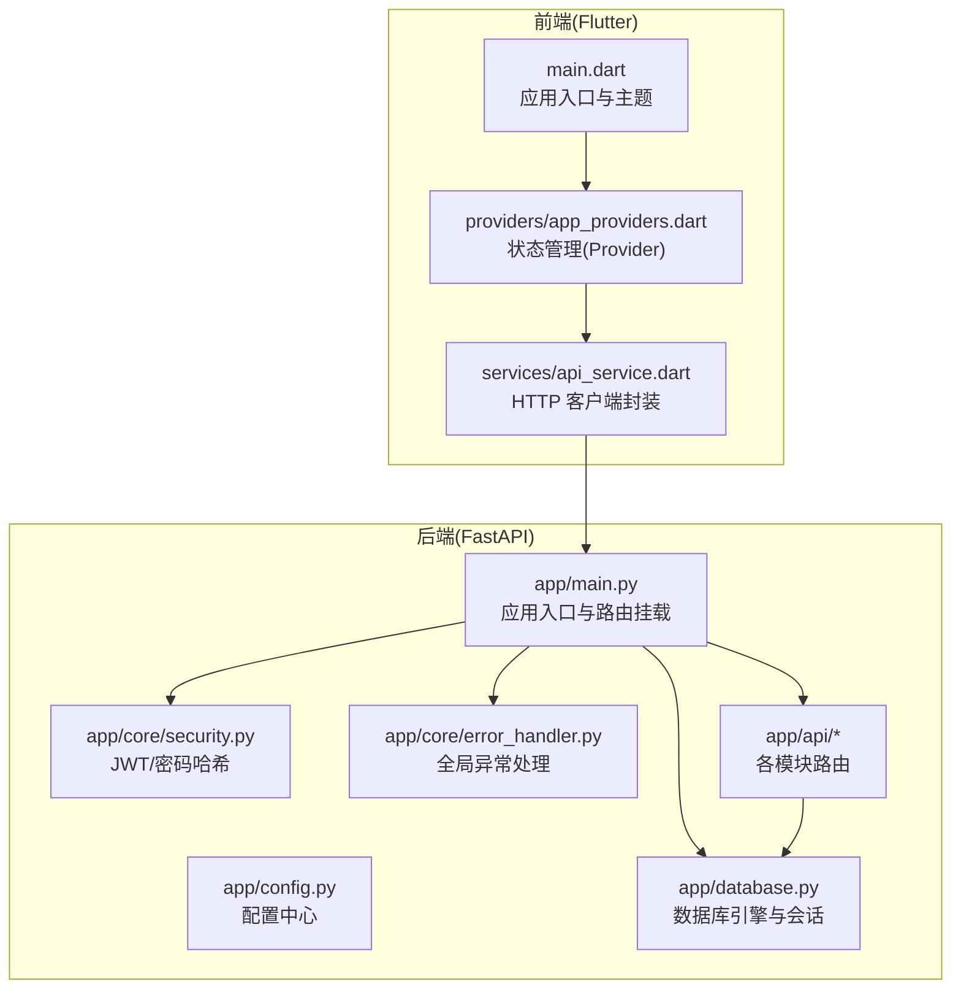
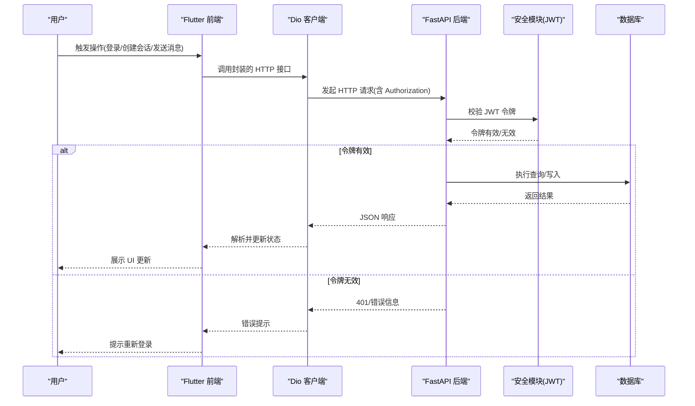
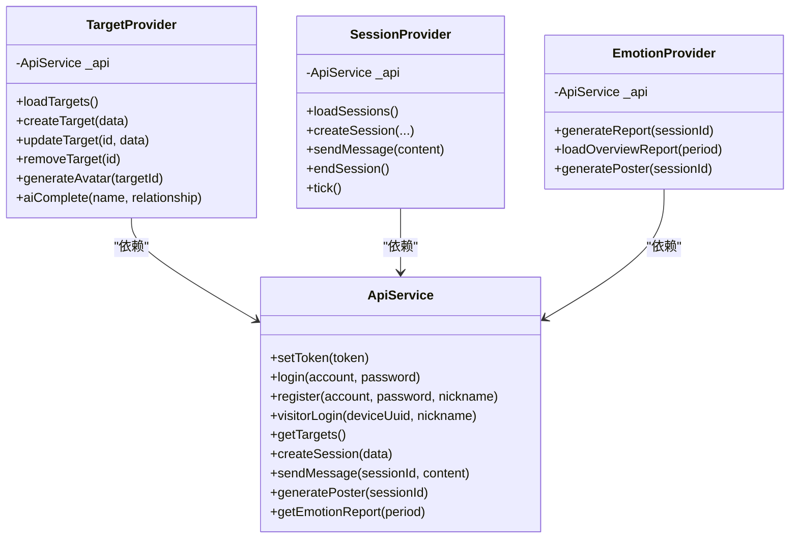
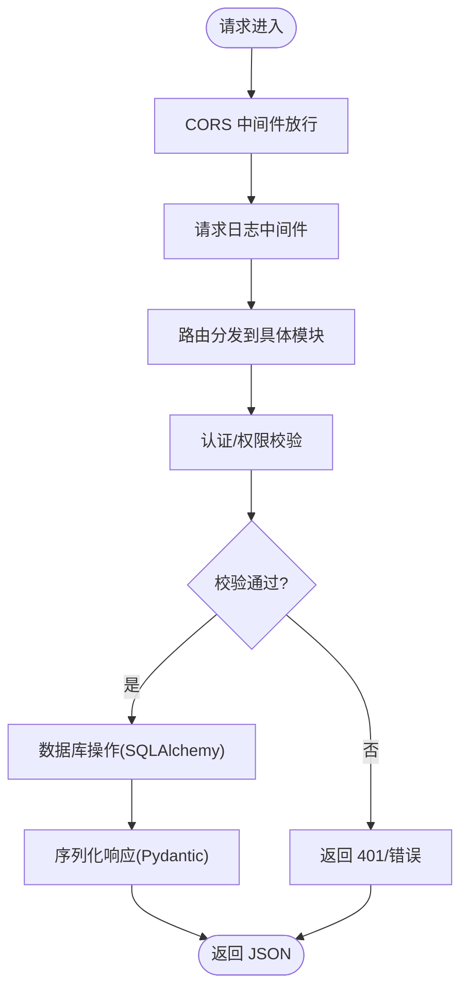
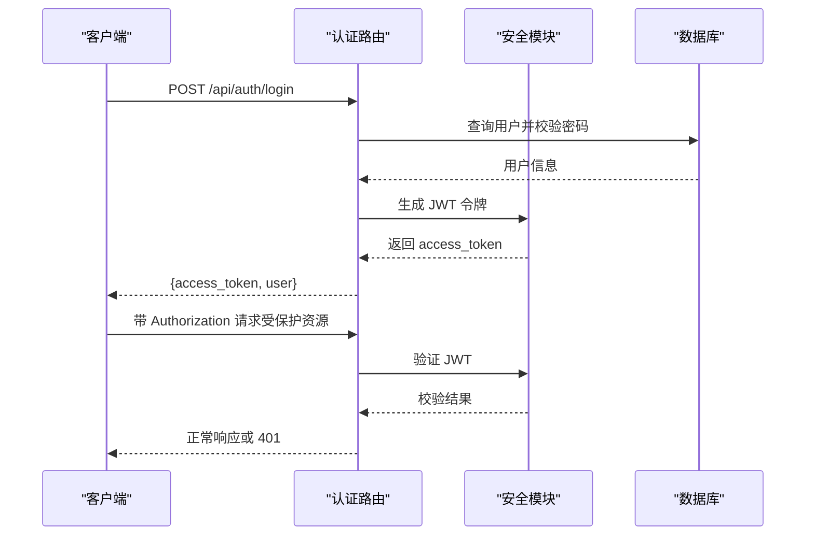
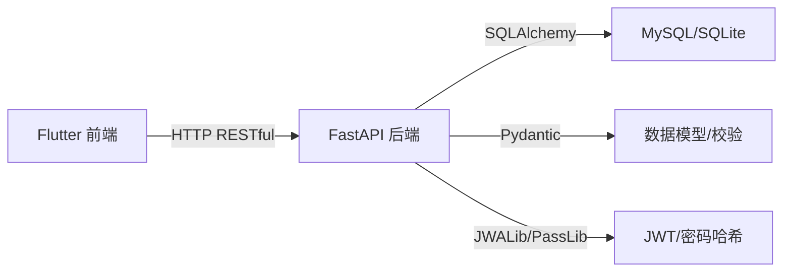

# 前后端分离架构

<cite>
**本文引用的文件**
- [emo_outlet_api/app/main.py](file://emo_outlet_api/app/main.py)
- [emo_outlet_api/app/config.py](file://emo_outlet_api/app/config.py)
- [emo_outlet_api/app/core/security.py](file://emo_outlet_api/app/core/security.py)
- [emo_outlet_api/app/core/error_handler.py](file://emo_outlet_api/app/core/error_handler.py)
- [emo_outlet_api/app/database.py](file://emo_outlet_api/app/database.py)
- [emo_outlet_api/app/api/auth.py](file://emo_outlet_api/app/api/auth.py)
- [emo_outlet_api/app/models/user.py](file://emo_outlet_api/app/models/user.py)
- [emo_outlet_api/app/schemas/user.py](file://emo_outlet_api/app/schemas/user.py)
- [emo_outlet_app/lib/main.dart](file://emo_outlet_app/lib/main.dart)
- [emo_outlet_app/lib/providers/app_providers.dart](file://emo_outlet_app/lib/providers/app_providers.dart)
- [emo_outlet_app/lib/services/api_service.dart](file://emo_outlet_app/lib/services/api_service.dart)
- [emo_outlet_app/pubspec.yaml](file://emo_outlet_app/pubspec.yaml)
- [README.md](file://README.md)
</cite>

## 目录
1. [简介](#简介)
2. [项目结构](#项目结构)
3. [核心组件](#核心组件)
4. [架构总览](#架构总览)
5. [详细组件分析](#详细组件分析)
6. [依赖分析](#依赖分析)
7. [性能考虑](#性能考虑)
8. [故障排查指南](#故障排查指南)
9. [结论](#结论)
10. [附录](#附录)

## 简介
本文件面向 Emo Outlet 项目，系统性阐述前后端分离架构的设计理念与技术实现，覆盖：
- 前端 Flutter 应用与后端 FastAPI 服务的职责边界与协作方式
- HTTP RESTful API 设计与数据传输格式
- 认证授权流程与安全策略
- 前端状态管理（Provider 模式）、路由与组件化开发
- 后端路由组织、中间件与异常处理机制
- 跨域处理策略与最佳实践

## 项目结构
Emo Outlet 采用典型的前后端分离架构：
- 前端：Flutter 应用，负责 UI、交互、状态管理与网络请求封装
- 后端：FastAPI 应用，提供 RESTful API、数据库访问、业务逻辑与安全控制
- 数据库：MySQL/SQLite（异步 SQLAlchemy）
- 配置：环境变量与 Pydantic Settings 统一管理

图表来源
- [emo_outlet_app/lib/main.dart:1-97](file://emo_outlet_app/lib/main.dart#L1-L97)
- [emo_outlet_app/lib/providers/app_providers.dart:1-416](file://emo_outlet_app/lib/providers/app_providers.dart#L1-L416)
- [emo_outlet_app/lib/services/api_service.dart:1-381](file://emo_outlet_app/lib/services/api_service.dart#L1-L381)
- [emo_outlet_api/app/main.py:1-82](file://emo_outlet_api/app/main.py#L1-L82)
- [emo_outlet_api/app/config.py:1-125](file://emo_outlet_api/app/config.py#L1-L125)
- [emo_outlet_api/app/database.py:1-43](file://emo_outlet_api/app/database.py#L1-L43)
- [emo_outlet_api/app/core/security.py:1-43](file://emo_outlet_api/app/core/security.py#L1-L43)
- [emo_outlet_api/app/core/error_handler.py:1-59](file://emo_outlet_api/app/core/error_handler.py#L1-L59)

章节来源
- [README.md:58-84](file://README.md#L58-L84)
- [emo_outlet_app/pubspec.yaml:1-52](file://emo_outlet_app/pubspec.yaml#L1-L52)

## 核心组件
- 前端应用入口与主题：初始化 Provider、MaterialApp 主题与导航入口
- 状态管理 Provider：封装目标、会话、消息、情绪报告等业务状态与数据流
- API 客户端：统一的 Dio 实例，自动注入 Authorization 头，封装全部 RESTful 接口
- 后端应用入口：注册中间件、异常处理器、挂载各模块路由
- 安全模块：JWT 令牌签发/校验、密码哈希
- 数据库：异步 SQLAlchemy 引擎与会话工厂
- 异常处理：统一返回格式，区分 HTTP、校验与未知错误

章节来源
- [emo_outlet_app/lib/main.dart:8-96](file://emo_outlet_app/lib/main.dart#L8-L96)
- [emo_outlet_app/lib/providers/app_providers.dart:1-416](file://emo_outlet_app/lib/providers/app_providers.dart#L1-L416)
- [emo_outlet_app/lib/services/api_service.dart:1-381](file://emo_outlet_app/lib/services/api_service.dart#L1-L381)
- [emo_outlet_api/app/main.py:23-82](file://emo_outlet_api/app/main.py#L23-L82)
- [emo_outlet_api/app/core/security.py:16-43](file://emo_outlet_api/app/core/security.py#L16-L43)
- [emo_outlet_api/app/database.py:10-43](file://emo_outlet_api/app/database.py#L10-L43)
- [emo_outlet_api/app/core/error_handler.py:10-59](file://emo_outlet_api/app/core/error_handler.py#L10-L59)

## 架构总览
前后端通过 HTTP RESTful API 通信，前端通过 Provider 管理状态，后端通过模块化路由组织业务能力，并以中间件与异常处理器保障稳定性与一致性。

图表来源
- [emo_outlet_app/lib/services/api_service.dart:22-32](file://emo_outlet_app/lib/services/api_service.dart#L22-L32)
- [emo_outlet_api/app/core/security.py:26-43](file://emo_outlet_api/app/core/security.py#L26-L43)
- [emo_outlet_api/app/main.py:33-39](file://emo_outlet_api/app/main.py#L33-L39)

## 详细组件分析

### 前端：状态管理与网络层
- Provider 模式：TargetProvider、SessionProvider、EmotionProvider 封装业务状态与副作用，统一通知 UI 刷新
- 网络层：ApiService 基于 Dio，集中处理超时、JSON 头、鉴权头注入；提供认证、目标、会话、消息、海报、报告等接口方法
- Mock 回退：在网络异常或后端不可用时，使用本地 mock 数据保证可用性

图表来源
- [emo_outlet_app/lib/services/api_service.dart:1-381](file://emo_outlet_app/lib/services/api_service.dart#L1-L381)
- [emo_outlet_app/lib/providers/app_providers.dart:1-416](file://emo_outlet_app/lib/providers/app_providers.dart#L1-L416)

章节来源
- [emo_outlet_app/lib/main.dart:18-24](file://emo_outlet_app/lib/main.dart#L18-L24)
- [emo_outlet_app/lib/providers/app_providers.dart:1-416](file://emo_outlet_app/lib/providers/app_providers.dart#L1-L416)
- [emo_outlet_app/lib/services/api_service.dart:1-381](file://emo_outlet_app/lib/services/api_service.dart#L1-L381)

### 后端：RESTful API 与安全
- 应用入口：注册异常处理器、日志中间件、CORS 中间件；挂载认证、目标、会话、消息、海报、支持等路由
- 认证模块：注册/登录/访客登录/个人信息读取/更新/注销/数据导出；使用 JWT 令牌与 bcrypt 密码哈希
- 数据模型与校验：Pydantic 模型定义请求/响应结构，SQLAlchemy 模型映射数据库表
- 数据库：异步连接，自动建表；会话生命周期内自动提交/回滚

图表来源
- [emo_outlet_api/app/main.py:33-63](file://emo_outlet_api/app/main.py#L33-L63)
- [emo_outlet_api/app/core/security.py:16-43](file://emo_outlet_api/app/core/security.py#L16-L43)
- [emo_outlet_api/app/database.py:22-32](file://emo_outlet_api/app/database.py#L22-L32)

章节来源
- [emo_outlet_api/app/main.py:23-82](file://emo_outlet_api/app/main.py#L23-L82)
- [emo_outlet_api/app/api/auth.py:33-332](file://emo_outlet_api/app/api/auth.py#L33-L332)
- [emo_outlet_api/app/models/user.py:14-56](file://emo_outlet_api/app/models/user.py#L14-L56)
- [emo_outlet_api/app/schemas/user.py:8-74](file://emo_outlet_api/app/schemas/user.py#L8-L74)
- [emo_outlet_api/app/core/error_handler.py:10-59](file://emo_outlet_api/app/core/error_handler.py#L10-L59)

### 认证与授权流程
- 登录/注册：前端提交账号/密码或设备信息，后端校验并签发 JWT 令牌
- 令牌携带：前端在 Dio 拦截器中自动附加 Authorization: Bearer {token}
- 令牌校验：后端中间件/依赖注入解析并验证 JWT，失败返回 401
- 会话与隐私：支持游客登录与合规信息收集；提供数据导出与注销接口

图表来源
- [emo_outlet_api/app/api/auth.py:78-94](file://emo_outlet_api/app/api/auth.py#L78-L94)
- [emo_outlet_api/app/core/security.py:26-43](file://emo_outlet_api/app/core/security.py#L26-L43)
- [emo_outlet_app/lib/services/api_service.dart:22-32](file://emo_outlet_app/lib/services/api_service.dart#L22-L32)

章节来源
- [emo_outlet_api/app/api/auth.py:33-332](file://emo_outlet_api/app/api/auth.py#L33-L332)
- [emo_outlet_api/app/core/security.py:16-43](file://emo_outlet_api/app/core/security.py#L16-L43)
- [emo_outlet_app/lib/services/api_service.dart:36-117](file://emo_outlet_app/lib/services/api_service.dart#L36-L117)

### 数据传输格式与接口约定
- Content-Type：application/json
- 成功响应：按 Pydantic 模型序列化，遵循后端定义的数据结构
- 错误响应：统一格式，包含错误代码与详情；HTTP 异常与参数校验异常分别处理
- 前端对接：ApiService 统一封装，自动处理 Authorization 头与响应解析

章节来源
- [emo_outlet_app/lib/services/api_service.dart:13-32](file://emo_outlet_app/lib/services/api_service.dart#L13-L32)
- [emo_outlet_api/app/core/error_handler.py:10-59](file://emo_outlet_api/app/core/error_handler.py#L10-L59)

### 跨域处理策略
- CORS 中间件允许任意来源、凭证、方法与头，便于开发调试
- 生产部署建议限定允许来源、方法与头，避免过度放行

章节来源
- [emo_outlet_api/app/main.py:42-48](file://emo_outlet_api/app/main.py#L42-L48)

### WebSocket 实时通信机制
- 当前实现：未发现 WebSocket 相关路由或客户端集成
- 建议：若需实时聊天/状态推送，可在后端引入 WebSocket 路由并在前端使用对应通道；当前项目以 HTTP 轮询/一次性响应为主

章节来源
- [emo_outlet_api/app/main.py:51-63](file://emo_outlet_api/app/main.py#L51-L63)

## 依赖分析
- 前端依赖：Flutter、Provider、go_router、dio、shared_preferences 等
- 后端依赖：FastAPI、SQLAlchemy、Pydantic、JWALib、PassLib 等
- 耦合与内聚：前端通过 ApiService 与后端解耦；后端按模块路由组织，依赖注入清晰

图表来源
- [emo_outlet_app/pubspec.yaml:9-41](file://emo_outlet_app/pubspec.yaml#L9-L41)
- [emo_outlet_api/app/database.py:10-15](file://emo_outlet_api/app/database.py#L10-L15)
- [emo_outlet_api/app/core/security.py:7-23](file://emo_outlet_api/app/core/security.py#L7-L23)

章节来源
- [emo_outlet_app/pubspec.yaml:1-52](file://emo_outlet_app/pubspec.yaml#L1-L52)
- [emo_outlet_api/app/config.py:1-125](file://emo_outlet_api/app/config.py#L1-L125)

## 性能考虑
- 前端
  - Provider 粒度：按屏幕/领域拆分 Provider，避免全局频繁刷新
  - 网络层：合理设置超时、重试与缓存策略；对高频接口做去抖/节流
- 后端
  - 异步 I/O：使用异步 SQLAlchemy，减少阻塞
  - 连接池：合理配置连接数与超时
  - 日志与监控：中间件记录耗时，结合指标系统定位瓶颈

## 故障排查指南
- 401 未授权
  - 检查前端是否正确设置 Authorization 头
  - 核对后端 JWT 密钥、算法与过期时间
- 参数校验失败
  - 查看 422 响应中的字段与错误描述，修正请求体
- 服务器内部错误
  - 查看统一 500 错误响应与后端日志
- CORS 问题
  - 确认后端 CORS 配置与前端请求头一致

章节来源
- [emo_outlet_app/lib/services/api_service.dart:22-32](file://emo_outlet_app/lib/services/api_service.dart#L22-L32)
- [emo_outlet_api/app/core/error_handler.py:10-59](file://emo_outlet_api/app/core/error_handler.py#L10-L59)
- [emo_outlet_api/app/main.py:42-48](file://emo_outlet_api/app/main.py#L42-L48)

## 结论
Emo Outlet 采用清晰的前后端分离架构：前端以 Provider 管理状态、以 ApiService 统一网络访问；后端以模块化路由组织业务、以中间件与异常处理器保障稳定性。当前以 HTTP RESTful 为主，具备良好的扩展性；后续可根据需要引入 WebSocket 实时通信与更细粒度的安全策略。

## 附录
- 快速开始与接口概览参见项目自述文件
- 前端依赖与后端依赖清单参见各自配置文件

章节来源
- [README.md:32-104](file://README.md#L32-L104)
- [emo_outlet_app/pubspec.yaml:9-41](file://emo_outlet_app/pubspec.yaml#L9-L41)
- [emo_outlet_api/app/config.py:1-125](file://emo_outlet_api/app/config.py#L1-L125)