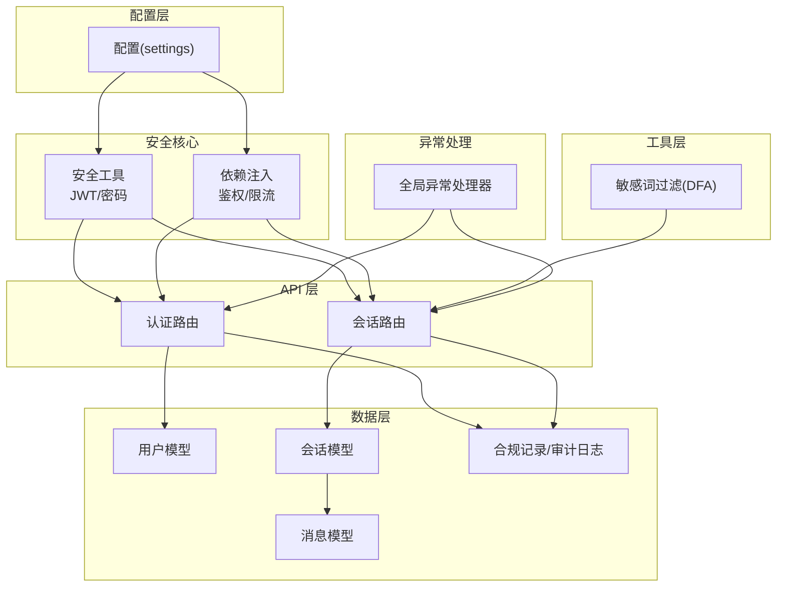
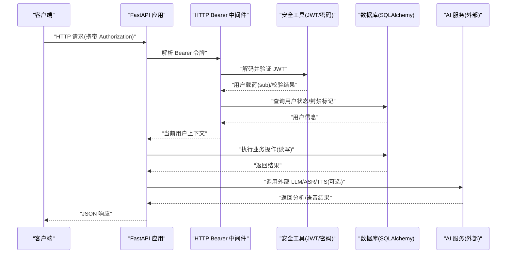
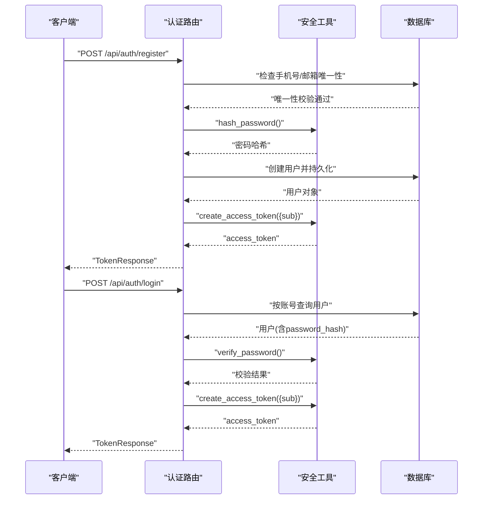
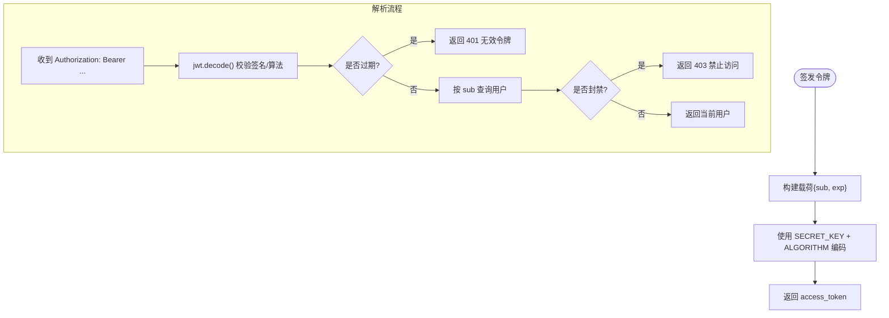
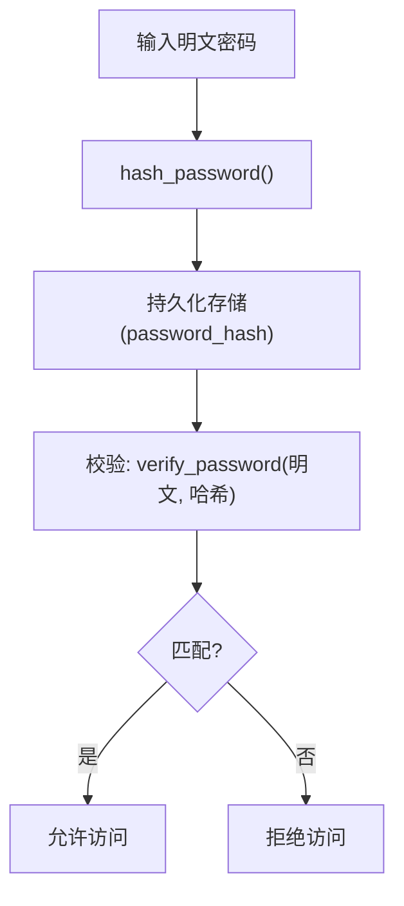
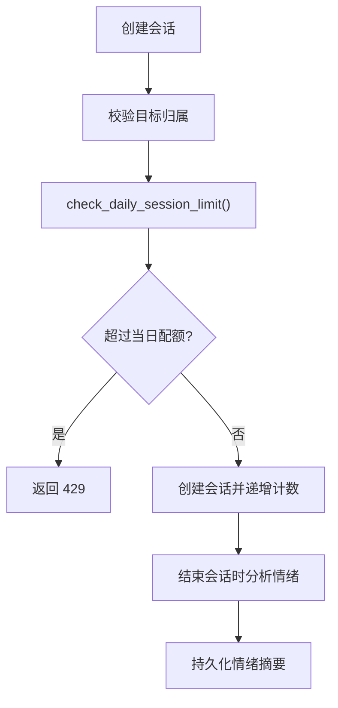
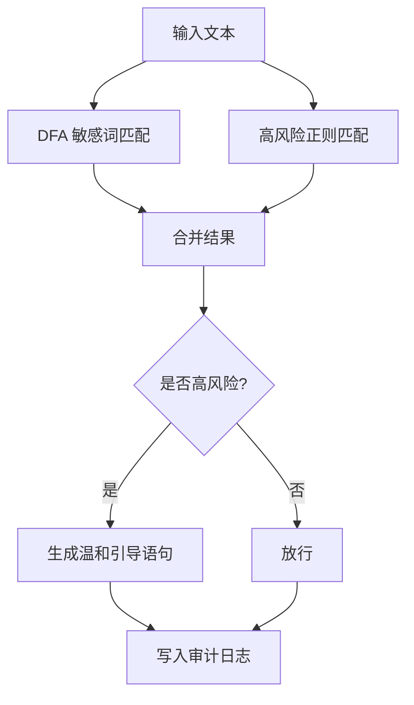
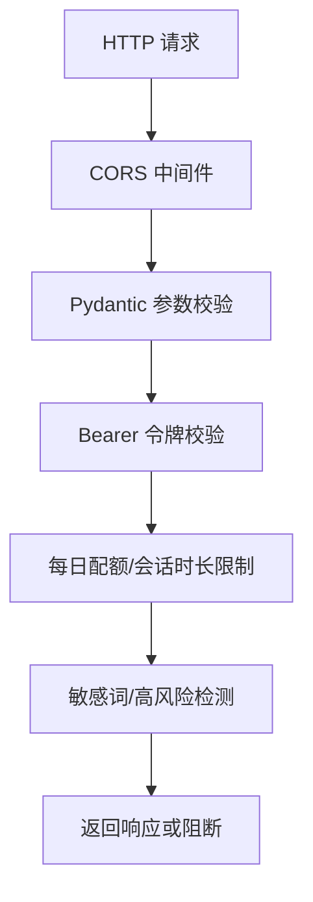
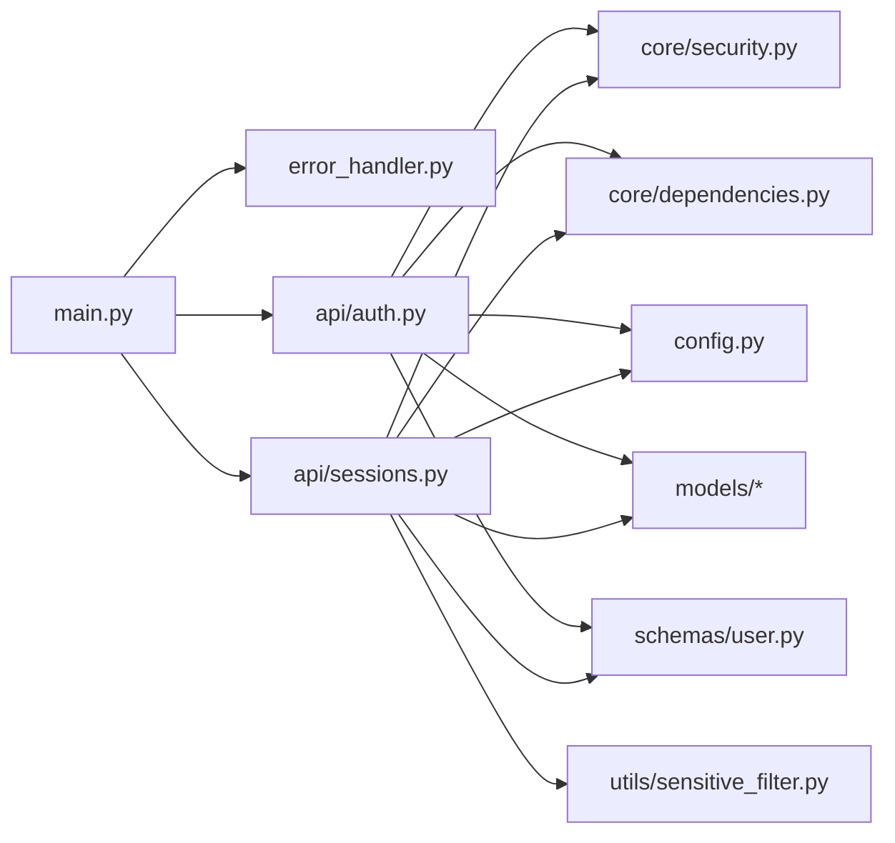

# 安全架构设计

<cite>
**本文引用的文件**
- [emo_outlet_api/app/core/security.py](file://emo_outlet_api/app/core/security.py)
- [emo_outlet_api/app/core/dependencies.py](file://emo_outlet_api/app/core/dependencies.py)
- [emo_outlet_api/app/core/error_handler.py](file://emo_outlet_api/app/core/error_handler.py)
- [emo_outlet_api/app/api/auth.py](file://emo_outlet_api/app/api/auth.py)
- [emo_outlet_api/app/api/sessions.py](file://emo_outlet_api/app/api/sessions.py)
- [emo_outlet_api/app/utils/sensitive_filter.py](file://emo_outlet_api/app/utils/sensitive_filter.py)
- [emo_outlet_api/app/models/compliance.py](file://emo_outlet_api/app/models/compliance.py)
- [emo_outlet_api/app/models/user.py](file://emo_outlet_api/app/models/user.py)
- [emo_outlet_api/app/models/session.py](file://emo_outlet_api/app/models/session.py)
- [emo_outlet_api/app/models/message.py](file://emo_outlet_api/app/models/message.py)
- [emo_outlet_api/app/schemas/user.py](file://emo_outlet_api/app/schemas/user.py)
- [emo_outlet_api/app/config.py](file://emo_outlet_api/app/config.py)
- [emo_outlet_api/app/main.py](file://emo_outlet_api/app/main.py)
</cite>

## 目录
1. [引言](#引言)
2. [项目结构](#项目结构)
3. [核心组件](#核心组件)
4. [架构总览](#架构总览)
5. [详细组件分析](#详细组件分析)
6. [依赖分析](#依赖分析)
7. [性能考虑](#性能考虑)
8. [故障排除指南](#故障排除指南)
9. [结论](#结论)
10. [附录](#附录)

## 引言
本文件为 Emo Outlet 项目的安全架构设计文档，聚焦后端 API 的安全防护体系，覆盖身份认证与授权、数据加密与存储、访问控制、API 安全防护、敏感数据处理与隐私合规、安全审计与日志、异常处理机制，以及第三方集成与数据传输安全。文档面向技术与非技术读者，既提供高层概览也包含代码级细节与可视化图示。

## 项目结构
后端采用 FastAPI + SQLAlchemy 异步 ORM 架构，安全相关能力分布于以下层次：
- 配置层：集中管理密钥、算法、令牌有效期、合规阈值与审计开关
- 安全核心：JWT 令牌生成与解析、密码哈希与校验
- 依赖注入：统一鉴权中间件与当前用户解析
- API 层：认证、会话、消息、海报、支持与目标等业务接口
- 数据模型：用户、会话、消息、合规记录与审计日志
- 工具模块：敏感词过滤（DFA + 正则）
- 异常处理：统一错误响应与参数校验处理

图表来源
- [emo_outlet_api/app/config.py:12-121](file://emo_outlet_api/app/config.py#L12-L121)
- [emo_outlet_api/app/core/security.py:16-42](file://emo_outlet_api/app/core/security.py#L16-L42)
- [emo_outlet_api/app/core/dependencies.py:18-66](file://emo_outlet_api/app/core/dependencies.py#L18-L66)
- [emo_outlet_api/app/api/auth.py:34-317](file://emo_outlet_api/app/api/auth.py#L34-L317)
- [emo_outlet_api/app/api/sessions.py:50-219](file://emo_outlet_api/app/api/sessions.py#L50-L219)
- [emo_outlet_api/app/utils/sensitive_filter.py:37-141](file://emo_outlet_api/app/utils/sensitive_filter.py#L37-L141)
- [emo_outlet_api/app/models/user.py:12-51](file://emo_outlet_api/app/models/user.py#L12-L51)
- [emo_outlet_api/app/models/session.py:13-79](file://emo_outlet_api/app/models/session.py#L13-L79)
- [emo_outlet_api/app/models/message.py:13-45](file://emo_outlet_api/app/models/message.py#L13-L45)
- [emo_outlet_api/app/models/compliance.py:12-49](file://emo_outlet_api/app/models/compliance.py#L12-L49)
- [emo_outlet_api/app/core/error_handler.py:10-58](file://emo_outlet_api/app/core/error_handler.py#L10-L58)

章节来源
- [emo_outlet_api/app/main.py:23-63](file://emo_outlet_api/app/main.py#L23-L63)
- [emo_outlet_api/app/config.py:12-121](file://emo_outlet_api/app/config.py#L12-L121)

## 核心组件
- JWT 与密码安全
  - 使用 bcrypt 进行密码哈希与校验，确保不可逆存储
  - 使用 HS256 算法签发与验证 JWT，令牌包含过期时间
  - 令牌由 HTTP Bearer 方式传递，接口通过依赖注入解析当前用户
- 统一异常处理
  - 捕获未处理异常、HTTP 异常与请求参数校验异常，返回标准化错误响应
- 敏感词与高风险内容防护
  - 基于 DFA 的 O(n) 敏感词匹配，结合高风险正则模式识别
  - 触发高风险时提供温和引导语句，避免激化情绪
- 合规与审计
  - 用户同意记录与审计日志表，支持关键词匹配、风险等级与处置动作
- 会话与访问控制
  - 按年龄分组的每日会话配额限制，访客与未成年人更严格
  - 用户封禁状态拦截访问，防止违规账户继续使用

章节来源
- [emo_outlet_api/app/core/security.py:16-42](file://emo_outlet_api/app/core/security.py#L16-L42)
- [emo_outlet_api/app/core/dependencies.py:18-66](file://emo_outlet_api/app/core/dependencies.py#L18-L66)
- [emo_outlet_api/app/core/error_handler.py:10-58](file://emo_outlet_api/app/core/error_handler.py#L10-L58)
- [emo_outlet_api/app/utils/sensitive_filter.py:37-141](file://emo_outlet_api/app/utils/sensitive_filter.py#L37-L141)
- [emo_outlet_api/app/models/compliance.py:12-49](file://emo_outlet_api/app/models/compliance.py#L12-L49)
- [emo_outlet_api/app/api/sessions.py:67-78](file://emo_outlet_api/app/api/sessions.py#L67-L78)

## 架构总览
下图展示从客户端到后端服务、数据库与第三方 AI 服务的整体交互与安全控制点。

图表来源
- [emo_outlet_api/app/main.py:33-48](file://emo_outlet_api/app/main.py#L33-L48)
- [emo_outlet_api/app/core/dependencies.py:18-50](file://emo_outlet_api/app/core/dependencies.py#L18-L50)
- [emo_outlet_api/app/core/security.py:26-42](file://emo_outlet_api/app/core/security.py#L26-L42)
- [emo_outlet_api/app/models/user.py:12-51](file://emo_outlet_api/app/models/user.py#L12-L51)

## 详细组件分析

### 身份认证与授权
- 认证流程
  - 注册：手机号/邮箱唯一性校验，密码经 bcrypt 哈希后存储，成功后签发 JWT
  - 登录：根据账号查找用户并校验密码哈希，成功后签发 JWT
  - 游客登录：按设备 UUID 查找或创建访客用户，签发 JWT
  - 获取/更新个人信息：基于当前用户上下文
- 授权与访问控制
  - 所有受保护接口依赖依赖注入解析当前用户，缺失或无效令牌将被拒绝
  - 封禁用户直接返回禁止访问
  - 会话创建前执行每日配额检查，超限返回 429

图表来源
- [emo_outlet_api/app/api/auth.py:34-92](file://emo_outlet_api/app/api/auth.py#L34-L92)
- [emo_outlet_api/app/core/security.py:16-31](file://emo_outlet_api/app/core/security.py#L16-L31)
- [emo_outlet_api/app/models/user.py:12-51](file://emo_outlet_api/app/models/user.py#L12-L51)

章节来源
- [emo_outlet_api/app/api/auth.py:34-231](file://emo_outlet_api/app/api/auth.py#L34-L231)
- [emo_outlet_api/app/core/dependencies.py:18-50](file://emo_outlet_api/app/core/dependencies.py#L18-L50)
- [emo_outlet_api/app/schemas/user.py:8-26](file://emo_outlet_api/app/schemas/user.py#L8-L26)

### JWT 令牌管理
- 令牌签发：包含 sub（用户 ID），设置 UTC 过期时间
- 令牌解析：校验签名与过期时间，提取用户标识
- 令牌传递：HTTP Bearer 头，依赖注入统一解析
- 令牌生命周期：在配置中定义算法与过期分钟数

图表来源
- [emo_outlet_api/app/core/security.py:26-42](file://emo_outlet_api/app/core/security.py#L26-L42)
- [emo_outlet_api/app/core/dependencies.py:18-50](file://emo_outlet_api/app/core/dependencies.py#L18-L50)
- [emo_outlet_api/app/config.py:54-61](file://emo_outlet_api/app/config.py#L54-L61)

章节来源
- [emo_outlet_api/app/core/security.py:26-42](file://emo_outlet_api/app/core/security.py#L26-L42)
- [emo_outlet_api/app/core/dependencies.py:18-50](file://emo_outlet_api/app/core/dependencies.py#L18-L50)
- [emo_outlet_api/app/config.py:54-61](file://emo_outlet_api/app/config.py#L54-L61)

### 密码加密与存储
- 存储策略：仅保存 bcrypt 哈希，永不明文存储
- 校验流程：接收明文 + 存储哈希，使用 verify_password 校验
- 配置要点：算法与哈希上下文在安全模块中初始化

图表来源
- [emo_outlet_api/app/core/security.py:16-23](file://emo_outlet_api/app/core/security.py#L16-L23)
- [emo_outlet_api/app/api/auth.py:49-57](file://emo_outlet_api/app/api/auth.py#L49-L57)

章节来源
- [emo_outlet_api/app/core/security.py:16-23](file://emo_outlet_api/app/core/security.py#L16-L23)
- [emo_outlet_api/app/api/auth.py:49-57](file://emo_outlet_api/app/api/auth.py#L49-L57)

### 会话安全管理与访问控制
- 会话创建前置检查
  - 目标存在性与归属校验
  - 每日配额检查：按访客/未成年人/青少年/成人区分上限
  - 超限时返回 429 Too Many Requests
- 会话完成时触发情绪分析，并将结果持久化
- 当前用户上下文每日重置会话计数，保证配额准确

图表来源
- [emo_outlet_api/app/api/sessions.py:50-99](file://emo_outlet_api/app/api/sessions.py#L50-L99)
- [emo_outlet_api/app/api/sessions.py:156-219](file://emo_outlet_api/app/api/sessions.py#L156-L219)
- [emo_outlet_api/app/core/dependencies.py:53-66](file://emo_outlet_api/app/core/dependencies.py#L53-L66)

章节来源
- [emo_outlet_api/app/api/sessions.py:50-99](file://emo_outlet_api/app/api/sessions.py#L50-L99)
- [emo_outlet_api/app/api/sessions.py:156-219](file://emo_outlet_api/app/api/sessions.py#L156-L219)
- [emo_outlet_api/app/core/dependencies.py:53-66](file://emo_outlet_api/app/core/dependencies.py#L53-L66)

### 敏感数据处理与高风险防护
- 敏感词过滤
  - 基于 DFA 的 Trie 树实现 O(n) 匹配
  - 额外维护高风险正则模式，识别自残、暴力、自杀等高危表达
  - 提供温和引导语句，降低风险表达的负面影响
- 内容审计日志
  - 记录用户、会话、风险等级、匹配关键词、原始内容与处置动作
  - 可配置采样率与开关，便于合规与风控

图表来源
- [emo_outlet_api/app/utils/sensitive_filter.py:37-139](file://emo_outlet_api/app/utils/sensitive_filter.py#L37-L139)
- [emo_outlet_api/app/models/compliance.py:31-49](file://emo_outlet_api/app/models/compliance.py#L31-L49)

章节来源
- [emo_outlet_api/app/utils/sensitive_filter.py:12-141](file://emo_outlet_api/app/utils/sensitive_filter.py#L12-L141)
- [emo_outlet_api/app/models/compliance.py:12-49](file://emo_outlet_api/app/models/compliance.py#L12-L49)

### API 安全防护
- CORS 配置
  - 允许任意源、凭据、方法与头，便于前端调试；生产环境建议收紧
- 请求限制
  - 参数校验：Pydantic 模型约束字段长度、格式与必填
  - 业务限流：每日会话配额与会话时长上限
- 恶意攻击防护
  - 令牌有效性与过期校验
  - 用户封禁拦截
  - 敏感词与高风险内容阻断
  - 统一异常处理，避免泄露内部错误细节

图表来源
- [emo_outlet_api/app/main.py:42-48](file://emo_outlet_api/app/main.py#L42-L48)
- [emo_outlet_api/app/schemas/user.py:8-26](file://emo_outlet_api/app/schemas/user.py#L8-L26)
- [emo_outlet_api/app/api/sessions.py:67-78](file://emo_outlet_api/app/api/sessions.py#L67-L78)
- [emo_outlet_api/app/utils/sensitive_filter.py:102-119](file://emo_outlet_api/app/utils/sensitive_filter.py#L102-L119)

章节来源
- [emo_outlet_api/app/main.py:42-48](file://emo_outlet_api/app/main.py#L42-L48)
- [emo_outlet_api/app/schemas/user.py:8-26](file://emo_outlet_api/app/schemas/user.py#L8-L26)
- [emo_outlet_api/app/api/sessions.py:67-78](file://emo_outlet_api/app/api/sessions.py#L67-L78)

### 隐私保护与合规
- 同意记录
  - 注册时可记录隐私与服务条款同意版本、IP 与 UA
- 数据最小化
  - 仅收集必要信息（昵称、手机号/邮箱二选一、设备 UUID、年龄区间）
- 数据导出
  - 提供用户数据导出接口，包含会话、消息、目标与海报等
- 审计日志
  - 记录敏感内容与处置动作，支持风险等级与关键词追踪

章节来源
- [emo_outlet_api/app/api/auth.py:62-72](file://emo_outlet_api/app/api/auth.py#L62-L72)
- [emo_outlet_api/app/models/compliance.py:12-29](file://emo_outlet_api/app/models/compliance.py#L12-L29)
- [emo_outlet_api/app/api/auth.py:234-317](file://emo_outlet_api/app/api/auth.py#L234-L317)

### 第三方 API 集成与数据传输安全
- 外部 LLM/ASR/TTS
  - 通过配置项选择提供商与密钥，调用前进行参数校验与敏感内容拦截
- 传输安全
  - 建议在生产环境强制 HTTPS，TLS 1.2+，并妥善保管密钥
- 日志与监控
  - 记录调用结果与异常，便于审计与排障

章节来源
- [emo_outlet_api/app/config.py:63-87](file://emo_outlet_api/app/config.py#L63-L87)
- [emo_outlet_api/app/api/sessions.py:196-208](file://emo_outlet_api/app/api/sessions.py#L196-L208)

## 依赖分析
- 组件耦合
  - 依赖注入模块集中解析令牌与用户上下文，降低各路由重复逻辑
  - 安全模块独立封装 JWT 与密码工具，便于替换与测试
  - 异常处理器集中处理各类错误，提升一致性
- 外部依赖
  - FastAPI、SQLAlchemy、Pydantic、passlib、jose（pyjwt 的替代库）

图表来源
- [emo_outlet_api/app/main.py:51-63](file://emo_outlet_api/app/main.py#L51-L63)
- [emo_outlet_api/app/core/error_handler.py:54-58](file://emo_outlet_api/app/core/error_handler.py#L54-L58)
- [emo_outlet_api/app/core/security.py:1-43](file://emo_outlet_api/app/core/security.py#L1-L43)
- [emo_outlet_api/app/core/dependencies.py:1-67](file://emo_outlet_api/app/core/dependencies.py#L1-L67)
- [emo_outlet_api/app/api/auth.py:1-318](file://emo_outlet_api/app/api/auth.py#L1-L318)
- [emo_outlet_api/app/api/sessions.py:1-220](file://emo_outlet_api/app/api/sessions.py#L1-L220)
- [emo_outlet_api/app/config.py:1-125](file://emo_outlet_api/app/config.py#L1-L125)
- [emo_outlet_api/app/schemas/user.py:1-74](file://emo_outlet_api/app/schemas/user.py#L1-L74)
- [emo_outlet_api/app/utils/sensitive_filter.py:1-142](file://emo_outlet_api/app/utils/sensitive_filter.py#L1-L142)
- [emo_outlet_api/app/models/user.py:1-52](file://emo_outlet_api/app/models/user.py#L1-L52)
- [emo_outlet_api/app/models/session.py:1-79](file://emo_outlet_api/app/models/session.py#L1-L79)
- [emo_outlet_api/app/models/message.py:1-46](file://emo_outlet_api/app/models/message.py#L1-L46)

章节来源
- [emo_outlet_api/app/main.py:51-63](file://emo_outlet_api/app/main.py#L51-L63)
- [emo_outlet_api/app/core/security.py:1-43](file://emo_outlet_api/app/core/security.py#L1-L43)
- [emo_outlet_api/app/core/dependencies.py:1-67](file://emo_outlet_api/app/core/dependencies.py#L1-L67)
- [emo_outlet_api/app/core/error_handler.py:54-58](file://emo_outlet_api/app/core/error_handler.py#L54-L58)

## 性能考虑
- JWT 解析与数据库查询
  - 令牌解析为纯内存计算，成本极低；用户查询为单表等值查询，索引完善可保障性能
- 敏感词匹配
  - DFA 实现 O(n)，适合高频文本过滤；建议缓存常用词汇与预编译正则
- 会话分析
  - 情绪分析调用外部 LLM，建议增加超时与重试策略，避免阻塞请求
- CORS 与中间件
  - 生产环境建议限制允许的源与头，减少跨域预检开销

## 故障排除指南
- 401 未认证/令牌无效
  - 检查 Authorization 头是否正确、令牌是否过期
  - 确认 SECRET_KEY 与 ALGORITHM 一致
- 403 禁止访问
  - 用户被封禁，需解除封禁或联系管理员
- 404 用户不存在
  - 令牌对应的用户可能已被删除或数据不一致
- 429 请求过多
  - 达到当日配额，等待次日或升级用户等级
- 422 参数校验失败
  - 检查请求体字段长度、格式与必填项
- 500 服务器内部错误
  - 查看统一异常处理返回的错误码与详情

章节来源
- [emo_outlet_api/app/core/dependencies.py:22-43](file://emo_outlet_api/app/core/dependencies.py#L22-L43)
- [emo_outlet_api/app/api/sessions.py:75-78](file://emo_outlet_api/app/api/sessions.py#L75-L78)
- [emo_outlet_api/app/core/error_handler.py:10-58](file://emo_outlet_api/app/core/error_handler.py#L10-L58)

## 结论
本安全架构围绕“强认证、细粒度授权、数据最小化、敏感内容阻断与审计留痕”展开，结合 JWT、bcrypt、DFA 敏感词过滤与统一异常处理，形成闭环的安全控制链。建议在生产环境进一步收紧 CORS、启用 HTTPS、强化密钥管理与审计采样，并持续优化第三方服务的调用策略与监控告警。

## 附录
- 配置要点清单
  - JWT：SECRET_KEY、ALGORITHM、ACCESS_TOKEN_EXPIRE_MINUTES
  - 安全阈值：MAX_DAILY_SESSIONS_*、MAX_CONVERSATION_TURNS、MAX_MESSAGE_LENGTH
  - 审计：ENABLE_AUDIT_LOG、AUDIT_LOG_SAMPLE_RATE
  - 第三方：LLM_PROVIDER/API_KEY/BaseURL、ASR/TTS Provider
- 建议加固项
  - CORS 白名单、速率限制中间件、CSRF 防护（若前端 SPA）
  - 密钥轮换与环境变量管理、数据库连接池与只读副本
  - 审计日志脱敏与留存策略、合规版本滚动升级