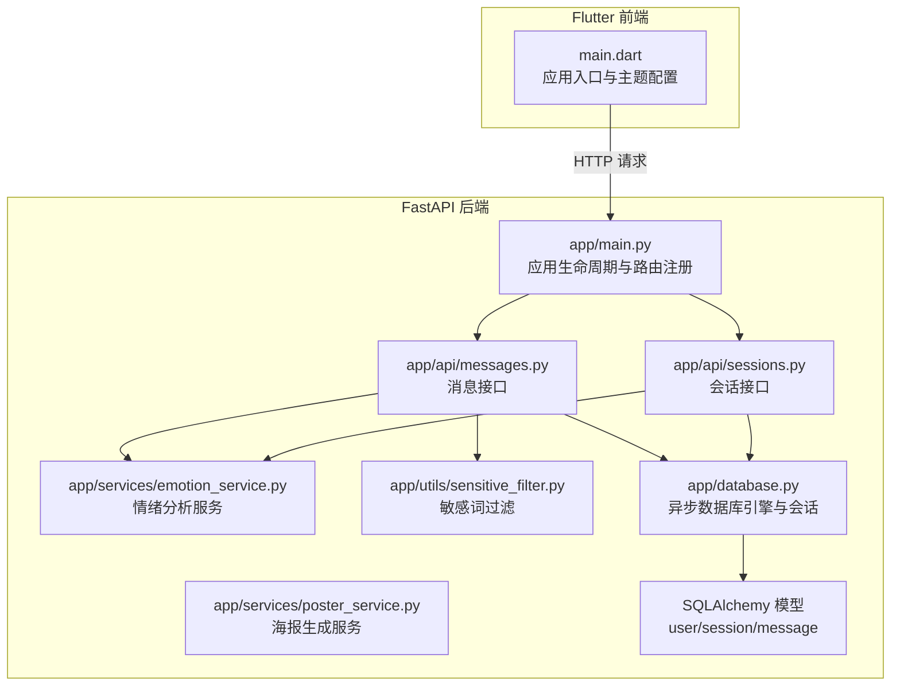
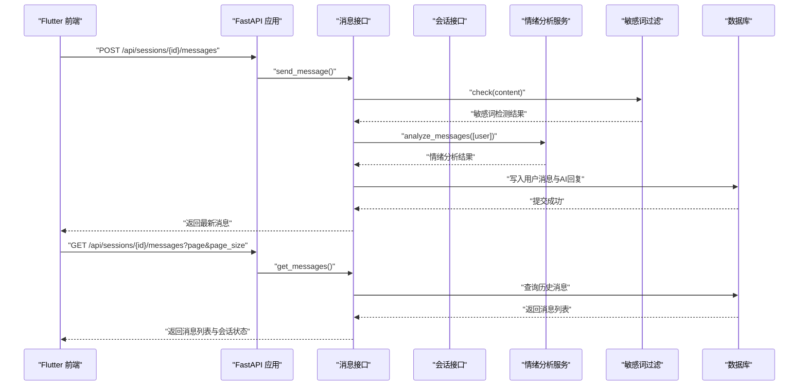
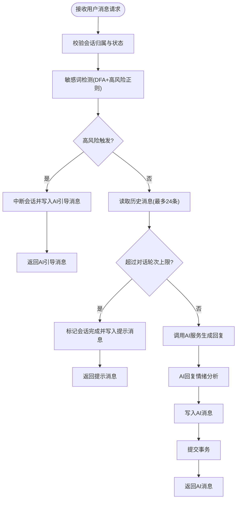
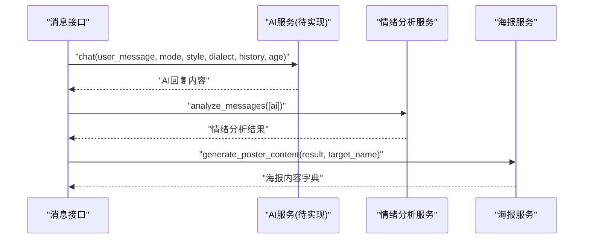
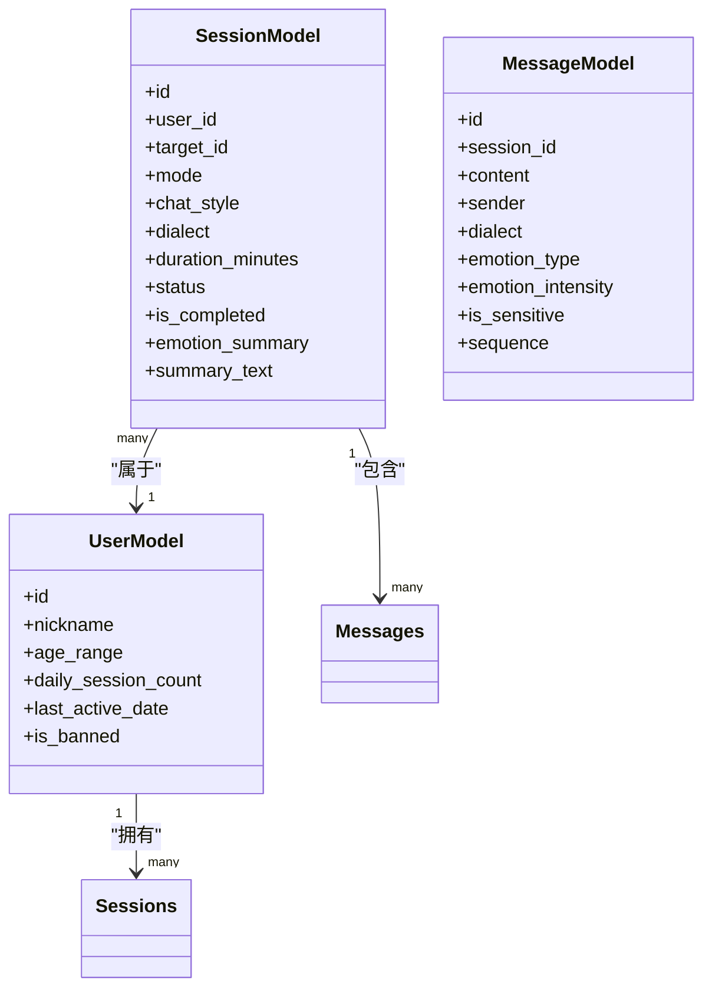
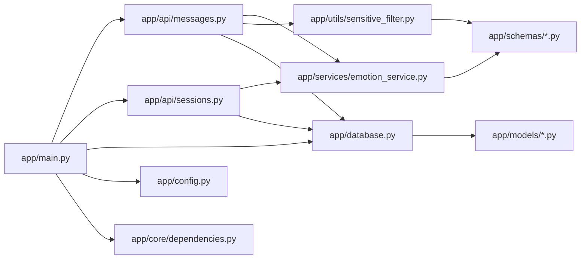

# 数据流架构设计

<cite>
**本文档引用的文件**
- [emo_outlet_api/app/main.py](file://emo_outlet_api/app/main.py)
- [emo_outlet_api/app/database.py](file://emo_outlet_api/app/database.py)
- [emo_outlet_api/app/config.py](file://emo_outlet_api/app/config.py)
- [emo_outlet_api/app/models/message.py](file://emo_outlet_api/app/models/message.py)
- [emo_outlet_api/app/models/session.py](file://emo_outlet_api/app/models/session.py)
- [emo_outlet_api/app/models/user.py](file://emo_outlet_api/app/models/user.py)
- [emo_outlet_api/app/api/messages.py](file://emo_outlet_api/app/api/messages.py)
- [emo_outlet_api/app/api/sessions.py](file://emo_outlet_api/app/api/sessions.py)
- [emo_outlet_api/app/services/emotion_service.py](file://emo_outlet_api/app/services/emotion_service.py)
- [emo_outlet_api/app/services/poster_service.py](file://emo_outlet_api/app/services/poster_service.py)
- [emo_outlet_api/app/utils/sensitive_filter.py](file://emo_outlet_api/app/utils/sensitive_filter.py)
- [emo_outlet_api/app/schemas/message.py](file://emo_outlet_api/app/schemas/message.py)
- [emo_outlet_api/app/schemas/session.py](file://emo_outlet_api/app/schemas/session.py)
- [emo_outlet_api/app/core/dependencies.py](file://emo_outlet_api/app/core/dependencies.py)
- [emo_outlet_app/lib/main.dart](file://emo_outlet_app/lib/main.dart)
</cite>

## 目录
1. [引言](#引言)
2. [项目结构](#项目结构)
3. [核心组件](#核心组件)
4. [架构总览](#架构总览)
5. [详细组件分析](#详细组件分析)
6. [依赖关系分析](#依赖关系分析)
7. [性能考虑](#性能考虑)
8. [故障排除指南](#故障排除指南)
9. [结论](#结论)
10. [附录](#附录)

## 引言
本文件面向Emo Outlet项目，聚焦数据流架构设计，系统性阐述从Flutter前端到FastAPI后端再到数据库的完整数据链路与处理机制。重点覆盖以下方面：
- 用户输入流：从界面输入到后端校验、敏感词过滤、情绪分析与AI回复生成的全过程
- AI处理流：基于多提供商适配的对话与图像生成能力，以及情绪分析与海报生成
- 数据持久化流：异步数据库连接、事务管理与模型映射
- 实时通信流：当前实现以REST为主，结合会话状态与剩余时长反馈
- 异步数据处理模式、事件驱动与消息队列机制：现状与扩展建议
- 数据验证、转换与序列化策略：Pydantic模型与SQLAlchemy ORM
- 数据缓存机制、性能优化方案与数据一致性保证
- 关键节点的数据流图与处理逻辑说明

## 项目结构
Emo Outlet采用前后端分离架构：
- Flutter前端负责用户交互与状态管理
- FastAPI后端提供REST API，包含认证中间件、数据库连接、业务服务与AI集成
- 数据库采用SQLAlchemy ORM（异步引擎），模型定义清晰，涵盖用户、会话、消息等核心实体

图表来源
- [emo_outlet_app/lib/main.dart:1-97](file://emo_outlet_app/lib/main.dart#L1-L97)
- [emo_outlet_api/app/main.py:1-82](file://emo_outlet_api/app/main.py#L1-L82)
- [emo_outlet_api/app/api/messages.py:1-216](file://emo_outlet_api/app/api/messages.py#L1-L216)
- [emo_outlet_api/app/api/sessions.py:1-220](file://emo_outlet_api/app/api/sessions.py#L1-L220)
- [emo_outlet_api/app/services/emotion_service.py:1-181](file://emo_outlet_api/app/services/emotion_service.py#L1-L181)
- [emo_outlet_api/app/services/poster_service.py:1-221](file://emo_outlet_api/app/services/poster_service.py#L1-L221)
- [emo_outlet_api/app/utils/sensitive_filter.py:1-142](file://emo_outlet_api/app/utils/sensitive_filter.py#L1-L142)
- [emo_outlet_api/app/database.py:1-43](file://emo_outlet_api/app/database.py#L1-L43)
- [emo_outlet_api/app/models/message.py:1-46](file://emo_outlet_api/app/models/message.py#L1-L46)
- [emo_outlet_api/app/models/session.py:1-79](file://emo_outlet_api/app/models/session.py#L1-L79)
- [emo_outlet_api/app/models/user.py:1-56](file://emo_outlet_api/app/models/user.py#L1-L56)

章节来源
- [emo_outlet_app/lib/main.dart:1-97](file://emo_outlet_app/lib/main.dart#L1-L97)
- [emo_outlet_api/app/main.py:1-82](file://emo_outlet_api/app/main.py#L1-L82)

## 核心组件
- 应用入口与生命周期：FastAPI应用初始化、CORS中间件、异常处理器注册、数据库连接生命周期管理
- 数据库层：异步SQLAlchemy引擎、会话工厂、模型基类与依赖注入
- 认证与依赖：JWT解析、当前用户解析、每日会话次数限制
- 业务接口：会话创建/查询/结束；消息发送/分页查询
- 服务层：情绪分析、海报生成、敏感词过滤
- 配置中心：数据库、Redis、AI提供商、合规参数等统一配置

章节来源
- [emo_outlet_api/app/main.py:14-82](file://emo_outlet_api/app/main.py#L14-L82)
- [emo_outlet_api/app/database.py:18-43](file://emo_outlet_api/app/database.py#L18-L43)
- [emo_outlet_api/app/config.py:12-125](file://emo_outlet_api/app/config.py#L12-L125)
- [emo_outlet_api/app/core/dependencies.py:18-67](file://emo_outlet_api/app/core/dependencies.py#L18-L67)

## 架构总览
Emo Outlet采用REST API驱动的同步数据流，结合服务层进行情绪分析与敏感词过滤，最终持久化至数据库。整体流程如下：

图表来源
- [emo_outlet_api/app/api/messages.py:69-195](file://emo_outlet_api/app/api/messages.py#L69-L195)
- [emo_outlet_api/app/services/emotion_service.py:44-71](file://emo_outlet_api/app/services/emotion_service.py#L44-L71)
- [emo_outlet_api/app/utils/sensitive_filter.py:102-119](file://emo_outlet_api/app/utils/sensitive_filter.py#L102-L119)
- [emo_outlet_api/app/database.py:22-32](file://emo_outlet_api/app/database.py#L22-L32)

## 详细组件分析

### 用户输入流
- 输入来源：Flutter界面输入框
- 请求路径：POST /api/sessions/{session_id}/messages
- 处理步骤：
  1) 校验会话归属与状态
  2) 敏感词检测（DFA + 正则高风险模式）
  3) 情绪分析（统计特征与关键词提取）
  4) 写入用户消息（含方言、情绪标签、序列号）
  5) 若高风险：中断会话并返回温和引导语
  6) 若达到对话轮次上限：结束会话并提示
  7) 调用AI服务生成回复，进行情绪分析并写入AI消息
  8) 返回最新消息响应

图表来源
- [emo_outlet_api/app/api/messages.py:69-195](file://emo_outlet_api/app/api/messages.py#L69-L195)
- [emo_outlet_api/app/utils/sensitive_filter.py:102-119](file://emo_outlet_api/app/utils/sensitive_filter.py#L102-L119)
- [emo_outlet_api/app/services/emotion_service.py:44-71](file://emo_outlet_api/app/services/emotion_service.py#L44-L71)

章节来源
- [emo_outlet_api/app/api/messages.py:69-195](file://emo_outlet_api/app/api/messages.py#L69-L195)
- [emo_outlet_api/app/utils/sensitive_filter.py:37-139](file://emo_outlet_api/app/utils/sensitive_filter.py#L37-L139)

### AI处理流
- 提供商适配：通过配置项选择OpenAI、DeepSeek、Qwen或Mock
- 模型选择：LLM模型与图像模型可配置
- 处理流程：
  - 消息发送时：根据会话模式、风格、方言与历史上下文调用AI服务
  - 会话结束时：汇总消息并进行情绪分析，生成JSON摘要与文本总结
  - 海报生成：基于情绪分析结果生成HTML或SVG内容，支持Mock输出

图表来源
- [emo_outlet_api/app/api/messages.py:165-172](file://emo_outlet_api/app/api/messages.py#L165-L172)
- [emo_outlet_api/app/api/sessions.py:196-208](file://emo_outlet_api/app/api/sessions.py#L196-L208)
- [emo_outlet_api/app/services/emotion_service.py:44-71](file://emo_outlet_api/app/services/emotion_service.py#L44-L71)
- [emo_outlet_api/app/services/poster_service.py:66-90](file://emo_outlet_api/app/services/poster_service.py#L66-L90)

章节来源
- [emo_outlet_api/app/config.py:63-80](file://emo_outlet_api/app/config.py#L63-L80)
- [emo_outlet_api/app/services/poster_service.py:66-221](file://emo_outlet_api/app/services/poster_service.py#L66-L221)

### 数据持久化流
- 异步数据库：使用SQLAlchemy异步引擎与会话工厂
- 依赖注入：每个请求通过依赖函数获取会话，自动提交或回滚
- 模型关系：用户-会话-消息三级关联，支持懒加载
- 事务语义：显式flush/refresh确保写入可见性

图表来源
- [emo_outlet_api/app/models/user.py:14-56](file://emo_outlet_api/app/models/user.py#L14-L56)
- [emo_outlet_api/app/models/session.py:13-79](file://emo_outlet_api/app/models/session.py#L13-L79)
- [emo_outlet_api/app/models/message.py:13-46](file://emo_outlet_api/app/models/message.py#L13-L46)

章节来源
- [emo_outlet_api/app/database.py:22-32](file://emo_outlet_api/app/database.py#L22-L32)
- [emo_outlet_api/app/models/user.py:50-52](file://emo_outlet_api/app/models/user.py#L50-L52)
- [emo_outlet_api/app/models/session.py:72-75](file://emo_outlet_api/app/models/session.py#L72-L75)
- [emo_outlet_api/app/models/message.py:41-42](file://emo_outlet_api/app/models/message.py#L41-L42)

### 实时通信流
- 当前实现：基于REST的同步请求-响应模式
- 会话状态反馈：消息查询接口返回会话状态与剩余秒数
- 扩展建议：WebSocket或Server-Sent Events用于推送AI回复与状态变更

章节来源
- [emo_outlet_api/app/api/messages.py:32-66](file://emo_outlet_api/app/api/messages.py#L32-L66)

### 异步数据处理模式、事件驱动与消息队列
- 现状：请求-响应同步处理，部分服务（情绪分析）为纯计算逻辑
- 建议：
  - 将AI生成与敏感词过滤放入后台任务队列（如Celery/RQ）
  - 使用事件总线发布“消息已写入”事件，触发下游处理（如海报生成、审计日志）
  - 引入Redis作为缓存与消息队列（配置项已存在）

章节来源
- [emo_outlet_api/app/config.py:42-52](file://emo_outlet_api/app/config.py#L42-L52)

### 数据验证、转换与序列化策略
- Pydantic模型：请求/响应模型严格定义字段范围与默认值
- SQLALchemy ORM：模型字段映射数据库表结构，支持关系与默认值
- 类型转换：时间字段统一为UTC时区，序列号自增
- 序列化：会话摘要以JSON字符串存储，便于后续渲染

章节来源
- [emo_outlet_api/app/schemas/message.py:8-33](file://emo_outlet_api/app/schemas/message.py#L8-L33)
- [emo_outlet_api/app/schemas/session.py:8-49](file://emo_outlet_api/app/schemas/session.py#L8-L49)
- [emo_outlet_api/app/models/message.py:16-39](file://emo_outlet_api/app/models/message.py#L16-L39)
- [emo_outlet_api/app/models/session.py:40-63](file://emo_outlet_api/app/models/session.py#L40-L63)

### 数据缓存机制、性能优化与一致性
- 缓存：Redis配置可用作会话状态、限流与热点数据缓存
- 性能：敏感词过滤采用DFA Trie树，复杂度O(n)；情绪分析按需计算
- 一致性：数据库事务保证写入原子性；会话状态更新与消息写入在同一事务内
- 可观测性：请求日志中间件记录耗时与状态码

章节来源
- [emo_outlet_api/app/config.py:42-52](file://emo_outlet_api/app/config.py#L42-L52)
- [emo_outlet_api/app/utils/sensitive_filter.py:37-101](file://emo_outlet_api/app/utils/sensitive_filter.py#L37-L101)
- [emo_outlet_api/app/main.py:33-39](file://emo_outlet_api/app/main.py#L33-L39)

## 依赖关系分析

图表来源
- [emo_outlet_api/app/main.py:51-63](file://emo_outlet_api/app/main.py#L51-L63)
- [emo_outlet_api/app/api/messages.py:16-19](file://emo_outlet_api/app/api/messages.py#L16-L19)
- [emo_outlet_api/app/api/sessions.py:24](file://emo_outlet_api/app/api/sessions.py#L24)
- [emo_outlet_api/app/database.py:18-32](file://emo_outlet_api/app/database.py#L18-L32)
- [emo_outlet_api/app/services/emotion_service.py:6](file://emo_outlet_api/app/services/emotion_service.py#L6)
- [emo_outlet_api/app/utils/sensitive_filter.py:11](file://emo_outlet_api/app/utils/sensitive_filter.py#L11)
- [emo_outlet_api/app/schemas/message.py:5](file://emo_outlet_api/app/schemas/message.py#L5)
- [emo_outlet_api/app/schemas/session.py:5](file://emo_outlet_api/app/schemas/session.py#L5)
- [emo_outlet_api/app/models/message.py:7](file://emo_outlet_api/app/models/message.py#L7)
- [emo_outlet_api/app/models/session.py:7](file://emo_outlet_api/app/models/session.py#L7)
- [emo_outlet_api/app/config.py:12](file://emo_outlet_api/app/config.py#L12)
- [emo_outlet_api/app/core/dependencies.py:15](file://emo_outlet_api/app/core/dependencies.py#L15)

章节来源
- [emo_outlet_api/app/main.py:51-63](file://emo_outlet_api/app/main.py#L51-L63)
- [emo_outlet_api/app/api/messages.py:16-19](file://emo_outlet_api/app/api/messages.py#L16-L19)
- [emo_outlet_api/app/api/sessions.py:24](file://emo_outlet_api/app/api/sessions.py#L24)

## 性能考虑
- 数据库层
  - 使用异步引擎与连接池，避免阻塞
  - 事务粒度控制：批量写入时减少flush次数
  - 查询优化：分页查询与索引（建议对session_id、sender、created_at建立索引）
- 服务层
  - 情绪分析与敏感词过滤均为内存计算，注意输入长度限制
  - AI调用建议异步化并增加超时与重试
- 前端
  - 减少重复请求，利用本地状态缓存最新消息
  - 分页加载与虚拟列表提升长列表体验

## 故障排除指南
- 认证失败
  - 检查Authorization头格式与JWT有效性
  - 确认用户未被封禁且未删除
- 会话访问权限
  - 确保session_id属于当前用户
  - 检查会话状态（已完成会话不可继续发送消息）
- 敏感词拦截
  - 高风险内容会中断会话并返回温和引导语
  - 审计日志可选开启，记录高风险行为
- 数据库异常
  - 事务回滚由依赖函数自动处理，检查异常日志

章节来源
- [emo_outlet_api/app/core/dependencies.py:18-50](file://emo_outlet_api/app/core/dependencies.py#L18-L50)
- [emo_outlet_api/app/api/messages.py:75-127](file://emo_outlet_api/app/api/messages.py#L75-L127)
- [emo_outlet_api/app/database.py:22-32](file://emo_outlet_api/app/database.py#L22-L32)

## 结论
Emo Outlet的数据流以REST为核心，结合服务层的情绪分析与敏感词过滤，实现了从用户输入到AI回复与数据持久化的闭环。当前架构具备良好的扩展性，建议引入异步任务与事件驱动机制，配合Redis缓存与消息队列，进一步提升吞吐与实时性。同时，持续完善AI服务抽象与合规策略，保障数据安全与用户体验。

## 附录
- 配置项概览（节选）
  - 数据库：MySQL/SQLite可选，支持DATABASE_URL与SQLite_URL
  - Redis：用于缓存与消息队列
  - AI提供商：OpenAI、DeepSeek、Qwen或Mock
  - 合规参数：每日会话上限、对话轮次上限、敏感词库与审计日志开关

章节来源
- [emo_outlet_api/app/config.py:22-114](file://emo_outlet_api/app/config.py#L22-L114)