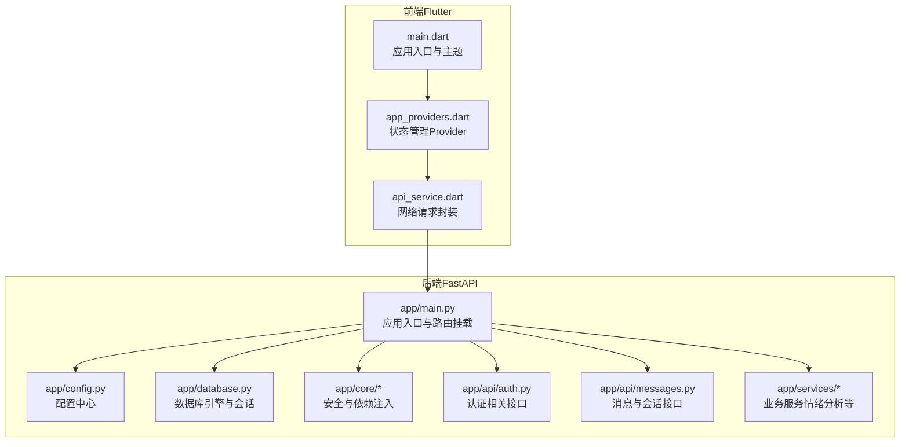
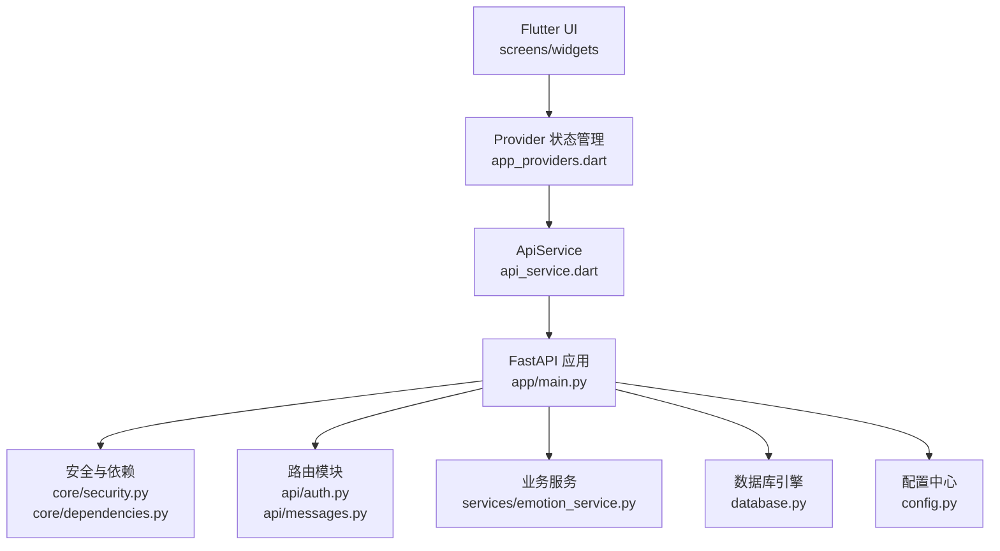
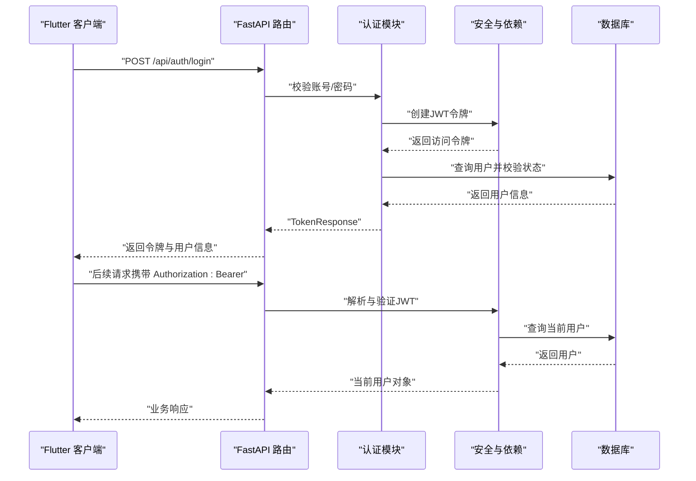
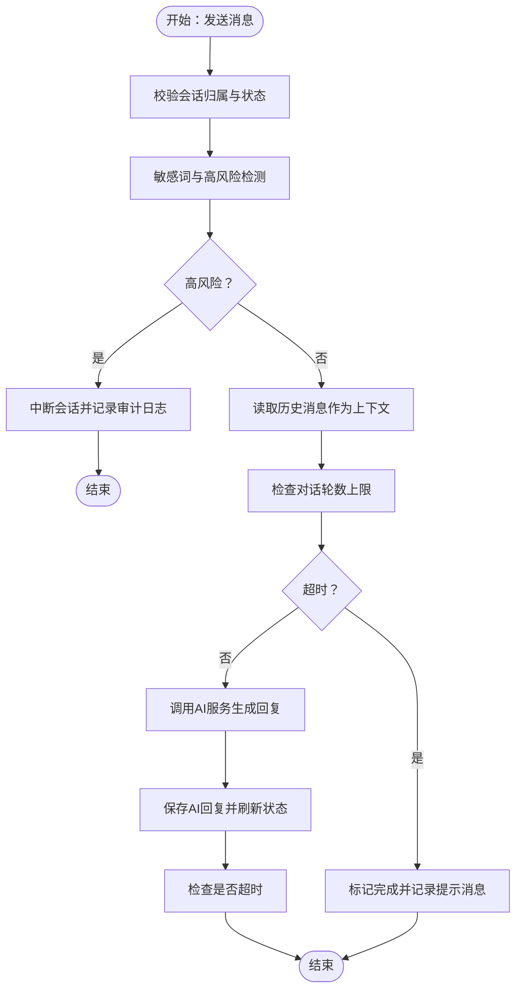
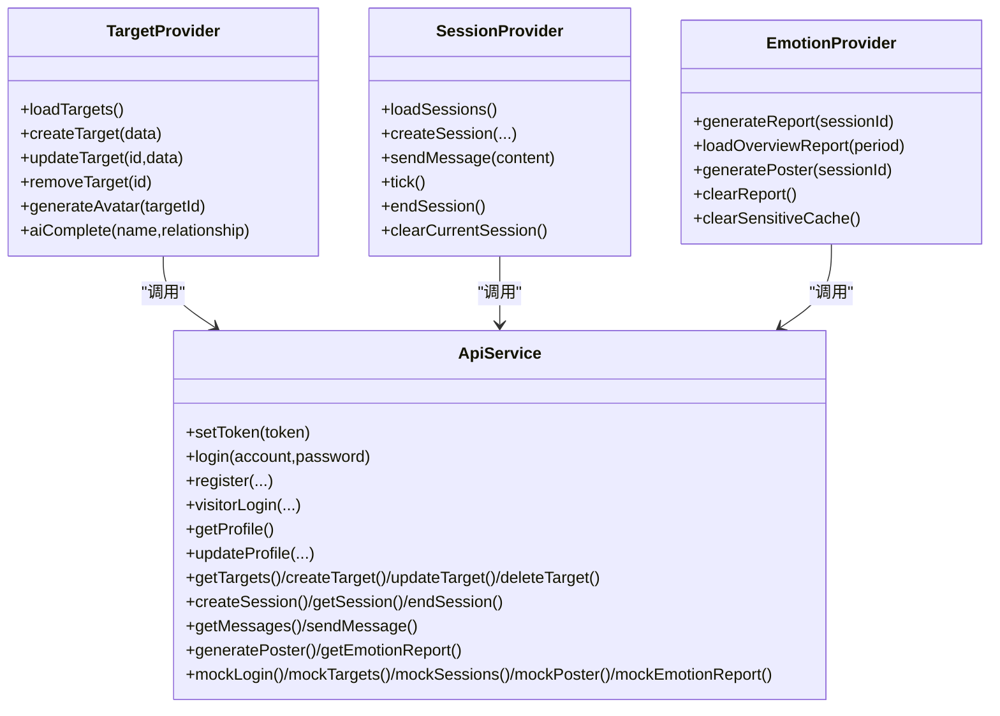
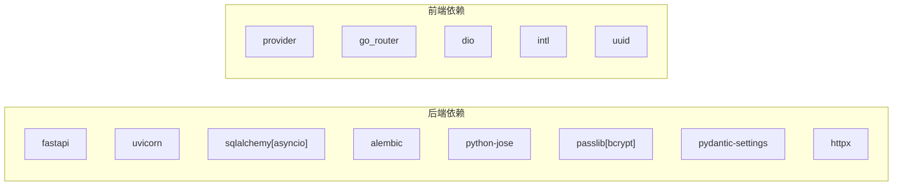

# 整体架构概览

<cite>
**本文引用的文件**
- [README.md](file://README.md)
- [emo_outlet_api/app/main.py](file://emo_outlet_api/app/main.py)
- [emo_outlet_api/app/config.py](file://emo_outlet_api/app/config.py)
- [emo_outlet_api/app/database.py](file://emo_outlet_api/app/database.py)
- [emo_outlet_api/app/core/security.py](file://emo_outlet_api/app/core/security.py)
- [emo_outlet_api/app/core/dependencies.py](file://emo_outlet_api/app/core/dependencies.py)
- [emo_outlet_api/app/api/auth.py](file://emo_outlet_api/app/api/auth.py)
- [emo_outlet_api/app/api/messages.py](file://emo_outlet_api/app/api/messages.py)
- [emo_outlet_api/app/models/user.py](file://emo_outlet_api/app/models/user.py)
- [emo_outlet_api/app/models/message.py](file://emo_outlet_api/app/models/message.py)
- [emo_outlet_api/app/schemas/user.py](file://emo_outlet_api/app/schemas/user.py)
- [emo_outlet_api/app/schemas/message.py](file://emo_outlet_api/app/schemas/message.py)
- [emo_outlet_api/app/services/emotion_service.py](file://emo_outlet_api/app/services/emotion_service.py)
- [emo_outlet_api/requirements.txt](file://emo_outlet_api/requirements.txt)
- [emo_outlet_app/lib/main.dart](file://emo_outlet_app/lib/main.dart)
- [emo_outlet_app/lib/providers/app_providers.dart](file://emo_outlet_app/lib/providers/app_providers.dart)
- [emo_outlet_app/lib/services/api_service.dart](file://emo_outlet_app/lib/services/api_service.dart)
- [emo_outlet_app/pubspec.yaml](file://emo_outlet_app/pubspec.yaml)
</cite>

## 目录
1. [引言](#引言)
2. [项目结构](#项目结构)
3. [核心组件](#核心组件)
4. [架构总览](#架构总览)
5. [详细组件分析](#详细组件分析)
6. [依赖分析](#依赖分析)
7. [性能考虑](#性能考虑)
8. [故障排查指南](#故障排查指南)
9. [结论](#结论)
10. [附录](#附录)

## 引言
本项目“情绪出口（Emo Outlet）”是一个前后端分离的全栈应用，目标是以安全、可控的方式帮助用户通过AI驱动的对话与可视化工具释放情绪。后端采用FastAPI构建REST API，前端采用Flutter跨平台框架，二者通过HTTP API协同工作。系统遵循分层架构与模块化设计，强调职责分离、可扩展性与合规安全。

## 项目结构
项目分为两个主要子工程：
- 后端API（Python/FastAPI）：负责认证、会话管理、消息处理、情绪分析、海报生成、合规与安全控制等。
- 前端App（Flutter/Dart）：负责UI渲染、状态管理、网络请求封装与Mock回退。

图表来源
- [emo_outlet_api/app/main.py:1-82](file://emo_outlet_api/app/main.py#L1-L82)
- [emo_outlet_app/lib/main.dart:1-97](file://emo_outlet_app/lib/main.dart#L1-L97)
- [emo_outlet_app/lib/providers/app_providers.dart:1-416](file://emo_outlet_app/lib/providers/app_providers.dart#L1-L416)
- [emo_outlet_app/lib/services/api_service.dart:1-381](file://emo_outlet_app/lib/services/api_service.dart#L1-L381)

章节来源
- [README.md:58-84](file://README.md#L58-L84)
- [emo_outlet_api/app/main.py:23-63](file://emo_outlet_api/app/main.py#L23-L63)
- [emo_outlet_app/lib/main.dart:8-96](file://emo_outlet_app/lib/main.dart#L8-L96)

## 核心组件
- 应用入口与生命周期
  - 后端：FastAPI应用初始化、CORS中间件、异常处理器注册、数据库连接生命周期管理、健康检查端点。
  - 前端：应用入口初始化、主题与全局Provider注入、首页路由。
- 安全与认证
  - JWT令牌签发与校验、密码哈希与校验、基于Bearer Token的鉴权依赖、每日会话次数限制与封禁检查。
- 数据层
  - 异步SQLAlchemy引擎、会话工厂、元数据初始化、软删除与合规字段。
- 业务服务
  - 情绪分析服务：关键词匹配、统计特征、情绪打分、摘要与建议生成。
- 前后端协作
  - 前端通过ApiService统一发起HTTP请求，携带Authorization头；后端通过依赖注入获取当前用户并执行业务逻辑。

章节来源
- [emo_outlet_api/app/main.py:14-82](file://emo_outlet_api/app/main.py#L14-L82)
- [emo_outlet_api/app/core/security.py:16-43](file://emo_outlet_api/app/core/security.py#L16-L43)
- [emo_outlet_api/app/core/dependencies.py:18-67](file://emo_outlet_api/app/core/dependencies.py#L18-L67)
- [emo_outlet_api/app/database.py:34-43](file://emo_outlet_api/app/database.py#L34-L43)
- [emo_outlet_api/app/services/emotion_service.py:44-181](file://emo_outlet_api/app/services/emotion_service.py#L44-L181)
- [emo_outlet_app/lib/services/api_service.dart:5-32](file://emo_outlet_app/lib/services/api_service.dart#L5-L32)

## 架构总览
系统采用前后端分离的分层架构：
- 表现层（Flutter）
  - UI组件、状态管理（Provider）、路由与导航。
  - 网络层：统一的ApiService封装，自动注入Authorization头，提供Mock回退能力。
- 应用层（FastAPI）
  - 路由层：按功能模块划分（认证、会话、消息、海报、支持等）。
  - 服务层：业务逻辑（情绪分析、AI交互、海报生成）。
  - 核心层：安全（JWT、密码哈希）、依赖注入（当前用户、数据库会话）。
  - 数据访问层：异步ORM模型与数据库引擎。
- 数据与外部服务
  - MySQL/SQLite：用户、目标、会话、消息、海报、合规审计等。
  - AI服务：OpenAI/DeepSeek/通义千问等（可通过配置切换）。
  - 存储：OSS（可选）。

图表来源
- [emo_outlet_api/app/main.py:51-63](file://emo_outlet_api/app/main.py#L51-L63)
- [emo_outlet_api/app/core/security.py:26-43](file://emo_outlet_api/app/core/security.py#L26-L43)
- [emo_outlet_api/app/core/dependencies.py:18-50](file://emo_outlet_api/app/core/dependencies.py#L18-L50)
- [emo_outlet_api/app/services/emotion_service.py:44-71](file://emo_outlet_api/app/services/emotion_service.py#L44-L71)
- [emo_outlet_app/lib/providers/app_providers.dart:9-416](file://emo_outlet_app/lib/providers/app_providers.dart#L9-L416)
- [emo_outlet_app/lib/services/api_service.dart:5-32](file://emo_outlet_app/lib/services/api_service.dart#L5-L32)

## 详细组件分析

### 认证与会话流程（序列图）

图表来源
- [emo_outlet_api/app/api/auth.py:78-94](file://emo_outlet_api/app/api/auth.py#L78-L94)
- [emo_outlet_api/app/core/security.py:26-43](file://emo_outlet_api/app/core/security.py#L26-L43)
- [emo_outlet_api/app/core/dependencies.py:18-50](file://emo_outlet_api/app/core/dependencies.py#L18-L50)

章节来源
- [emo_outlet_api/app/api/auth.py:33-121](file://emo_outlet_api/app/api/auth.py#L33-L121)
- [emo_outlet_api/app/core/security.py:16-43](file://emo_outlet_api/app/core/security.py#L16-L43)
- [emo_outlet_api/app/core/dependencies.py:18-50](file://emo_outlet_api/app/core/dependencies.py#L18-L50)

### 消息发送与情绪分析（流程图）

图表来源
- [emo_outlet_api/app/api/messages.py:80-231](file://emo_outlet_api/app/api/messages.py#L80-L231)
- [emo_outlet_api/app/services/emotion_service.py:44-121](file://emo_outlet_api/app/services/emotion_service.py#L44-L121)

章节来源
- [emo_outlet_api/app/api/messages.py:27-77](file://emo_outlet_api/app/api/messages.py#L27-L77)
- [emo_outlet_api/app/api/messages.py:164-186](file://emo_outlet_api/app/api/messages.py#L164-L186)
- [emo_outlet_api/app/services/emotion_service.py:44-121](file://emo_outlet_api/app/services/emotion_service.py#L44-L121)

### 前后端协作与Mock回退（类图）

图表来源
- [emo_outlet_app/lib/providers/app_providers.dart:9-416](file://emo_outlet_app/lib/providers/app_providers.dart#L9-L416)
- [emo_outlet_app/lib/services/api_service.dart:5-381](file://emo_outlet_app/lib/services/api_service.dart#L5-L381)

章节来源
- [emo_outlet_app/lib/providers/app_providers.dart:9-416](file://emo_outlet_app/lib/providers/app_providers.dart#L9-L416)
- [emo_outlet_app/lib/services/api_service.dart:5-32](file://emo_outlet_app/lib/services/api_service.dart#L5-L32)

## 依赖分析
- 后端依赖
  - Web框架：FastAPI、Uvicorn
  - 数据库：SQLAlchemy（异步）、Alembic迁移
  - 安全：python-jose、passlib（bcrypt）
  - 配置：pydantic-settings、python-dotenv
  - HTTP客户端：httpx
- 前端依赖
  - 状态管理：provider
  - 路由：go_router
  - 网络：dio
  - 工具：intl、uuid、cached_network_image等

图表来源
- [emo_outlet_api/requirements.txt:4-29](file://emo_outlet_api/requirements.txt#L4-L29)
- [emo_outlet_app/pubspec.yaml:9-41](file://emo_outlet_app/pubspec.yaml#L9-L41)

章节来源
- [emo_outlet_api/requirements.txt:1-29](file://emo_outlet_api/requirements.txt#L1-L29)
- [emo_outlet_app/pubspec.yaml:1-52](file://emo_outlet_app/pubspec.yaml#L1-L52)

## 性能考虑
- 异步IO与并发
  - 后端使用异步SQLAlchemy与异步HTTP客户端，提升I/O密集型场景下的吞吐。
- 缓存与降级
  - 前端在API不可用时启用Mock回退，保证用户体验连续性。
- 数据库优化
  - 使用异步会话工厂与连接池参数，避免阻塞；合理索引与分页查询（如消息列表）。
- 安全与合规
  - 敏感词过滤与高风险自动中断，降低内容审核成本；审计日志采样配置便于性能与合规平衡。

## 故障排查指南
- 认证失败
  - 检查Authorization头是否正确传递；确认JWT未过期；核对用户状态（封禁/删除）。
- 会话异常
  - 确认会话归属与状态；检查每日会话次数限制；关注高风险内容导致的中断。
- 数据库问题
  - 确认数据库URL与驱动可用；检查迁移脚本是否执行；查看连接池与事务提交/回滚逻辑。
- 前后端联调
  - 使用Swagger文档校验接口；在前端开启Mock回退定位问题；检查CORS配置与跨域策略。

章节来源
- [emo_outlet_api/app/core/dependencies.py:22-50](file://emo_outlet_api/app/core/dependencies.py#L22-L50)
- [emo_outlet_api/app/api/messages.py:96-100](file://emo_outlet_api/app/api/messages.py#L96-L100)
- [emo_outlet_api/app/database.py:22-31](file://emo_outlet_api/app/database.py#L22-L31)
- [emo_outlet_app/lib/services/api_service.dart:22-31](file://emo_outlet_app/lib/services/api_service.dart#L22-L31)

## 结论
本项目通过清晰的前后端分层与模块化设计，实现了从认证、会话、消息到情绪分析与海报生成的完整闭环。系统在保证安全与合规的前提下，提供了良好的扩展性与可维护性。未来演进方向可围绕多租户、A/B测试与AI能力增强、报表与趋势分析深化、以及可观测性与自动化运维等方面展开。

## 附录
- 快速开始与接口概览可参考项目README中的“快速开始”与“API 接口”部分。
- 数据库表结构与核心字段可参考“数据库设计”部分。

章节来源
- [README.md:32-104](file://README.md#L32-L104)
- [README.md:107-127](file://README.md#L107-L127)