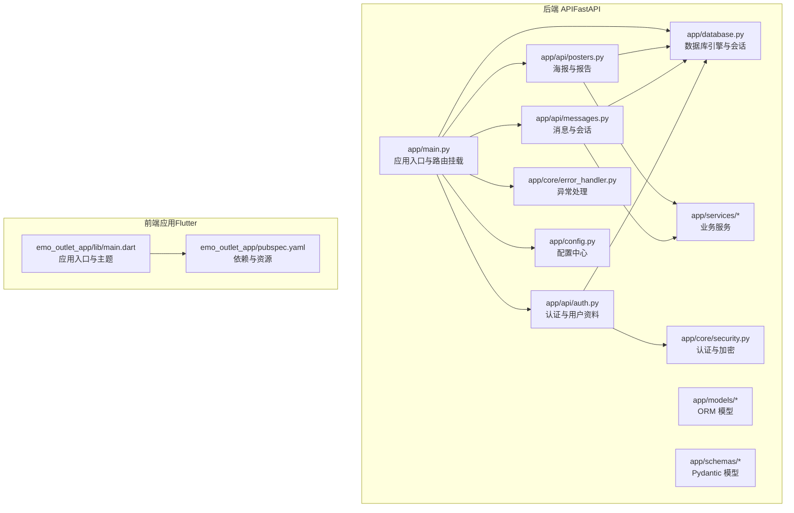
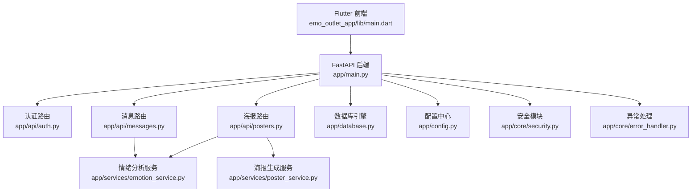
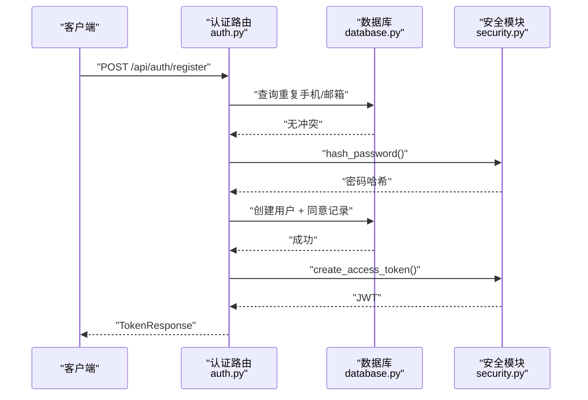
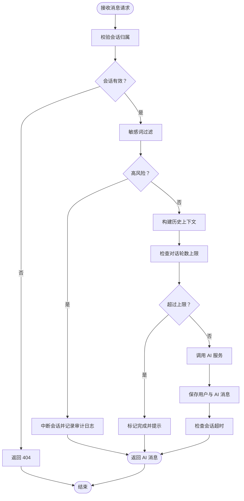
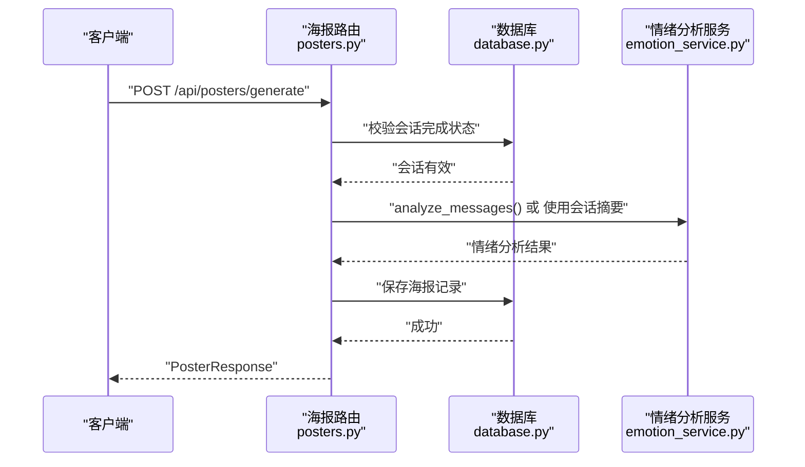
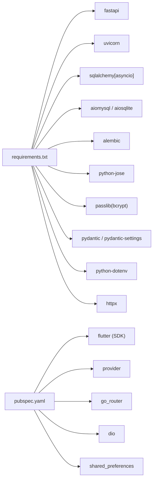
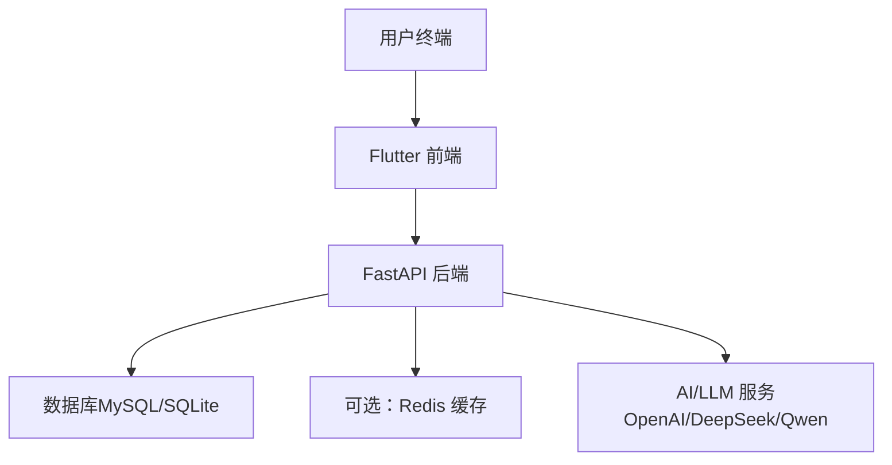

# 系统架构设计

<cite>
**本文引用的文件**
- [emo_outlet_api/app/main.py](file://emo_outlet_api/app/main.py)
- [emo_outlet_api/app/config.py](file://emo_outlet_api/app/config.py)
- [emo_outlet_api/app/database.py](file://emo_outlet_api/app/database.py)
- [emo_outlet_api/app/core/security.py](file://emo_outlet_api/app/core/security.py)
- [emo_outlet_api/app/core/error_handler.py](file://emo_outlet_api/app/core/error_handler.py)
- [emo_outlet_api/app/api/auth.py](file://emo_outlet_api/app/api/auth.py)
- [emo_outlet_api/app/api/messages.py](file://emo_outlet_api/app/api/messages.py)
- [emo_outlet_api/app/api/posters.py](file://emo_outlet_api/app/api/posters.py)
- [emo_outlet_api/app/models/user.py](file://emo_outlet_api/app/models/user.py)
- [emo_outlet_api/app/schemas/user.py](file://emo_outlet_api/app/schemas/user.py)
- [emo_outlet_api/app/services/emotion_service.py](file://emo_outlet_api/app/services/emotion_service.py)
- [emo_outlet_api/run.py](file://emo_outlet_api/run.py)
- [emo_outlet_api/requirements.txt](file://emo_outlet_api/requirements.txt)
- [emo_outlet_app/lib/main.dart](file://emo_outlet_app/lib/main.dart)
- [emo_outlet_app/pubspec.yaml](file://emo_outlet_app/pubspec.yaml)
- [README.md](file://README.md)
</cite>

## 目录
1. [引言](#引言)
2. [项目结构](#项目结构)
3. [核心组件](#核心组件)
4. [架构总览](#架构总览)
5. [详细组件分析](#详细组件分析)
6. [依赖关系分析](#依赖关系分析)
7. [性能与可扩展性](#性能与可扩展性)
8. [故障排查指南](#故障排查指南)
9. [结论](#结论)
10. [附录](#附录)

## 引言
本文件面向 Emo Outlet 项目，提供系统架构设计文档。系统采用前后端分离架构，后端基于 FastAPI 构建，前端基于 Flutter，围绕“情绪释放”场景提供认证、会话、消息、海报生成与报告等能力。后端通过模块化设计实现分层架构与职责分离，并以事件驱动的数据流贯穿消息处理、情绪分析与海报生成流程。文档同时覆盖技术选型、安全与合规、监控与运维、部署拓扑与可扩展性等横切关注点。

## 项目结构
项目采用“前后端分离”的双仓库组织方式：
- 后端 API：emo_outlet_api，使用 FastAPI + SQLAlchemy Async + MySQL/SQLite，提供 REST 接口与业务逻辑。
- 前端应用：emo_outlet_app，使用 Flutter，负责用户界面与状态管理。

图表来源
- [emo_outlet_api/app/main.py:1-82](file://emo_outlet_api/app/main.py#L1-L82)
- [emo_outlet_api/app/config.py:1-125](file://emo_outlet_api/app/config.py#L1-L125)
- [emo_outlet_api/app/database.py:1-43](file://emo_outlet_api/app/database.py#L1-L43)
- [emo_outlet_api/app/core/security.py:1-43](file://emo_outlet_api/app/core/security.py#L1-L43)
- [emo_outlet_api/app/core/error_handler.py:1-59](file://emo_outlet_api/app/core/error_handler.py#L1-L59)
- [emo_outlet_api/app/api/auth.py:1-332](file://emo_outlet_api/app/api/auth.py#L1-L332)
- [emo_outlet_api/app/api/messages.py:1-243](file://emo_outlet_api/app/api/messages.py#L1-L243)
- [emo_outlet_api/app/api/posters.py:1-352](file://emo_outlet_api/app/api/posters.py#L1-L352)
- [emo_outlet_api/app/services/emotion_service.py:1-170](file://emo_outlet_api/app/services/emotion_service.py#L1-L170)
- [emo_outlet_app/lib/main.dart:1-97](file://emo_outlet_app/lib/main.dart#L1-L97)
- [emo_outlet_app/pubspec.yaml:1-52](file://emo_outlet_app/pubspec.yaml#L1-L52)

章节来源
- [emo_outlet_api/app/main.py:1-82](file://emo_outlet_api/app/main.py#L1-L82)
- [emo_outlet_app/lib/main.dart:1-97](file://emo_outlet_app/lib/main.dart#L1-L97)

## 核心组件
- 应用入口与生命周期：FastAPI 应用初始化、中间件（CORS、请求日志）、健康检查、路由挂载。
- 配置中心：集中管理数据库、Redis、AI 服务、安全与合规参数。
- 数据访问层：异步 SQLAlchemy 引擎与会话工厂，支持 MySQL/SQLite。
- 安全模块：JWT 令牌签发与校验、密码哈希与校验。
- 异常处理：统一 HTTP/校验/通用异常处理。
- 业务 API：
  - 认证与用户：注册、登录、访客登录、资料查询与更新、数据导出与注销。
  - 消息与会话：消息分页查询、发送与上下文构建、敏感词过滤与审计、AI 回复、会话超时与轮数限制。
  - 海报与报告：情绪分析、海报生成、情绪趋势与分布统计。
- 业务服务：
  - 情绪分析服务：基于关键词的情绪检测与建议生成。
  - 海报生成服务：占位实现，便于后续接入 AI 绘图能力。
- 前端入口与主题：Flutter 应用入口、主题与 Provider 状态管理初始化。

章节来源
- [emo_outlet_api/app/main.py:14-82](file://emo_outlet_api/app/main.py#L14-L82)
- [emo_outlet_api/app/config.py:12-125](file://emo_outlet_api/app/config.py#L12-L125)
- [emo_outlet_api/app/database.py:8-43](file://emo_outlet_api/app/database.py#L8-L43)
- [emo_outlet_api/app/core/security.py:16-43](file://emo_outlet_api/app/core/security.py#L16-L43)
- [emo_outlet_api/app/core/error_handler.py:10-59](file://emo_outlet_api/app/core/error_handler.py#L10-L59)
- [emo_outlet_api/app/api/auth.py:33-332](file://emo_outlet_api/app/api/auth.py#L33-L332)
- [emo_outlet_api/app/api/messages.py:27-243](file://emo_outlet_api/app/api/messages.py#L27-L243)
- [emo_outlet_api/app/api/posters.py:40-352](file://emo_outlet_api/app/api/posters.py#L40-L352)
- [emo_outlet_api/app/services/emotion_service.py:36-170](file://emo_outlet_api/app/services/emotion_service.py#L36-L170)
- [emo_outlet_app/lib/main.dart:8-97](file://emo_outlet_app/lib/main.dart#L8-L97)

## 架构总览
系统采用“前后端分离 + 微服务思想”的轻量级架构：
- 前端（Flutter）通过 HTTP 与后端交互，负责 UI、状态与本地缓存。
- 后端（FastAPI）提供 REST API，按领域拆分路由模块，内聚业务逻辑，外显接口契约。
- 数据持久化：MySQL/SQLite；缓存：Redis（配置项存在，具体使用视部署而定）。
- AI/LLM：OpenAI、DeepSeek、Qwen 等多提供商抽象，便于切换与灰度。
- 合规与安全：JWT、密码哈希、敏感词过滤、审计日志、防沉迷策略。

图表来源
- [emo_outlet_api/app/main.py:23-82](file://emo_outlet_api/app/main.py#L23-L82)
- [emo_outlet_api/app/api/auth.py:30-332](file://emo_outlet_api/app/api/auth.py#L30-L332)
- [emo_outlet_api/app/api/messages.py:24-243](file://emo_outlet_api/app/api/messages.py#L24-L243)
- [emo_outlet_api/app/api/posters.py:28-352](file://emo_outlet_api/app/api/posters.py#L28-L352)
- [emo_outlet_api/app/database.py:8-43](file://emo_outlet_api/app/database.py#L8-L43)
- [emo_outlet_api/app/config.py:12-125](file://emo_outlet_api/app/config.py#L12-L125)
- [emo_outlet_api/app/core/security.py:16-43](file://emo_outlet_api/app/core/security.py#L16-L43)
- [emo_outlet_api/app/core/error_handler.py:54-59](file://emo_outlet_api/app/core/error_handler.py#L54-L59)
- [emo_outlet_api/app/services/emotion_service.py:36-170](file://emo_outlet_api/app/services/emotion_service.py#L36-L170)

## 详细组件分析

### 认证与用户模块
- 功能要点
  - 支持手机号/邮箱注册、密码登录、访客登录（设备维度）。
  - 用户资料与详情的读写，支持注销与数据导出。
  - 同意版本记录与合规字段。
- 安全机制
  - 密码哈希与校验，JWT 令牌签发与过期控制。
- 数据模型与契约
  - 用户模型包含合规字段与活跃度统计。
  - Pydantic 请求/响应模型定义输入输出。

图表来源
- [emo_outlet_api/app/api/auth.py:33-76](file://emo_outlet_api/app/api/auth.py#L33-L76)
- [emo_outlet_api/app/core/security.py:16-31](file://emo_outlet_api/app/core/security.py#L16-L31)
- [emo_outlet_api/app/database.py:22-31](file://emo_outlet_api/app/database.py#L22-L31)

章节来源
- [emo_outlet_api/app/api/auth.py:33-332](file://emo_outlet_api/app/api/auth.py#L33-L332)
- [emo_outlet_api/app/core/security.py:16-43](file://emo_outlet_api/app/core/security.py#L16-L43)
- [emo_outlet_api/app/models/user.py:14-56](file://emo_outlet_api/app/models/user.py#L14-L56)
- [emo_outlet_api/app/schemas/user.py:8-74](file://emo_outlet_api/app/schemas/user.py#L8-L74)

### 消息与会话模块
- 功能要点
  - 分页获取会话消息，发送消息并调用 AI 服务回复。
  - 敏感词过滤与高风险拦截，记录审计日志。
  - 会话轮数上限与超时控制，自动完成会话。
- 数据流
  - 输入校验 → 权限校验 → 敏感词过滤 → 历史上下文拼接 → AI 聊天 → 保存消息 → 更新会话状态 → 返回响应。

图表来源
- [emo_outlet_api/app/api/messages.py:80-231](file://emo_outlet_api/app/api/messages.py#L80-L231)

章节来源
- [emo_outlet_api/app/api/messages.py:27-243](file://emo_outlet_api/app/api/messages.py#L27-L243)

### 海报与报告模块
- 功能要点
  - 生成情绪海报：从会话情绪摘要或消息分析结果生成海报内容。
  - 情绪报告：概览与详情，包含分布、趋势、目标偏好与时段分布。
- 服务协作
  - 情绪分析服务负责情绪检测与建议。
  - 海报生成服务负责海报内容模板与占位图生成。

图表来源
- [emo_outlet_api/app/api/posters.py:40-110](file://emo_outlet_api/app/api/posters.py#L40-L110)
- [emo_outlet_api/app/services/emotion_service.py:39-86](file://emo_outlet_api/app/services/emotion_service.py#L39-L86)

章节来源
- [emo_outlet_api/app/api/posters.py:182-352](file://emo_outlet_api/app/api/posters.py#L182-L352)
- [emo_outlet_api/app/services/emotion_service.py:36-170](file://emo_outlet_api/app/services/emotion_service.py#L36-L170)

### 安全与合规
- 认证与授权
  - JWT 令牌签发与过期控制，依赖密钥与算法配置。
  - 密码使用 bcrypt 哈希，校验一致。
- 合规与风控
  - 敏感词过滤与高风险拦截，支持审计日志采样。
  - 防沉迷策略：按年龄段限制每日会话数与对话轮数。
  - 同意版本记录与合规字段。

章节来源
- [emo_outlet_api/app/core/security.py:16-43](file://emo_outlet_api/app/core/security.py#L16-L43)
- [emo_outlet_api/app/config.py:88-114](file://emo_outlet_api/app/config.py#L88-L114)
- [emo_outlet_api/app/api/messages.py:102-199](file://emo_outlet_api/app/api/messages.py#L102-L199)

### 异常处理与可观测性
- 全局异常处理：统一返回 500 错误与结构化错误码。
- HTTP 异常：保留原状态码与细节。
- 参数校验异常：收集字段与错误信息。
- 日志：请求中间件打印方法、路径与耗时。

章节来源
- [emo_outlet_api/app/core/error_handler.py:10-59](file://emo_outlet_api/app/core/error_handler.py#L10-L59)
- [emo_outlet_api/app/main.py:33-39](file://emo_outlet_api/app/main.py#L33-L39)

## 依赖关系分析
- 技术栈与版本
  - Web 框架：FastAPI、Uvicorn
  - 数据库：SQLAlchemy Async、aiomysql/aiosqlite、Alembic
  - 安全：python-jose、passlib(bcrypt)、bcrypt
  - 配置：pydantic、pydantic-settings、python-dotenv
  - 工具：httpx、python-multipart
  - 前端：Flutter SDK、provider、go_router、dio、shared_preferences 等
- 外部依赖与集成
  - AI/LLM：OpenAI 等多提供商抽象，便于切换。
  - 存储：MySQL/SQLite 可选，Redis 可选（配置存在）。
  - 前端网络：Dio 进行 HTTP 请求，Provider 管理状态。

图表来源
- [emo_outlet_api/requirements.txt:3-29](file://emo_outlet_api/requirements.txt#L3-L29)
- [emo_outlet_app/pubspec.yaml:6-52](file://emo_outlet_app/pubspec.yaml#L6-L52)

章节来源
- [emo_outlet_api/requirements.txt:1-29](file://emo_outlet_api/requirements.txt#L1-L29)
- [emo_outlet_app/pubspec.yaml:1-52](file://emo_outlet_app/pubspec.yaml#L1-L52)

## 性能与可扩展性
- 并发与吞吐
  - 后端使用异步 SQLAlchemy 与 FastAPI，适合 I/O 密集型场景。
  - 生产环境建议使用多进程 Uvicorn Worker，提升并发处理能力。
- 数据库优化
  - 使用异步连接池与延迟加载关系，避免 N+1 查询。
  - 合理索引：用户唯一字段（手机/邮箱）、会话与消息的关联键。
- 缓存策略
  - Redis 可用于会话状态、验证码、热点报表缓存（需在路由中启用）。
- AI 服务
  - 异步调用与超时控制，必要时引入重试与熔断。
- 前端性能
  - Flutter 状态管理与懒加载，图片缓存与网络请求复用。

[本节为通用指导，不直接分析具体文件]

## 故障排查指南
- 常见问题定位
  - 500 服务器错误：查看全局异常处理器返回的统一结构。
  - 422 参数校验失败：核对请求体字段与 Pydantic 校验规则。
  - 401/403：确认 JWT 是否过期或缺失。
  - 404：核对会话归属与资源 ID。
- 建议步骤
  - 查看请求中间件日志，定位耗时与错误路径。
  - 检查数据库连接字符串与凭据。
  - 校验敏感词过滤与审计日志开关。
  - 确认 AI 服务提供商与密钥配置。

章节来源
- [emo_outlet_api/app/core/error_handler.py:10-59](file://emo_outlet_api/app/core/error_handler.py#L10-L59)
- [emo_outlet_api/app/main.py:33-39](file://emo_outlet_api/app/main.py#L33-L39)
- [emo_outlet_api/app/config.py:22-87](file://emo_outlet_api/app/config.py#L22-L87)

## 结论
Emo Outlet 采用清晰的前后端分离与模块化设计，后端以 FastAPI 为核心，结合异步数据库与安全模块，形成稳定可演进的业务层。消息与海报流程体现了事件驱动的数据流：输入校验 → 敏感词过滤 → AI 生成 → 持久化与状态更新。前端以 Flutter 实现跨平台体验，配合 Provider 管理状态。整体架构具备良好的扩展性与合规性基础，可在后续引入 Redis 缓存、分布式任务队列与更丰富的 AI 能力。

[本节为总结性内容，不直接分析具体文件]

## 附录

### 系统上下文图

[该图为概念性上下文图，不直接映射具体源文件]

### 部署拓扑与运行指引
- 开发环境
  - 后端：使用 Uvicorn 重启模式启动，Swagger 文档与健康检查可用。
  - 前端：Flutter 运行于模拟器或设备。
- 生产环境
  - 后端：多进程 Uvicorn Worker，配置环境变量与数据库连接。
  - 前端：打包为 Web/移动端发布包。
- Docker
  - 提供构建与运行示例，建议使用 .env 文件注入配置。

章节来源
- [emo_outlet_api/run.py:8-31](file://emo_outlet_api/run.py#L8-L31)
- [README.md](file://README.md)