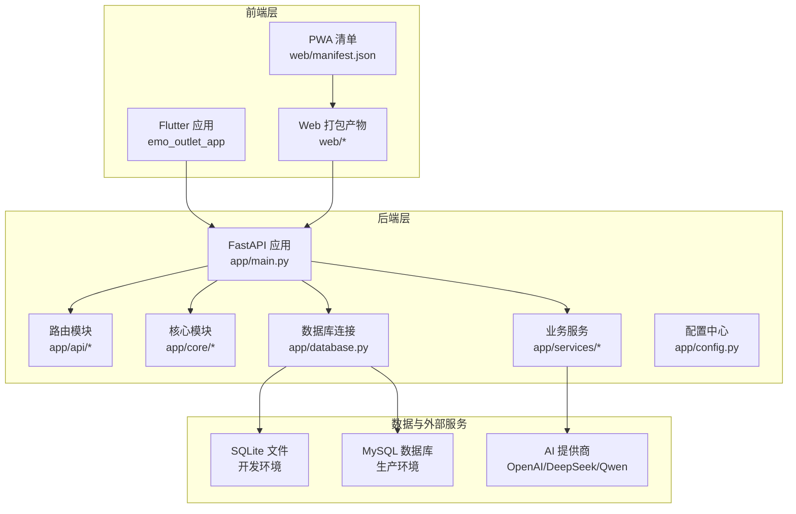
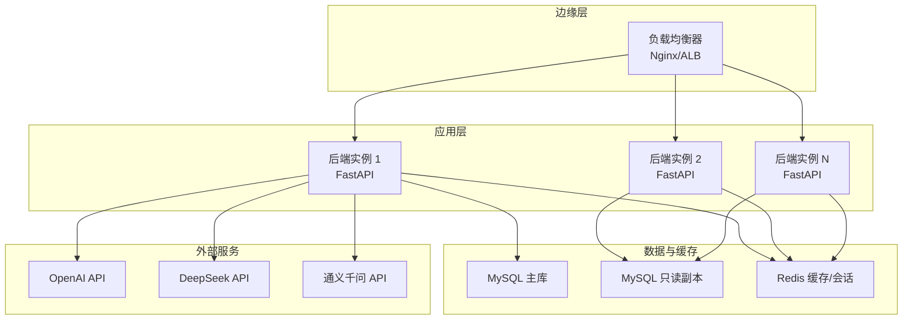
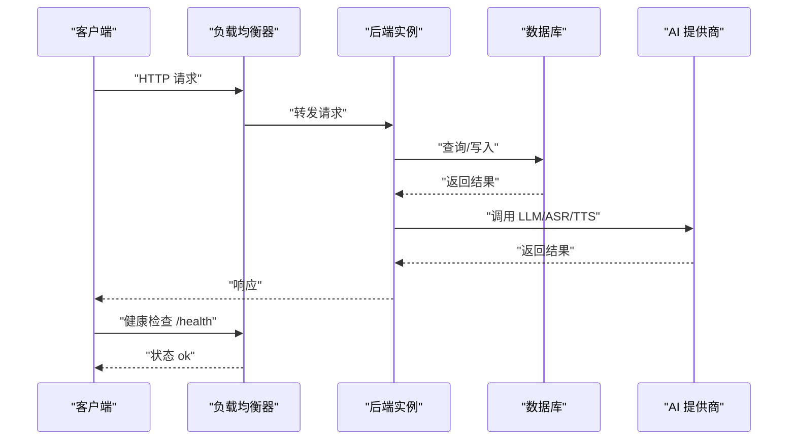
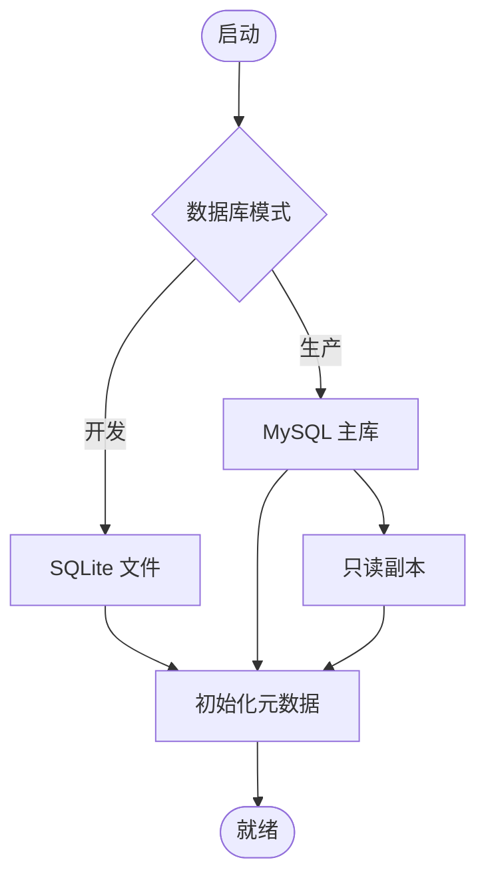
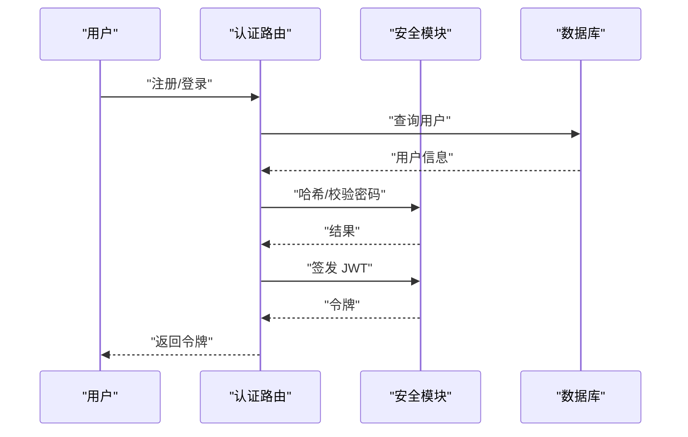
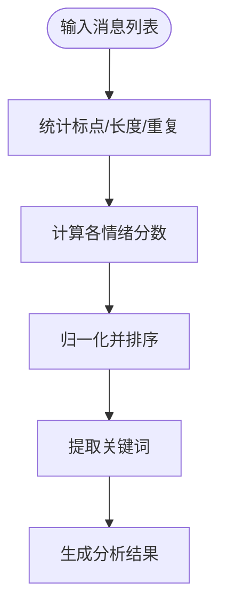
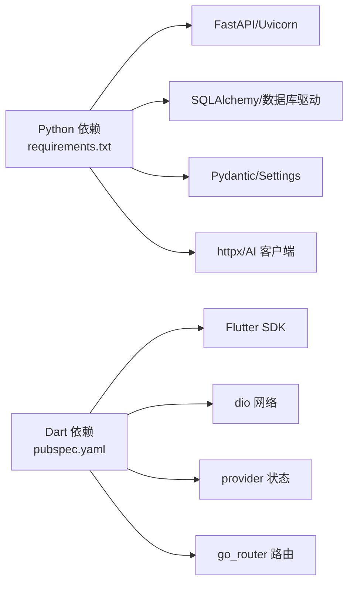

# 部署拓扑架构

<cite>
**本文引用的文件**
- [README.md](file://README.md)
- [emo_outlet_api/requirements.txt](file://emo_outlet_api/requirements.txt)
- [emo_outlet_api/setup.cfg](file://emo_outlet_api/setup.cfg)
- [emo_outlet_api/run.py](file://emo_outlet_api/run.py)
- [emo_outlet_api/app/main.py](file://emo_outlet_api/app/main.py)
- [emo_outlet_api/app/config.py](file://emo_outlet_api/app/config.py)
- [emo_outlet_api/app/database.py](file://emo_outlet_api/app/database.py)
- [emo_outlet_api/app/api/auth.py](file://emo_outlet_api/app/api/auth.py)
- [emo_outlet_api/app/models/user.py](file://emo_outlet_api/app/models/user.py)
- [emo_outlet_api/app/models/session.py](file://emo_outlet_api/app/models/session.py)
- [emo_outlet_api/app/core/security.py](file://emo_outlet_api/app/core/security.py)
- [emo_outlet_api/app/services/emotion_service.py](file://emo_outlet_api/app/services/emotion_service.py)
- [emo_outlet_app/pubspec.yaml](file://emo_outlet_app/pubspec.yaml)
- [emo_outlet_app/web/manifest.json](file://emo_outlet_app/web/manifest.json)
</cite>

## 目录
1. [简介](#简介)
2. [项目结构](#项目结构)
3. [核心组件](#核心组件)
4. [架构总览](#架构总览)
5. [详细组件分析](#详细组件分析)
6. [依赖分析](#依赖分析)
7. [性能考虑](#性能考虑)
8. [故障排查指南](#故障排查指南)
9. [结论](#结论)
10. [附录](#附录)

## 简介
本文件面向 Emo Outlet 项目的部署与运维团队，提供从开发到生产的部署拓扑与运行环境要求，覆盖容器化部署、负载均衡与高可用、数据库架构与灾备、CI/CD 流水线、监控告警与日志、扩展性与弹性伸缩策略，并给出部署清单、环境变量与依赖管理说明。

## 项目结构
Emo Outlet 采用前后端分离架构：
- 前端：Flutter 应用，支持 Android/macOS，包含 Web 打包产物与 PWA 清单。
- 后端：Python FastAPI 应用，使用异步 SQLAlchemy 连接 MySQL 或 SQLite，提供 REST API。
- AI 引擎：通过 OpenAI/DeepSeek/通义千问等外部服务实现情绪分析与内容生成能力。

图表来源
- [emo_outlet_api/app/main.py:1-82](file://emo_outlet_api/app/main.py#L1-L82)
- [emo_outlet_api/app/database.py:1-43](file://emo_outlet_api/app/database.py#L1-L43)
- [emo_outlet_api/app/config.py:1-125](file://emo_outlet_api/app/config.py#L1-L125)
- [emo_outlet_app/web/manifest.json:1-36](file://emo_outlet_app/web/manifest.json#L1-L36)

章节来源
- [README.md:58-84](file://README.md#L58-L84)
- [emo_outlet_api/app/main.py:1-82](file://emo_outlet_api/app/main.py#L1-L82)
- [emo_outlet_api/app/database.py:1-43](file://emo_outlet_api/app/database.py#L1-L43)
- [emo_outlet_api/app/config.py:1-125](file://emo_outlet_api/app/config.py#L1-L125)
- [emo_outlet_app/web/manifest.json:1-36](file://emo_outlet_app/web/manifest.json#L1-L36)

## 核心组件
- 应用入口与生命周期：FastAPI 应用初始化、中间件注册、路由挂载、健康检查端点。
- 数据库层：异步引擎与会话工厂，支持 SQLite（开发）与 MySQL（生产）。
- 配置中心：统一读取 .env，支持数据库、Redis、AI、合规与安全参数。
- 安全模块：JWT 令牌签发与校验、密码哈希与校验。
- 业务服务：情绪分析、海报生成、会话与目标管理等。
- 前端应用：Flutter 主程序、Web 构建产物、PWA 清单。

章节来源
- [emo_outlet_api/app/main.py:14-82](file://emo_outlet_api/app/main.py#L14-L82)
- [emo_outlet_api/app/database.py:8-43](file://emo_outlet_api/app/database.py#L8-L43)
- [emo_outlet_api/app/config.py:12-125](file://emo_outlet_api/app/config.py#L12-L125)
- [emo_outlet_api/app/core/security.py:16-43](file://emo_outlet_api/app/core/security.py#L16-L43)
- [emo_outlet_api/app/services/emotion_service.py:44-181](file://emo_outlet_api/app/services/emotion_service.py#L44-L181)
- [emo_outlet_app/pubspec.yaml:1-52](file://emo_outlet_app/pubspec.yaml#L1-L52)

## 架构总览
下图展示了生产环境的典型部署拓扑：多实例后端通过反向代理对外暴露，数据库与缓存独立部署，AI 服务通过 API Key 调用外部提供商。

图表来源
- [emo_outlet_api/app/main.py:23-63](file://emo_outlet_api/app/main.py#L23-L63)
- [emo_outlet_api/app/config.py:22-52](file://emo_outlet_api/app/config.py#L22-L52)
- [emo_outlet_api/app/config.py:63-87](file://emo_outlet_api/app/config.py#L63-L87)

## 详细组件分析

### 后端服务部署策略
- 容器化：提供 Docker 快速启动示例，建议构建镜像并以环境变量注入配置。
- 实例数量：生产至少 2 个实例，结合健康检查与自动重启策略。
- 负载均衡：Nginx 或云厂商 ALB，启用会话亲和或无状态设计。
- 高可用：多可用区部署，数据库主从/只读副本，Redis 集群或哨兵模式。
- 健康检查：/health 端点返回应用状态与版本信息。

图表来源
- [emo_outlet_api/app/main.py:66-72](file://emo_outlet_api/app/main.py#L66-L72)
- [emo_outlet_api/run.py:19-31](file://emo_outlet_api/run.py#L19-L31)

章节来源
- [emo_outlet_api/run.py:19-31](file://emo_outlet_api/run.py#L19-L31)
- [emo_outlet_api/app/main.py:66-72](file://emo_outlet_api/app/main.py#L66-L72)

### 数据库部署架构
- 开发环境：SQLite（无需额外服务，便于本地快速启动）。
- 生产环境：MySQL 主库 + 只读副本，支持读写分离；Alembic 管理迁移。
- 连接池与事务：异步 SQLAlchemy 会话工厂，自动提交/回滚与关闭。
- 安全与合规：敏感字段端侧处理，审计日志可配置采样率。

图表来源
- [emo_outlet_api/app/database.py:8-43](file://emo_outlet_api/app/database.py#L8-L43)
- [emo_outlet_api/app/config.py:39-40](file://emo_outlet_api/app/config.py#L39-L40)
- [emo_outlet_api/app/config.py:22-37](file://emo_outlet_api/app/config.py#L22-L37)

章节来源
- [emo_outlet_api/app/database.py:8-43](file://emo_outlet_api/app/database.py#L8-L43)
- [emo_outlet_api/app/config.py:39-40](file://emo_outlet_api/app/config.py#L39-L40)
- [emo_outlet_api/app/config.py:22-37](file://emo_outlet_api/app/config.py#L22-L37)

### 认证与安全
- JWT 令牌：密钥、算法与过期时间可配置；提供访问令牌签发与校验。
- 密码哈希：bcrypt；登录/注册流程校验与生成令牌。
- 安全参数：最大消息长度、每日会话上限、敏感词过滤开关等。

图表来源
- [emo_outlet_api/app/api/auth.py:34-118](file://emo_outlet_api/app/api/auth.py#L34-L118)
- [emo_outlet_api/app/core/security.py:16-43](file://emo_outlet_api/app/core/security.py#L16-L43)

章节来源
- [emo_outlet_api/app/api/auth.py:34-118](file://emo_outlet_api/app/api/auth.py#L34-L118)
- [emo_outlet_api/app/core/security.py:16-43](file://emo_outlet_api/app/core/security.py#L16-L43)
- [emo_outlet_api/app/config.py:88-92](file://emo_outlet_api/app/config.py#L88-L92)

### 情绪分析与海报生成
- 情绪分析：基于关键词与文本统计计算情绪分数，输出主要情绪、强度、关键词与建议。
- 海报生成：结合情绪分析结果生成可视化海报（接口路径见 README）。

图表来源
- [emo_outlet_api/app/services/emotion_service.py:44-181](file://emo_outlet_api/app/services/emotion_service.py#L44-L181)

章节来源
- [emo_outlet_api/app/services/emotion_service.py:44-181](file://emo_outlet_api/app/services/emotion_service.py#L44-L181)
- [README.md:88-104](file://README.md#L88-L104)

### 前端部署策略
- Flutter 构建：生成 web 打包产物，部署至静态站点或 CDN。
- PWA 支持：通过 manifest.json 提供离线体验与安装提示。
- 域名与证书：建议启用 HTTPS，配置 CORS 与安全头。

章节来源
- [emo_outlet_app/pubspec.yaml:42-52](file://emo_outlet_app/pubspec.yaml#L42-L52)
- [emo_outlet_app/web/manifest.json:1-36](file://emo_outlet_app/web/manifest.json#L1-L36)

## 依赖分析
- 后端依赖：FastAPI、Uvicorn、SQLAlchemy asyncio、aiomysql/aiosqlite、Pydantic/Settings、OpenAI、httpx 等。
- 前端依赖：Flutter SDK、provider、go_router、dio、shared_preferences、intl、uuid 等。
- 构建忽略：Python 构建产物、.env、数据库文件、虚拟环境等。

图表来源
- [emo_outlet_api/requirements.txt:1-29](file://emo_outlet_api/requirements.txt#L1-L29)
- [emo_outlet_app/pubspec.yaml:9-41](file://emo_outlet_app/pubspec.yaml#L9-L41)
- [emo_outlet_api/setup.cfg:3-17](file://emo_outlet_api/setup.cfg#L3-L17)

章节来源
- [emo_outlet_api/requirements.txt:1-29](file://emo_outlet_api/requirements.txt#L1-L29)
- [emo_outlet_app/pubspec.yaml:9-41](file://emo_outlet_app/pubspec.yaml#L9-L41)
- [emo_outlet_api/setup.cfg:3-17](file://emo_outlet_api/setup.cfg#L3-L17)

## 性能考虑
- 数据库：生产使用 MySQL 主从复制与只读副本分担读流量；连接池参数按并发调整。
- 缓存：Redis 用于会话与热点数据缓存，建议集群与持久化策略。
- AI 调用：合理设置超时与重试，避免阻塞请求线程；对高频调用增加本地缓存。
- 前端：静态资源开启压缩与缓存，PWA 提升离线体验。
- 监控：埋点关键链路耗时，结合 APM 与日志聚合。

## 故障排查指南
- 健康检查：访问 /health 确认应用存活与版本信息。
- 日志：请求中间件打印方法、路径与耗时；生产建议集中化日志采集。
- 数据库：确认连接字符串、驱动版本与网络连通性；迁移脚本需在停机窗口执行。
- 认证：核对 SECRET_KEY、算法与过期时间；检查令牌签名与解析。
- AI 服务：核对 API Key 与 Base URL；关注限流与费用控制。

章节来源
- [emo_outlet_api/app/main.py:33-39](file://emo_outlet_api/app/main.py#L33-L39)
- [emo_outlet_api/app/main.py:66-72](file://emo_outlet_api/app/main.py#L66-L72)
- [emo_outlet_api/app/config.py:55-61](file://emo_outlet_api/app/config.py#L55-L61)

## 结论
Emo Outlet 的部署架构以“前后端分离 + 异步后端 + 外部 AI 服务”为核心，强调可扩展与可维护性。通过容器化、负载均衡与数据库主从/只读副本，可在保证高可用的同时实现弹性伸缩。配合完善的监控与日志体系，可有效支撑从开发到生产的全生命周期运维。

## 附录

### 环境变量与配置要点
- 应用基础：APP_NAME、APP_VERSION、DEBUG、HOST、PORT。
- 数据库：DB_HOST、DB_PORT、DB_USER、DB_PASSWORD、DB_NAME、DATABASE_URL（优先级高于分段配置）、SQLITE_URL。
- 缓存：REDIS_HOST、REDIS_PORT、REDIS_DB、REDIS_URL。
- 安全：SECRET_KEY、ALGORITHM、ACCESS_TOKEN_EXPIRE_MINUTES。
- AI 与模型：LLM_PROVIDER、OPENAI_*、DEEPSEEK_*、QWEN_*、LLM_MODEL、IMAGE_MODEL、IMAGE_SIZE。
- ASR/TTS：ASR_PROVIDER、TTS_PROVIDER。
- 存储：OSS_ENABLED、OSS_*。
- 合规与安全：MAX_*、ENABLE_AUDIT_LOG、AUDIT_LOG_SAMPLE_RATE、DIALECT_DATA_DIR。

章节来源
- [emo_outlet_api/app/config.py:12-125](file://emo_outlet_api/app/config.py#L12-L125)

### 部署清单（建议）
- 基础设施
  - 反向代理：Nginx/ALB，HTTPS 证书，CORS 配置。
  - 数据库：MySQL 主库 + 只读副本，备份策略（定时快照/增量日志）。
  - 缓存：Redis 集群/哨兵，持久化策略。
- 应用
  - Docker 镜像：构建并推送至镜像仓库。
  - 配置：.env 文件，密钥管理，环境变量注入。
  - 实例：至少 2 个后端实例，健康检查与自动扩缩容。
- 外部服务
  - AI 提供商：API Key 与 Base URL，限额与费用控制。
- 监控与日志
  - APM/指标：QPS、P95/P99、错误率、AI 调用耗时。
  - 日志：请求日志、业务日志、审计日志，集中化采集与检索。
  - 告警：阈值告警、异常检测、SLA 达成率。

### CI/CD 流水线设计（建议）
- 触发条件：push 到 main/master，PR 合并，tag 推送。
- 步骤：
  - 代码检查与单元测试（Python/Dart）。
  - 构建镜像并推送。
  - 健康检查与灰度发布。
  - 自动化回归测试（可选）。
  - 发布报告与变更记录。
- 版本管理：语义化版本，Git Tag 与 Changelog。

### 扩展性与弹性伸缩策略
- 水平扩展：后端实例按 CPU/内存/队列长度动态扩缩。
- 读写分离：只读流量走副本，写流量走主库。
- 缓存优化：热点数据预热，失效策略与一致性保障。
- AI 限流：令牌桶/滑动窗口，熔断与降级策略。
- 存储：对象存储用于海报与媒体，CDN 加速。