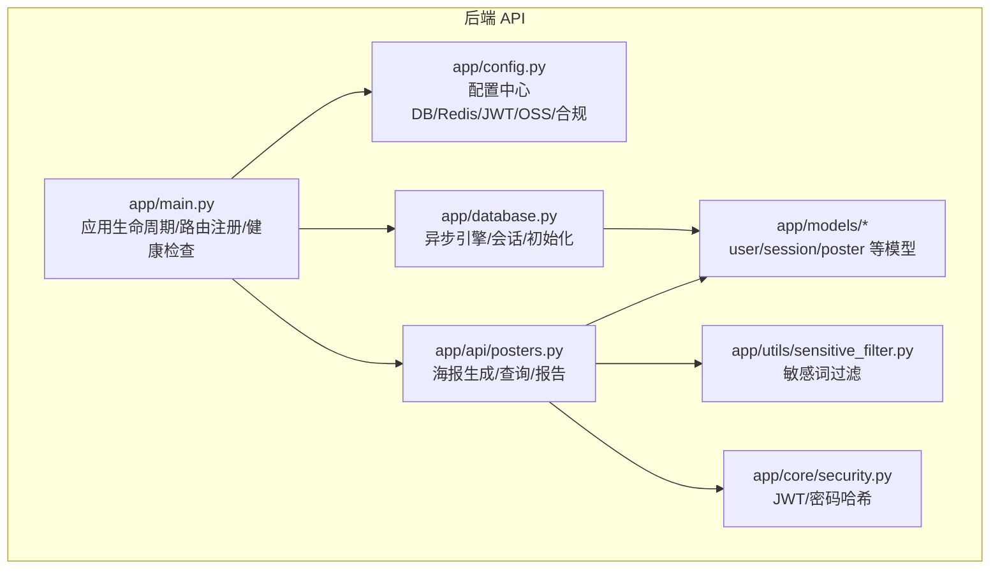
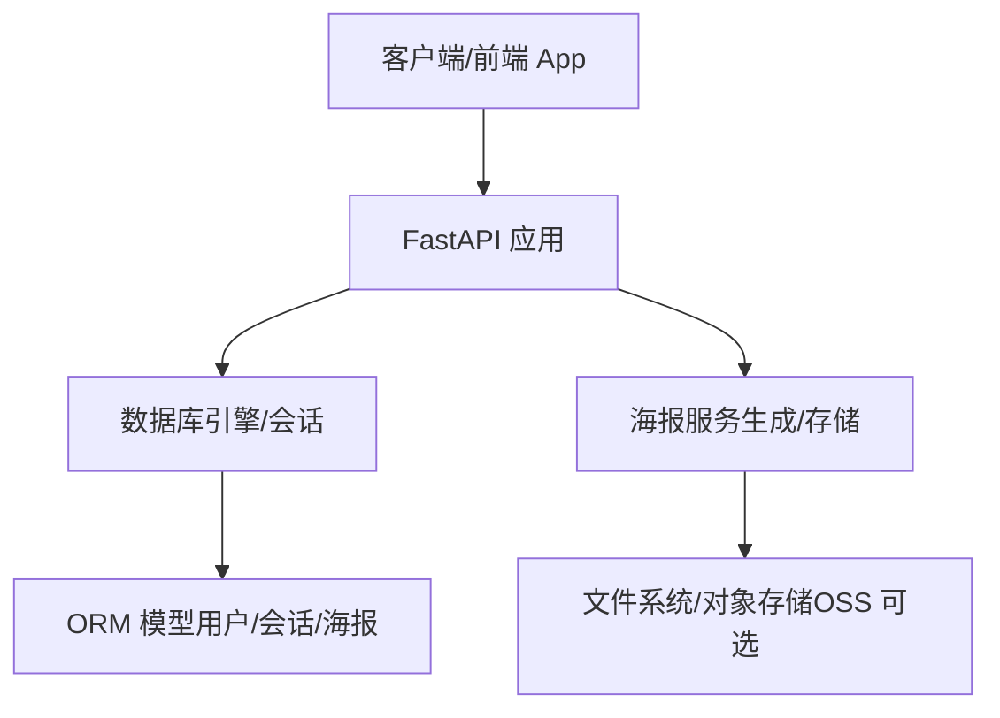
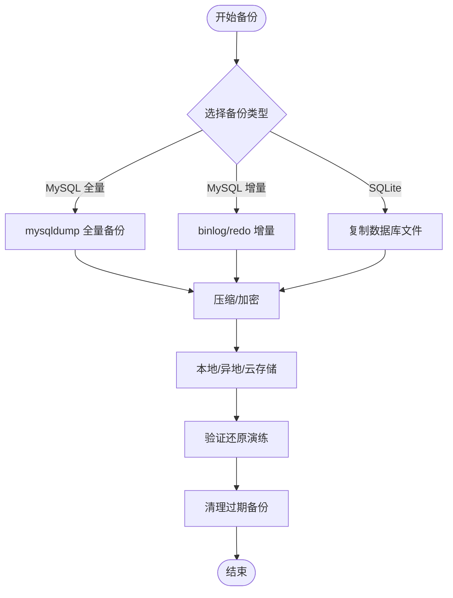
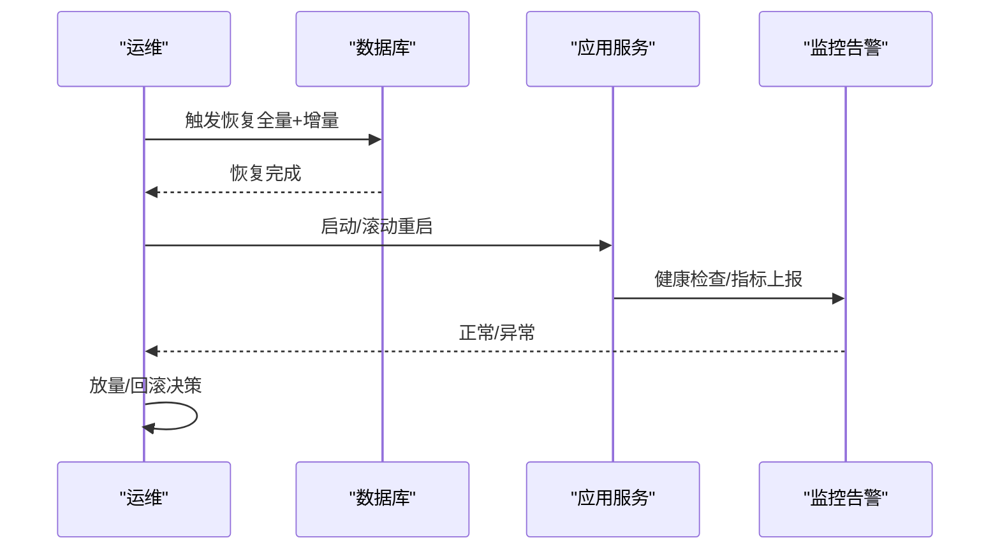
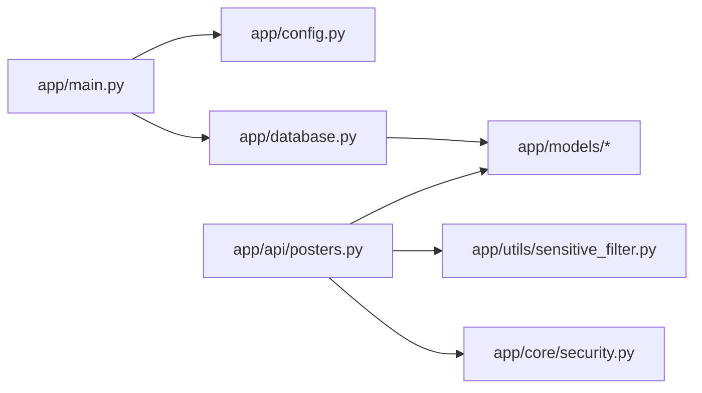

# 备份恢复策略

<cite>
**本文引用的文件**   
- [emo_outlet_api/app/config.py](file://emo_outlet_api/app/config.py)
- [emo_outlet_api/app/database.py](file://emo_outlet_api/app/database.py)
- [emo_outlet_api/app/main.py](file://emo_outlet_api/app/main.py)
- [emo_outlet_api/app/models/user.py](file://emo_outlet_api/app/models/user.py)
- [emo_outlet_api/app/models/session.py](file://emo_outlet_api/app/models/session.py)
- [emo_outlet_api/app/models/poster.py](file://emo_outlet_api/app/models/poster.py)
- [emo_outlet_api/app/api/posters.py](file://emo_outlet_api/app/api/posters.py)
- [emo_outlet_api/app/utils/sensitive_filter.py](file://emo_outlet_api/app/utils/sensitive_filter.py)
- [emo_outlet_api/app/core/security.py](file://emo_outlet_api/app/core/security.py)
- [emo_outlet_api/run.py](file://emo_outlet_api/run.py)
- [emo_outlet_api/requirements.txt](file://emo_outlet_api/requirements.txt)
- [README.md](file://README.md)
</cite>

## 目录
1. [引言](#引言)
2. [项目结构](#项目结构)
3. [核心组件](#核心组件)
4. [架构总览](#架构总览)
5. [详细组件分析](#详细组件分析)
6. [依赖分析](#依赖分析)
7. [性能考虑](#性能考虑)
8. [故障排查指南](#故障排查指南)
9. [结论](#结论)
10. [附录](#附录)

## 引言
本策略文档面向 Emo Outlet 项目，围绕数据库与文件系统的备份与恢复、灾难恢复计划、业务连续性、备份自动化工具、恢复测试流程、数据迁移指南以及备份数据安全管理等方面，提供可落地的方案与最佳实践。文档同时结合项目现有技术栈（Python FastAPI、SQLAlchemy、MySQL/SQLite、AI 服务等）进行针对性设计。

## 项目结构
Emo Outlet 采用前后端分离架构，后端 API 使用 Python FastAPI + SQLAlchemy，数据库默认支持 MySQL（生产）与 SQLite（开发）。AI 服务通过外部 LLM 提供商对接，敏感词过滤与安全模块独立实现。海报生成涉及会话与情绪分析结果的持久化。

**图表来源**
- [emo_outlet_api/app/main.py:1-82](file://emo_outlet_api/app/main.py#L1-L82)
- [emo_outlet_api/app/config.py:1-125](file://emo_outlet_api/app/config.py#L1-L125)
- [emo_outlet_api/app/database.py:1-43](file://emo_outlet_api/app/database.py#L1-L43)
- [emo_outlet_api/app/models/user.py:1-52](file://emo_outlet_api/app/models/user.py#L1-L52)
- [emo_outlet_api/app/models/session.py:1-79](file://emo_outlet_api/app/models/session.py#L1-L79)
- [emo_outlet_api/app/models/poster.py:1-61](file://emo_outlet_api/app/models/poster.py#L1-L61)
- [emo_outlet_api/app/api/posters.py:1-383](file://emo_outlet_api/app/api/posters.py#L1-L383)
- [emo_outlet_api/app/utils/sensitive_filter.py:1-142](file://emo_outlet_api/app/utils/sensitive_filter.py#L1-L142)
- [emo_outlet_api/app/core/security.py:1-43](file://emo_outlet_api/app/core/security.py#L1-L43)

**章节来源**
- [README.md:1-151](file://README.md#L1-L151)
- [emo_outlet_api/app/main.py:1-82](file://emo_outlet_api/app/main.py#L1-L82)
- [emo_outlet_api/app/config.py:1-125](file://emo_outlet_api/app/config.py#L1-L125)

## 核心组件
- 配置中心：集中管理数据库连接、Redis、AI 服务、OSS、安全与合规参数，支持 .env 文件加载。
- 数据库层：异步 SQLAlchemy 引擎，支持 MySQL（生产）与 SQLite（开发），提供会话工厂与初始化入口。
- 模型层：用户、会话、海报等核心实体，承载业务数据与关系。
- API 层：海报相关接口负责生成、查询、报告与删除，依赖情绪分析与海报服务。
- 安全与合规：JWT 认证、密码哈希、敏感词过滤与高风险模式检测，保障数据与内容安全。
- 启动与部署：提供开发/生产启动方式与 Docker 部署说明。

**章节来源**
- [emo_outlet_api/app/config.py:1-125](file://emo_outlet_api/app/config.py#L1-L125)
- [emo_outlet_api/app/database.py:1-43](file://emo_outlet_api/app/database.py#L1-L43)
- [emo_outlet_api/app/models/user.py:1-52](file://emo_outlet_api/app/models/user.py#L1-L52)
- [emo_outlet_api/app/models/session.py:1-79](file://emo_outlet_api/app/models/session.py#L1-L79)
- [emo_outlet_api/app/models/poster.py:1-61](file://emo_outlet_api/app/models/poster.py#L1-L61)
- [emo_outlet_api/app/api/posters.py:1-383](file://emo_outlet_api/app/api/posters.py#L1-L383)
- [emo_outlet_api/app/utils/sensitive_filter.py:1-142](file://emo_outlet_api/app/utils/sensitive_filter.py#L1-L142)
- [emo_outlet_api/app/core/security.py:1-43](file://emo_outlet_api/app/core/security.py#L1-L43)
- [emo_outlet_api/run.py:1-31](file://emo_outlet_api/run.py#L1-L31)

## 架构总览
下图展示备份与恢复相关的数据流与组件交互，强调数据库与文件系统（海报 Base64 数据）的备份关注点。

**图表来源**
- [emo_outlet_api/app/main.py:1-82](file://emo_outlet_api/app/main.py#L1-L82)
- [emo_outlet_api/app/database.py:1-43](file://emo_outlet_api/app/database.py#L1-L43)
- [emo_outlet_api/app/models/user.py:1-52](file://emo_outlet_api/app/models/user.py#L1-L52)
- [emo_outlet_api/app/models/session.py:1-79](file://emo_outlet_api/app/models/session.py#L1-L79)
- [emo_outlet_api/app/models/poster.py:1-61](file://emo_outlet_api/app/models/poster.py#L1-L61)
- [emo_outlet_api/app/api/posters.py:1-383](file://emo_outlet_api/app/api/posters.py#L1-L383)

## 详细组件分析

### 数据库备份方案
- 备份介质与目标
  - MySQL 生产库：使用逻辑备份（如 mysqldump）与物理备份（如 Percona XtraBackup）相结合，按需选择增量备份策略。
  - SQLite 开发库：直接复制数据库文件进行备份。
- 备份频率与窗口
  - 全量备份：每日一次（低峰时段，如凌晨 2:00-6:00）。
  - 增量备份：每 4 小时代理 binlog 或 redo 日志，配合全量备份恢复。
- 备份验证
  - 每周随机抽取最近 3 天的备份进行还原演练，验证完整性与可恢复性。
- 存储策略
  - 本地保留最近 7 天；异地/云存储保留 30 天；超过 30 天的归档至低成本存储。
- 备份保留与清理
  - 基于时间的保留策略（TTL），定期清理过期备份，避免磁盘占用。
- 备份加密
  - 传输与静态加密（如 AES-256），密钥由运维密管系统管理。
- 备份监控与告警
  - 监控备份任务执行状态、失败重试次数、存储空间与压缩率；异常即时告警。

**图表来源**
- [emo_outlet_api/app/config.py:22-40](file://emo_outlet_api/app/config.py#L22-L40)
- [emo_outlet_api/app/database.py:8-15](file://emo_outlet_api/app/database.py#L8-L15)

**章节来源**
- [emo_outlet_api/app/config.py:22-40](file://emo_outlet_api/app/config.py#L22-L40)
- [emo_outlet_api/app/database.py:8-15](file://emo_outlet_api/app/database.py#L8-L15)

### 文件系统备份
- 用户上传文件与生成海报
  - 海报数据在数据库中以 Base64 字段存储，属于结构化数据，随数据库备份一并保护。
  - 若未来启用对象存储（OSS），需对 OSS 桶进行独立备份与版本控制。
- 日志文件
  - 应用日志与审计日志建议单独归档，保留周期根据合规要求设定（如 90 天）。
- 备份策略
  - 结构化数据（数据库）：按上述数据库备份策略。
  - 非结构化数据（日志/附件）：按天/周归档，保留期与合规一致。

**章节来源**
- [emo_outlet_api/app/models/poster.py:43-49](file://emo_outlet_api/app/models/poster.py#L43-L49)
- [emo_outlet_api/app/config.py:81-87](file://emo_outlet_api/app/config.py#L81-L87)
- [README.md:119-127](file://README.md#L119-L127)

### 灾难恢复计划（DRP）
- RTO/RPO 目标
  - RTO：核心业务（会话/海报/用户）恢复时间不超过 4 小时。
  - RPO：数据丢失不超过 15 分钟（结合增量备份与日志恢复）。
- 故障场景
  - 数据库实例故障：切换到备用实例或异地灾备库。
  - 磁盘损坏：从备份恢复；若为共享存储，优先恢复卷。
  - 应用服务故障：滚动重启或蓝绿发布回滚。
  - 网络/中间件故障：切换到备用网络或上游服务。
- 恢复流程
  - 评估影响范围与级别，启动应急响应。
  - 恢复数据库（全量 + 增量），重建索引与缓存。
  - 恢复应用服务，进行健康检查与灰度验证。
  - 逐步放量，监控指标与告警。
- 测试验证
  - 每季度进行一次“部分场景”演练（如数据库恢复），每半年一次“全链路”演练。

**图表来源**
- [emo_outlet_api/app/main.py:66-72](file://emo_outlet_api/app/main.py#L66-L72)
- [emo_outlet_api/app/database.py:34-42](file://emo_outlet_api/app/database.py#L34-L42)

**章节来源**
- [emo_outlet_api/app/main.py:66-72](file://emo_outlet_api/app/main.py#L66-L72)
- [emo_outlet_api/app/database.py:34-42](file://emo_outlet_api/app/database.py#L34-L42)

### 业务连续性规划
- 高可用架构
  - 应用：多副本部署，负载均衡，健康检查与自动扩缩容。
  - 数据库：主从复制/集群，自动故障转移与读写分离。
  - 缓存：Redis 集群，哨兵或 Sentinel 保障高可用。
- 故障转移机制
  - 应用：蓝绿/金丝雀发布，回滚策略明确。
  - 数据库：跨机房/跨地域复制，自动切换。
- 数据同步与一致性
  - 事务内一致性，幂等接口设计，补偿机制（如消息队列重试）。
  - 读写分离场景下的最终一致性，必要时引入分布式锁或版本号。

**章节来源**
- [emo_outlet_api/app/config.py:42-52](file://emo_outlet_api/app/config.py#L42-L52)
- [emo_outlet_api/app/core/security.py:26-42](file://emo_outlet_api/app/core/security.py#L26-L42)

### 备份自动化工具
- Cron 作业
  - 每日凌晨 2:10 执行全量备份；每 4 小时执行增量备份。
  - 每日 3:00 执行备份验证与压缩率/容量监控。
- 备份脚本
  - 统一封装 mysqldump/Percona XtraBackup/SQLite 复制脚本，支持参数化配置与日志输出。
- 监控告警
  - Prometheus/Grafana 监控备份任务成功率、耗时、存储空间；钉钉/企业微信告警。

**章节来源**
- [emo_outlet_api/run.py:14-23](file://emo_outlet_api/run.py#L14-L23)

### 恢复测试流程
- 测试目标
  - 验证备份数据完整性、可恢复性与业务可用性。
- 测试步骤
  - 选择最近 3 天备份，隔离环境还原。
  - 执行关键业务路径（用户登录、创建会话、生成海报、查看报告）。
  - 记录耗时、错误与修复项，形成测试报告。
- 测试频率
  - 每周一次抽样测试，每季度一次全量演练。

**章节来源**
- [emo_outlet_api/app/api/posters.py:72-137](file://emo_outlet_api/app/api/posters.py#L72-L137)

### 数据迁移指南
- 版本升级
  - 使用 Alembic 迁移脚本管理数据库结构变更；升级前先备份。
- 架构变更
  - 新增/删除表、索引、字段时，先在测试环境验证迁移脚本。
- 云平台迁移
  - 评估目标平台的数据库兼容性（MySQL 兼容性）、网络与安全组策略。
  - 使用逻辑导出导入或物理备份迁移，迁移后进行一致性校验。

**章节来源**
- [README.md:107-116](file://README.md#L107-L116)
- [emo_outlet_api/app/database.py:34-38](file://emo_outlet_api/app/database.py#L34-L38)

### 备份数据安全管理
- 加密存储
  - 备份文件传输与静态存储均采用 AES-256 加密，密钥由 KMS 管理。
- 访问控制
  - 最小权限原则，仅授权运维与 DBA 访问备份系统；审计日志记录所有操作。
- 合规要求
  - 遵循个人信息保护法与行业标准，明确数据保留期限与销毁流程。
- 审计与追溯
  - 备份任务日志、访问日志、恢复记录纳入统一审计平台。

**章节来源**
- [emo_outlet_api/app/config.py:88-114](file://emo_outlet_api/app/config.py#L88-L114)
- [emo_outlet_api/app/utils/sensitive_filter.py:1-142](file://emo_outlet_api/app/utils/sensitive_filter.py#L1-L142)

## 依赖分析
- 组件耦合
  - 应用启动依赖配置与数据库初始化；API 路由依赖模型与服务；安全模块贯穿认证与敏感词过滤。
- 外部依赖
  - MySQL/SQLite、Redis、AI 服务提供商、可选 OSS。
- 潜在风险
  - 单点故障（数据库主节点）、网络延迟（AI 服务）、敏感词误判（规则更新）。

**图表来源**
- [emo_outlet_api/app/main.py:1-82](file://emo_outlet_api/app/main.py#L1-L82)
- [emo_outlet_api/app/config.py:1-125](file://emo_outlet_api/app/config.py#L1-L125)
- [emo_outlet_api/app/database.py:1-43](file://emo_outlet_api/app/database.py#L1-L43)
- [emo_outlet_api/app/models/user.py:1-52](file://emo_outlet_api/app/models/user.py#L1-L52)
- [emo_outlet_api/app/models/session.py:1-79](file://emo_outlet_api/app/models/session.py#L1-L79)
- [emo_outlet_api/app/models/poster.py:1-61](file://emo_outlet_api/app/models/poster.py#L1-L61)
- [emo_outlet_api/app/api/posters.py:1-383](file://emo_outlet_api/app/api/posters.py#L1-L383)
- [emo_outlet_api/app/utils/sensitive_filter.py:1-142](file://emo_outlet_api/app/utils/sensitive_filter.py#L1-L142)
- [emo_outlet_api/app/core/security.py:1-43](file://emo_outlet_api/app/core/security.py#L1-L43)

**章节来源**
- [emo_outlet_api/app/main.py:1-82](file://emo_outlet_api/app/main.py#L1-L82)
- [emo_outlet_api/app/config.py:1-125](file://emo_outlet_api/app/config.py#L1-L125)
- [emo_outlet_api/app/database.py:1-43](file://emo_outlet_api/app/database.py#L1-L43)
- [emo_outlet_api/app/api/posters.py:1-383](file://emo_outlet_api/app/api/posters.py#L1-L383)

## 性能考虑
- 备份性能
  - 全量备份在低峰期执行；增量备份减少对业务的影响。
  - 压缩与分片传输，降低带宽占用。
- 恢复性能
  - 预热热点数据与索引，缩短恢复时间。
- 监控指标
  - 备份耗时、并发连接数、IO 吞吐、网络带宽利用率。

## 故障排查指南
- 常见问题
  - 备份失败：检查数据库连接、磁盘空间、权限与网络。
  - 恢复异常：核对备份文件完整性、版本兼容性与依赖服务状态。
  - 恢复慢：检查 IO 与 CPU 利用率，优化索引重建策略。
- 工具与命令
  - 备份：mysqldump/Percona XtraBackup/SQLite 文件复制。
  - 验证：校验和/MD5、抽样查询、关键接口回归测试。
  - 监控：Prometheus/Grafana/日志分析。

**章节来源**
- [emo_outlet_api/app/database.py:34-42](file://emo_outlet_api/app/database.py#L34-L42)
- [emo_outlet_api/app/api/posters.py:72-137](file://emo_outlet_api/app/api/posters.py#L72-L137)

## 结论
本策略文档基于 Emo Outlet 项目的技术栈与业务特性，制定了覆盖数据库与文件系统的备份方案、灾难恢复计划、业务连续性设计、自动化工具与安全管控的完整体系。建议在生产环境中严格执行备份验证与演练，并持续优化备份窗口与恢复策略，以满足 RTO/RPO 目标与合规要求。

## 附录
- 快速参考
  - 开发启动：参见 [run.py:34-42](file://emo_outlet_api/run.py#L34-L42)
  - 生产部署：参见 [run.py:14-23](file://emo_outlet_api/run.py#L14-L23)
  - 依赖清单：参见 [requirements.txt:1-29](file://emo_outlet_api/requirements.txt#L1-L29)
  - 数据库设计：参见 [README.md:107-116](file://README.md#L107-L116)