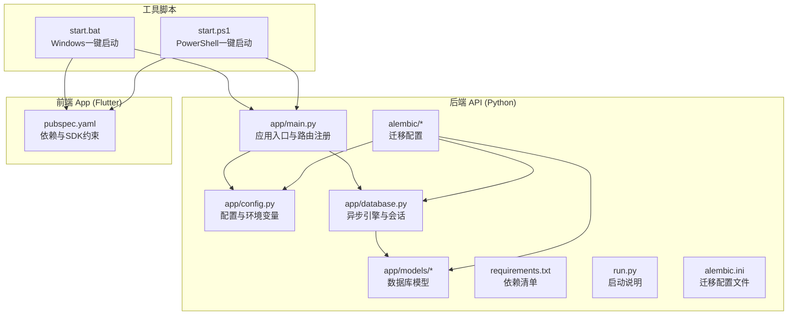
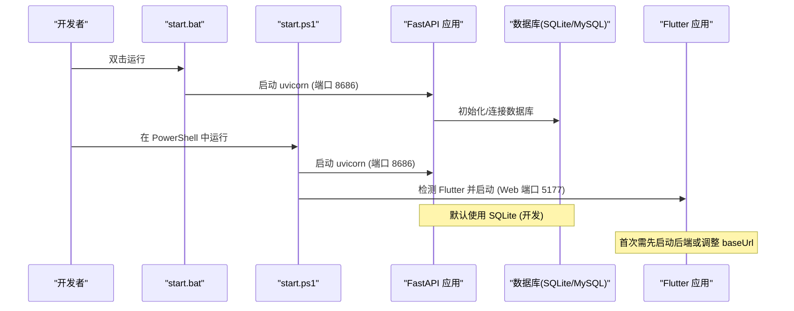
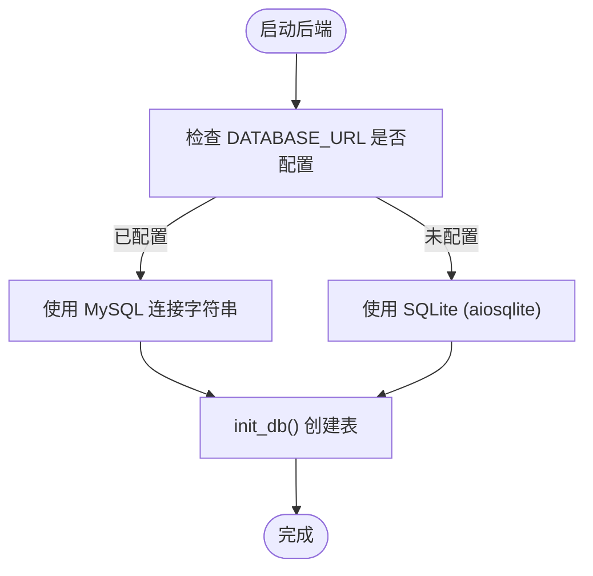
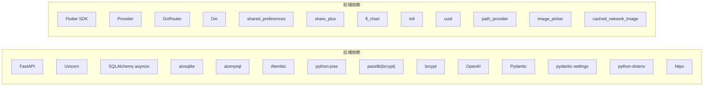

# 开发环境搭建

<cite>
**本文引用的文件**
- [README.md](file://README.md)
- [start.bat](file://start.bat)
- [start.ps1](file://start.ps1)
- [emo_outlet_api/requirements.txt](file://emo_outlet_api/requirements.txt)
- [emo_outlet_api/setup.cfg](file://emo_outlet_api/setup.cfg)
- [emo_outlet_api/run.py](file://emo_outlet_api/run.py)
- [emo_outlet_api/alembic.ini](file://emo_outlet_api/alembic.ini)
- [emo_outlet_api/app/main.py](file://emo_outlet_api/app/main.py)
- [emo_outlet_api/app/config.py](file://emo_outlet_api/app/config.py)
- [emo_outlet_api/app/database.py](file://emo_outlet_api/app/database.py)
- [emo_outlet_api/alembic/env.py](file://emo_outlet_api/alembic/env.py)
- [emo_outlet_api/app/models/user.py](file://emo_outlet_api/app/models/user.py)
- [emo_outlet_api/app/models/target.py](file://emo_outlet_api/app/models/target.py)
- [emo_outlet_api/app/models/session.py](file://emo_outlet_api/app/models/session.py)
- [emo_outlet_app/pubspec.yaml](file://emo_outlet_app/pubspec.yaml)
</cite>

## 目录
1. [简介](#简介)
2. [项目结构](#项目结构)
3. [核心组件](#核心组件)
4. [架构总览](#架构总览)
5. [详细组件分析](#详细组件分析)
6. [依赖分析](#依赖分析)
7. [性能考虑](#性能考虑)
8. [故障排除指南](#故障排除指南)
9. [结论](#结论)
10. [附录](#附录)

## 简介
本指南面向首次参与 Emo Outlet 项目的开发者，提供从零搭建 Python 后端与 Flutter 前端开发环境的完整步骤，涵盖以下要点：
- Python 后端：Python 版本要求、虚拟环境创建、FastAPI 框架安装、数据库依赖（SQLite 开发）、环境变量配置与数据库初始化。
- Flutter 前端：Flutter SDK 安装、Dart 环境、IDE 设置、设备/模拟器配置。
- 一键启动脚本：Windows 批处理与 PowerShell 脚本的使用方法与注意事项。
- 常见问题排查：端口冲突、依赖版本不兼容、网络代理与跨域等。

## 项目结构
Emo Outlet 采用前后端分离架构：
- 后端 API：基于 Python FastAPI + SQLAlchemy（异步）+ Alembic 迁移，支持 SQLite（开发）与 MySQL（生产）。
- 前端 App：基于 Flutter，使用 Provider 状态管理、GoRouter 路由、Dio 网络请求等。
- 一键启动：提供 Windows 批处理与 PowerShell 脚本，同时启动后端与前端（若检测到 Flutter）。

图表来源
- [emo_outlet_api/app/main.py:1-82](file://emo_outlet_api/app/main.py#L1-L82)
- [emo_outlet_api/app/config.py:1-125](file://emo_outlet_api/app/config.py#L1-L125)
- [emo_outlet_api/app/database.py:1-43](file://emo_outlet_api/app/database.py#L1-L43)
- [emo_outlet_api/alembic/env.py:1-71](file://emo_outlet_api/alembic/env.py#L1-L71)
- [emo_outlet_api/alembic.ini:1-38](file://emo_outlet_api/alembic.ini#L1-L38)
- [emo_outlet_api/requirements.txt:1-29](file://emo_outlet_api/requirements.txt#L1-L29)
- [emo_outlet_api/run.py:1-31](file://emo_outlet_api/run.py#L1-L31)
- [emo_outlet_app/pubspec.yaml:1-52](file://emo_outlet_app/pubspec.yaml#L1-L52)
- [start.bat:1-43](file://start.bat#L1-L43)
- [start.ps1:1-65](file://start.ps1#L1-L65)

章节来源
- [README.md:58-84](file://README.md#L58-L84)
- [emo_outlet_api/app/main.py:1-82](file://emo_outlet_api/app/main.py#L1-L82)
- [emo_outlet_api/app/config.py:1-125](file://emo_outlet_api/app/config.py#L1-L125)
- [emo_outlet_api/app/database.py:1-43](file://emo_outlet_api/app/database.py#L1-L43)
- [emo_outlet_api/alembic/env.py:1-71](file://emo_outlet_api/alembic/env.py#L1-L71)
- [emo_outlet_api/alembic.ini:1-38](file://emo_outlet_api/alembic.ini#L1-L38)
- [emo_outlet_api/requirements.txt:1-29](file://emo_outlet_api/requirements.txt#L1-L29)
- [emo_outlet_api/run.py:1-31](file://emo_outlet_api/run.py#L1-L31)
- [emo_outlet_app/pubspec.yaml:1-52](file://emo_outlet_app/pubspec.yaml#L1-L52)
- [start.bat:1-43](file://start.bat#L1-L43)
- [start.ps1:1-65](file://start.ps1#L1-L65)

## 核心组件
- 后端框架与运行
  - FastAPI + Uvicorn：提供高性能异步 API 服务，默认监听 0.0.0.0:8000（run.py 提供示例），实际一键脚本使用 8686 端口。
  - CORS：允许任意来源访问，便于前端调试。
  - 健康检查：/health。
- 数据库与迁移
  - SQLAlchemy 异步引擎 + aiomysql（生产）+ aiosqlite（开发）。
  - Alembic 迁移：默认 SQLite 路径在 alembic.ini 中配置。
  - 初始化：应用生命周期内自动创建表。
- 配置与环境变量
  - pydantic-settings 加载 .env；默认端口 8000，生产默认 MySQL 参数；开发可用 DATABASE_URL 留空自动走 SQLite。
  - AI 服务：OpenAI/DeepSeek/Qwen/Mock；可通过 LLM_PROVIDER 切换。
- 前端依赖与 SDK
  - Flutter SDK >= 3.0.0 < 4.0.0；Dio 网络、Provider 状态管理、GoRouter 路由、shared_preferences 等。

章节来源
- [emo_outlet_api/run.py:1-31](file://emo_outlet_api/run.py#L1-L31)
- [emo_outlet_api/app/main.py:23-48](file://emo_outlet_api/app/main.py#L23-L48)
- [emo_outlet_api/app/main.py:66-72](file://emo_outlet_api/app/main.py#L66-L72)
- [emo_outlet_api/app/config.py:18-37](file://emo_outlet_api/app/config.py#L18-L37)
- [emo_outlet_api/app/config.py:63-80](file://emo_outlet_api/app/config.py#L63-L80)
- [emo_outlet_api/alembic.ini:1-38](file://emo_outlet_api/alembic.ini#L1-L38)
- [emo_outlet_api/app/database.py:34-38](file://emo_outlet_api/app/database.py#L34-L38)
- [emo_outlet_app/pubspec.yaml:6-8](file://emo_outlet_app/pubspec.yaml#L6-L8)

## 架构总览
下图展示了开发环境启动流程与组件交互：

图表来源
- [start.bat:10-30](file://start.bat#L10-L30)
- [start.ps1:15-51](file://start.ps1#L15-L51)
- [emo_outlet_api/app/main.py:14-20](file://emo_outlet_api/app/main.py#L14-L20)
- [emo_outlet_api/app/database.py:34-38](file://emo_outlet_api/app/database.py#L34-L38)
- [README.md:46-54](file://README.md#L46-L54)

章节来源
- [start.bat:1-43](file://start.bat#L1-L43)
- [start.ps1:1-65](file://start.ps1#L1-L65)
- [emo_outlet_api/app/main.py:1-82](file://emo_outlet_api/app/main.py#L1-L82)
- [emo_outlet_api/app/database.py:1-43](file://emo_outlet_api/app/database.py#L1-L43)
- [README.md:46-54](file://README.md#L46-L54)

## 详细组件分析

### Python 后端开发环境搭建
- Python 版本
  - 项目配置文件声明 Python 版本为 3.11；建议使用 3.11.x 或 3.8+（满足最低要求）。
- 虚拟环境
  - 建议使用 venv 或 conda 创建隔离环境，避免全局包污染。
- 依赖安装
  - 安装后端依赖：pip install -r emo_outlet_api/requirements.txt。
- 运行方式
  - 开发模式：cd emo_outlet_api && uvicorn app.main:app --reload --host 0.0.0.0 --port 8000（run.py 提供示例）。
  - 一键脚本：start.bat/start.ps1 将使用 8686 端口启动后端，并尝试启动前端。
- 环境变量
  - 使用 .env 文件加载配置；默认端口 8000；开发可留 DATABASE_URL 空以启用 SQLite。
  - AI 服务：LLM_PROVIDER 可设为 openai/deepseek/qwen/mock；接入真实服务时配置对应 API Key。
- 数据库初始化
  - 应用启动时自动调用 init_db() 创建表；也可使用 Alembic 进行迁移管理。
  - Alembic 默认 SQLite 路径在 alembic.ini 中配置。

章节来源
- [emo_outlet_api/setup.cfg:3-4](file://emo_outlet_api/setup.cfg#L3-L4)
- [emo_outlet_api/requirements.txt:1-29](file://emo_outlet_api/requirements.txt#L1-L29)
- [emo_outlet_api/run.py:1-31](file://emo_outlet_api/run.py#L1-L31)
- [emo_outlet_api/app/config.py:18-37](file://emo_outlet_api/app/config.py#L18-L37)
- [emo_outlet_api/app/config.py:63-80](file://emo_outlet_api/app/config.py#L63-L80)
- [emo_outlet_api/alembic.ini:4-4](file://emo_outlet_api/alembic.ini#L4-L4)
- [emo_outlet_api/app/database.py:34-38](file://emo_outlet_api/app/database.py#L34-L38)
- [emo_outlet_api/alembic/env.py:26-30](file://emo_outlet_api/alembic/env.py#L26-L30)

### 数据库初始化与迁移
- 自动初始化
  - 应用生命周期内调用 init_db()，通过 Base.metadata.create_all 创建所有表。
- Alembic 迁移
  - 读取配置中的数据库 URL（优先 DATABASE_URL，否则回退到 SQLite）。
  - 支持离线/在线迁移，导入所有模型以生成迁移脚本或直接执行迁移。
- SQLite 文件
  - 开发环境下默认使用 ./emo_outlet.db；首次启动会自动创建。

图表来源
- [emo_outlet_api/app/database.py:8-38](file://emo_outlet_api/app/database.py#L8-L38)
- [emo_outlet_api/alembic/env.py:26-30](file://emo_outlet_api/alembic/env.py#L26-L30)
- [emo_outlet_api/alembic.ini:4-4](file://emo_outlet_api/alembic.ini#L4-L4)

章节来源
- [emo_outlet_api/app/database.py:34-38](file://emo_outlet_api/app/database.py#L34-L38)
- [emo_outlet_api/alembic/env.py:26-30](file://emo_outlet_api/alembic/env.py#L26-L30)
- [emo_outlet_api/alembic.ini:4-4](file://emo_outlet_api/alembic.ini#L4-L4)

### Flutter 前端开发环境搭建
- SDK 与 Dart
  - pubspec.yaml 约束 Flutter SDK 版本范围为 >=3.0.0 <4.0.0。
- 依赖安装
  - 在 emo_outlet_app 目录执行 flutter pub get 获取依赖。
- 运行与调试
  - flutter run 启动默认设备/模拟器；首次运行需确保后端已启动，或修改前端 baseUrl 指向后端地址。
- Web 调试
  - 一键脚本默认使用 Web 端口 5177；若需手动运行，可指定 --web-port=5177。

章节来源
- [emo_outlet_app/pubspec.yaml:6-8](file://emo_outlet_app/pubspec.yaml#L6-L8)
- [README.md:46-54](file://README.md#L46-L54)
- [start.bat:18-30](file://start.bat#L18-L30)
- [start.ps1:31-51](file://start.ps1#L31-L51)

### 一键启动脚本使用
- Windows 批处理脚本
  - 启动后端：uvicorn app.main:app --reload --host 0.0.0.0 --port 8686。
  - 启动前端：检测 Flutter 是否安装，若存在则启动 flutter run -d chrome --web-port=5177。
- PowerShell 脚本
  - 功能与批处理一致，输出更丰富的彩色提示信息。
- 注意事项
  - 若端口 8686/5177 被占用，请先释放端口或修改脚本中的端口。
  - 前端启动前请确认后端已成功启动并监听相应端口。

章节来源
- [start.bat:10-30](file://start.bat#L10-L30)
- [start.ps1:15-51](file://start.ps1#L15-L51)

### 环境变量配置
- 基础应用
  - APP_NAME、APP_VERSION、DEBUG、HOST、PORT。
- 数据库
  - DB_HOST、DB_PORT、DB_USER、DB_PASSWORD、DB_NAME、DATABASE_URL（优先级更高）。
  - SQLite 开发：SQLITE_URL 默认指向 ./emo_outlet.db。
- 缓存与中间件
  - REDIS_HOST、REDIS_PORT、REDIS_DB、REDIS_URL。
- 安全与认证
  - SECRET_KEY、ALGORITHM、ACCESS_TOKEN_EXPIRE_MINUTES。
- AI 服务
  - LLM_PROVIDER、OPENAI_API_KEY、OPENAI_BASE_URL、DEEPSEEK_*、QWEN_*。
- 其他
  - MAX_MESSAGE_LENGTH、MAX_SESSION_DURATION_MINUTES、敏感词与方言路径等合规与审计相关配置。

章节来源
- [emo_outlet_api/app/config.py:12-121](file://emo_outlet_api/app/config.py#L12-L121)

## 依赖分析
- 后端依赖
  - Web 框架：FastAPI、Uvicorn。
  - 数据库：SQLAlchemy asyncio、aiosqlite（开发）、aiomysql（生产）、Alembic。
  - 安全：python-jose、passlib(bcrypt)、bcrypt。
  - AI：OpenAI。
  - 配置：Pydantic、pydantic-settings、python-dotenv。
  - 工具：python-multipart、httpx。
- 前端依赖
  - Flutter SDK、Provider、GoRouter、Dio、shared_preferences、share_plus、fl_chart、intl、uuid、path_provider、image_picker、cached_network_image 等。

图表来源
- [emo_outlet_api/requirements.txt:1-29](file://emo_outlet_api/requirements.txt#L1-L29)
- [emo_outlet_app/pubspec.yaml:9-41](file://emo_outlet_app/pubspec.yaml#L9-L41)

章节来源
- [emo_outlet_api/requirements.txt:1-29](file://emo_outlet_api/requirements.txt#L1-L29)
- [emo_outlet_app/pubspec.yaml:9-41](file://emo_outlet_app/pubspec.yaml#L9-L41)

## 性能考虑
- 异步数据库：使用 SQLAlchemy asyncio 与 async_sessionmaker，减少阻塞，提升并发。
- CORS：开发阶段允许任意来源，生产环境建议限制具体域名。
- 端口选择：默认端口 8000（run.py 示例），一键脚本使用 8686，避免与系统常用服务冲突。
- 依赖版本：严格遵循 requirements.txt 与 pubspec.yaml 的版本约束，减少兼容性问题。

## 故障排除指南
- 端口冲突
  - 现象：启动失败或端口被占用。
  - 处理：修改一键脚本中的端口（后端 8686、前端 5177），或释放占用端口。
- 依赖版本不兼容
  - 现象：安装依赖时报错或运行时报错。
  - 处理：确保 Python 版本满足 setup.cfg 与 README 要求；使用 requirements.txt 与 pubspec.yaml 的精确版本。
- 无法连接数据库
  - 现象：启动后端报数据库错误。
  - 处理：确认 DATABASE_URL 是否正确；开发环境可留空以使用 SQLite；检查 alembic.ini 中的 sqlite 路径。
- 前端无法访问后端
  - 现象：前端请求 404/跨域错误。
  - 处理：确保后端已启动并监听 0.0.0.0；检查 CORS 配置；如需本地联调，可在前端 baseUrl 指定后端地址。
- Flutter 未安装
  - 现象：一键脚本跳过前端启动。
  - 处理：安装 Flutter SDK 并配置环境变量后重试。

章节来源
- [emo_outlet_api/setup.cfg:3-4](file://emo_outlet_api/setup.cfg#L3-L4)
- [emo_outlet_api/requirements.txt:1-29](file://emo_outlet_api/requirements.txt#L1-L29)
- [emo_outlet_app/pubspec.yaml:6-8](file://emo_outlet_app/pubspec.yaml#L6-L8)
- [emo_outlet_api/alembic.ini:4-4](file://emo_outlet_api/alembic.ini#L4-L4)
- [emo_outlet_api/app/main.py:42-48](file://emo_outlet_api/app/main.py#L42-L48)
- [README.md:46-54](file://README.md#L46-L54)
- [start.bat:21-30](file://start.bat#L21-L30)
- [start.ps1:34-51](file://start.ps1#L34-L51)

## 结论
通过本指南，您可以在本地快速搭建 Emo Outlet 的开发环境：后端使用 Python 3.8+/3.11（推荐）与 FastAPI，数据库默认 SQLite（开发），前端使用 Flutter SDK。借助一键启动脚本，可同时启动后端与前端（若检测到 Flutter）。遇到问题时，优先检查端口占用、依赖版本与数据库连接配置。

## 附录
- 快速参考
  - 后端安装与运行：cd emo_outlet_api && pip install -r requirements.txt && uvicorn app.main:app --reload --host 0.0.0.0 --port 8000。
  - 前端安装与运行：cd emo_outlet_app && flutter pub get && flutter run。
  - 一键启动：双击 start.bat 或在 PowerShell 中运行 start.ps1。
  - 数据库：默认 SQLite 文件 ./emo_outlet.db，首次启动自动创建表。
  - 环境变量：在 .env 中配置 DATABASE_URL、LLM_PROVIDER、API Key 等。

章节来源
- [README.md:32-54](file://README.md#L32-L54)
- [emo_outlet_api/run.py:1-31](file://emo_outlet_api/run.py#L1-L31)
- [start.bat:1-43](file://start.bat#L1-L43)
- [start.ps1:1-65](file://start.ps1#L1-L65)
- [emo_outlet_api/alembic.ini:4-4](file://emo_outlet_api/alembic.ini#L4-L4)