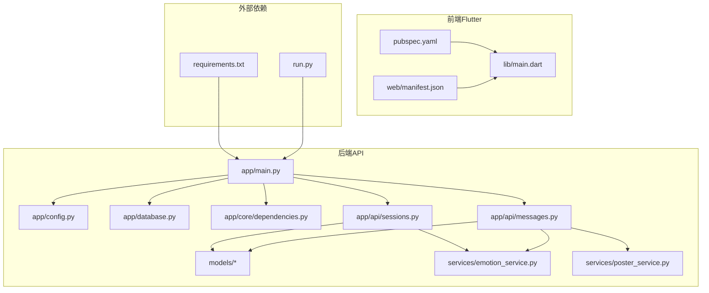
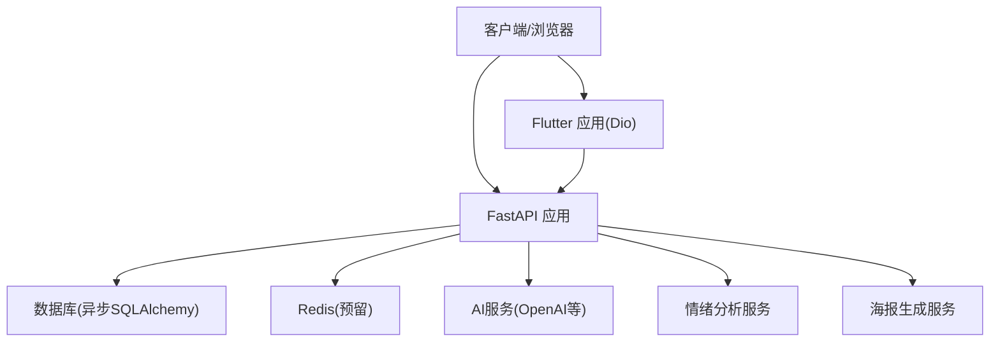
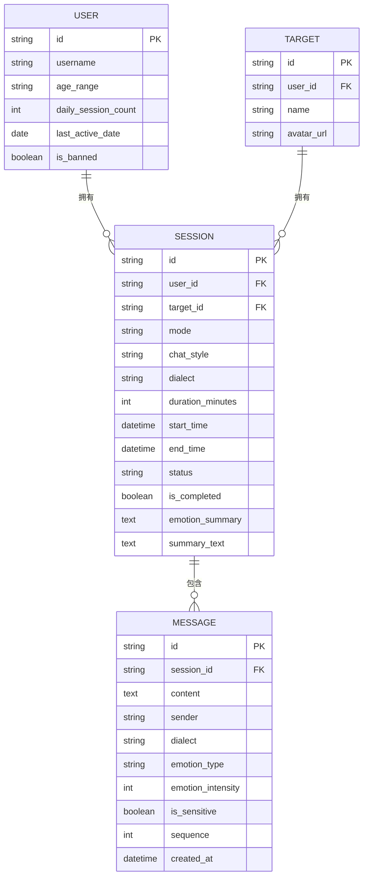
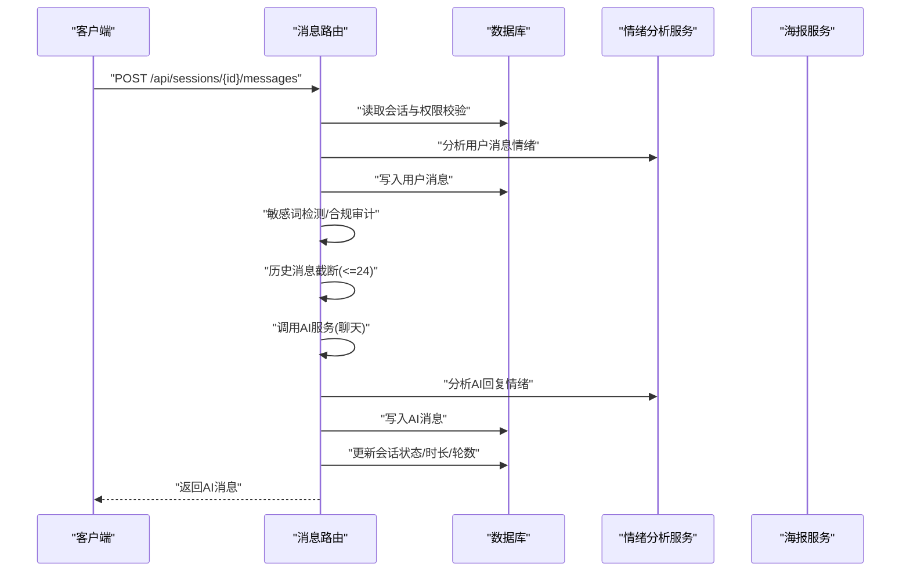
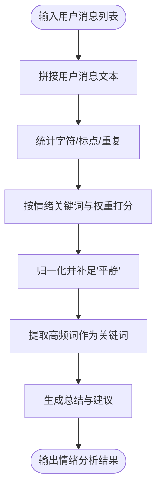
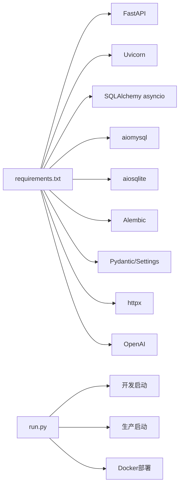

# 性能调优优化

<cite>
**本文引用的文件**
- [emo_outlet_api/requirements.txt](file://emo_outlet_api/requirements.txt)
- [emo_outlet_api/app/config.py](file://emo_outlet_api/app/config.py)
- [emo_outlet_api/app/database.py](file://emo_outlet_api/app/database.py)
- [emo_outlet_api/app/main.py](file://emo_outlet_api/app/main.py)
- [emo_outlet_api/app/api/messages.py](file://emo_outlet_api/app/api/messages.py)
- [emo_outlet_api/app/api/sessions.py](file://emo_outlet_api/app/api/sessions.py)
- [emo_outlet_api/app/models/message.py](file://emo_outlet_api/app/models/message.py)
- [emo_outlet_api/app/models/session.py](file://emo_outlet_api/app/models/session.py)
- [emo_outlet_api/app/services/emotion_service.py](file://emo_outlet_api/app/services/emotion_service.py)
- [emo_outlet_api/app/services/poster_service.py](file://emo_outlet_api/app/services/poster_service.py)
- [emo_outlet_api/app/core/dependencies.py](file://emo_outlet_api/app/core/dependencies.py)
- [emo_outlet_api/run.py](file://emo_outlet_api/run.py)
- [emo_outlet_app/pubspec.yaml](file://emo_outlet_app/pubspec.yaml)
- [emo_outlet_app/lib/main.dart](file://emo_outlet_app/lib/main.dart)
- [emo_outlet_app/web/manifest.json](file://emo_outlet_app/web/manifest.json)
</cite>

## 目录
1. [简介](#简介)
2. [项目结构](#项目结构)
3. [核心组件](#核心组件)
4. [架构总览](#架构总览)
5. [详细组件分析](#详细组件分析)
6. [依赖关系分析](#依赖关系分析)
7. [性能优化策略](#性能优化策略)
8. [系统资源监控与瓶颈分析](#系统资源监控与瓶颈分析)
9. [性能测试方法](#性能测试方法)
10. [成本优化策略](#成本优化策略)
11. [性能监控指标与SLA](#性能监控指标与sla)
12. [故障排查与诊断流程](#故障排查与诊断流程)
13. [结论](#结论)

## 简介
本文件面向Emo Outlet项目的性能调优与优化，覆盖后端（FastAPI + SQLAlchemy异步）、AI服务（OpenAI集成）、前端（Flutter/Dart）以及跨端部署与运维层面。重点围绕数据库查询优化、索引设计、连接池配置、缓存策略；前端打包与资源优化、网络请求优化；AI服务调用频率控制、批量处理、结果缓存与降级；系统资源监控与瓶颈分析；性能测试方法与成本优化，并给出性能基线与预警机制建议。

## 项目结构
- 后端API采用FastAPI + SQLAlchemy异步引擎，使用MySQL/SQLite作为数据源，支持Redis配置项（当前未启用），并内置AI服务提供商配置。
- 前端采用Flutter，使用Dio进行网络请求，cached_network_image进行图片缓存，提供PWA能力（web/manifest.json）。
- 运维脚本提供开发/生产启动方式与Docker部署参考。

图表来源
- [emo_outlet_api/app/main.py:1-82](file://emo_outlet_api/app/main.py#L1-L82)
- [emo_outlet_api/app/config.py:1-125](file://emo_outlet_api/app/config.py#L1-L125)
- [emo_outlet_api/app/database.py:1-43](file://emo_outlet_api/app/database.py#L1-L43)
- [emo_outlet_api/app/api/sessions.py:1-220](file://emo_outlet_api/app/api/sessions.py#L1-L220)
- [emo_outlet_api/app/api/messages.py:1-216](file://emo_outlet_api/app/api/messages.py#L1-L216)
- [emo_outlet_api/app/services/emotion_service.py:1-181](file://emo_outlet_api/app/services/emotion_service.py#L1-L181)
- [emo_outlet_api/app/services/poster_service.py:1-221](file://emo_outlet_api/app/services/poster_service.py#L1-L221)
- [emo_outlet_api/app/core/dependencies.py:1-67](file://emo_outlet_api/app/core/dependencies.py#L1-L67)
- [emo_outlet_api/requirements.txt:1-29](file://emo_outlet_api/requirements.txt#L1-L29)
- [emo_outlet_api/run.py:1-31](file://emo_outlet_api/run.py#L1-L31)
- [emo_outlet_app/pubspec.yaml:1-52](file://emo_outlet_app/pubspec.yaml#L1-L52)
- [emo_outlet_app/lib/main.dart:1-97](file://emo_outlet_app/lib/main.dart#L1-L97)
- [emo_outlet_app/web/manifest.json:1-36](file://emo_outlet_app/web/manifest.json#L1-L36)

章节来源
- [emo_outlet_api/app/main.py:1-82](file://emo_outlet_api/app/main.py#L1-L82)
- [emo_outlet_api/app/config.py:1-125](file://emo_outlet_api/app/config.py#L1-L125)
- [emo_outlet_api/app/database.py:1-43](file://emo_outlet_api/app/database.py#L1-L43)
- [emo_outlet_api/app/api/sessions.py:1-220](file://emo_outlet_api/app/api/sessions.py#L1-L220)
- [emo_outlet_api/app/api/messages.py:1-216](file://emo_outlet_api/app/api/messages.py#L1-L216)
- [emo_outlet_api/app/services/emotion_service.py:1-181](file://emo_outlet_api/app/services/emotion_service.py#L1-L181)
- [emo_outlet_api/app/services/poster_service.py:1-221](file://emo_outlet_api/app/services/poster_service.py#L1-L221)
- [emo_outlet_api/app/core/dependencies.py:1-67](file://emo_outlet_api/app/core/dependencies.py#L1-L67)
- [emo_outlet_api/requirements.txt:1-29](file://emo_outlet_api/requirements.txt#L1-L29)
- [emo_outlet_api/run.py:1-31](file://emo_outlet_api/run.py#L1-L31)
- [emo_outlet_app/pubspec.yaml:1-52](file://emo_outlet_app/pubspec.yaml#L1-L52)
- [emo_outlet_app/lib/main.dart:1-97](file://emo_outlet_app/lib/main.dart#L1-L97)
- [emo_outlet_app/web/manifest.json:1-36](file://emo_outlet_app/web/manifest.json#L1-L36)

## 核心组件
- 配置中心：集中管理数据库、Redis、AI服务、合规与安全阈值等参数。
- 数据库层：异步SQLAlchemy引擎，统一Session工厂，支持MySQL/SQLite切换。
- 业务路由：会话与消息API，负责限流、合规审计、情绪分析与AI交互。
- 服务层：情绪分析服务与海报生成服务，承担文本统计、评分、关键词提取与HTML/SVG生成。
- 中间件与依赖：认证鉴权、每日会话次数校验、请求耗时日志中间件。
- 前端：Flutter应用，网络层基于Dio，图片缓存基于cached_network_image，PWA清单。

章节来源
- [emo_outlet_api/app/config.py:1-125](file://emo_outlet_api/app/config.py#L1-L125)
- [emo_outlet_api/app/database.py:1-43](file://emo_outlet_api/app/database.py#L1-L43)
- [emo_outlet_api/app/api/sessions.py:1-220](file://emo_outlet_api/app/api/sessions.py#L1-L220)
- [emo_outlet_api/app/api/messages.py:1-216](file://emo_outlet_api/app/api/messages.py#L1-L216)
- [emo_outlet_api/app/services/emotion_service.py:1-181](file://emo_outlet_api/app/services/emotion_service.py#L1-L181)
- [emo_outlet_api/app/services/poster_service.py:1-221](file://emo_outlet_api/app/services/poster_service.py#L1-L221)
- [emo_outlet_api/app/core/dependencies.py:1-67](file://emo_outlet_api/app/core/dependencies.py#L1-L67)
- [emo_outlet_api/app/main.py:1-82](file://emo_outlet_api/app/main.py#L1-L82)
- [emo_outlet_app/pubspec.yaml:1-52](file://emo_outlet_app/pubspec.yaml#L1-L52)
- [emo_outlet_app/lib/main.dart:1-97](file://emo_outlet_app/lib/main.dart#L1-L97)

## 架构总览
后端以FastAPI为核心，通过依赖注入获取数据库Session，路由层调用服务层完成业务逻辑，服务层内部进行情绪分析与AI交互。前端Flutter通过Dio发起HTTP请求，使用缓存与PWA提升体验。

图表来源
- [emo_outlet_api/app/main.py:1-82](file://emo_outlet_api/app/main.py#L1-L82)
- [emo_outlet_api/app/config.py:63-86](file://emo_outlet_api/app/config.py#L63-L86)
- [emo_outlet_api/app/database.py:1-43](file://emo_outlet_api/app/database.py#L1-L43)
- [emo_outlet_api/app/services/emotion_service.py:1-181](file://emo_outlet_api/app/services/emotion_service.py#L1-L181)
- [emo_outlet_api/app/services/poster_service.py:1-221](file://emo_outlet_api/app/services/poster_service.py#L1-L221)
- [emo_outlet_app/pubspec.yaml:19-40](file://emo_outlet_app/pubspec.yaml#L19-L40)

## 详细组件分析

### 数据库与ORM模型
- 异步引擎与Session工厂：统一创建异步连接，关闭时自动回收。
- 模型关系：Session与Message为一对多，懒加载策略使用selectin以减少N+1查询。
- 查询路径：消息列表分页、按会话统计数量、按序列排序；会话列表按完成状态与时间排序。

图表来源
- [emo_outlet_api/app/models/session.py:13-79](file://emo_outlet_api/app/models/session.py#L13-L79)
- [emo_outlet_api/app/models/message.py:13-46](file://emo_outlet_api/app/models/message.py#L13-L46)

章节来源
- [emo_outlet_api/app/database.py:1-43](file://emo_outlet_api/app/database.py#L1-L43)
- [emo_outlet_api/app/models/session.py:1-79](file://emo_outlet_api/app/models/session.py#L1-L79)
- [emo_outlet_api/app/models/message.py:1-46](file://emo_outlet_api/app/models/message.py#L1-L46)
- [emo_outlet_api/app/api/messages.py:32-66](file://emo_outlet_api/app/api/messages.py#L32-L66)
- [emo_outlet_api/app/api/sessions.py:102-120](file://emo_outlet_api/app/api/sessions.py#L102-L120)

### 会话与消息API流程
- 创建会话：校验目标归属、每日会话限额，记录开始时间与状态。
- 获取消息列表：分页查询消息并统计总数，计算剩余秒数。
- 发送消息：敏感词检测、情绪分析、AI对话、历史截断、会话轮数与时长限制、高风险中断。
- 结束会话：汇总消息并进行情绪分析，持久化摘要。

图表来源
- [emo_outlet_api/app/api/messages.py:69-195](file://emo_outlet_api/app/api/messages.py#L69-L195)
- [emo_outlet_api/app/services/emotion_service.py:44-71](file://emo_outlet_api/app/services/emotion_service.py#L44-L71)
- [emo_outlet_api/app/services/poster_service.py:66-90](file://emo_outlet_api/app/services/poster_service.py#L66-L90)

章节来源
- [emo_outlet_api/app/api/messages.py:1-216](file://emo_outlet_api/app/api/messages.py#L1-L216)
- [emo_outlet_api/app/api/sessions.py:50-99](file://emo_outlet_api/app/api/sessions.py#L50-L99)
- [emo_outlet_api/app/services/emotion_service.py:1-181](file://emo_outlet_api/app/services/emotion_service.py#L1-L181)
- [emo_outlet_api/app/services/poster_service.py:1-221](file://emo_outlet_api/app/services/poster_service.py#L1-L221)

### 情绪分析算法流程
- 统计字符、感叹号、问号、重复字符。
- 基于关键词计数与标点权重打分，归一化得到各情绪分数。
- 提取高频词作为关键词，生成总结与建议。

图表来源
- [emo_outlet_api/app/services/emotion_service.py:44-177](file://emo_outlet_api/app/services/emotion_service.py#L44-L177)

章节来源
- [emo_outlet_api/app/services/emotion_service.py:1-181](file://emo_outlet_api/app/services/emotion_service.py#L1-L181)

### 前端应用与网络层
- 依赖：Dio用于HTTP请求，cached_network_image用于网络图片缓存，go_router路由，provider状态管理。
- PWA清单：定义应用名称、图标、显示模式与主题色。
- 主题与UI：Material 3主题，颜色与字体、卡片、按钮样式统一。

章节来源
- [emo_outlet_app/pubspec.yaml:9-52](file://emo_outlet_app/pubspec.yaml#L9-L52)
- [emo_outlet_app/lib/main.dart:1-97](file://emo_outlet_app/lib/main.dart#L1-L97)
- [emo_outlet_app/web/manifest.json:1-36](file://emo_outlet_app/web/manifest.json#L1-L36)

## 依赖关系分析
- 后端依赖：FastAPI、Uvicorn、SQLAlchemy asyncio、aiomysql/aiosqlite、Alembic、Pydantic/Settings、httpx、OpenAI等。
- 运行脚本：提供开发/生产启动命令与Docker部署说明。
- 前端依赖：Dio、cached_network_image、go_router、provider等。

图表来源
- [emo_outlet_api/requirements.txt:1-29](file://emo_outlet_api/requirements.txt#L1-L29)
- [emo_outlet_api/run.py:1-31](file://emo_outlet_api/run.py#L1-L31)

章节来源
- [emo_outlet_api/requirements.txt:1-29](file://emo_outlet_api/requirements.txt#L1-L29)
- [emo_outlet_api/run.py:1-31](file://emo_outlet_api/run.py#L1-L31)

## 性能优化策略

### 后端数据库优化
- 查询优化
  - 列表分页：消息按sequence升序分页，避免全表扫描；统计总数与分页结合。
  - 关联懒加载：Session.messages使用selectin，减少N+1查询。
  - 索引建议
    - message(session_id, sequence)：加速按会话的消息查询与排序。
    - message(session_id, created_at)：按时间范围检索。
    - session(user_id, is_completed, created_at)：按用户完成会话列表查询。
    - session(status, start_time)：活跃会话筛选。
  - 批量与去重
    - 历史消息截断至固定窗口（如24条），降低上下文长度与AI调用成本。
- 连接池配置
  - 异步引擎默认连接池参数需结合并发与QPS评估，必要时显式设置min_size/max_size/timeout等。
- 缓存策略
  - Redis预留：可缓存热点会话摘要、用户每日配额、敏感词规则、AI响应（带TTL）。
  - 会话状态与消息列表短期缓存（如30-60秒），结合ETag或Last-Modified实现条件GET。

章节来源
- [emo_outlet_api/app/api/messages.py:32-66](file://emo_outlet_api/app/api/messages.py#L32-L66)
- [emo_outlet_api/app/api/messages.py:128-138](file://emo_outlet_api/app/api/messages.py#L128-L138)
- [emo_outlet_api/app/models/session.py:75-75](file://emo_outlet_api/app/models/session.py#L75-L75)
- [emo_outlet_api/app/config.py:42-52](file://emo_outlet_api/app/config.py#L42-L52)

### AI服务性能调优
- 调用频率控制
  - 使用令牌桶/滑动窗口限流，避免突发流量冲击上游API。
  - 对高风险/高成本请求增加队列与重试退避。
- 批量处理
  - 将多个会话的摘要分析合并为批量任务，减少API往返。
- 结果缓存
  - 对相同输入的AI结果进行缓存（如基于内容哈希），命中则直接返回。
- 降级策略
  - 当上游API不可用或超时时，返回兜底文案与提示，记录降级事件以便事后分析。

章节来源
- [emo_outlet_api/app/config.py:63-86](file://emo_outlet_api/app/config.py#L63-L86)
- [emo_outlet_api/app/api/messages.py:165-172](file://emo_outlet_api/app/api/messages.py#L165-L172)

### 前端性能优化（Flutter）
- 打包优化
  - Release构建，启用代码混淆与摇树优化；移除调试符号与冗余资源。
- 资源压缩
  - 图片资源预压缩，Web端使用现代格式（如WebP）；按设备像素比提供合适尺寸。
- 图片优化
  - 使用cached_network_image缓存网络图片；合理设置缓存大小与过期策略。
- 网络请求优化
  - 使用Dio拦截器统一添加超时、重试、错误处理；开启GZIP压缩；复用HTTP连接。
- PWA优化
  - 配置manifest与Service Worker，离线缓存关键静态资源，提升首屏与弱网体验。

章节来源
- [emo_outlet_app/pubspec.yaml:19-40](file://emo_outlet_app/pubspec.yaml#L19-L40)
- [emo_outlet_app/web/manifest.json:1-36](file://emo_outlet_app/web/manifest.json#L1-L36)
- [emo_outlet_app/lib/main.dart:1-97](file://emo_outlet_app/lib/main.dart#L1-L97)

## 系统资源监控与瓶颈分析
- CPU使用率：关注FastAPI工作进程、AI服务调用与文本分析峰值。
- 内存占用：数据库连接池与缓存占用、图片解码与渲染内存。
- 磁盘IO：数据库文件与日志写入，图片缓存目录。
- 网络带宽：AI服务调用、图片下载与静态资源分发。
- 建议指标
  - 请求延迟分位（P50/P90/P95/P99）、错误率、并发连接数、数据库慢查询、Redis命中率、AI调用成功率与耗时。

章节来源
- [emo_outlet_api/app/main.py:33-39](file://emo_outlet_api/app/main.py#L33-L39)
- [emo_outlet_api/app/config.py:63-86](file://emo_outlet_api/app/config.py#L63-L86)

## 性能测试方法
- 压力测试：逐步提升并发与QPS，观察延迟与错误率拐点。
- 负载测试：在稳定负载下持续运行，验证稳定性与资源消耗。
- 并发测试：模拟多用户同时创建/结束会话、发送消息，验证锁与事务一致性。
- 性能回归测试：建立基准集，每次变更后对比关键指标，确保无回归。

章节来源
- [emo_outlet_api/app/api/sessions.py:50-99](file://emo_outlet_api/app/api/sessions.py#L50-L99)
- [emo_outlet_api/app/api/messages.py:69-195](file://emo_outlet_api/app/api/messages.py#L69-L195)

## 成本优化策略
- 云资源优化
  - 后端：根据峰值QPS与并发选择合适实例规格，启用自动扩缩容（HPA）。
  - 数据库：MySQL/PostgreSQL按读写分离与只读副本优化；冷热数据分层存储。
- CDN成本控制
  - 图片与静态资源走CDN，开启压缩与缓存；按区域与协议优化节点分布。
- 数据库实例调整
  - 通过慢查询日志识别热点表与索引缺失，调整实例规格与存储类型。
- 自动扩缩容配置
  - 基于CPU/内存/请求数/队列长度设置扩缩容阈值，避免过度扩容导致成本上升。

章节来源
- [emo_outlet_api/app/config.py:22-41](file://emo_outlet_api/app/config.py#L22-L41)
- [emo_outlet_api/app/config.py:63-86](file://emo_outlet_api/app/config.py#L63-L86)

## 性能监控指标与SLA
- 关键指标
  - 响应时间：P50/P90/P95；错误率；吞吐量（req/s）。
  - 数据库：慢查询比例、连接池利用率、锁等待。
  - 缓存：命中率、淘汰率、内存占用。
  - AI：调用成功率、平均耗时、超时率、费用占比。
- SLA建议
  - 95%请求响应时间<2s；错误率<0.1%；AI可用性>99%；缓存命中率>90%。

章节来源
- [emo_outlet_api/app/main.py:33-39](file://emo_outlet_api/app/main.py#L33-L39)
- [emo_outlet_api/app/config.py:63-86](file://emo_outlet_api/app/config.py#L63-L86)

## 故障排查与诊断流程
- 性能分析工具
  - 后端：uvicorn自带访问日志与耗时打印；可接入APM（如SkyWalking/Jeager）追踪链路。
  - 前端：Chrome DevTools Network/Performance面板分析网络与渲染瓶颈。
- 问题定位方法
  - 从路由到服务逐层排查：确认鉴权与限流是否异常、数据库慢查询、AI服务超时或限流。
  - 关注热点接口：消息列表、会话创建/结束、情绪分析与海报生成。
- 常见问题
  - 数据库锁与死锁：检查事务粒度与索引覆盖；必要时拆分写入。
  - 缓存穿透/击穿：对空结果设置短TTL，热点数据预热。
  - AI服务抖动：增加重试与熔断，记录失败原因与耗时直方图。

章节来源
- [emo_outlet_api/app/main.py:33-39](file://emo_outlet_api/app/main.py#L33-L39)
- [emo_outlet_api/app/api/messages.py:165-172](file://emo_outlet_api/app/api/messages.py#L165-L172)
- [emo_outlet_api/app/services/emotion_service.py:44-71](file://emo_outlet_api/app/services/emotion_service.py#L44-L71)

## 结论
本项目在后端采用异步架构与清晰的服务分层，在前端具备良好的网络与缓存能力。建议优先完善数据库索引与连接池配置、引入Redis缓存与AI结果缓存、实施限流与降级策略，并建立完善的监控与压测体系，以支撑业务增长与用户体验提升。