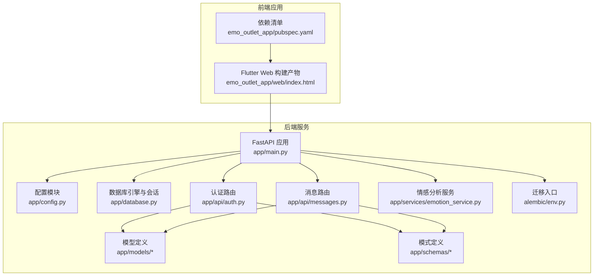
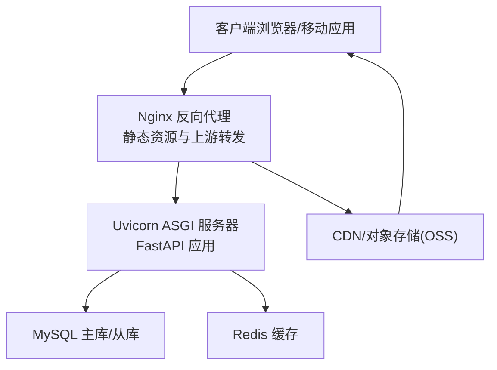
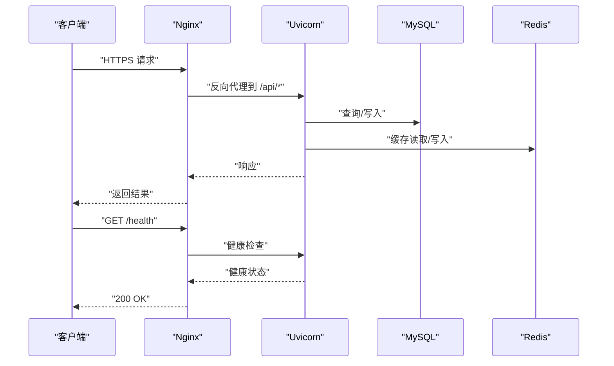
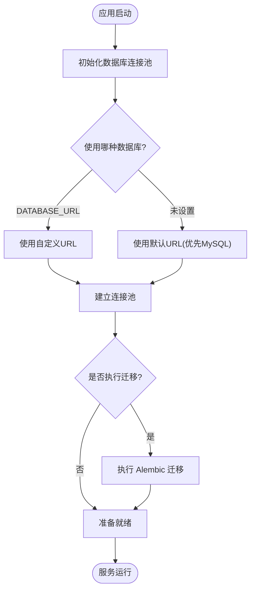
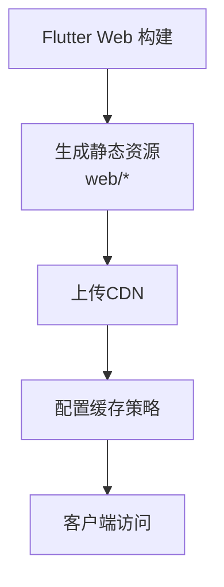
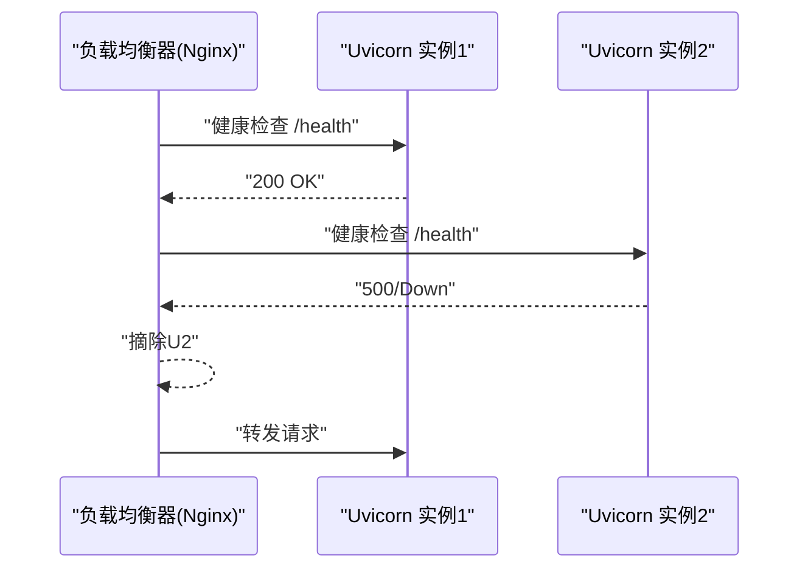
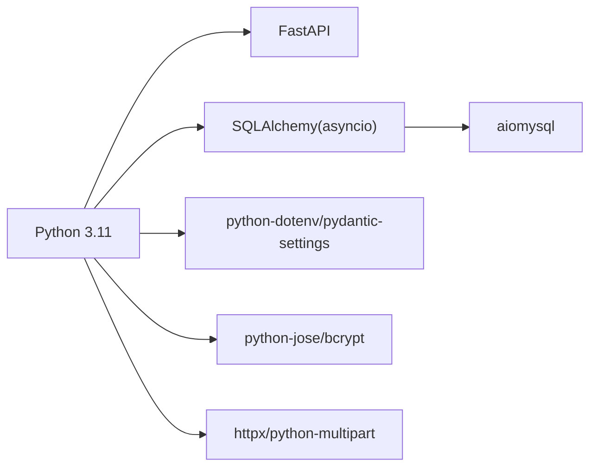

# 生产环境部署

<cite>
**本文引用的文件**
- [emo_outlet_api/requirements.txt](file://emo_outlet_api/requirements.txt)
- [emo_outlet_api/run.py](file://emo_outlet_api/run.py)
- [emo_outlet_api/app/main.py](file://emo_outlet_api/app/main.py)
- [emo_outlet_api/app/config.py](file://emo_outlet_api/app/config.py)
- [emo_outlet_api/app/database.py](file://emo_outlet_api/app/database.py)
- [emo_outlet_api/setup.cfg](file://emo_outlet_api/setup.cfg)
- [emo_outlet_api/alembic/env.py](file://emo_outlet_api/alembic/env.py)
- [emo_outlet_api/app/api/auth.py](file://emo_outlet_api/app/api/auth.py)
- [emo_outlet_api/app/api/messages.py](file://emo_outlet_api/app/api/messages.py)
- [emo_outlet_api/app/models/user.py](file://emo_outlet_api/app/models/user.py)
- [emo_outlet_api/app/models/message.py](file://emo_outlet_api/app/models/message.py)
- [emo_outlet_api/app/schemas/user.py](file://emo_outlet_api/app/schemas/user.py)
- [emo_outlet_api/app/schemas/message.py](file://emo_outlet_api/app/schemas/message.py)
- [emo_outlet_api/app/services/emotion_service.py](file://emo_outlet_api/app/services/emotion_service.py)
- [emo_outlet_app/pubspec.yaml](file://emo_outlet_app/pubspec.yaml)
- [emo_outlet_app/web/index.html](file://emo_outlet_app/web/index.html)
</cite>

## 目录
1. [简介](#简介)
2. [项目结构](#项目结构)
3. [核心组件](#核心组件)
4. [架构总览](#架构总览)
5. [详细组件分析](#详细组件分析)
6. [依赖关系分析](#依赖关系分析)
7. [性能考量](#性能考量)
8. [故障排查指南](#故障排查指南)
9. [结论](#结论)
10. [附录](#附录)

## 简介
本文件面向Emo Outlet项目的生产环境部署，围绕后端服务容器化与反向代理、数据库生产配置（含迁移与备份）、前端静态资源构建与CDN、负载均衡与健康检查、环境变量与密钥管理、以及部署脚本与自动化工具进行系统化说明。文档同时提供部署验证与测试流程，确保服务稳定运行与功能完整。

## 项目结构
- 后端服务采用FastAPI + SQLAlchemy异步ORM，支持MySQL与SQLite双栈，具备Alembic迁移能力。
- 前端基于Flutter Web，使用Dart生态，静态资源通过Flutter构建输出至web目录。
- 项目提供快速启动示例与Docker部署提示，便于本地与生产环境快速上线。

图表来源
- [emo_outlet_api/app/main.py:1-82](file://emo_outlet_api/app/main.py#L1-L82)
- [emo_outlet_api/app/config.py:1-125](file://emo_outlet_api/app/config.py#L1-L125)
- [emo_outlet_api/app/database.py:1-43](file://emo_outlet_api/app/database.py#L1-L43)
- [emo_outlet_api/app/api/auth.py:1-332](file://emo_outlet_api/app/api/auth.py#L1-L332)
- [emo_outlet_api/app/api/messages.py:1-208](file://emo_outlet_api/app/api/messages.py#L1-L208)
- [emo_outlet_api/app/models/user.py:1-56](file://emo_outlet_api/app/models/user.py#L1-L56)
- [emo_outlet_api/app/models/message.py:1-46](file://emo_outlet_api/app/models/message.py#L1-L46)
- [emo_outlet_api/app/schemas/user.py:1-74](file://emo_outlet_api/app/schemas/user.py#L1-L74)
- [emo_outlet_api/app/schemas/message.py:1-33](file://emo_outlet_api/app/schemas/message.py#L1-L33)
- [emo_outlet_api/app/services/emotion_service.py:1-181](file://emo_outlet_api/app/services/emotion_service.py#L1-L181)
- [emo_outlet_api/alembic/env.py:1-71](file://emo_outlet_api/alembic/env.py#L1-L71)
- [emo_outlet_app/web/index.html:1-47](file://emo_outlet_app/web/index.html#L1-L47)
- [emo_outlet_app/pubspec.yaml:1-52](file://emo_outlet_app/pubspec.yaml#L1-L52)

章节来源
- [emo_outlet_api/app/main.py:1-82](file://emo_outlet_api/app/main.py#L1-L82)
- [emo_outlet_app/web/index.html:1-47](file://emo_outlet_app/web/index.html#L1-L47)

## 核心组件
- 应用生命周期与中间件：应用在启动时初始化数据库，在关闭时释放连接；内置CORS与请求日志中间件；提供健康检查端点。
- 配置体系：基于Pydantic Settings加载环境变量，支持MySQL与SQLite双URL切换，并提供Redis、JWT、AI服务、合规与审计等配置项。
- 数据层：异步SQLAlchemy引擎与会话工厂，自动建表与事务控制；迁移通过Alembic集成。
- API路由：认证、会话与消息相关接口，结合敏感词过滤与内容审计日志。
- 前端构建：Flutter Web静态资源，包含manifest与图标配置。

章节来源
- [emo_outlet_api/app/main.py:14-82](file://emo_outlet_api/app/main.py#L14-L82)
- [emo_outlet_api/app/config.py:12-125](file://emo_outlet_api/app/config.py#L12-L125)
- [emo_outlet_api/app/database.py:1-43](file://emo_outlet_api/app/database.py#L1-L43)
- [emo_outlet_api/alembic/env.py:1-71](file://emo_outlet_api/alembic/env.py#L1-L71)
- [emo_outlet_app/web/index.html:1-47](file://emo_outlet_app/web/index.html#L1-L47)

## 架构总览
生产部署建议采用“反向代理 + WSGI容器 + 数据库 + 缓存/对象存储”的分层架构。后端以Uvicorn作为ASGI服务器承载FastAPI应用，Nginx负责静态资源与反向代理；数据库采用MySQL，配合迁移与备份策略；前端静态资源由Nginx或CDN提供。

图表来源
- [emo_outlet_api/app/main.py:23-82](file://emo_outlet_api/app/main.py#L23-L82)
- [emo_outlet_api/app/config.py:22-52](file://emo_outlet_api/app/config.py#L22-L52)
- [emo_outlet_app/web/index.html:1-47](file://emo_outlet_app/web/index.html#L1-L47)

## 详细组件分析

### 后端服务部署（Docker + Nginx + Gunicorn/Uvicorn）
- 容器化要点
  - 使用Python 3.11镜像，安装依赖并暴露应用端口。
  - 通过环境变量注入数据库、Redis、AI服务等配置。
  - 提供健康检查端点，便于容器编排与探活。
- 反向代理（Nginx）
  - 将静态资源直接由Nginx提供，减少后端压力。
  - 将动态请求转发至Uvicorn容器。
  - 配置SSL终止与HTTP/2/HTTPS。
- WSGI服务器（Uvicorn）
  - 生产环境建议使用多worker与合适的并发参数。
  - 结合Nginx实现高吞吐与低延迟。
- SSL证书
  - 使用Let’s Encrypt或商业证书，结合自动续期策略。
  - 在Nginx中配置证书链与加密套件。

图表来源
- [emo_outlet_api/app/main.py:66-82](file://emo_outlet_api/app/main.py#L66-L82)
- [emo_outlet_api/run.py:14-31](file://emo_outlet_api/run.py#L14-L31)

章节来源
- [emo_outlet_api/run.py:14-31](file://emo_outlet_api/run.py#L14-L31)
- [emo_outlet_api/app/main.py:66-82](file://emo_outlet_api/app/main.py#L66-L82)

### 数据库生产配置（MySQL主从、读写分离、连接池与备份）
- 连接字符串与驱动
  - 使用aiomysql驱动，支持异步连接与连接池。
  - 支持DATABASE_URL显式覆盖与默认MySQL/SQLite双栈。
- 迁移与初始化
  - Alembic迁移脚本与在线/离线模式，按配置选择目标数据库。
- 读写分离与主从复制
  - 建议在应用侧或中间层实现读写分离：写操作走主库，读操作走从库。
  - 通过独立的只读连接池与路由策略实现。
- 连接池配置
  - 设置合理的min_size/max_size、max_overflow、pool_recycle等参数，避免连接泄漏与超时。
- 备份策略
  - 定时全量备份 + 增量/二进制日志备份，定期校验恢复演练。
  - 对敏感数据进行脱敏与加密存储。

图表来源
- [emo_outlet_api/app/config.py:30-40](file://emo_outlet_api/app/config.py#L30-L40)
- [emo_outlet_api/app/database.py:8-15](file://emo_outlet_api/app/database.py#L8-L15)
- [emo_outlet_api/alembic/env.py:26-30](file://emo_outlet_api/alembic/env.py#L26-L30)

章节来源
- [emo_outlet_api/app/config.py:22-40](file://emo_outlet_api/app/config.py#L22-L40)
- [emo_outlet_api/app/database.py:1-43](file://emo_outlet_api/app/database.py#L1-L43)
- [emo_outlet_api/alembic/env.py:1-71](file://emo_outlet_api/alembic/env.py#L1-L71)

### 前端静态资源部署（Flutter Web + CDN + 缓存）
- 构建
  - 使用Flutter Web构建静态资源，输出至web目录。
  - index.html包含manifest与图标配置，适配移动端与桌面端。
- CDN与缓存
  - 将静态资源上传至CDN，启用长缓存策略（immutable）。
  - 对index.html与manifest.json设置较短缓存或按版本号更新。
- 回滚与灰度
  - 通过版本号或子路径实现灰度发布与快速回滚。

图表来源
- [emo_outlet_app/pubspec.yaml:1-52](file://emo_outlet_app/pubspec.yaml#L1-L52)
- [emo_outlet_app/web/index.html:1-47](file://emo_outlet_app/web/index.html#L1-L47)

章节来源
- [emo_outlet_app/pubspec.yaml:1-52](file://emo_outlet_app/pubspec.yaml#L1-L52)
- [emo_outlet_app/web/index.html:1-47](file://emo_outlet_app/web/index.html#L1-L47)

### 负载均衡与健康检查（Nginx + 健康检查 + 故障转移）
- Nginx负载均衡
  - upstream指向多个Uvicorn实例，支持轮询/加权/IP哈希等策略。
- 健康检查
  - 利用后端健康检查端点进行探活，失败自动摘除。
- 故障转移
  - 当节点不可用时，流量自动切换至可用节点；恢复后重新加入。
- SSL与安全
  - 在Nginx层统一处理TLS，开启HTTP/2与安全头。

图表来源
- [emo_outlet_api/app/main.py:66-72](file://emo_outlet_api/app/main.py#L66-L72)

章节来源
- [emo_outlet_api/app/main.py:66-72](file://emo_outlet_api/app/main.py#L66-L72)

### 环境变量与配置管理（生产配置文件、密钥与敏感信息）
- 配置来源
  - 通过.env文件与环境变量注入，支持DATABASE_URL、REDIS_URL、AI服务密钥等。
- 密钥管理
  - 使用平台机密管理服务（如KMS/Secrets Manager），避免硬编码。
  - 严格权限控制与轮换策略。
- 敏感信息保护
  - 对数据库、AI服务、OSS等敏感字段进行加密存储与传输。
  - 审计日志仅记录必要信息，避免泄露。

章节来源
- [emo_outlet_api/app/config.py:115-121](file://emo_outlet_api/app/config.py#L115-L121)

### 部署脚本与自动化工具（Docker Compose + Kubernetes）
- Docker Compose
  - 定义后端服务、数据库、Redis、Nginx等服务与网络。
  - 映射端口与挂载卷，注入环境变量与证书。
- Kubernetes
  - 使用Deployment/Service/Ingress/ConfigMap/Secret管理应用。
  - 配置HPA/PDB与滚动更新策略，保障高可用。
- Ansible Playbook
  - 自动化安装依赖、拉取镜像、部署与回滚。
  - 统一日志与监控采集。

章节来源
- [emo_outlet_api/run.py:20-23](file://emo_outlet_api/run.py#L20-L23)
- [emo_outlet_api/requirements.txt:1-29](file://emo_outlet_api/requirements.txt#L1-L29)

### 部署验证与测试流程
- 功能验证
  - 注册/登录、游客登录、会话消息收发、导出数据等核心流程。
- 性能验证
  - 并发压测、慢查询分析、连接池利用率。
- 安全验证
  - 敏感词拦截、高危内容阻断、审计日志采样。
- 可靠性验证
  - 健康检查、故障注入、故障转移、数据一致性校验。

章节来源
- [emo_outlet_api/app/api/auth.py:33-120](file://emo_outlet_api/app/api/auth.py#L33-L120)
- [emo_outlet_api/app/api/messages.py:61-187](file://emo_outlet_api/app/api/messages.py#L61-L187)
- [emo_outlet_api/app/config.py:88-111](file://emo_outlet_api/app/config.py#L88-L111)

## 依赖关系分析
- 后端依赖
  - Web框架与异步数据库：FastAPI + SQLAlchemy asyncio + aiomysql。
  - 配置与环境：pydantic-settings + python-dotenv。
  - 安全与认证：python-jose + bcrypt。
  - 工具与HTTP：httpx + python-multipart。
- 前端依赖
  - Flutter SDK、路由、网络请求、状态管理等。

图表来源
- [emo_outlet_api/requirements.txt:1-29](file://emo_outlet_api/requirements.txt#L1-L29)

章节来源
- [emo_outlet_api/requirements.txt:1-29](file://emo_outlet_api/requirements.txt#L1-L29)

## 性能考量
- 数据库
  - 合理设置连接池大小与超时；索引优化与慢查询分析。
  - 读写分离降低主库压力，从库用于报表与历史查询。
- 应用
  - 异步I/O提升并发；合理使用缓存（Redis）降低数据库压力。
  - 控制消息长度与会话轮数，避免长事务。
- 网络
  - Nginx启用gzip/HTTP/2；CDN就近加速静态资源。
  - 合理设置缓存头与ETag，减少带宽消耗。

## 故障排查指南
- 健康检查
  - 通过/health确认应用存活与版本信息。
- 日志
  - 应用请求日志与异常捕获，结合数据库与AI服务日志定位问题。
- 数据库
  - 连接池耗尽、慢查询、主从延迟；检查连接字符串与只读路由。
- 前端
  - 静态资源404或缓存问题，核对CDN配置与版本号。

章节来源
- [emo_outlet_api/app/main.py:33-48](file://emo_outlet_api/app/main.py#L33-L48)
- [emo_outlet_api/app/main.py:66-72](file://emo_outlet_api/app/main.py#L66-L72)

## 结论
通过容器化与反向代理、完善的数据库迁移与备份、CDN与缓存策略、以及负载均衡与健康检查，Emo Outlet可在生产环境中实现高可用、高性能与易维护。建议结合平台机密管理与自动化工具，持续完善发布与运维流程。

## 附录
- 快速启动与Docker部署提示见后端run脚本注释。
- 项目忽略规则与构建产物见setup.cfg。

章节来源
- [emo_outlet_api/run.py:1-31](file://emo_outlet_api/run.py#L1-L31)
- [emo_outlet_api/setup.cfg:1-18](file://emo_outlet_api/setup.cfg#L1-L18)