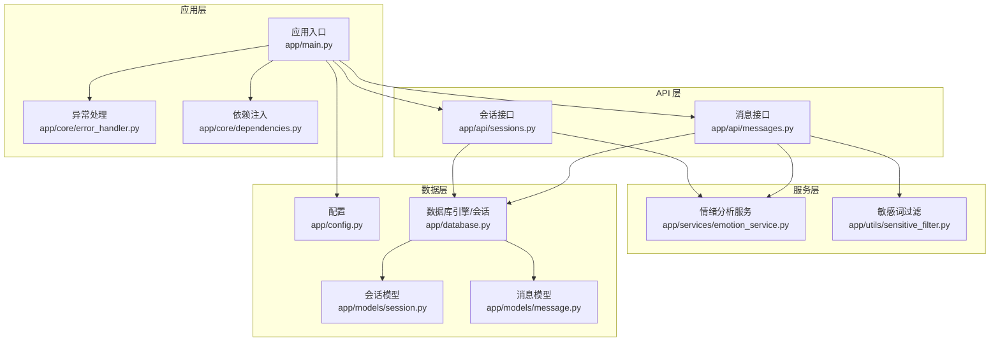
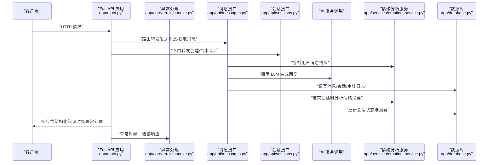
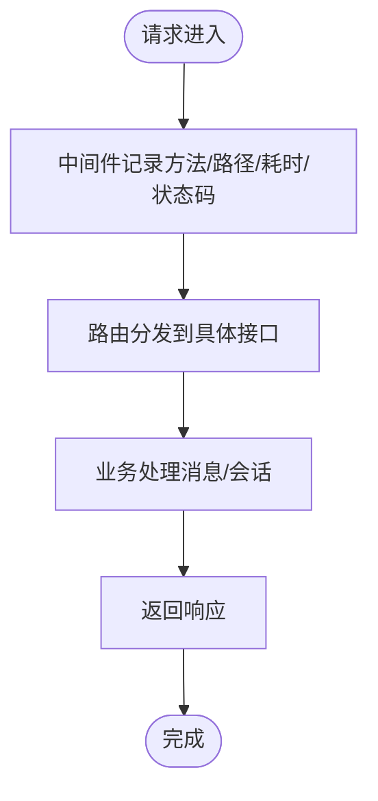
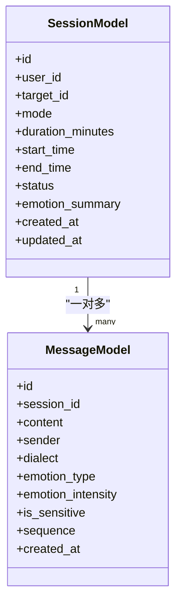
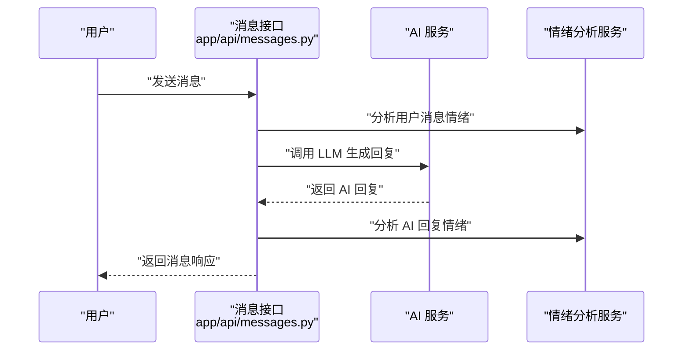
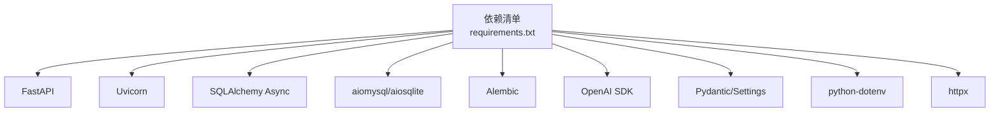

# 监控告警系统

<cite>
**本文引用的文件**
- [emo_outlet_api/app/main.py](file://emo_outlet_api/app/main.py)
- [emo_outlet_api/app/config.py](file://emo_outlet_api/app/config.py)
- [emo_outlet_api/app/database.py](file://emo_outlet_api/app/database.py)
- [emo_outlet_api/app/core/error_handler.py](file://emo_outlet_api/app/core/error_handler.py)
- [emo_outlet_api/app/core/dependencies.py](file://emo_outlet_api/app/core/dependencies.py)
- [emo_outlet_api/app/utils/sensitive_filter.py](file://emo_outlet_api/app/utils/sensitive_filter.py)
- [emo_outlet_api/app/api/messages.py](file://emo_outlet_api/app/api/messages.py)
- [emo_outlet_api/app/api/sessions.py](file://emo_outlet_api/app/api/sessions.py)
- [emo_outlet_api/app/models/session.py](file://emo_outlet_api/app/models/session.py)
- [emo_outlet_api/app/models/message.py](file://emo_outlet_api/app/models/message.py)
- [emo_outlet_api/run.py](file://emo_outlet_api/run.py)
- [emo_outlet_api/requirements.txt](file://emo_outlet_api/requirements.txt)
</cite>

## 目录
1. [简介](#简介)
2. [项目结构](#项目结构)
3. [核心组件](#核心组件)
4. [架构总览](#架构总览)
5. [详细组件分析](#详细组件分析)
6. [依赖分析](#依赖分析)
7. [性能考虑](#性能考虑)
8. [故障排查指南](#故障排查指南)
9. [结论](#结论)
10. [附录](#附录)

## 简介
本文件面向 Emo Outlet 项目的监控告警系统建设，围绕应用性能监控、数据库性能监控、AI 服务调用监控、日志管理、错误监控与告警、业务指标监控、监控仪表板配置、性能基准与容量规划以及监控数据分析与报告等方面，提供可操作的实施建议与最佳实践。当前代码库尚未集成 Prometheus/Grafana、结构化日志、统一告警通道等监控基础设施，本文将基于现有代码结构与配置，给出从零到一的落地方案。

## 项目结构
Emo Outlet 后端采用 FastAPI + SQLAlchemy Async 架构，核心入口位于应用主程序，通过依赖注入与中间件实现生命周期管理、CORS、异常处理与请求日志；数据库层通过异步引擎与依赖注入提供会话管理；AI 服务与情绪分析服务通过 API 路由调用；敏感词过滤模块提供内容合规能力。

图表来源
- [emo_outlet_api/app/main.py:1-82](file://emo_outlet_api/app/main.py#L1-L82)
- [emo_outlet_api/app/core/error_handler.py:1-59](file://emo_outlet_api/app/core/error_handler.py#L1-L59)
- [emo_outlet_api/app/core/dependencies.py:1-67](file://emo_outlet_api/app/core/dependencies.py#L1-L67)
- [emo_outlet_api/app/api/messages.py:1-216](file://emo_outlet_api/app/api/messages.py#L1-L216)
- [emo_outlet_api/app/api/sessions.py:1-220](file://emo_outlet_api/app/api/sessions.py#L1-L220)
- [emo_outlet_api/app/utils/sensitive_filter.py:1-142](file://emo_outlet_api/app/utils/sensitive_filter.py#L1-L142)
- [emo_outlet_api/app/config.py:1-125](file://emo_outlet_api/app/config.py#L1-L125)
- [emo_outlet_api/app/database.py:1-43](file://emo_outlet_api/app/database.py#L1-L43)
- [emo_outlet_api/app/models/session.py:1-79](file://emo_outlet_api/app/models/session.py#L1-L79)
- [emo_outlet_api/app/models/message.py:1-46](file://emo_outlet_api/app/models/message.py#L1-L46)

章节来源
- [emo_outlet_api/app/main.py:1-82](file://emo_outlet_api/app/main.py#L1-L82)
- [emo_outlet_api/app/config.py:1-125](file://emo_outlet_api/app/config.py#L1-L125)
- [emo_outlet_api/app/database.py:1-43](file://emo_outlet_api/app/database.py#L1-L43)

## 核心组件
- 应用生命周期与中间件：通过 lifespan 管理数据库初始化与关闭，HTTP 中间件打印请求耗时与状态码，便于初步性能观测。
- 异常处理：统一捕获未处理异常、HTTP 异常与参数校验异常，返回结构化错误信息，为错误监控提供基础。
- 数据库层：异步引擎与依赖注入会话工厂，支持 SQLite/MySQL 切换，便于本地开发与生产部署。
- 业务接口：消息接口负责对话流程、情绪分析与敏感词拦截，会话接口负责会话创建、查询与结束时的情绪分析汇总。
- 情绪分析与敏感词：提供情绪打分、关键词提取与高风险响应策略，支撑合规与用户体验。

章节来源
- [emo_outlet_api/app/main.py:14-48](file://emo_outlet_api/app/main.py#L14-L48)
- [emo_outlet_api/app/core/error_handler.py:10-59](file://emo_outlet_api/app/core/error_handler.py#L10-L59)
- [emo_outlet_api/app/database.py:10-32](file://emo_outlet_api/app/database.py#L10-L32)
- [emo_outlet_api/app/api/messages.py:69-195](file://emo_outlet_api/app/api/messages.py#L69-L195)
- [emo_outlet_api/app/api/sessions.py:156-219](file://emo_outlet_api/app/api/sessions.py#L156-L219)
- [emo_outlet_api/app/utils/sensitive_filter.py:102-139](file://emo_outlet_api/app/utils/sensitive_filter.py#L102-L139)

## 架构总览
下图展示从客户端到数据库的典型请求链路，标注了可观测性关键节点（请求日志、异常处理、数据库事务、AI 服务调用、情绪分析）。

图表来源
- [emo_outlet_api/app/main.py:33-39](file://emo_outlet_api/app/main.py#L33-L39)
- [emo_outlet_api/app/api/messages.py:69-195](file://emo_outlet_api/app/api/messages.py#L69-L195)
- [emo_outlet_api/app/api/sessions.py:156-219](file://emo_outlet_api/app/api/sessions.py#L156-L219)
- [emo_outlet_api/app/core/error_handler.py:10-59](file://emo_outlet_api/app/core/error_handler.py#L10-L59)
- [emo_outlet_api/app/database.py:22-31](file://emo_outlet_api/app/database.py#L22-L31)

## 详细组件分析

### 应用性能监控（FastAPI）
- 请求耗时与状态码：HTTP 中间件记录每个请求的耗时与状态码，可用于快速定位慢请求与异常响应。
- 生命周期管理：lifespan 在启动时初始化数据库，在关闭时释放连接，确保资源回收。
- 健康检查：提供 /health 接口，便于外部探针与编排系统进行存活与就绪探测。

图表来源
- [emo_outlet_api/app/main.py:33-39](file://emo_outlet_api/app/main.py#L33-L39)
- [emo_outlet_api/app/main.py:14-20](file://emo_outlet_api/app/main.py#L14-L20)

章节来源
- [emo_outlet_api/app/main.py:33-39](file://emo_outlet_api/app/main.py#L33-L39)
- [emo_outlet_api/app/main.py:66-72](file://emo_outlet_api/app/main.py#L66-L72)

### 数据库性能监控
- 引擎与会话：异步引擎与依赖注入会话工厂，支持 SQLite/MySQL 切换；DEBUG 模式下开启 echo 可输出 SQL 语句，便于开发调试。
- 事务与回滚：会话管理中包含提交/回滚逻辑，异常时自动回滚，避免脏数据；建议结合数据库慢查询日志与连接池指标进行监控。
- 模型设计：消息与会话模型包含时间戳字段，便于按时间维度统计会话时长与消息量。

图表来源
- [emo_outlet_api/app/models/session.py:13-75](file://emo_outlet_api/app/models/session.py#L13-L75)
- [emo_outlet_api/app/models/message.py:13-42](file://emo_outlet_api/app/models/message.py#L13-L42)

章节来源
- [emo_outlet_api/app/database.py:10-32](file://emo_outlet_api/app/database.py#L10-L32)
- [emo_outlet_api/app/models/session.py:13-75](file://emo_outlet_api/app/models/session.py#L13-L75)
- [emo_outlet_api/app/models/message.py:13-42](file://emo_outlet_api/app/models/message.py#L13-L42)

### AI 服务调用监控
- 调用点：消息接口在用户输入后调用 AI 服务生成回复，并再次进行情绪分析，形成完整的对话闭环。
- 配置项：LLM 提供商、模型名称、基础地址等在配置中集中管理，便于切换与灰度。
- 建议：对 AI 调用增加超时、重试、熔断与限流策略，并记录调用耗时、成功率与错误码，作为 SLA 监控依据。

图表来源
- [emo_outlet_api/app/api/messages.py:165-172](file://emo_outlet_api/app/api/messages.py#L165-L172)
- [emo_outlet_api/app/config.py:63-76](file://emo_outlet_api/app/config.py#L63-L76)

章节来源
- [emo_outlet_api/app/api/messages.py:165-172](file://emo_outlet_api/app/api/messages.py#L165-L172)
- [emo_outlet_api/app/config.py:63-76](file://emo_outlet_api/app/config.py#L63-L76)

### WebSocket 连接监控（概念性说明）
- 当前代码库未包含 WebSocket 实现，若后续引入实时消息推送或会话状态变更通知，建议：
  - 统计在线用户数、连接数、消息吞吐量与延迟。
  - 记录连接建立/断开事件与异常断线原因。
  - 结合心跳与重连策略，设置告警阈值（如断线率、平均延迟）。

（本节为概念性内容，不直接分析具体文件）

### 日志管理系统
- 结构化日志：建议在中间件与异常处理中输出结构化 JSON 日志，包含请求 ID、方法、路径、耗时、状态码、异常堆栈等字段。
- 日志级别：区分 INFO/WARN/ERROR，生产环境默认 ERROR，必要时临时提升至 WARN/INFO。
- 日志轮转：使用系统级轮转工具（如 logrotate/rsyslog）或 Python logging.handlers.TimedRotatingFileHandler。
- 集中式收集：通过 Filebeat/Fluent Bit 收集日志，发送至 ELK/Elasticsearch 或 Loki，便于检索与聚合分析。

（本节为通用实践说明，不直接分析具体文件）

### 错误监控与告警机制
- 异常捕获：全局异常处理器统一返回错误码与描述，便于前端与监控系统识别。
- 错误报告：建议将错误事件上报至统一告警平台（如 AlertManager/钉钉机器人/Webhook），并记录上下文（用户 ID、会话 ID、请求参数）。
- 告警渠道：邮件与短信告警可通过第三方服务（SMTP/短信网关）或平台内置集成实现，设置分级阈值（严重/警告/通知）。

章节来源
- [emo_outlet_api/app/core/error_handler.py:10-59](file://emo_outlet_api/app/core/error_handler.py#L10-L59)

### 业务指标监控
- 用户活跃度：基于每日活跃日期与会话计数统计，结合登录/会话创建事件。
- 会话时长：利用会话模型的起止时间计算实际时长，支持按用户/目标/方言维度聚合。
- AI 调用次数：统计消息接口中 AI 服务调用次数与成功率，按提供商/模型维度拆分。
- 系统资源使用率：结合容器/主机监控（CPU/内存/磁盘/网络），与业务指标联动分析。

章节来源
- [emo_outlet_api/app/api/sessions.py:80-99](file://emo_outlet_api/app/api/sessions.py#L80-L99)
- [emo_outlet_api/app/models/session.py:40-48](file://emo_outlet_api/app/models/session.py#L40-L48)
- [emo_outlet_api/app/api/messages.py:165-172](file://emo_outlet_api/app/api/messages.py#L165-L172)

### 监控仪表板配置（Grafana/Prometheus）
- 指标采集：建议引入 Prometheus 客户端与 Exporter，采集应用指标（请求速率、错误率、响应时间、并发数）、数据库指标（连接数、慢查询、锁等待）与系统指标（CPU/内存/IO）。
- 仪表板：创建多面板仪表板，覆盖应用健康、业务趋势、AI 性能与合规指标。
- 自定义规则：针对错误率、响应时间、AI 调用失败率、敏感词触发率等设置告警规则。

（本节为通用实践说明，不直接分析具体文件）

### 性能基准测试与容量规划
- 基准测试：使用 Locust/JMeter 等工具模拟并发用户，测量不同场景下的 P95/P99 响应时间与错误率。
- 容量规划：基于峰值 QPS、内存占用与数据库连接池上限，推导 CPU/内存/存储/网络需求，预留 30%-50% 缓冲。

（本节为通用实践说明，不直接分析具体文件）

### 监控数据分析与报告
- 实时告警：结合告警平台与可视化看板，实现异常即时通知与处置。
- 周期报告：按日/周/月生成业务与技术指标报告，辅助运营决策与系统优化。

（本节为通用实践说明，不直接分析具体文件）

## 依赖分析
- Web 框架与运行：FastAPI、Uvicorn。
- 数据库与迁移：SQLAlchemy Async、aiomysql/aiosqlite、Alembic。
- AI 与配置：OpenAI SDK、Pydantic/Settings、python-dotenv。
- 工具：multipart、httpx。

图表来源
- [emo_outlet_api/requirements.txt:4-28](file://emo_outlet_api/requirements.txt#L4-L28)

章节来源
- [emo_outlet_api/requirements.txt:1-29](file://emo_outlet_api/requirements.txt#L1-L29)

## 性能考虑
- 异步优先：数据库与外部服务调用均采用异步，减少阻塞。
- 连接池：合理配置数据库连接池大小与超时，避免连接泄漏。
- 缓存：对热点查询（如用户信息、会话状态）引入缓存，降低数据库压力。
- 资源回收：在 lifespan 中正确初始化与关闭数据库连接，避免资源泄露。

（本节为通用指导，不直接分析具体文件）

## 故障排查指南
- 健康检查：访问 /health 确认应用存活与版本信息。
- 请求追踪：通过中间件日志定位慢请求与异常状态码。
- 异常排查：查看统一异常处理返回的错误码与描述，结合业务上下文定位问题。
- 数据库问题：启用 DEBUG 时的 SQL 输出，检查慢查询与事务回滚情况。

章节来源
- [emo_outlet_api/app/main.py:66-72](file://emo_outlet_api/app/main.py#L66-L72)
- [emo_outlet_api/app/main.py:33-39](file://emo_outlet_api/app/main.py#L33-L39)
- [emo_outlet_api/app/core/error_handler.py:10-59](file://emo_outlet_api/app/core/error_handler.py#L10-L59)
- [emo_outlet_api/app/database.py:10-15](file://emo_outlet_api/app/database.py#L10-L15)

## 结论
当前代码库提供了清晰的应用入口、异常处理、数据库与业务接口，具备良好的扩展性。建议尽快引入结构化日志、统一错误监控与告警、Prometheus 指标采集与 Grafana 仪表板，以实现从“可观测”到“可预警、可分析、可优化”的完整闭环。同时完善 AI 服务与数据库的性能监控与容量规划，保障系统在高并发与复杂业务场景下的稳定性与可维护性。

## 附录
- 快速启动与文档入口：参考运行脚本中的启动命令与健康检查地址。

章节来源
- [emo_outlet_api/run.py:11-30](file://emo_outlet_api/run.py#L11-L30)