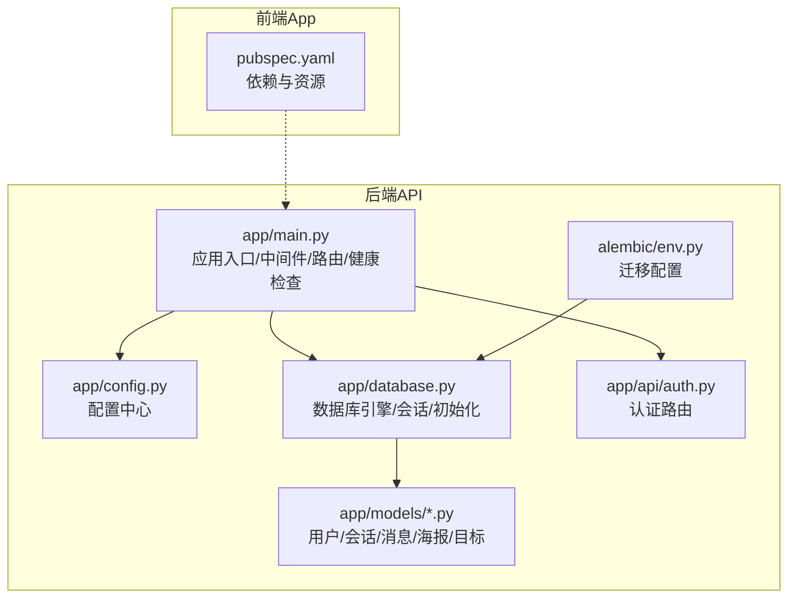
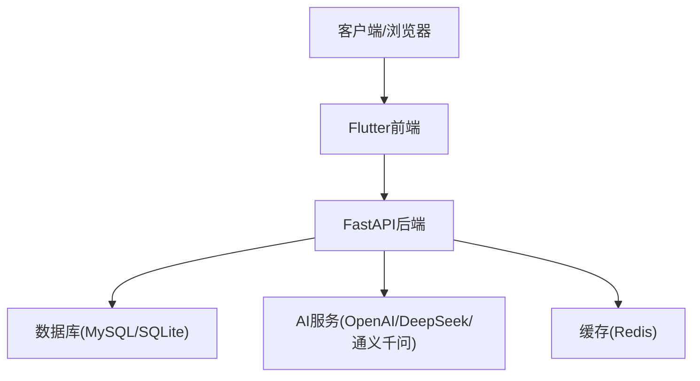
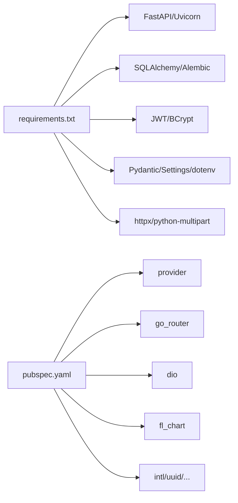

# 部署与运维

<cite>
**本文引用的文件**
- [README.md](file://README.md)
- [emo_outlet_api/requirements.txt](file://emo_outlet_api/requirements.txt)
- [emo_outlet_api/run.py](file://emo_outlet_api/run.py)
- [emo_outlet_api/app/main.py](file://emo_outlet_api/app/main.py)
- [emo_outlet_api/app/config.py](file://emo_outlet_api/app/config.py)
- [emo_outlet_api/app/database.py](file://emo_outlet_api/app/database.py)
- [emo_outlet_api/alembic/env.py](file://emo_outlet_api/alembic/env.py)
- [emo_outlet_api/app/api/auth.py](file://emo_outlet_api/app/api/auth.py)
- [emo_outlet_api/app/models/user.py](file://emo_outlet_api/app/models/user.py)
- [emo_outlet_api/app/models/session.py](file://emo_outlet_api/app/models/session.py)
- [emo_outlet_api/app/models/message.py](file://emo_outlet_api/app/models/message.py)
- [emo_outlet_api/app/models/poster.py](file://emo_outlet_api/app/models/poster.py)
- [emo_outlet_api/app/models/target.py](file://emo_outlet_api/app/models/target.py)
- [emo_outlet_app/pubspec.yaml](file://emo_outlet_app/pubspec.yaml)
- [start.bat](file://start.bat)
- [start.ps1](file://start.ps1)
</cite>

## 目录
1. [简介](#简介)
2. [项目结构](#项目结构)
3. [核心组件](#核心组件)
4. [架构总览](#架构总览)
5. [详细组件分析](#详细组件分析)
6. [依赖分析](#依赖分析)
7. [性能考虑](#性能考虑)
8. [故障排查指南](#故障排查指南)
9. [结论](#结论)
10. [附录](#附录)

## 简介
本文件面向Emo Outlet项目的部署与运维团队，提供从开发环境搭建到生产部署、监控告警、备份恢复、运维自动化、性能调优与故障排查的完整实践指南。项目采用前后端分离架构：后端为Python FastAPI + SQLAlchemy + MySQL/SQLite；前端为Flutter（Android/macOS/Web）。系统具备健康检查、JWT认证、敏感词过滤、合规审计、会话时长与频次限制等安全与合规能力。

## 项目结构
- 后端API（FastAPI）
  - 应用入口、中间件、路由注册、健康检查
  - 配置中心（环境变量、数据库、Redis、AI服务、合规参数）
  - 数据库初始化与Alembic迁移
  - 认证、会话、消息、海报、目标等业务模块
- 前端App（Flutter）
  - 依赖管理与资源清单
- 一键启动脚本（Windows批处理与PowerShell）
  - 同时启动后端与前端，便于本地联调

图表来源
- [emo_outlet_api/app/main.py:1-82](file://emo_outlet_api/app/main.py#L1-L82)
- [emo_outlet_api/app/config.py:1-125](file://emo_outlet_api/app/config.py#L1-L125)
- [emo_outlet_api/app/database.py:1-43](file://emo_outlet_api/app/database.py#L1-L43)
- [emo_outlet_api/alembic/env.py:1-71](file://emo_outlet_api/alembic/env.py#L1-L71)
- [emo_outlet_api/app/api/auth.py:1-332](file://emo_outlet_api/app/api/auth.py#L1-L332)
- [emo_outlet_app/pubspec.yaml:1-52](file://emo_outlet_app/pubspec.yaml#L1-L52)

章节来源
- [README.md: 9-151:9-151](file://README.md#L9-L151)
- [emo_outlet_api/app/main.py: 1-L82:1-82](file://emo_outlet_api/app/main.py#L1-L82)
- [emo_outlet_api/app/config.py: 1-L125:1-125](file://emo_outlet_api/app/config.py#L1-L125)
- [emo_outlet_api/app/database.py: 1-L43:1-43](file://emo_outlet_api/app/database.py#L1-L43)
- [emo_outlet_api/alembic/env.py: 1-L71:1-71](file://emo_outlet_api/alembic/env.py#L1-L71)
- [emo_outlet_app/pubspec.yaml: 1-L52:1-52](file://emo_outlet_app/pubspec.yaml#L1-L52)

## 核心组件
- 应用入口与生命周期
  - FastAPI应用实例、CORS中间件、请求日志中间件、健康检查端点
- 配置中心
  - 支持MySQL/SQLite、Redis、JWT、AI提供商、合规与安全阈值、方言词库等
- 数据层
  - 异步SQLAlchemy引擎、会话工厂、元数据初始化、迁移脚本
- 认证与用户
  - 注册/登录/游客登录、用户资料、账户注销与数据导出
- 业务模型
  - 用户、目标、会话、消息、海报等核心实体及关系

章节来源
- [emo_outlet_api/app/main.py: 14-L82:14-82](file://emo_outlet_api/app/main.py#L14-L82)
- [emo_outlet_api/app/config.py: 12-L125:12-125](file://emo_outlet_api/app/config.py#L12-L125)
- [emo_outlet_api/app/database.py: 8-L43:8-43](file://emo_outlet_api/app/database.py#L8-L43)
- [emo_outlet_api/app/api/auth.py: 33-L332:33-332](file://emo_outlet_api/app/api/auth.py#L33-L332)
- [emo_outlet_api/app/models/user.py: 14-L56:14-56](file://emo_outlet_api/app/models/user.py#L14-L56)
- [emo_outlet_api/app/models/session.py: 13-L79:13-79](file://emo_outlet_api/app/models/session.py#L13-L79)
- [emo_outlet_api/app/models/message.py: 13-L46:13-46](file://emo_outlet_api/app/models/message.py#L13-L46)
- [emo_outlet_api/app/models/poster.py: 13-L61:13-61](file://emo_outlet_api/app/models/poster.py#L13-L61)
- [emo_outlet_api/app/models/target.py: 13-L56:13-56](file://emo_outlet_api/app/models/target.py#L13-L56)

## 架构总览
后端采用FastAPI异步框架，数据库默认开发使用SQLite，生产可切换为MySQL；AI服务支持OpenAI/DeepSeek/通义千问等；前端Flutter负责Web与移动端展示与交互。系统提供健康检查端点与Swagger文档，便于运维与联调。

图表来源
- [emo_outlet_api/app/main.py: 23-L82:23-82](file://emo_outlet_api/app/main.py#L23-L82)
- [emo_outlet_api/app/config.py: 30-L87:30-87](file://emo_outlet_api/app/config.py#L30-L87)
- [emo_outlet_api/app/database.py: 10-L15:10-15](file://emo_outlet_api/app/database.py#L10-L15)

章节来源
- [README.md: 58-L104:58-104](file://README.md#L58-L104)
- [emo_outlet_api/app/main.py: 23-L82:23-82](file://emo_outlet_api/app/main.py#L23-L82)
- [emo_outlet_api/app/config.py: 30-L87:30-87](file://emo_outlet_api/app/config.py#L30-L87)

## 详细组件分析

### 开发环境搭建
- Python虚拟环境
  - 使用Python 3.10+，推荐venv隔离依赖
- 依赖安装
  - 后端依赖清单位于requirements.txt，包含FastAPI、Uvicorn、SQLAlchemy、Alembic、Pydantic、dotenv、HTTPX等
- 数据库
  - 开发默认SQLite（无需安装MySQL），生产使用MySQL
- 启动方式
  - 后端：uvicorn启动，支持热重载（开发）、多工作进程（生产）
  - 前端：Flutter运行，支持Chrome调试端口
  - 一键启动脚本：Windows批处理与PowerShell脚本同时启动前后端

章节来源
- [emo_outlet_api/requirements.txt: 1-L29:1-29](file://emo_outlet_api/requirements.txt#L1-L29)
- [emo_outlet_api/run.py: 1-L31:1-31](file://emo_outlet_api/run.py#L1-L31)
- [README.md: 32-L54:32-54](file://README.md#L32-L54)
- [start.bat: 1-L43:1-43](file://start.bat#L1-L43)
- [start.ps1: 1-L65:1-65](file://start.ps1#L1-L65)

### 生产环境部署策略
- 容器化部署
  - 提供Docker构建与运行示例，建议使用.env文件注入环境变量
- 负载均衡
  - 建议在容器编排层（如Kubernetes）或反向代理层（Nginx/Traefik）前置LB，实现多副本横向扩展
- SSL证书管理
  - 建议在LB层统一终止TLS，或使用Let’s Encrypt自动化证书签发
- CDN加速
  - 前端静态资源与AI生成的海报图片可接入CDN，结合缓存策略提升访问速度
- 数据库高可用
  - 生产使用MySQL主从/集群，配合只读副本分担查询压力；定期备份与快照

章节来源
- [emo_outlet_api/run.py: 20-L24:20-24](file://emo_outlet_api/run.py#L20-L24)
- [emo_outlet_api/app/config.py: 22-L46:22-46](file://emo_outlet_api/app/config.py#L22-L46)

### 监控告警配置
- 应用性能监控
  - 健康检查端点：/health；请求耗时日志：请求中间件输出
- 错误日志收集
  - 统一输出至标准日志；建议接入集中式日志（如ELK/Fluentd/Loki）
- 用户行为分析
  - 可在会话与消息层面埋点，采集会话时长、情绪类型分布、方言偏好等
- 业务指标跟踪
  - 会话总量、用户活跃度、敏感词触发率、AI调用成功率等

章节来源
- [emo_outlet_api/app/main.py: 66-L82:66-82](file://emo_outlet_api/app/main.py#L66-L82)
- [emo_outlet_api/app/main.py: 33-L40:33-40](file://emo_outlet_api/app/main.py#L33-L40)

### 备份恢复策略
- 数据库备份
  - MySQL：逻辑备份（mysqldump/Percona XtraBackup）+ 定时快照；SQLite：直接复制文件
- 文件存储备份
  - 若启用OSS/CDN，需确保对象版本控制与跨区域复制
- 灾难恢复演练
  - 定期进行RTO/RPO测试，验证从备份到恢复的端到端流程
- 业务连续性计划
  - 多机房/多可用区部署，自动故障转移与手动切换预案

章节来源
- [emo_outlet_api/app/config.py: 81-L87:81-87](file://emo_outlet_api/app/config.py#L81-L87)
- [emo_outlet_api/app/database.py: 8-L15:8-15](file://emo_outlet_api/app/database.py#L8-L15)

### 运维自动化
- CI/CD流水线
  - 建议使用GitOps（如ArgoCD）或传统CI（GitHub Actions/Jenkins）：代码检出 → 依赖安装 → 单元/集成测试 → 构建镜像 → 部署到预生产/生产
- 自动化测试
  - 后端：pytest + FastAPI TestClient；前端：Flutter Widget/Integration测试
- 滚动更新与回滚
  - 容器编排中使用滚动升级策略，失败自动回滚至上一稳定版本

章节来源
- [emo_outlet_api/requirements.txt: 1-L29:1-29](file://emo_outlet_api/requirements.txt#L1-L29)
- [emo_outlet_app/pubspec.yaml: 42-L46:42-46](file://emo_outlet_app/pubspec.yaml#L42-L46)

### 性能调优指南
- 资源监控
  - CPU/内存/IO/网络；数据库连接池大小；并发工作进程数
- 容量规划
  - 基于峰值QPS与响应时间估算服务器规格；数据库读写分离与索引优化
- 成本优化
  - 按需弹性伸缩、冷热数据分层存储、CDN缓存命中率提升

章节来源
- [emo_outlet_api/app/config.py: 18-L21:18-21](file://emo_outlet_api/app/config.py#L18-L21)
- [emo_outlet_api/run.py: 15-L17:15-17](file://emo_outlet_api/run.py#L15-L17)

### 故障排查手册
- 常见问题
  - 端口占用：确认HOST/PORT配置与防火墙放行
  - 数据库连接失败：核对DATABASE_URL/DB_HOST/DB_PORT/DB_NAME
  - AI服务不可用：检查LLM_PROVIDER与对应API Key/Base URL
- 紧急响应流程
  - 降级开关（如禁用AI生成）→ 快速回滚 → 修复发布 → 全面回归测试 → 恢复全量流量

章节来源
- [emo_outlet_api/app/config.py: 22-L76:22-76](file://emo_outlet_api/app/config.py#L22-L76)
- [emo_outlet_api/app/main.py: 66-L82:66-82](file://emo_outlet_api/app/main.py#L66-L82)

## 依赖分析
- 后端依赖
  - Web框架：FastAPI + Uvicorn
  - 数据库：SQLAlchemy + Alembic（异步驱动）
  - 安全：python-jose + passlib/bcrypt
  - 配置：Pydantic + Pydantic-Settings + python-dotenv
  - 工具：httpx + python-multipart
- 前端依赖
  - 状态管理：provider
  - 路由：go_router
  - 网络：dio
  - UI图表：fl_chart
  - 工具：intl/uuid/path_provider/image_picker/cached_network_image等

图表来源
- [emo_outlet_api/requirements.txt: 1-L29:1-29](file://emo_outlet_api/requirements.txt#L1-L29)
- [emo_outlet_app/pubspec.yaml: 9-L41:9-41](file://emo_outlet_app/pubspec.yaml#L9-L41)

章节来源
- [emo_outlet_api/requirements.txt: 1-L29:1-29](file://emo_outlet_api/requirements.txt#L1-L29)
- [emo_outlet_app/pubspec.yaml: 1-L52:1-52](file://emo_outlet_app/pubspec.yaml#L1-L52)

## 性能考虑
- 数据库
  - 异步连接池与事务边界控制；合理索引覆盖高频查询（用户、会话、消息）
- 缓存
  - Redis用于会话令牌、验证码、热点数据缓存
- API
  - 控制并发与超时；对大响应体启用分页与压缩
- 前端
  - 静态资源CDN与缓存头；图片懒加载与尺寸裁剪

章节来源
- [emo_outlet_api/app/config.py: 42-L53:42-53](file://emo_outlet_api/app/config.py#L42-L53)
- [emo_outlet_api/app/database.py: 10-L15:10-15](file://emo_outlet_api/app/database.py#L10-L15)

## 故障排查指南
- 健康检查
  - 访问/health端点确认应用存活与版本信息
- 日志定位
  - 请求中间件输出方法、路径与响应码、耗时
- 数据库问题
  - 检查数据库URL与连接参数；确认迁移脚本执行成功
- AI服务异常
  - 核对提供商与密钥；检查网络连通性与限流

章节来源
- [emo_outlet_api/app/main.py: 66-L82:66-82](file://emo_outlet_api/app/main.py#L66-L82)
- [emo_outlet_api/app/main.py: 33-L40:33-40](file://emo_outlet_api/app/main.py#L33-L40)
- [emo_outlet_api/alembic/env.py: 26-L31:26-31](file://emo_outlet_api/alembic/env.py#L26-L31)
- [emo_outlet_api/app/config.py: 63-L76:63-76](file://emo_outlet_api/app/config.py#L63-L76)

## 结论
本指南提供了从开发到生产的全链路部署与运维实践，涵盖环境搭建、容器化、监控告警、备份恢复、自动化与性能优化，并给出故障排查与应急响应流程。建议结合实际业务规模与合规要求，持续迭代完善。

## 附录
- 快速启动
  - Windows一键启动脚本：同时启动后端与前端
- API文档
  - Swagger UI：/docs；ReDoc：/redoc；健康检查：/health

章节来源
- [start.bat: 1-L43:1-43](file://start.bat#L1-L43)
- [start.ps1: 1-L65:1-65](file://start.ps1#L1-L65)
- [emo_outlet_api/run.py: 27-L31:27-31](file://emo_outlet_api/run.py#L27-L31)
- [emo_outlet_api/app/main.py: 66-L82:66-82](file://emo_outlet_api/app/main.py#L66-L82)