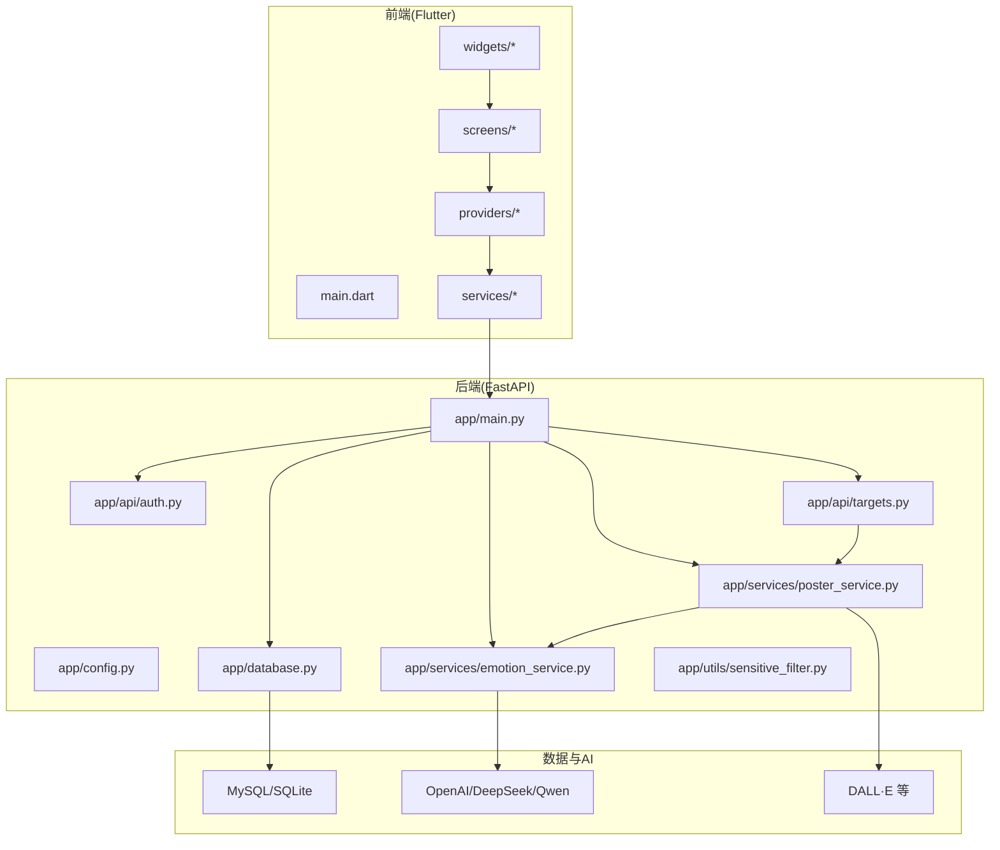
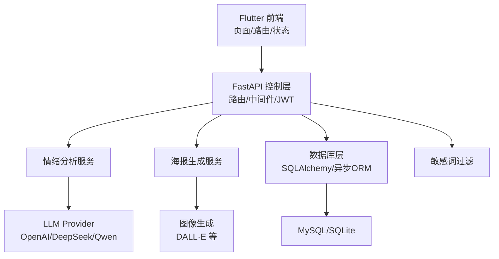
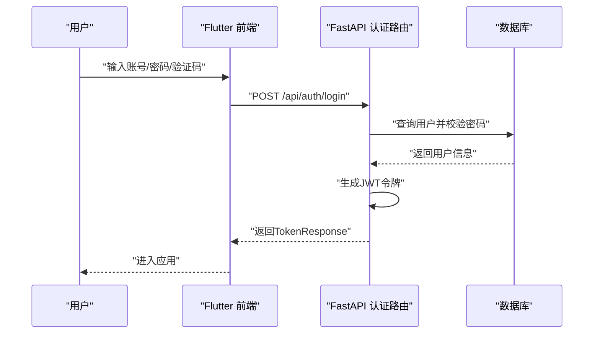
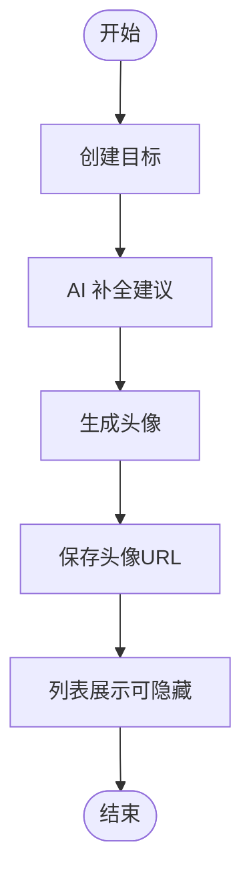
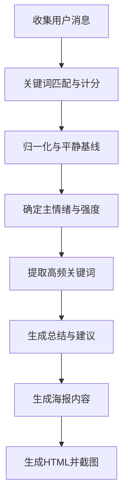
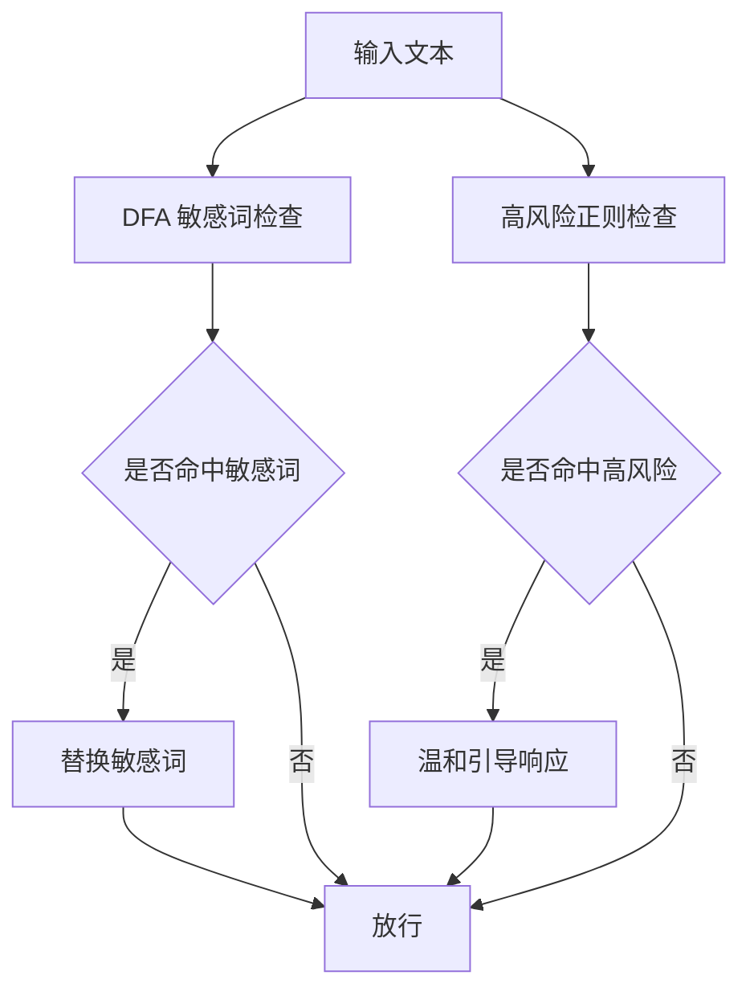
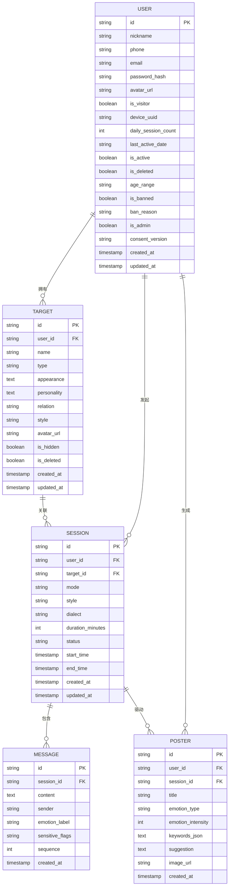
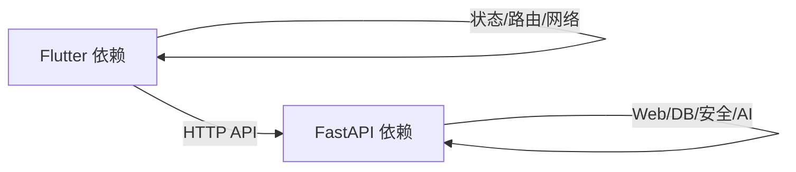

# 项目概览

<cite>
**本文引用的文件**
- [README.md](file://README.md)
- [emo_outlet_api/app/main.py](file://emo_outlet_api/app/main.py)
- [emo_outlet_api/app/config.py](file://emo_outlet_api/app/config.py)
- [emo_outlet_api/app/database.py](file://emo_outlet_api/app/database.py)
- [emo_outlet_api/app/models/user.py](file://emo_outlet_api/app/models/user.py)
- [emo_outlet_api/app/models/target.py](file://emo_outlet_api/app/models/target.py)
- [emo_outlet_api/app/api/auth.py](file://emo_outlet_api/app/api/auth.py)
- [emo_outlet_api/app/api/targets.py](file://emo_outlet_api/app/api/targets.py)
- [emo_outlet_api/app/services/emotion_service.py](file://emo_outlet_api/app/services/emotion_service.py)
- [emo_outlet_api/app/services/poster_service.py](file://emo_outlet_api/app/services/poster_service.py)
- [emo_outlet_api/app/utils/sensitive_filter.py](file://emo_outlet_api/app/utils/sensitive_filter.py)
- [emo_outlet_api/run.py](file://emo_outlet_api/run.py)
- [emo_outlet_api/requirements.txt](file://emo_outlet_api/requirements.txt)
- [emo_outlet_app/pubspec.yaml](file://emo_outlet_app/pubspec.yaml)
</cite>

## 目录
1. [引言](#引言)
2. [项目结构](#项目结构)
3. [核心组件](#核心组件)
4. [架构总览](#架构总览)
5. [详细组件分析](#详细组件分析)
6. [依赖分析](#依赖分析)
7. [性能考虑](#性能考虑)
8. [故障排查指南](#故障排查指南)
9. [结论](#结论)
10. [附录](#附录)

## 引言
Emo Outlet 是一款“可以安全骂人，但不会伤害任何人的 AI 出气筒”。它通过虚拟目标系统、方言表达、情绪可视化与海报生成，帮助用户在受控环境中释放压力、整理情绪。项目强调安全与合规，采用端侧加密、敏感词过滤与高风险自动中断等机制，确保用户在获得情绪出口的同时，始终处于安全可控的范围内。

- 价值主张：以“安全”为核心，提供可信任的情绪释放工具，降低心理负担，提升情绪管理能力。
- 产品定位：面向有情绪释放需求的个人用户，兼顾青少年与成年人的差异化保护。
- 目标用户：工作压力大、情感困扰、需要短期情绪出口的职场人、学生与社会青年。

## 项目结构
项目采用前后端分离架构：
- 前端：Flutter 应用，覆盖 Android 与 macOS，负责用户交互、路由、状态管理与本地存储。
- 后端：Python FastAPI 服务，提供认证、会话、消息、海报与支持等 API，并集成 AI 引擎与安全策略。
- 数据层：异步 SQLAlchemy ORM，支持 MySQL 与 SQLite；默认开发环境使用 SQLite，便于零配置启动。
- AI 引擎：OpenAI / DeepSeek / 通义千问等 LLM 与图像生成服务，可通过配置切换或使用模拟模式。

图表来源
- [emo_outlet_api/app/main.py:1-82](file://emo_outlet_api/app/main.py#L1-L82)
- [emo_outlet_api/app/config.py:1-125](file://emo_outlet_api/app/config.py#L1-L125)
- [emo_outlet_api/app/database.py:1-43](file://emo_outlet_api/app/database.py#L1-L43)
- [emo_outlet_api/app/api/auth.py:1-332](file://emo_outlet_api/app/api/auth.py#L1-L332)
- [emo_outlet_api/app/api/targets.py:1-213](file://emo_outlet_api/app/api/targets.py#L1-L213)
- [emo_outlet_api/app/services/emotion_service.py:1-170](file://emo_outlet_api/app/services/emotion_service.py#L1-L170)
- [emo_outlet_api/app/services/poster_service.py:1-151](file://emo_outlet_api/app/services/poster_service.py#L1-L151)
- [emo_outlet_api/app/utils/sensitive_filter.py:1-142](file://emo_outlet_api/app/utils/sensitive_filter.py#L1-L142)

章节来源
- [README.md:58-84](file://README.md#L58-L84)
- [emo_outlet_api/app/main.py:1-82](file://emo_outlet_api/app/main.py#L1-L82)
- [emo_outlet_api/app/config.py:1-125](file://emo_outlet_api/app/config.py#L1-L125)
- [emo_outlet_api/app/database.py:1-43](file://emo_outlet_api/app/database.py#L1-L43)

## 核心组件
- 前端应用（Flutter）
  - 状态管理：Provider
  - 路由：go_router
  - 网络：dio
  - 本地存储：shared_preferences、image_picker、cached_network_image
  - 图表：fl_chart
  - 响应式：flutter_screenutil
  - 资源：assets/images
- 后端 API（FastAPI）
  - 路由模块：认证、目标、会话、消息、海报、支持
  - 数据库：异步 SQLAlchemy + Alembic 迁移
  - 安全：JWT、bcrypt、敏感词过滤、高风险中断
  - AI 集成：LLM Provider 切换、图像生成
- 数据模型
  - 用户、目标、会话、消息、海报、合规记录等
- 服务层
  - 情绪分析：关键词匹配与情绪分布计算
  - 海报生成：HTML 模板渲染与图片生成
  - 敏感词过滤：DFA Trie + 正则高风险模式

章节来源
- [emo_outlet_app/pubspec.yaml:1-52](file://emo_outlet_app/pubspec.yaml#L1-L52)
- [emo_outlet_api/requirements.txt:1-29](file://emo_outlet_api/requirements.txt#L1-L29)
- [emo_outlet_api/app/models/user.py:1-56](file://emo_outlet_api/app/models/user.py#L1-L56)
- [emo_outlet_api/app/models/target.py:1-56](file://emo_outlet_api/app/models/target.py#L1-L56)
- [emo_outlet_api/app/services/emotion_service.py:1-170](file://emo_outlet_api/app/services/emotion_service.py#L1-L170)
- [emo_outlet_api/app/services/poster_service.py:1-151](file://emo_outlet_api/app/services/poster_service.py#L1-L151)
- [emo_outlet_api/app/utils/sensitive_filter.py:1-142](file://emo_outlet_api/app/utils/sensitive_filter.py#L1-L142)

## 架构总览
系统采用分层架构：
- 表现层：Flutter 前端，负责页面与交互。
- 控制层：FastAPI 路由与依赖注入，处理业务流程。
- 服务层：情绪分析、海报生成、AI 图像生成等。
- 数据层：异步 ORM + MySQL/SQLite，配合 Alembic 迁移。
- 安全层：JWT、bcrypt、敏感词过滤、高风险中断、软删除、端侧加密策略。

图表来源
- [emo_outlet_api/app/main.py:23-63](file://emo_outlet_api/app/main.py#L23-L63)
- [emo_outlet_api/app/config.py:63-87](file://emo_outlet_api/app/config.py#L63-L87)
- [emo_outlet_api/app/database.py:10-15](file://emo_outlet_api/app/database.py#L10-L15)
- [emo_outlet_api/app/services/emotion_service.py:36-86](file://emo_outlet_api/app/services/emotion_service.py#L36-L86)
- [emo_outlet_api/app/services/poster_service.py:32-54](file://emo_outlet_api/app/services/poster_service.py#L32-L54)
- [emo_outlet_api/app/utils/sensitive_filter.py:37-119](file://emo_outlet_api/app/utils/sensitive_filter.py#L37-L119)

## 详细组件分析

### 认证与用户管理
- 功能要点
  - 注册：手机号/邮箱唯一性校验，密码哈希存储，设备指纹与年龄范围记录。
  - 登录：JWT 令牌签发（7 天有效期），支持游客登录。
  - 个人信息：昵称、头像、签名、性别、生日、地区等扩展信息。
  - 数据导出：按用户聚合会话、消息、目标与海报数据。
  - 账号注销：级联软删除用户相关数据并标记账户状态。
- 安全特性
  - JWT + bcrypt；密码哈希不可逆；游客登录无明文凭证。
  - 合规记录：隐私与条款版本记录，支持审计与版本追踪。

图表来源
- [emo_outlet_api/app/api/auth.py:78-94](file://emo_outlet_api/app/api/auth.py#L78-L94)
- [emo_outlet_api/app/config.py:54-61](file://emo_outlet_api/app/config.py#L54-L61)

章节来源
- [emo_outlet_api/app/api/auth.py:33-120](file://emo_outlet_api/app/api/auth.py#L33-L120)
- [emo_outlet_api/app/api/auth.py:123-210](file://emo_outlet_api/app/api/auth.py#L123-L210)
- [emo_outlet_api/app/api/auth.py:212-240](file://emo_outlet_api/app/api/auth.py#L212-L240)
- [emo_outlet_api/app/api/auth.py:242-332](file://emo_outlet_api/app/api/auth.py#L242-L332)

### 泄愤对象系统
- 功能要点
  - 创建/更新/删除（软删除）：支持隐藏与可见切换。
  - AI 补全：根据关系类型自动填充外观、性格与风格。
  - 头像生成：调用图像服务生成虚拟形象并回写 URL。
- 数据模型
  - 用户与目标为一对多关系，支持按更新时间倒序展示。

图表来源
- [emo_outlet_api/app/api/targets.py:47-66](file://emo_outlet_api/app/api/targets.py#L47-L66)
- [emo_outlet_api/app/api/targets.py:184-213](file://emo_outlet_api/app/api/targets.py#L184-L213)
- [emo_outlet_api/app/api/targets.py:153-181](file://emo_outlet_api/app/api/targets.py#L153-L181)

章节来源
- [emo_outlet_api/app/api/targets.py:26-44](file://emo_outlet_api/app/api/targets.py#L26-L44)
- [emo_outlet_api/app/api/targets.py:92-128](file://emo_outlet_api/app/api/targets.py#L92-L128)
- [emo_outlet_api/app/api/targets.py:131-150](file://emo_outlet_api/app/api/targets.py#L131-L150)
- [emo_outlet_api/app/models/target.py:13-56](file://emo_outlet_api/app/models/target.py#L13-L56)

### 情绪分析与海报生成
- 情绪分析
  - 关键词映射：愤怒/悲伤/焦虑/疲惫/无奈等情绪关键词集合。
  - 情绪检测：基于关键词计数与归一化，输出主情绪与强度。
  - 总结与建议：根据主情绪生成总结文案与调节建议。
- 海报生成
  - 内容生成：标题、情绪类型、强度、关键词、建议与目标名。
  - HTML 渲染：生成海报 HTML，用于截图与分享。
  - 模拟模式：开发阶段提供 SVG Base64 模板。

图表来源
- [emo_outlet_api/app/services/emotion_service.py:36-86](file://emo_outlet_api/app/services/emotion_service.py#L36-L86)
- [emo_outlet_api/app/services/poster_service.py:32-54](file://emo_outlet_api/app/services/poster_service.py#L32-L54)
- [emo_outlet_api/app/services/poster_service.py:56-123](file://emo_outlet_api/app/services/poster_service.py#L56-L123)

章节来源
- [emo_outlet_api/app/services/emotion_service.py:88-166](file://emo_outlet_api/app/services/emotion_service.py#L88-L166)
- [emo_outlet_api/app/services/poster_service.py:125-147](file://emo_outlet_api/app/services/poster_service.py#L125-L147)

### 敏感词过滤与高风险中断
- 实现机制
  - DFA Trie：O(n) 时间复杂度的敏感词匹配，支持最长匹配。
  - 高风险正则：对自残/他伤意图进行模式识别。
  - 温和引导：触发高风险时返回安抚性提示，避免二次刺激。
- 配置与扩展
  - 敏感词库与高风险模式集中维护，便于迭代升级。

图表来源
- [emo_outlet_api/app/utils/sensitive_filter.py:37-119](file://emo_outlet_api/app/utils/sensitive_filter.py#L37-L119)
- [emo_outlet_api/app/utils/sensitive_filter.py:128-138](file://emo_outlet_api/app/utils/sensitive_filter.py#L128-L138)

章节来源
- [emo_outlet_api/app/utils/sensitive_filter.py:11-26](file://emo_outlet_api/app/utils/sensitive_filter.py#L11-L26)
- [emo_outlet_api/app/utils/sensitive_filter.py:69-73](file://emo_outlet_api/app/utils/sensitive_filter.py#L69-L73)

### 数据库与模型
- 数据库连接
  - 默认使用 SQLite（开发环境），可配置 MySQL；异步连接池与事务管理。
- 核心模型
  - 用户：设备指纹、游客标识、年龄范围、封禁状态、合规字段。
  - 目标：名称、类型、外观、性格、关系、风格、头像 URL、软删除。
  - 会话/消息/海报：记录会话参数、消息内容与情绪分析结果、海报内容。
- 关系与索引
  - 用户与目标/会话为一对多；目标与会话为一对多；消息与会话为一对多。
  - 基于时间戳与状态的常用查询字段，便于报表与趋势分析。

图表来源
- [emo_outlet_api/app/models/user.py:14-56](file://emo_outlet_api/app/models/user.py#L14-L56)
- [emo_outlet_api/app/models/target.py:13-56](file://emo_outlet_api/app/models/target.py#L13-L56)

章节来源
- [emo_outlet_api/app/database.py:8-43](file://emo_outlet_api/app/database.py#L8-L43)
- [emo_outlet_api/app/models/user.py:14-56](file://emo_outlet_api/app/models/user.py#L14-L56)
- [emo_outlet_api/app/models/target.py:13-56](file://emo_outlet_api/app/models/target.py#L13-L56)

## 依赖分析
- 前端依赖
  - 状态管理：provider
  - 路由：go_router
  - 网络：dio
  - 本地存储：shared_preferences、image_picker、cached_network_image
  - 图表：fl_chart
  - 响应式：flutter_screenutil
- 后端依赖
  - Web 框架：FastAPI + Uvicorn
  - 数据库：SQLAlchemy[asyncio] + aiosqlite/aiomysql + Alembic
  - 认证安全：python-jose + passlib(bcrypt)
  - AI/LLM：openai
  - 配置：pydantic + pydantic-settings + python-dotenv
  - 工具：python-multipart + httpx

图表来源
- [emo_outlet_app/pubspec.yaml:9-41](file://emo_outlet_app/pubspec.yaml#L9-L41)
- [emo_outlet_api/requirements.txt:3-29](file://emo_outlet_api/requirements.txt#L3-L29)

章节来源
- [emo_outlet_app/pubspec.yaml:1-52](file://emo_outlet_app/pubspec.yaml#L1-L52)
- [emo_outlet_api/requirements.txt:1-29](file://emo_outlet_api/requirements.txt#L1-L29)

## 性能考虑
- 异步数据库：使用异步 SQLAlchemy 与连接池，减少阻塞，提升并发。
- 最短路径匹配：敏感词过滤采用 DFA Trie，复杂度 O(n)，适合高频文本处理。
- 会话轮数与时长限制：防止滥用与资源占用，结合每日配额控制。
- 静态资源与缓存：前端静态资源与图片缓存，后端可引入 Redis 缓存热点数据。
- 部署建议：生产环境使用多进程 Uvicorn，合理设置 workers 数量与超时。

## 故障排查指南
- 启动问题
  - 后端：确认端口占用与环境变量；查看健康检查接口；核对数据库连接字符串。
  - 前端：确认 baseUrl 指向正确后端地址；检查网络连通性。
- 认证失败
  - 核对账号/密码或游客设备 UUID；检查 JWT 有效期与签名算法。
- 数据库异常
  - 检查数据库 URL 与凭据；确认 Alembic 迁移执行状态；查看异步会话生命周期。
- 敏感词误判
  - 更新敏感词库与高风险正则；评估 DFA 匹配策略与最长匹配规则。
- 海报生成失败
  - 检查 HTML 模板渲染与截图服务；确认图像生成服务可用性。

章节来源
- [emo_outlet_api/run.py:11-31](file://emo_outlet_api/run.py#L11-L31)
- [emo_outlet_api/app/main.py:66-72](file://emo_outlet_api/app/main.py#L66-L72)
- [emo_outlet_api/app/config.py:30-52](file://emo_outlet_api/app/config.py#L30-L52)
- [emo_outlet_api/app/utils/sensitive_filter.py:11-26](file://emo_outlet_api/app/utils/sensitive_filter.py#L11-L26)

## 结论
Emo Outlet 将“安全”置于首位，通过 Flutter 前端与 FastAPI 后端的清晰分层，结合 SQLAlchemy 异步数据层与 DFA 敏感词过滤、高风险中断等安全机制，构建了可扩展且合规的情绪释放平台。AI 引擎的可插拔设计使其具备良好的生态兼容性，同时情绪分析与海报生成提升了用户体验与自我觉察。建议在生产部署中完善合规审计、监控告警与灾备策略，持续优化情绪关键词库与高风险模式，保障长期可持续运营。

## 附录
- 快速开始
  - 后端：安装依赖后启动 Uvicorn，默认端口 8000，Swagger 文档见 /docs。
  - 前端：安装依赖后运行 Flutter 应用，首次需先启动后端或修改 API 地址。
- 开发模式
  - 无需配置 API Key 即可运行，LLM Provider 可设为 mock；数据库可留空使用 SQLite。
- API 接口概览
  - 认证：注册、登录、游客登录、个人信息、数据导出、注销。
  - 目标：列表、创建、详情、更新、删除、AI 补全、生成头像。
  - 会话：创建、结束（触发情绪分析）、消息收发。
  - 海报：生成、报告（概览）。

章节来源
- [README.md:32-56](file://README.md#L32-L56)
- [README.md:130-145](file://README.md#L130-L145)
- [README.md:88-104](file://README.md#L88-L104)